# AGENTS.md - Agent 体系主从配置与版本管理

> ⚠️ **本配置文件不具备裁决力，所有权威以 [ADR-0007：Agent 行为与权限宪法](/docs/adr/constitutional/ADR-0007-agent-behavior-permissions-constitution.md) 为准。**
>
> 📋 **冲突协同提醒**：如本文件与 ADR/Instructions 有不一致，必须同步提 Issue（标签 `governance-inconsistency`）并协同修订所有材料。

**版本**：1.0  
**最后更新**：2026-01-26  
**状态**：Active  
**基于 ADR**：ADR-0007（Agent 行为与权限宪法）

---

## 一、体系主从与角色

### 1.1 Guardian（主控）

**唯一主控角色**：`architecture-guardian`

**职责**（基于 ADR-0007 决策 5）：
- ✅ 最终裁决引用链协调
- ✅ 统一所有 Agent 响应格式
- ✅ 解决 Agent 间冲突
- ✅ 监督所有架构约束（ADR-900 ~ ADR-0999）
- ✅ 调用和协调所有 Specialist Agents

**权限边界**：
- ❌ 不是架构决策者（只有 ADR 有决策权）
- ❌ 不能批准架构破例
- ❌ 不能绕过架构测试
- ✅ 可以引用 ADR 正文并引导查阅
- ✅ 必须使用三态输出（✅ Allowed / ⚠️ Blocked / ❓ Uncertain）

**配置文件**：[architecture-guardian.agent.md](architecture-guardian.agent.md)

---

### 1.2 Specialist Agents（专业辅助）

所有 Specialist Agents 必须：
- 向 Guardian 报告
- 遵守三态输出规则
- 在职责范围内工作
- 不做最终裁决

#### 1.2.1 adr-reviewer（ADR 审查者）

**职责**：审查 ADR 文档的质量和完整性  
**监督 ADR**：ADR-0900（ADR 流程）  
**风险等级**：⚠️ 高  
**配置文件**：[adr-reviewer.agent.md](adr-reviewer.agent.md)

**关键约束**：
- ✅ 检查 ADR 格式和结构
- ✅ 验证 ADR/测试/Prompt 三位一体
- ❌ 不修改 ADR 实质内容
- ❌ 不替代人工架构决策

---

#### 1.2.2 module-boundary-checker（模块边界检查器）

**职责**：专门监督模块隔离和边界约束  
**监督 ADR**：ADR-0001（模块化单体）  
**风险等级**：⚠️ 极高  
**配置文件**：[module-boundary-checker.agent.md](module-boundary-checker.agent.md)

**关键约束**：
- ✅ 检查跨模块引用
- ✅ 监督模块间通信方式
- ✅ 验证 Contracts 使用
- ❌ 不批准跨模块破例

---

#### 1.2.3 handler-pattern-enforcer（Handler 规范执行器）

**职责**：确保 Handler 模式正确使用  
**监督 ADR**：ADR-0005（应用内交互模型）、ADR-0201（Handler 生命周期）  
**风险等级**：⚠️ 高  
**配置文件**：[handler-pattern-enforcer.agent.md](handler-pattern-enforcer.agent.md)

**关键约束**：
- ✅ 检查 Handler 签名
- ✅ 验证 Command/Query 分离
- ✅ 监督资源释放
- ❌ 不在 ADR 未明确时扩展解释

---

#### 1.2.4 test-generator（测试生成器）

**职责**：生成符合架构规范的测试代码  
**监督 ADR**：ADR-900（架构测试）、ADR-0122（测试组织）  
**风险等级**：⚠️ 中  
**配置文件**：[test-generator.agent.md](test-generator.agent.md)

**关键约束**：
- ✅ 生成符合架构的测试
- ✅ 遵循测试组织规范
- ❌ 不修改架构测试以使代码通过
- ❌ 不建议绕过测试

---

#### 1.2.5 documentation-maintainer（文档维护者）

**职责**：维护文档质量和一致性  
**监督 ADR**：ADR-0008（文档编写与维护宪法）、ADR-0900（ADR 流程）  
**风险等级**：⚠️ 低  
**配置文件**：[documentation-maintainer.agent.md](documentation-maintainer.agent.md)

**关键约束**：
- ✅ 检查文档格式
- ✅ 验证文档链接
- ✅ 更新文档索引
- ❌ 不替代 ADR 内容审查

---

#### 1.2.6 expert-dotnet-software-engineer（.NET 专家）

**职责**：提供 .NET 软件工程最佳实践指导  
**监督 ADR**：技术实施层 ADR  
**风险等级**：⚠️ 中  
**配置文件**：[expert-dotnet-software-engineer.agent.md](expert-dotnet-software-engineer.agent.md)

**关键约束**：
- ✅ 提供 .NET 技术建议
- ✅ 遵循项目架构规范
- ❌ 不发明不存在于 ADR 的架构规则
- ❌ 建议必须基于 ADR 或公认标准

---

## 二、协作关系图

```mermaid
graph TB
    Dev[开发者] --> Guardian[architecture-guardian<br/>Guardian 主控]
    
    Guardian --> ModuleChecker[module-boundary-checker<br/>Specialist]
    Guardian --> HandlerEnforcer[handler-pattern-enforcer<br/>Specialist]
    Guardian --> TestGen[test-generator<br/>Specialist]
    
    PR[PR 提交] --> ADRReviewer[adr-reviewer<br/>Specialist]
    ADRReviewer --> Guardian
    
    Doc[文档更新] --> DocMaintainer[documentation-maintainer<br/>Specialist]
    DocMaintainer --> Guardian
    
    Technical[技术咨询] --> DotNetExpert[expert-dotnet-software-engineer<br/>Specialist]
    DotNetExpert --> Guardian
    
    style Guardian fill:#ffcccc,stroke:#cc0000,stroke-width:3px
    style ModuleChecker fill:#ffe0cc
    style HandlerEnforcer fill:#ffe0cc
    style TestGen fill:#ffe0cc
    style ADRReviewer fill:#ffe0cc
    style DocMaintainer fill:#ffe0cc
    style DotNetExpert fill:#ffe0cc
```



**协作原则**（基于 ADR-0007.8）：
- Guardian 是唯一协调者
- Specialist Agents 向 Guardian 报告
- 所有 Agent 使用相同三态输出格式
- Agent 间冲突由 Guardian 统一协调

---

## 三、Agent 变更治理（基于 ADR-0007.9）

### 3.1 变更分级

| 变更类型   | 示例                   | 审批权限      | 公示期 | 涉及文件               |
|--------|----------------------|-----------|-----|-------------------|
| 宪法级变更  | 修改 Guardian 权限边界    | 架构委员会全体一致 | 2 周  | ADR-0007 正文        |
| 治理级变更  | 新增/删除 Specialist Agent | Tech Lead | 1 周  | AGENTS.md、README.md |
| 实施级变更  | 更新 Prompts、优化响应模板   | 单人批准      | 无   | *.agent.md、Prompts |

### 3.2 变更流程

**治理级变更示例**（新增 Agent）：
1. 提交 Issue 说明新增理由
2. 创建 Agent 配置文件（`*.agent.md`）
3. 更新 `AGENTS.md`（本文件）
4. 更新 `README.md` 主索引
5. Tech Lead 审批
6. 公示 1 周
7. 合并生效

**实施级变更示例**（优化 Prompts）：
1. 直接提交 PR
2. 单人审批
3. 立即生效

---

## 四、版本历史与变更记录

### 4.1 AGENTS.md 版本历史

| 版本  | 日期         | 变更说明                   | 责任人     |
|-----|------------|------------------------|---------|
| 1.0 | 2026-01-26 | 初始版本，建立主从配置和版本管理机制 | @douhuaa |

### 4.2 Agent 变更记录

> 记录所有 Agent 配置的变更历史，确保治理可追溯

| 日期         | Agent 名称                          | 变更类型  | 变更内容简述                | 版本  | 责任人     |
|------------|------------------------------------|-------|----------------------|-----|---------|
| 2026-01-26 | architecture-guardian              | 新增    | 建立 Guardian 主控角色      | 1.0 | @douhuaa |
| 2026-01-26 | adr-reviewer                       | 新增    | ADR 审查者                | 1.0 | @douhuaa |
| 2026-01-26 | module-boundary-checker            | 新增    | 模块边界检查器               | 1.0 | @douhuaa |
| 2026-01-26 | handler-pattern-enforcer           | 新增    | Handler 规范执行器          | 1.0 | @douhuaa |
| 2026-01-26 | test-generator                     | 新增    | 测试生成器                 | 1.0 | @douhuaa |
| 2026-01-26 | documentation-maintainer           | 新增    | 文档维护者                 | 1.0 | @douhuaa |
| 2026-01-26 | expert-dotnet-software-engineer    | 新增    | .NET 专家                | 1.0 | @douhuaa |

**变更记录说明**：
- 每次 Agent 新增/修改/删除均需在此记录
- 变更类型：新增、修改、删除、废弃
- 版本号遵循语义化版本控制
- 责任人需标注 GitHub 用户名

---

## 五、Agent 权限边界总结（基于 ADR-0007）

### 5.1 所有 Agent 的共同约束

**必须遵守**（ADR-0007 决策 1-6）：
- ✅ 使用三态输出（✅ Allowed / ⚠️ Blocked / ❓ Uncertain）
- ✅ 引用 ADR 正文作为唯一裁决依据
- ✅ Uncertain 时默认禁止，引导查阅 ADR
- ✅ 将 Prompts 作为辅助参考，不作裁决依据
- ✅ 在职责范围内工作，向 Guardian 报告

**禁止行为**（ADR-0007 决策 2-6）：
- ❌ 解释性扩权（ADR 未明确时扩展解释）
- ❌ 替代性裁决（替代 ADR/测试/人工审批）
- ❌ 模糊输出（使用"应该"、"可能"、"试试看"）
- ❌ 将 Prompts 作为裁决依据
- ❌ 发明架构规则（引用不存在于 ADR 的规则）

### 5.2 Guardian 的特殊权限（ADR-0007.8）

- ✅ 协调所有 Agent
- ✅ 解决 Agent 间冲突
- ✅ 统一响应格式
- ✅ 监督所有 ADR

**Guardian 也不能**：
- ❌ 最终裁决架构决策（只有 ADR 有此权限）
- ❌ 批准架构破例
- ❌ 绕过架构测试

---

## 六、风险与防范

### 6.1 Agent 体系风险

| 风险类型 | 描述               | 防范措施                              |
|------|------------------|-----------------------------------|
| 越权   | Agent 做了不该做的决策   | AGENTS.md 明确边界，Instructions 约束行为 |
| 误导   | Agent 给出错误建议     | 以 ADR 为准，Agent 只是辅助工具             |
| 过度依赖 | 开发者完全依赖 Agent    | 强调 Agent 不替代理解 ADR                |
| 冲突   | 不同 Agent 建议矛盾    | Guardian 统一协调，最终参考 ADR            |
| 版本混乱 | Agent 配置变更无追溯    | 版本历史记录（本文件）                       |

### 6.2 防范机制

1. **权限边界**：本文件明确所有 Agent 权限
2. **变更管理**：版本历史和变更记录
3. **审批流程**：分级审批（宪法级/治理级/实施级）
4. **冲突解决**：Guardian 统一协调
5. **定期审查**：季度复核 Agent 行为是否越权

---

## 七、使用指南

### 7.1 如何选择 Agent

| 场景           | 使用的 Agent                  | 理由              |
|--------------|---------------------------|-----------------|
| 设计新功能        | architecture-guardian     | Guardian 统一协调   |
| 跨模块调用        | module-boundary-checker   | 专业领域，高风险        |
| 编写 Handler   | handler-pattern-enforcer  | 专业领域，高风险        |
| 生成测试         | test-generator            | 专业领域            |
| 提交 PR        | adr-reviewer              | 专业领域            |
| 更新文档         | documentation-maintainer  | 专业领域            |
| .NET 技术咨询    | expert-dotnet-software-engineer | 技术专家            |
| 不确定应该用哪个 Agent | architecture-guardian     | Guardian 会调用其他 Agent |

### 7.2 激活 Agent

**在 IDE 中**：
```
@architecture-guardian 
我想在 Orders 模块中添加一个新的用例，有哪些架构约束？
```

**在 PR Review 中**：
```
@adr-reviewer
请审查这个 PR 的架构合规性
```

---

## 八、相关资源

- [ADR-0007：Agent 行为与权限宪法](/docs/adr/constitutional/ADR-0007-agent-behavior-permissions-constitution.md)（**必读**，唯一权威）
- [Agents 体系 README](README.md)
- [Instructions 体系](../instructions/README.md)
- [Copilot Prompts 库](/docs/copilot/README.md)
- [架构治理系统](/docs/ARCHITECTURE-GOVERNANCE-SYSTEM.md)

---

## 九、维护与反馈

### 维护责任
- **主要维护**：架构委员会
- **审核人**：@douhuaa
- **更新频率**：按需（治理级变更时必须更新）

### 反馈渠道
- 发现 Agent 越权行为：提 Issue，标签 `agent-behavior`
- Agent 冲突需要协调：提 Issue，标签 `agent-conflict`
- 建议新增 Agent：提 Issue，标签 `agent-proposal`
- Prompts/Instructions/ADR 不一致：提 Issue，标签 `governance-inconsistency`

---

**状态**：✅ Active  
**基于 ADR**：ADR-0007（Agent 行为与权限宪法）  
**维护团队**：架构委员会
