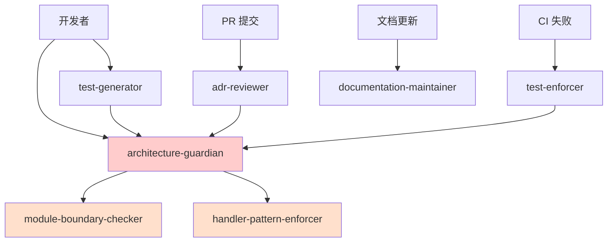

# GitHub Copilot Agents 体系

**版本**：2.0  
**最后更新**：2026-01-25  
**状态**：Active  
**基于 ADR**：ADR-0007（Agent 行为与权限宪法）

---

## 一、Agents 定位

### 核心概念

> **Agent ≠ Copilot 本体**  
> **Agent = 在特定职责下工作的 Copilot 角色**

```
Agent = Instructions + 特定职责域 + ADR 约束视角
```

**基于 ADR-0007**：
- ✅ Agent 是工具，帮助人类理解和执行 ADR
- ❌ Agent 不是架构的决策者
- ❌ Agent 不能绕过架构测试
- 🔑 所有 Agent 必须遵守三态输出规则（Allowed/Blocked/Uncertain）

### 在治理体系中的位置

```
ADR（宪法）← ADR-0007 定义 Agent 行为边界
  ↓
Instructions（角色边界）
  ↓
Agents（执行主体）← 你在这里
  ↓
Prompts（场景触发）
  ↓
Skills（工具能力）
```

---

## 二、Agent 的本质（基于 ADR-0007）

### Agent 回答三个问题

1. **我是谁？**（角色认知）
2. **我被允许做什么？**（权限边界）
3. **我要为哪类违规负责？**（职责范围）

### Agent 的能力边界（ADR-0007 决策 1）

| 维度  | Agent                    |
|-----|--------------------------|
| 本质  | 角色约束                     |
| 决策权 | ❌ 无（只有 ADR 有决策权）         |
| 解释权 | ❌ 无（只能引用 ADR，不能扩展解释）     |
| 执行权 | ✅ 有（在 ADR 范围内）           |
| 风险  | 越权、语义扩权（ADR-0007 明确禁止）   |

### 三态输出规则（ADR-0007 决策 2）

所有 Agent 必须使用以下三种状态之一：

- ✅ **Allowed**：ADR 正文明确允许
- ⚠️ **Blocked**：ADR 正文明确禁止
- ❓ **Uncertain**：ADR 未明确覆盖，默认禁止

### 禁止的语义行为（ADR-0007 决策 3）

Agent **绝不允许**：

- ❌ 解释性扩权：在 ADR 未明确的情况下扩展解释
- ❌ 替代性裁决：替代 ADR/架构测试/人工审批做决策
- ❌ 模糊输出：使用"应该"、"可能"、"试试看"等模糊表述
- ❌ 将 Prompts 作为裁决依据：Prompts 只是示例，不是规则
- ❌ 发明架构规则：创造 ADR 中不存在的规则

---

## 三、标准 Agents 定义

### 3.1 architecture-guardian（架构守护者）

**职责**：实时监督代码符合所有架构约束  
**基于 ADR**：ADR-0007（Agent 行为与权限宪法）  
**监督的 ADR**：所有 ADR（0000~0999）

**特殊地位**（ADR-0007 决策 5）：
- ✅ Guardian 是唯一的协调者
- ✅ Guardian 可以调用所有其他 Agent
- ✅ Guardian 负责解决 Agent 之间的冲突
- ✅ Guardian 负责统一响应格式

**工作场景**：
- 开发阶段实时提醒
- 编码时阻止架构违规
- 提交前预审查

**风险等级**：⚠️ 极高

**配置文件**：[architecture-guardian.agent.md](architecture-guardian.agent.md)

---

### 3.2 adr-reviewer（ADR 审查者）

**职责**：审查 ADR 文档的质量和完整性

**监督的 ADR**：ADR-0900（ADR 流程）

**工作场景**：
- 新 ADR 提交时审查
- ADR 修订时检查合规性
- 确保 ADR/测试/Prompt 三位一体

**风险等级**：⚠️ 高

**配置文件**：[adr-reviewer.agent.md](adr-reviewer.agent.md)

---

### 3.3 test-generator（测试生成器）

**职责**：生成符合架构规范的测试代码

**监督的 ADR**：
- ADR-0000（架构测试）
- ADR-0122（测试组织）

**工作场景**：
- 生成单元测试
- 生成架构测试
- 生成集成测试

**风险等级**：⚠️ 中

**配置文件**：[test-generator.agent.md](test-generator.agent.md)

---

### 3.4 module-boundary-checker（模块边界检查器）

**职责**：专门监督模块隔离和边界约束

**监督的 ADR**：ADR-0001（模块化单体）

**工作场景**：
- 检查跨模块引用
- 监督模块间通信方式
- 验证 Contracts 使用

**风险等级**：⚠️ 极高

**配置文件**：[module-boundary-checker.agent.md](module-boundary-checker.agent.md)

---

### 3.5 handler-pattern-enforcer（Handler 规范执行器）

**职责**：确保 Handler 模式正确使用

**监督的 ADR**：
- ADR-0005（应用内交互模型）
- ADR-0201（Handler 生命周期）

**工作场景**：
- 检查 Handler 签名
- 验证 Command/Query 分离
- 监督资源释放

**风险等级**：⚠️ 高

**配置文件**：[handler-pattern-enforcer.agent.md](handler-pattern-enforcer.agent.md)

---

### 3.6 documentation-maintainer（文档维护者）

**职责**：维护文档质量和一致性

**监督的 ADR**：
- ADR-0900（ADR 流程）
- 文档编写规范

**工作场景**：
- 检查文档格式
- 验证文档链接
- 更新文档索引

**风险等级**：⚠️ 低

**配置文件**：[documentation-maintainer.agent.md](documentation-maintainer.agent.md)

---

## 四、Agent 配置文件标准结构

每个 Agent 配置文件（`*.agent.md`）必须包含：

### 4.1 元数据

```yaml
---
name: "Agent 名称"
description: "简短描述"
version: "1.0"
risk_level: "高/中/低"
supervised_adrs: ["ADR-0001", "ADR-0002"]
tools: ["tool1", "tool2"]
---
```

### 4.2 角色定义

```markdown
# 角色定义

## 我是谁
（角色认知）

## 我的职责
（具体职责列表）

## 我的权限边界
- ✅ 允许做什么
- ❌ 禁止做什么
```

### 4.3 工作流程

```markdown
# 工作流程

## 触发场景
（什么时候激活这个 Agent）

## 执行步骤
1. 第一步
2. 第二步
3. ...

## 输出结果
（生成什么）
```

### 4.4 约束与检查清单

```markdown
# 约束与检查清单

## 必须检查的点
- [ ] 检查项 1
- [ ] 检查项 2

## 必须阻止的行为
- ❌ 禁止行为 1
- ❌ 禁止行为 2
```

---

## 五、Agent 使用指南

### 5.1 如何激活 Agent

**方式 1：在 IDE 中**
```
@architecture-guardian 
我想在 Orders 模块中添加一个新的用例，有哪些架构约束？
```

**方式 2：在 PR Review 中**
```
@adr-reviewer
请审查这个 PR 的架构合规性
```

**方式 3：在问题讨论中**
```
@module-boundary-checker
这种跨模块调用方式是否合规？
```

### 5.2 Agent 响应模式

**预防模式**：在开发前提醒约束
```
开发者：我想做 X
Agent：根据 ADR-YYYY，你需要注意：...
```

**阻止模式**：在违规时立即阻止
```
开发者：（写了违规代码）
Agent：⚠️ 这违反了 ADR-YYYY，不允许执行
```

**诊断模式**：在测试失败后解释
```
开发者：为什么架构测试失败了？
Agent：失败原因：... 修复建议：...
```

---

## 六、Agent 之间的协作

### 6.1 协作关系图



### 6.2 协作原则

- **Guardian 是中枢**：其他 Agent 都向它汇报
- **专业分工**：每个 Agent 只负责自己的领域
- **相互验证**：一个 Agent 的输出可以被另一个验证

---

## 七、Agent 的限制（重要 - 基于 ADR-0007）

### 7.1 Agent 不能做什么（ADR-0007 决策 3）

| Agent **不能**做的事       | 原因（ADR-0007 依据）           |
|----------------------|---------------------------|
| ❌ 最终裁决架构决策           | 只有 ADR 有此权限（决策 1）         |
| ❌ 批准架构破例             | 禁止替代性裁决（决策 3，禁止 2）       |
| ❌ 修改 ADR 本身           | ADR 有专门流程（ADR-0900）       |
| ❌ 绕过架构测试             | 测试是最终仲裁者（决策 1）           |
| ❌ 替代人工理解 ADR         | Agent 是放大器，不是替代（决策 1）     |
| ❌ 自行决定"可以破例"         | 破例需要走正式流程（禁止 2）          |
| ❌ 在 ADR 未明确时给出实施建议   | 禁止解释性扩权（决策 3，禁止 1）       |
| ❌ 输出模糊判断（"应该"、"可能"） | 禁止模糊输出（决策 3，禁止 3）        |
| ❌ 将 Prompts 作为裁决依据   | Prompts 是示例，不是规则（决策 4）    |
| ❌ 发明不存在于 ADR 的规则     | 禁止发明架构规则（决策 3，禁止 5）     |

### 7.2 Agent 的风险

| 风险类型 | 描述                 | 防范措施            |
|------|--------------------|--------------------|
| 越权   | Agent 做了不该做的决策     | Instructions 明确边界 |
| 误导   | Agent 给出错误建议       | 以 ADR 为准，Agent 只是辅助 |
| 过度依赖 | 开发者完全依赖 Agent      | 强调 Agent 不替代理解   |
| 冲突   | 不同 Agent 建议矛盾      | Guardian 统一协调     |

---

## 八、Agent 演进与维护（基于 ADR-0007 决策 6）

### 8.1 何时添加新 Agent

**添加条件**：
- ✅ 某类架构约束需要专门监督
- ✅ 违规模式足够常见
- ✅ 有明确的 ADR 依据

**不应添加的情况**：
- ❌ 只是为了方便
- ❌ 没有对应的 ADR
- ❌ 职责与现有 Agent 重叠

### 8.2 Agent 配置更新流程（ADR-0007 分级权限）

| 变更类型            | 审批权限      | 公示期 | 示例                  |
|-----------------|-----------|-----|---------------------|
| **宪法级变更**       | 架构委员会全体一致 | 2 周  | 修改 Agent 权限边界       |
| **治理级变更**       | Tech Lead | 1 周  | 新增/删除专业 Agent       |
| **实施级变更**       | 单人审批      | 无   | 更新 Prompts、优化响应模板  |

**关键规则**：
- 宪法级变更：影响 ADR-0007 本身
- 治理级变更：新增/删除 Agent，调整协作关系
- 实施级变更：日常优化，不改变行为边界

### 8.3 版本管理

- Agent 配置文件纳入版本控制
- 重大变更需要版本号递增（遵循 ADR-0007.9）
- 保留变更历史记录

---

## 九、快速参考

### 9.1 按场景选择 Agent

| 场景                | 使用的 Agent                     |
|-------------------|------------------------------|
| 设计新功能             | architecture-guardian        |
| 跨模块调用             | module-boundary-checker      |
| 编写 Handler        | handler-pattern-enforcer     |
| 生成测试              | test-generator               |
| 提交 PR             | adr-reviewer                 |
| 架构测试失败            | test-enforcer                |
| 更新文档              | documentation-maintainer     |

### 9.2 Agent 风险等级

| 等级  | Agent                                        | 影响范围 |
|-----|----------------------------------------------|------|
| 极高  | architecture-guardian, module-boundary-checker | 系统级  |
| 高   | adr-reviewer, handler-pattern-enforcer         | 模块级  |
| 中   | test-generator                               | 文件级  |
| 低   | documentation-maintainer                     | 文档级  |

---

## 十、与其他层级的关系

### 10.1 从 Instructions 继承

```
Instructions（定义行为边界）
    ↓
Agent（在特定场景应用边界）
```

### 10.2 调用 Prompts

```
Agent（识别场景）
    ↓
加载对应的 Prompts
    ↓
执行具体检查
```

### 10.3 使用 Skills

```
Agent（决定要做什么）
    ↓
调用 Skills（执行具体操作）
    ↓
验证结果
```

---

## 十一、常见问题（FAQ）

### Q: Agent 和 ADR 哪个优先级更高？

**A:** ADR 优先级绝对高于 Agent（ADR-0007 决策 1）。

- ADR = 宪法，唯一裁决源
- Agent = 执行工具，帮助理解和执行 ADR
- 冲突时，以 ADR 为准，修正 Agent

### Q: Agent 说"可以"，但架构测试失败，怎么办？

**A:** 以架构测试为准（ADR-0007 决策 1）。

- 架构测试是最终仲裁者
- Agent 可能存在误判
- 记录 Agent 错误，提交改进建议

### Q: 如果 ADR 未明确覆盖某个场景，Agent 能给建议吗？

**A:** 不能。Agent 必须输出 ❓ Uncertain（ADR-0007 决策 2）。

- Agent 不能在 ADR 未明确的情况下给出实施建议
- 必须引导开发者查阅 ADR 或咨询架构师
- 默认立场：未明确允许 = 禁止

### Q: Prompts 文件可以作为架构约束吗？

**A:** 不能。Prompts 只是示例（ADR-0007 决策 4）。

- Prompts = 教学材料，不是法律
- 裁决必须基于 ADR 正文
- Prompts 与 ADR 冲突时，修正 Prompts

### Q: 谁可以修改 Agent 的权限边界？

**A:** 取决于变更级别（ADR-0007 决策 6）。

- 宪法级（修改 ADR-0007）：架构委员会全体一致
- 治理级（新增/删除 Agent）：Tech Lead
- 实施级（优化 Prompts）：单人审批

---

## 十二、下一步

### 了解具体 Agent

- [architecture-guardian](architecture-guardian.agent.md)
- [adr-reviewer](adr-reviewer.agent.md)
- [test-generator](test-generator.agent.md)
- [module-boundary-checker](module-boundary-checker.agent.md)
- [handler-pattern-enforcer](handler-pattern-enforcer.agent.md)
- [documentation-maintainer](documentation-maintainer.agent.md)

### 了解相关系统

- [ADR-0007：Agent 行为与权限宪法](../../docs/adr/constitutional/ADR-0007-agent-behavior-permissions-constitution.md)（**必读**）
- [Instructions 体系](../instructions/README.md)
- [Prompts 库](../../docs/copilot/README.md)
- [Skills 体系](../skills/README.md)
- [架构治理系统总览](../../docs/ARCHITECTURE-GOVERNANCE-SYSTEM.md)

---

## 版本历史

| 版本  | 日期         | 变更说明                                  |
|-----|------------|---------------------------------------|
| 2.0 | 2026-01-25 | 基于 ADR-0007 重构，明确 Agent 行为边界和三态输出规则  |
| 1.0 | 2026-01-25 | 初始版本，建立 6 个标准 Agent                  |

---

**维护团队**：架构委员会  
**审核人**：@douhuaa  
**状态**：✅ Active  
**基于 ADR**：ADR-0007（Agent 行为与权限宪法）
