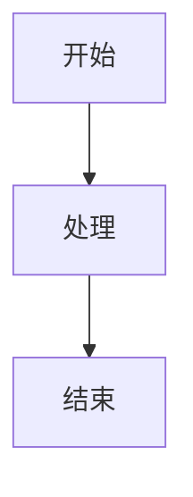

# 文档编写指令

> **⚠️ 权威声明**  
> 本文件所列规则仅作操作/辅导用，权威判据以 ADR 正文为准。  
> 若本文件与 ADR 正文存在分歧，请及时修订本文件，并以 ADR 正文为最终依据。

## 适用场景：编写和维护文档

在协助文档工作时，在 [`base.instructions.md`](./base.instructions.md) 的基础上应用这些指南。

---

## 🚨 高风险防御点（文档完整性）

### 文档/索引同步检查（强制）

在进行以下操作前，**必须**使用检查清单：

#### ✅ 创建新文档前的检查清单

```markdown
- [ ] 确定文档类型（ADR/Summary/Copilot Prompt/Guide）
- [ ] 确定目标目录位置
- [ ] 识别需要更新的索引文件
- [ ] 准备文档元数据（标题、日期、作者）
- [ ] 准备交叉引用列表
```

#### ✅ 创建新文档后的检查清单

```markdown
- [ ] 文档已创建并遵循标准格式
- [ ] 相应的 README.md 已更新
  - [ ] 目录结构图已添加新文件
  - [ ] 文档列表表格已添加新条目
  - [ ] 快速导航已添加新主题（如适用）
  - [ ] 时间线已添加新条目（如适用）
  - [ ] 统计数字已更新
- [ ] 所有链接已验证可用
- [ ] 相关文档已添加交叉引用（双向链接）
- [ ] 如果是 ADR，相应的 adr-XXXX.prompts.md 已创建/更新
```

#### ✅ 修改现有文档的检查清单

```markdown
- [ ] 版本号已更新
- [ ] 修改日期已更新
- [ ] 版本历史已添加变更记录
- [ ] 所有受影响的链接已更新
- [ ] 交叉引用的文档已更新（双向链接）
- [ ] 如果是重大变更，相关索引已更新
```

**执行级别**：**强制执行** - 所有文档变更必须完成相应检查清单

---

## ⚖️ 编写原则
**核心原则**：
- ADR 正文必须清晰、完整、可执行
- 辅导材料不得与 ADR 正文冲突
- 发现冲突时，以 ADR 正文为准并修正辅导材料

---

## 语言和风格

### 主要语言
- 所有文档必须使用**简体中文**，除非是：
  - 代码示例（使用相应的编程语言）
  - 常用的英文技术术语（如 "API"、"DTO"、"CQRS"）
  - 文件名和路径

### 语气和风格
- **清晰直接** - 不使用营销语言
- **以行动为导向** - 关注要做什么，而非仅概念
- **示例驱动** - 在适用的情况下始终包含代码示例
- **可扫描** - 使用标题、列表和表格

---

## 文档类型

### 1. ADR（架构决策记录）

**位置**：[`docs/adr/`](../../docs/adr/)

**结构**（必须遵循）：参考 ADR 模板

**绝不做**：
- ❌ 在一个 ADR 中混合多个关注点
- ❌ 留下模糊的决策
- ❌ 跳过技术术语的术语表
- ❌ 忘记链接相关 ADR

**关键要求**：
- 每个 ADR 必须明确标注【必须架构测试覆盖】的条款
- 所有约束必须有清晰的✅允许/❌禁止示例
- 必须包含"相关 ADR"和"参考资料"章节

---

### 2. Copilot Prompts

**位置**：[`docs/copilot/`](../../docs/copilot/)

**结构**（必须遵循）：参考 Copilot Prompt 模板

**目的**：这些文件供 Copilot 参考，因此：
- 极其具体
- 包含完整的代码示例
- 展示 ❌ 错误和 ✅ 正确模式
- 提供确切的 CI 错误消息和解释

**关键要求**：
- 每个 Prompt 必须链接到对应的 ADR 正文
- 必须包含场景化的"开发者问题 → Copilot 响应"示例
- 必须包含执行级别（Level 1/2/3）说明

---

### 3. 用户指南

**位置**：[`docs/`](../../docs/)（根级别指南）

**特征**：
- 以清晰的目的陈述开始
- 对长指南包含目录
- 使用 mermaid 图表展示流程和关系
- 提供逐步说明
- 链接到相关 ADR 和 Prompts

---

## 格式标准

### 标题
使用清晰的层级：
```markdown
# H1：文档标题（每个文件只有一个）
## H2：主要章节
### H3：子章节
#### H4：详细内容（谨慎使用）
```

### 代码块
始终指定语言：
````markdown
```csharp
public class Example { }
```

```bash
dotnet test
```
````

### 列表
使用一致的格式：
```markdown
- 无序列表用于无序项
- 使用 `- [ ]` 表示清单
- 使用 `- [x]` 表示已完成项

1. 有序列表用于顺序步骤
2. 自然继续编号
```

### 表格
用于结构化比较：
```markdown
| 功能 | 描述 | 示例 |
|------|------|------|
| X    | 执行 Y | `code` |
```

### 标注
使用表情符号进行视觉强调：
```markdown
✅ 正确方法
❌ 错误方法
⚠️ 警告
💡 提示
📋 清单
🚩 危险信号
```

### 链接
始终使用仓库内的相对路径：
```markdown
[ADR-0001](../../docs/adr/constitutional/ADR-0001-modular-monolith-vertical-slice-architecture.md)
[Prompt 库](../../docs/copilot/adr-0001.prompts.md)
```

**检查清单**：
- [ ] 所有内部链接使用相对路径
- [ ] 链接已验证（文件存在）
- [ ] 跨引用文档已添加反向链接
- [ ] 重组时已更新所有相关链接

---

## 图表

### Mermaid 图表
优先使用 mermaid：
- 架构图
- 流程图
- 序列图



### 何时使用图表
- 文字难以解释的复杂关系
- 架构概览
- 流程流
- 状态转换

### 何时不使用图表
- 简单的列表或层级（使用 markdown 列表）
- 单一关系（使用文字）
- 当图表会比文字解释更大时

---

## 文档维护

### 更新现有文档

**检查清单化流程**：

更新文档时：
1. **检查版本** - 更新版本号和日期
2. **维护结构** - 不要打破既定模式
3. **更新链接** - 确保所有引用仍然有效
4. **添加到历史** - 在版本历史部分记录更改

**重大变更检查清单**（必须）：
```markdown
- [ ] 版本号已升级（major/minor/patch）
- [ ] 修改日期已更新
- [ ] 变更历史已添加新条目
- [ ] 所有相关链接已验证
- [ ] 交叉引用文档已通知/更新
- [ ] 相关 Copilot Prompts 已同步
- [ ] 如果是 ADR，架构测试已同步
```

---

### 废弃文档

永远不要删除旧的 ADR 或主要文档：
1. 将状态改为 `❌ 已废弃`
2. 添加废弃日期
3. 链接到替代文档
4. 解释为什么被废弃

---

### 交叉引用

始终维护双向链接：
- 如果文档 A 引用文档 B，确保文档 B 在"相关文档"中提及文档 A
- 使用一致的链接文字
- 重组时检查链接不会断裂

---

### 更新索引文件（强制执行）

**关键规则**：创建新文档时，必须更新相关的索引/目录文件：

#### 🚨 添加新的 Summary 文档（强制检查清单）

当在 [`docs/summaries/`](../../docs/summaries/) 中创建新的总结文档时：

**强制检查清单**：
```markdown
- [ ] 新文档已创建：docs/summaries/[name]-summary.md
- [ ] README.md 已更新：docs/summaries/README.md
  - [ ] 目录结构图已添加新文件
  - [ ] 文档列表表格已添加新条目（按类别）
  - [ ] 快速导航已添加新主题（按主题）
  - [ ] 时间线表已添加新条目（按日期）
  - [ ] 文档统计已更新（总数+分类计数）
- [ ] 所有链接已验证可用
- [ ] 相关文档已添加交叉引用
```

**示例**：
```markdown
创建 docs/summaries/copilot-governance-summary.md 后：

✅ 必须做：
1. 在 docs/summaries/README.md 的目录结构图中添加：
   │   ├─ copilot-governance-summary.md

2. 在文档列表表格中添加（按类别排序）：
   | copilot-governance-summary.md | Copilot 治理体系总结 | 治理 | 2026-01-21 |

3. 在快速导航中添加（如果是新主题）：
   - **Copilot 治理**：[copilot-governance-summary.md]

4. 在时间线表中添加：
   | 2026-01-21 | copilot-governance-summary.md | 新增 Copilot 治理体系总结 |

5. 更新统计数字：
   总文档数：15 → 16
   治理类：3 → 4
```

#### 🚨 添加新的 ADR（强制检查清单）

当创建新的 ADR 文档时：

**强制检查清单**：
```markdown
- [ ] 新 ADR 已创建：docs/adr/[category]/ADR-XXXX-[name].md
- [ ] 主 README 已更新：docs/adr/README.md
- [ ] 分类 README 已更新：docs/adr/[category]/README.md
- [ ] 相应的 Copilot Prompt 已创建：docs/copilot/adr-XXXX.prompts.md
- [ ] Copilot README 已更新：docs/copilot/README.md
- [ ] 相关架构测试已创建/更新（如适用）
- [ ] 所有交叉引用已建立
```

#### 🚨 添加新的 Copilot Prompt（强制检查清单）

当创建新的 Copilot Prompt 时：

**强制检查清单**：
```markdown
- [ ] 新 Prompt 已创建：docs/copilot/[name].prompts.md
- [ ] README.md 已更新：docs/copilot/README.md
  - [ ] 文件列表已添加新条目
  - [ ] 按字母顺序排序
- [ ] 对应的 ADR 已链接此 Prompt
- [ ] .github/instructions/ 中相关指令已引用此 Prompt
```

**示例检查过程**：
```markdown
✅ 正确流程：
1. 创建 ADR-0006-xxx.md
2. 立即创建 adr-0006.prompts.md
3. 更新 docs/adr/README.md
4. 更新 docs/adr/[category]/README.md
5. 更新 docs/copilot/README.md
6. 在 ADR 中链接 Prompt
7. 在 Prompt 中链接 ADR
8. 验证所有链接可用

❌ 错误流程：
1. 创建 ADR-0006-xxx.md
2. [停止] ← 索引未更新！
```

---

## 要遵循的示例

### 好的文档示例
```markdown
# ADR-0001：模块化单体与垂直切片架构

**状态**：✅ 已采纳
**级别**：架构约束

## 本章聚焦内容

本 ADR 定义模块划分和用例组织方式。

## 决策

模块必须：
- ✅ 按业务能力划分
- ✅ 包含完整垂直切片

模块禁止：
- ❌ 直接引用其他模块
- ❌ 创建横向 Service 层

示例：
```csharp
// ✅ 正确
public class CreateOrderHandler { }

// ❌ 错误
public class OrderService { }
```
```

### 坏的文档示例
```markdown
# 某个文档

这是关于订单的。

你可以创建订单之类的东西。

详情请看代码。
```

**问题**：
- 模糊的标题
- 没有结构
- 没有可操作的信息
- 没有示例
- 告诉人们"看代码"而不是文档化

## 快速参考

| 文档类型 | 位置 | 语言 | 更新 |
|---------|------|------|------|
| ADR | `docs/adr/` | 简体中文 | 版本控制，很少更改 |
| Copilot Prompts | `docs/copilot/` | 简体中文 | 随团队经验演进 |
| 用户指南 | `docs/` | 简体中文 | 随功能更新 |
| 代码注释 | 代码中 | 英文 | 按需 |

## 建议什么

| 场景 | 建议 |
|------|------|
| 新的架构决策 | 按模板创建新 ADR，同时创建对应的 Copilot Prompt |
| 常见的 Copilot 问题 | 添加到相关 [`adr-XXXX.prompts.md`](../../docs/copilot/) |
| 流程变更 | 更新 [`docs/`](../../docs/) 中的相关指南 |
| 令人困惑的 ADR | 添加示例和图表，不要简化规则 |

---

## 参考

- [所有 ADR](../../docs/adr/README.md) - ADR 总览
- [Copilot 系统](../../docs/copilot/README.md) - Copilot Prompts 库
- [实施总结](../../docs/summaries/copilot-governance-implementation.md) - Copilot 治理实施

---

## 维护提醒

> **🔄 重要**  
> 如本文件内容与 ADR 正文存在不一致，或架构演进导致规则变更，请：
> 1. 同步架构负责人确认变更
> 2. 更新本文件以与 ADR 正文保持一致
> 3. 进行团队公告，确保所有成员知晓变更
> 4. 更新相关的 [`docs/copilot/`](../../docs/copilot/) 辅导材料
> 5. 确保所有文档索引保持最新状态
> 6. 验证所有交叉引用的完整性

---
