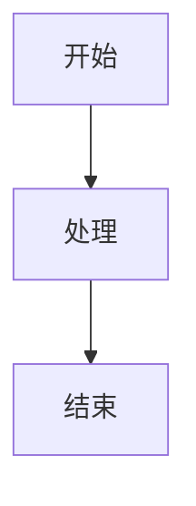

# 文档编写指令

## 适用场景：编写和维护文档

在协助文档工作时，在 `base.instructions.md` 的基础上应用这些指南。

## 语言和风格

### 主要语言
- 所有文档必须使用**简体中文**，除非是：
  - 代码示例（使用相应的编程语言）
  - 常用的英文技术术语（如 "API"、"DTO"、"CQRS"）
  - 文件名和路径

### 语气和风格
- **清晰直接** - 不使用营销语言
- **以行动为导向** - 关注要做什么，而非仅概念
- **示例驱动** - 在适用的情况下始终包含代码示例
- **可扫描** - 使用标题、列表和表格

## 文档类型

### 1. ADR（架构决策记录）

**位置**：`docs/adr/`

**结构**（必须遵循）：
```markdown
# ADR-XXXX：标题

**状态**：✅ 已采纳 / ⚠️ 草稿 / ❌ 已废弃
**级别**：架构约束 / 技术选型 / 最佳实践
**适用范围**：...
**生效时间**：...

## 本章聚焦内容（Focus）
明确说明本 ADR 的主轴和边界

## 术语表（Glossary）
定义关键术语

## 决策（Decision）
明确的决策内容

## 与其他 ADR 关系
说明依赖和引用关系

## 快速参考表
提供查询表格
```

**绝不做**：
- ❌ 在一个 ADR 中混合多个关注点
- ❌ 留下模糊的决策
- ❌ 跳过技术术语的术语表
- ❌ 忘记链接相关 ADR

### 2. Copilot Prompts

**位置**：`docs/copilot/`

**结构**（必须遵循）：
```markdown
# ADR-XXXX：标题 - Copilot 提示词库

## 一、当我在写什么时，你应该提醒我哪些约束？
场景化的触发条件和检查清单

## 二、哪些写法必须阻止？
反模式 + 正确做法对比

## 三、CI 失败时，你应该如何解释？
失败原因的人话翻译和修复步骤

## 四、典型问答（FAQ）
常见问题和答案

## 五、快速检查清单
PR 前的自检项
```

**目的**：这些文件供 Copilot 参考，因此：
- 极其具体
- 包含完整的代码示例
- 展示 ❌ 错误和 ✅ 正确模式
- 提供确切的 CI 错误消息和解释

### 3. 用户指南

**位置**：`docs/`（根级别指南）

**特征**：
- 以清晰的目的陈述开始
- 对长指南包含目录
- 使用 mermaid 图表展示流程和关系
- 提供逐步说明
- 链接到相关 ADR 和 Prompts

## 格式标准

### 标题
使用清晰的层级：
```markdown
# H1：文档标题（每个文件只有一个）
## H2：主要章节
### H3：子章节
#### H4：详细内容（谨慎使用）
```

### 代码块
始终指定语言：
````markdown
```csharp
public class Example { }
```

```bash
dotnet test
```
````

### 列表
使用一致的格式：
```markdown
- 无序列表用于无序项
- 使用 `- [ ]` 表示清单
- 使用 `- [x]` 表示已完成项

1. 有序列表用于顺序步骤
2. 自然继续编号
```

### 表格
用于结构化比较：
```markdown
| 功能 | 描述 | 示例 |
|------|------|------|
| X    | 执行 Y | `code` |
```

### 标注
使用表情符号进行视觉强调：
```markdown
✅ 正确方法
❌ 错误方法
⚠️ 警告
💡 提示
📋 清单
🚩 危险信号
```

### 链接
始终使用仓库内的相对路径：
```markdown
[ADR-0001](../adr/ADR-0001-modular-monolith-vertical-slice-architecture.md)
[Prompt 库](../copilot/adr-0001.prompts.md)
```

## 图表

### Mermaid 图表
优先使用 mermaid：
- 架构图
- 流程图
- 序列图



### 何时使用图表
- 文字难以解释的复杂关系
- 架构概览
- 流程流
- 状态转换

### 何时不使用图表
- 简单的列表或层级（使用 markdown 列表）
- 单一关系（使用文字）
- 当图表会比文字解释更大时

## 文档维护

### 更新现有文档

更新文档时：
1. **检查版本** - 更新版本号和日期
2. **维护结构** - 不要打破既定模式
3. **更新链接** - 确保所有引用仍然有效
4. **添加到历史** - 在版本历史部分记录更改

### 废弃文档

永远不要删除旧的 ADR 或主要文档：
1. 将状态改为 `❌ 已废弃`
2. 添加废弃日期
3. 链接到替代文档
4. 解释为什么被废弃

### 交叉引用

始终维护双向链接：
- 如果文档 A 引用文档 B，确保文档 B 在"相关文档"中提及文档 A
- 使用一致的链接文字
- 重组时检查链接不会断裂

## 要遵循的示例

### 好的文档示例
```markdown
# ADR-0001：模块化单体与垂直切片架构

**状态**：✅ 已采纳
**级别**：架构约束

## 本章聚焦内容

本 ADR 定义模块划分和用例组织方式。

## 决策

模块必须：
- ✅ 按业务能力划分
- ✅ 包含完整垂直切片

模块禁止：
- ❌ 直接引用其他模块
- ❌ 创建横向 Service 层

示例：
```csharp
// ✅ 正确
public class CreateOrderHandler { }

// ❌ 错误
public class OrderService { }
```
```

### 坏的文档示例
```markdown
# 某个文档

这是关于订单的。

你可以创建订单之类的东西。

详情请看代码。
```

**问题**：
- 模糊的标题
- 没有结构
- 没有可操作的信息
- 没有示例
- 告诉人们"看代码"而不是文档化

## 快速参考

| 文档类型 | 位置 | 语言 | 更新 |
|---------|------|------|------|
| ADR | `docs/adr/` | 简体中文 | 版本控制，很少更改 |
| Copilot Prompts | `docs/copilot/` | 简体中文 | 随团队经验演进 |
| 用户指南 | `docs/` | 简体中文 | 随功能更新 |
| 代码注释 | 代码中 | 英文 | 按需 |

## 建议什么

| 场景 | 建议 |
|------|------|
| 新的架构决策 | 按模板创建新 ADR |
| 常见的 Copilot 问题 | 添加到相关 `adr-XXXX.prompts.md` |
| 流程变更 | 更新 `docs/` 中的相关指南 |
| 令人困惑的 ADR | 添加示例和图表，不要简化规则 |

## 参考

- 所有 ADR：`docs/adr/README.md`
- Copilot 系统：`docs/copilot/README.md`
- 实施总结：`docs/summaries/copilot-governance-implementation.md`
