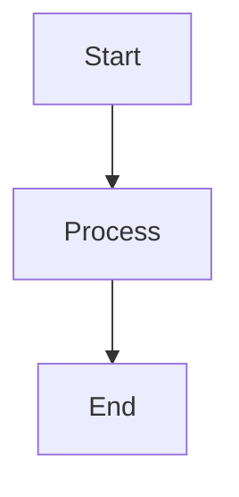

# Documentation Instructions

## Specific to: Writing and Maintaining Documentation

When assisting with documentation, apply these guidelines on top of `base.instructions.md`.

## Language and Style

### Primary Language
- All documentation MUST be in **Simplified Chinese (简体中文)** unless it's:
  - Code examples (use appropriate programming language)
  - Technical terms that are commonly used in English (e.g., "API", "DTO", "CQRS")
  - File names and paths

### Tone and Style
- **Clear and direct** - No marketing language
- **Action-oriented** - Focus on what to do, not just concepts
- **Example-driven** - Always include code examples where applicable
- **Scannable** - Use headings, lists, and tables

## Documentation Types

### 1. ADR (Architecture Decision Records)

**Location**: `docs/adr/`

**Structure** (MUST follow):
```markdown
# ADR-XXXX: Title

**状态**: ✅ 已采纳 / ⚠️ 草稿 / ❌ 已废弃
**级别**: 架构约束 / 技术选型 / 最佳实践
**适用范围**: ...
**生效时间**: ...

## 本章聚焦内容（Focus）
明确说明本 ADR 的主轴和边界

## 术语表（Glossary）
定义关键术语

## 决策（Decision）
明确的决策内容

## 与其他 ADR 关系
说明依赖和引用关系

## 快速参考表
提供查询表格
```

**Never do**:
- ❌ Mix multiple concerns in one ADR
- ❌ Leave decisions ambiguous
- ❌ Skip the glossary for technical terms
- ❌ Forget to link related ADRs

### 2. Copilot Prompts

**Location**: `docs/copilot/`

**Structure** (MUST follow):
```markdown
# ADR-XXXX: Title - Copilot 提示词库

## 一、当我在写什么时，你应该提醒我哪些约束？
场景化的触发条件和检查清单

## 二、哪些写法必须阻止？
反模式 + 正确做法对比

## 三、CI 失败时，你应该如何解释？
失败原因的人话翻译和修复步骤

## 四、典型问答（FAQ）
常见问题和答案

## 五、快速检查清单
PR 前的自检项
```

**Purpose**: These files are for Copilot to reference, so:
- Be extremely specific
- Include complete code examples
- Show both ❌ wrong and ✅ correct patterns
- Provide exact CI error messages and explanations

### 3. User Guides

**Location**: `docs/` (root level guides)

**Characteristics**:
- Start with a clear purpose statement
- Include a table of contents for long guides
- Use mermaid diagrams for flows and relationships
- Provide step-by-step instructions
- Link to related ADRs and prompts

## Formatting Standards

### Headings
Use clear hierarchy:
```markdown
# H1: Document Title (only one per file)
## H2: Major sections
### H3: Subsections
#### H4: Details (use sparingly)
```

### Code Blocks
Always specify the language:
````markdown
```csharp
public class Example { }
```

```bash
dotnet test
```
````

### Lists
Use consistent formatting:
```markdown
- Unordered lists for items without sequence
- Use `- [ ]` for checklists
- Use `- [x]` for completed items

1. Ordered lists for sequential steps
2. Continue numbering naturally
```

### Tables
Use for structured comparisons:
```markdown
| Feature | Description | Example |
|---------|-------------|---------|
| X       | Does Y      | `code`  |
```

### Callouts
Use emoji for visual emphasis:
```markdown
✅ Correct approach
❌ Incorrect approach
⚠️ Warning
💡 Tip
📋 Checklist
🚩 Red flag
```

### Links
Always use relative paths within the repository:
```markdown
[ADR-0001](../adr/ADR-0001-modular-monolith-vertical-slice-architecture.md)
[Prompt Library](../copilot/adr-0001.prompts.md)
```

## Diagrams

### Mermaid Diagrams
Prefer mermaid for:
- Architecture diagrams
- Flow charts
- Sequence diagrams



### When to Use Diagrams
- Complex relationships that text can't easily explain
- Architectural overviews
- Process flows
- State transitions

### When NOT to Use Diagrams
- Simple lists or hierarchies (use markdown lists)
- Single relationships (use text)
- When the diagram would be larger than the text explanation

## Documentation Maintenance

### Updating Existing Docs

When updating documentation:
1. **Check version** - Update version number and date
2. **Maintain structure** - Don't break established patterns
3. **Update links** - Ensure all references are still valid
4. **Add to history** - Document changes in version history section

### Deprecating Documents

Never delete old ADRs or major documents:
1. Change status to `❌ 已废弃`
2. Add deprecation date
3. Link to replacement document
4. Explain why it was deprecated

### Cross-References

Always maintain bidirectional links:
- If Doc A references Doc B, ensure Doc B mentions Doc A in "Related Documents"
- Use consistent link text
- Check links don't break when restructuring

## Examples to Follow

### Good Documentation Example
```markdown
# ADR-0001：模块化单体与垂直切片架构

**状态**：✅ 已采纳
**级别**：架构约束

## 本章聚焦内容

本 ADR 定义模块划分和用例组织方式。

## 决策

模块必须:
- ✅ 按业务能力划分
- ✅ 包含完整垂直切片

模块禁止:
- ❌ 直接引用其他模块
- ❌ 创建横向 Service 层

示例:
```csharp
// ✅ Correct
public class CreateOrderHandler { }

// ❌ Incorrect
public class OrderService { }
```
```

### Bad Documentation Example
```markdown
# Some Document

This is about orders.

You can create orders and stuff.

See the code for details.
```

**Problems**:
- Vague title
- No structure
- No actionable information
- No examples
- Tells people to "see code" instead of documenting

## Quick Reference

| Document Type | Location | Language | Updates |
|---------------|----------|----------|---------|
| ADR | `docs/adr/` | 简体中文 | Version-controlled, rarely changed |
| Copilot Prompts | `docs/copilot/` | 简体中文 | Evolve with team experience |
| User Guides | `docs/` | 简体中文 | Update with features |
| Code Comments | In code | English | As needed |

## What to Suggest

| Scenario | Suggestion |
|----------|------------|
| New architecture decision | Create new ADR following template |
| Common Copilot question | Add to relevant `adr-XXXX.prompts.md` |
| Process change | Update relevant guide in `docs/` |
| Confusing ADR | Add examples and diagrams, don't simplify rules |

## Reference

- All ADRs: `docs/adr/README.md`
- Copilot system: `docs/copilot/README.md`
- Implementation summary: `docs/summaries/copilot-governance-implementation.md`
