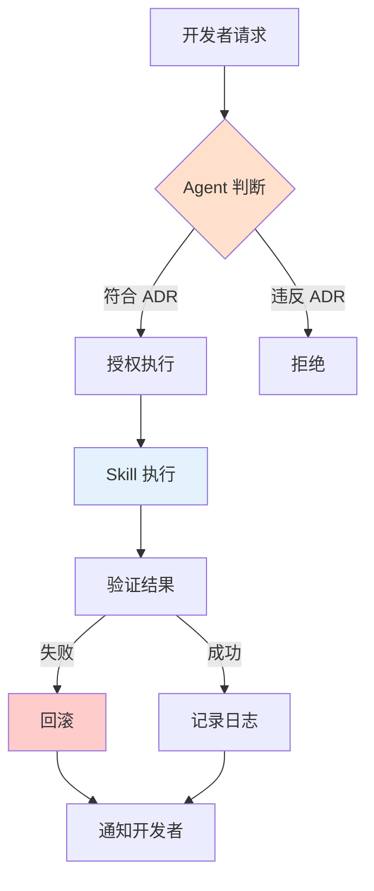

# GitHub Copilot Skills 体系

**版本**：1.0  
**最后更新**：2026-01-25  
**状态**：Active

---

## 一、Skills 定位

### 核心概念

> **Skills = 实际"动手"的工具函数**

⚠️ **Skills 是最不重要、但最危险的一层**

因为：
- 权限大
- 行为具体
- 一旦越权，破坏力最大

### 在治理体系中的位置

```
ADR（宪法）
  ↓
Instructions（角色边界）
  ↓
Agents（执行主体）
  ↓
Prompts（场景触发）
  ↓
Skills（工具能力）← 你在这里
```

---

## 二、Skills 的本质

### Skills 必须被三重约束

```
┌────────────────────────────────┐
│   ADR（定义"能不能做"）          │
└──────────┬─────────────────────┘
           ↓
┌────────────────────────────────┐
│   Agent（决定"要不要做"）        │
└──────────┬─────────────────────┘
           ↓
┌────────────────────────────────┐
│   Skill（执行"怎么做"）          │
└────────────────────────────────┘
```

**如果没有 ADR + Agent 约束，Skill 就是"会写代码的猴子"。**

### Skills 的特征

| 特性  | 说明                  |
|-----|--------------------|
| 专业性 | 每个 Skill 只做一件事      |
| 无判断 | Skill 不判断"应不应该执行"   |
| 可审计 | 所有 Skill 调用必须有日志    |
| 可撤销 | 危险操作必须有回滚机制        |
| 幂等性 | 相同输入产生相同输出         |

---

## 三、Skills 分类

### 3.1 代码生成类（高风险）

| Skill                   | 描述             | 风险等级 | 需要 Agent 授权          |
|-------------------------|----------------|------|---------------------|
| generate-handler        | 生成 Handler 代码  | 高    | architecture-guardian |
| generate-test           | 生成测试代码         | 中    | test-generator       |
| generate-endpoint       | 生成 Endpoint 代码 | 高    | architecture-guardian |
| generate-domain-model   | 生成领域模型         | 高    | architecture-guardian |
| generate-contract       | 生成数据契约         | 中    | architecture-guardian |

**风险点**：
- 可能生成不符合架构的代码
- 可能覆盖现有文件
- 可能破坏命名规范

**防范措施**：
- 必须由 Agent 预先验证
- 生成前检查冲突
- 生成后自动运行架构测试

---

### 3.2 代码分析类（中风险）

| Skill                   | 描述           | 风险等级 | 需要 Agent 授权                |
|-------------------------|--------------|------|-----------------------------|
| scan-dependencies       | 扫描项目依赖       | 低    | architecture-guardian         |
| analyze-architecture    | 分析架构结构       | 低    | architecture-guardian         |
| check-naming            | 检查命名规范       | 低    | architecture-guardian         |
| find-violations         | 查找架构违规       | 低    | architecture-guardian         |
| scan-cross-module-refs  | 扫描跨模块引用      | 中    | module-boundary-checker       |

**风险点**：
- 可能产生误报
- 可能遗漏真正的问题

**防范措施**：
- 分析结果必须由 Agent 二次验证
- 提供详细的分析报告
- 支持人工复核

---

### 3.3 代码修改类（极高风险）

| Skill               | 描述        | 风险等级 | 需要 Agent 授权          |
|---------------------|-----------|------|---------------------|
| batch-rename        | 批量重命名     | 极高   | architecture-guardian |
| move-files          | 移动文件      | 极高   | architecture-guardian |
| refactor-namespace  | 重构命名空间    | 极高   | architecture-guardian |
| update-references   | 更新引用      | 极高   | architecture-guardian |

**风险点**：
- 可能破坏大量代码
- 可能导致编译失败
- 可能丢失代码

**防范措施**：
- ⚠️ **强制要求**：修改前必须备份
- ⚠️ **强制要求**：修改后必须运行完整测试
- ⚠️ **强制要求**：Agent 必须预先审批
- ⚠️ **强制要求**：操作可回滚

---

### 3.4 文档生成类（中风险）

| Skill                | 描述          | 风险等级 | 需要 Agent 授权             |
|----------------------|-------------|------|-----------------------|
| generate-adr         | 生成 ADR 文档   | 高    | adr-reviewer           |
| generate-prompts     | 生成 Prompts  | 中    | adr-reviewer           |
| update-documentation | 更新文档索引      | 低    | documentation-maintainer |
| generate-diagram     | 生成架构图       | 低    | documentation-maintainer |

**风险点**：
- 可能生成不符合规范的文档
- 可能覆盖重要内容

**防范措施**：
- 生成后必须人工审核
- 保留文档历史版本
- 重要文档需要审批流程

---

### 3.5 测试执行类（低风险）

| Skill                      | 描述       | 风险等级 | 需要 Agent 授权        |
|----------------------------|----------|------|-------------------|
| run-architecture-tests     | 运行架构测试   | 低    | test-generator     |
| run-unit-tests             | 运行单元测试   | 低    | test-generator     |
| run-integration-tests      | 运行集成测试   | 低    | test-generator     |
| analyze-test-coverage      | 分析测试覆盖率  | 低    | test-generator     |

**风险点**：
- 几乎无风险（只读操作）

**防范措施**：
- 确保测试环境隔离
- 不影响生产数据

---

### 3.6 CI/CD 集成类（中风险）

| Skill                | 描述        | 风险等级 | 需要 Agent 授权        |
|----------------------|-----------|------|-------------------|
| trigger-build        | 触发构建      | 中    | architecture-guardian |
| post-comment         | 发布 PR 评论  | 低    | adr-reviewer       |
| update-pr-status     | 更新 PR 状态  | 中    | adr-reviewer       |
| notify-team          | 通知团队      | 低    | documentation-maintainer |

**风险点**：
- 可能触发不必要的构建
- 可能发送错误信息

**防范措施**：
- 关键操作需要人工确认
- 操作留有审计日志

---

## 四、Skill 配置文件标准结构

每个 Skill 配置文件（`*.skill.md`）必须包含：

### 4.1 元数据

```yaml
---
name: "Skill 名称"
description: "简短描述"
version: "1.0"
risk_level: "高/中/低"
category: "代码生成/代码分析/代码修改/文档生成/测试执行/CI集成"
required_agent: "必须由哪个 Agent 授权"
---
```

### 4.2 功能定义

```markdown
# 功能定义

## 用途
（这个 Skill 做什么）

## 输入参数
- 参数 1：类型，说明
- 参数 2：类型，说明

## 输出结果
（生成什么）
```

### 4.3 前置条件

```markdown
# 前置条件

## 必须满足的条件
- [ ] 条件 1
- [ ] 条件 2

## 必须的 Agent 授权
- 需要：agent-name
- 理由：...
```

### 4.4 执行步骤

```markdown
# 执行步骤

1. 验证输入参数
2. 检查前置条件
3. 执行主要操作
4. 验证结果
5. 记录日志
```

### 4.5 回滚机制（高风险 Skill 必须）

```markdown
# 回滚机制

## 如何回滚
1. 步骤 1
2. 步骤 2

## 回滚验证
- [ ] 验证点 1
- [ ] 验证点 2
```

---

## 五、Skills 使用原则

### 5.1 核心原则

| 原则           | 说明                      |
|--------------|-------------------------|
| ✅ 明确授权      | 每个 Skill 必须在 Agent 中显式授权 |
| ✅ 单一职责      | 一个 Skill 只做一件事          |
| ✅ 可审计       | 所有 Skill 调用必须有日志        |
| ❌ 不可越权      | Skill 不能绕过 ADR          |
| ❌ 不可自主决策    | Skill 不能判断"应不应该执行"      |
| ❌ 不可修改 ADR  | Skill 不能修改架构规则          |

### 5.2 使用流程



### 5.3 调用约束

**所有 Skills 必须遵守**：

1. **不能直接被开发者调用**
  - 必须通过 Agent 调用
  - Agent 负责验证合法性

2. **不能自主决策**
  - Skill 只执行，不判断
  - 判断逻辑在 Agent 层

3. **不能修改架构规则**
  - Skill 不能修改 ADR
  - Skill 不能修改 Instructions
  - Skill 不能修改 Agents

4. **必须留有审计痕迹**
  - 记录调用时间
  - 记录调用参数
  - 记录执行结果

---

## 六、Skills 开发规范

### 6.1 命名规范

```
{动词}-{对象}.skill.md

示例：
- generate-handler.skill.md
- scan-dependencies.skill.md
- batch-rename.skill.md
```

### 6.2 文件组织

```
.github/skills/
  ├── README.md                    ← 本文件
  ├── code-generation/             ← 代码生成类
  │   ├── generate-handler.skill.md
  │   ├── generate-test.skill.md
  │   └── generate-endpoint.skill.md
  ├── code-analysis/               ← 代码分析类
  │   ├── scan-dependencies.skill.md
  │   ├── analyze-architecture.skill.md
  │   └── check-naming.skill.md
  ├── code-modification/           ← 代码修改类（高风险）
  │   ├── batch-rename.skill.md
  │   └── move-files.skill.md
  ├── documentation/               ← 文档生成类
  │   ├── generate-adr.skill.md
  │   └── generate-prompts.skill.md
  ├── testing/                     ← 测试执行类
  │   ├── run-architecture-tests.skill.md
  │   └── run-unit-tests.skill.md
  └── ci-cd/                       ← CI/CD 集成类
      ├── trigger-build.skill.md
      └── post-comment.skill.md
```

### 6.3 版本管理

- Skill 配置文件纳入版本控制
- 重大变更需要版本号递增
- 保留变更历史记录
- 破坏性变更需要团队通知

---

## 七、Skills 安全机制

### 7.1 三层安全防护

```
┌────────────────────────────────┐
│  第 1 层：Agent 授权             │
│  - 验证是否允许调用               │
└──────────┬─────────────────────┘
           ↓
┌────────────────────────────────┐
│  第 2 层：前置条件检查            │
│  - 验证输入参数                  │
│  - 检查环境状态                  │
└──────────┬─────────────────────┘
           ↓
┌────────────────────────────────┐
│  第 3 层：执行后验证              │
│  - 验证结果正确性                │
│  - 运行架构测试                  │
└────────────────────────────────┘
```

### 7.2 高风险 Skill 特殊要求

对于"代码修改类" Skills：

- ⚠️ **强制要求**：执行前必须备份
- ⚠️ **强制要求**：执行后必须运行完整测试
- ⚠️ **强制要求**：必须有回滚机制
- ⚠️ **强制要求**：必须有人工审批流程

### 7.3 审计日志

所有 Skill 调用必须记录：

```json
{
  "timestamp": "2026-01-25T10:30:00Z",
  "skill": "generate-handler",
  "agent": "architecture-guardian",
  "user": "developer@example.com",
  "parameters": {
    "module": "Orders",
    "command": "CreateOrder"
  },
  "result": "success",
  "duration_ms": 1234
}
```

---

## 八、Skills 与其他层级的关系

### 8.1 被 Agents 调用

```
Agent（判断"要不要做"）
    ↓
调用 Skill（执行"怎么做"）
    ↓
验证结果
    ↓
返回给 Agent
```

### 8.2 受 ADR 约束

```
ADR（定义"能不能做"）
    ↓
Agent 验证合规性
    ↓
符合 ADR → 调用 Skill
不符合 ADR → 拒绝调用
```

### 8.3 结果反馈到 Prompts

```
Skill 执行失败
    ↓
Agent 分析原因
    ↓
更新 Prompts（补充失败案例）
```

---

## 九、常见问题（FAQ）

### Q: Skill 和 Agent 的区别是什么？

**A:**
- **Agent**：判断"要不要做"，有职责和边界
- **Skill**：执行"怎么做"，只是工具函数

### Q: 可以直接调用 Skill 吗？

**A:** ❌ **不可以**。Skill 必须通过 Agent 调用，Agent 负责验证合法性。

### Q: 如何添加新的 Skill？

**A:** 遵循以下步骤：
1. 确认有明确的使用场景
2. 按标准结构创建配置文件
3. 指定必需的 Agent 授权
4. 实现安全机制（特别是高风险 Skill）
5. 添加到相应 Agent 的授权列表
6. 更新文档

### Q: Skill 出错了怎么办？

**A:**
1. 检查审计日志
2. 如果有回滚机制，执行回滚
3. 分析失败原因
4. 修复问题并更新 Skill 配置
5. 如果是高风险 Skill，通知团队

---

## 十、快速参考

### 10.1 按风险等级选择 Skill

| 风险等级 | Skills                                          | 特殊要求    |
|------|-------------------------------------------------|---------|
| 极高   | batch-rename, move-files, refactor-namespace    | 必须有回滚机制 |
| 高    | generate-handler, generate-adr, generate-endpoint | Agent 审批 |
| 中    | generate-test, scan-cross-module-refs            | 结果验证    |
| 低    | run-tests, analyze-architecture                  | 基本审计    |

### 10.2 按类别选择 Skill

| 需求     | Skills 目录                 | 风险提示 |
|--------|---------------------------|------|
| 生成代码   | code-generation/          | 高    |
| 分析代码   | code-analysis/            | 低    |
| 修改代码   | code-modification/        | 极高   |
| 生成文档   | documentation/            | 中    |
| 运行测试   | testing/                  | 低    |
| CI/CD 集成 | ci-cd/                    | 中    |

---

## 十一、下一步

### 了解具体 Skills

- [代码生成 Skills](code-generation/)
- [代码分析 Skills](code-analysis/)
- [代码修改 Skills](code-modification/)
- [文档生成 Skills](documentation/)
- [测试执行 Skills](testing/)
- [CI/CD 集成 Skills](ci-cd/)

### 了解相关系统

- [Agents 体系](../agents/README.md)
- [Instructions 体系](../instructions/README.md)
- [Prompts 库](../../docs/copilot/README.md)
- [架构治理系统总览](../../docs/ARCHITECTURE-GOVERNANCE-SYSTEM.md)

---

## 版本历史

| 版本  | 日期         | 变更说明                  |
|-----|------------|----------------------------|
| 1.0 | 2026-01-25 | 初始版本，建立 Skills 规范体系 |

---

**维护团队**：架构委员会  
**审核人**：@douhuaa  
**状态**：✅ Active
