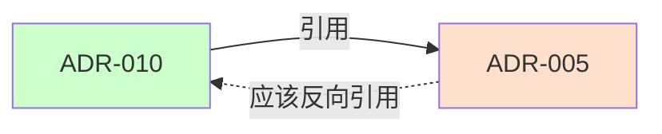

# Update Documentation Skill

**类别**：文档生成  
**风险等级**：低  
**版本**：1.0

---

## 功能定义

### 用途

自动更新文档索引、目录和交叉引用，确保文档体系的完整性和可发现性。

### 输入参数

- `operation`：字符串枚举，"add" / "remove" / "update" / "check"
- `docType`：字符串枚举，"adr" / "prompt" / "summary" / "guide"
- `filePath`：字符串，文档文件路径
- `metadata`：对象，文档元数据（标题、类别等）

### 输出结果

```json
{
  "success": true,
  "updates": [
    {
      "file": "docs/adr/README.md",
      "type": "index",
      "changes": "添加 ADR-010 到索引"
    },
    {
      "file": "docs/adr/constitutional/README.md",
      "type": "category-index",
      "changes": "添加到宪法类别列表"
    }
  ],
  "crossReferences": [
    {
      "source": "ADR-010",
      "target": "ADR-005",
      "type": "references",
      "needsBackReference": true
    }
  ],
  "summary": {
    "filesUpdated": 2,
    "referencesAdded": 1,
    "referencesNeedAttention": 1
  }
}
```

---

## 前置条件

### 必须满足的条件

- [ ] 文档文件存在（对于 add/update）
- [ ] 索引文件可写
- [ ] 文档元数据完整

### 必须的 Agent 授权

- **需要**：`documentation-maintainer`
- **理由**：索引维护需要文档维护专业知识

---

## 执行步骤

1. **验证输入参数**
  - 检查操作类型有效
  - 验证文档类型
  - 检查文件路径

2. **确定需要更新的索引**
  - 主索引（README.md）
  - 类别索引
  - 交叉引用

3. **执行更新操作**
  - 添加新条目
  - 删除旧条目
  - 更新现有条目

4. **检查交叉引用**
  - 提取引用关系
  - 验证双向链接
  - 标记缺失引用

5. **生成报告**
  - 列出更新内容
  - 提示需要手动处理的项

6. **记录日志**

---

## 更新模式

### 添加 ADR

需要更新的文件：

1. **`docs/adr/README.md`**
```markdown
### 宪法层 (Constitutional)

| ADR | 标题 | 状态 |
|-----|------|------|
| [ADR-001](constitutional/ADR-001-...) | ... | ✅ |
| [ADR-010](constitutional/ADR-010-...) | ... | 🚧 | ← 新增
```

2. **`docs/adr/constitutional/README.md`**
```markdown
## 文档列表

- [ADR-001：...](ADR-001-...)
- [ADR-010：...](ADR-010-...) ← 新增
```

3. **相关 ADR 的"相关 ADR"章节**
```markdown
## 相关 ADR

- [ADR-005：...](../constitutional/ADR-005-...)
- [ADR-010：...](../constitutional/ADR-010-...) ← 新增反向引用
```

### 添加 Summary

需要更新的文件：

1. **`docs/summaries/README.md`**

更新以下部分：
- 目录结构图
- 文档列表表格
- 快速导航
- 时间线
- 统计数字

### 添加 Copilot Prompt

需要更新的文件：

1. **`docs/copilot/README.md`**
```markdown
## 文件列表

| 文件 | 关联 ADR | 用途 |
|------|---------|------|
| adr-001.prompts.md | ADR-001 | ... |
| adr-010.prompts.md | ADR-010 | ... | ← 新增
```

---

## 交叉引用检查

### 提取引用关系

扫描文档内容，提取：
- `[ADR-XXXX：...](path)`
- 相关 ADR 章节
- 参考资料章节

### 验证双向链接



### 生成缺失引用报告

```markdown
## 缺失的交叉引用

⚠️ 以下引用需要补充：

- ADR-010 引用了 ADR-005
  建议：在 ADR-005 的"相关 ADR"章节添加 ADR-010

- ADR-010 引用了 ADR-001
  建议：在 ADR-001 的"相关 ADR"章节添加 ADR-010
```

---

## 验证规则

### 索引完整性检查

- [ ] 所有新文档已添加到索引
- [ ] 索引格式正确
- [ ] 链接有效

### 交叉引用检查

- [ ] 引用关系已提取
- [ ] 缺失的反向引用已标记
- [ ] 提供了补充建议

---

## 回滚机制

### 如何回滚

1. 恢复索引文件到更新前状态
2. 验证索引完整性

### 回滚验证

- [ ] 索引恢复正确
- [ ] 所有链接有效

---

## 危险信号

⚠️ **警告**：
- 大量文档未在索引中
- 索引格式不一致
- 交叉引用严重缺失

---

## 使用示例

### 示例 1：添加新 ADR 到索引

**输入**：
```json
{
  "operation": "add",
  "docType": "adr",
  "filePath": "docs/adr/constitutional/ADR-010-event-sourcing.md",
  "metadata": {
    "number": "0010",
    "title": "Event Sourcing Pattern",
    "level": "宪法",
    "status": "草稿",
    "relatedAdrs": ["ADR-005", "ADR-001"]
  }
}
```

**输出**：
- 更新 `docs/adr/README.md`
- 更新 `docs/adr/constitutional/README.md`
- 标记需要在 ADR-005 和 ADR-001 中添加反向引用

### 示例 2：检查文档索引

**输入**：
```json
{
  "operation": "check",
  "docType": "adr"
}
```

**输出**：
- 扫描所有 ADR 文件
- 对比索引文件
- 报告缺失或多余的条目

---

## 参考资料

- [ADR-008：文档编写规范](../../../docs/adr/constitutional/ADR-008-documentation-writing-maintenance-constitution.md)
- [文档编写指令](../../instructions/documentation.instructions.md)

---

**维护者**：架构委员会  
**状态**：✅ Active
