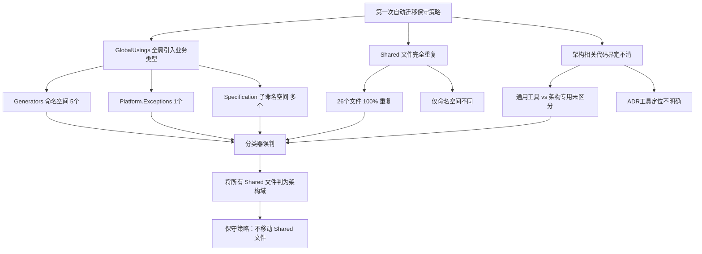
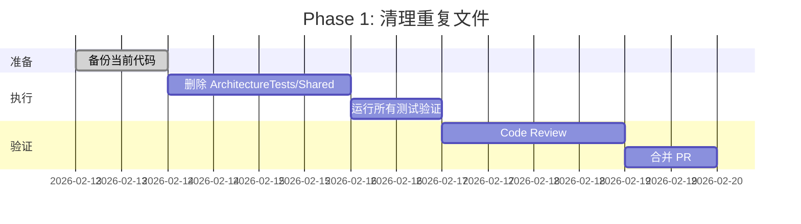
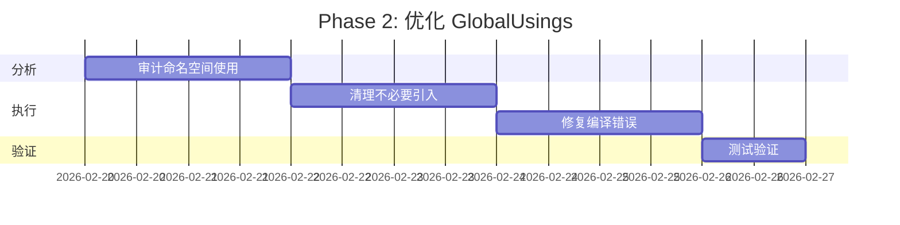
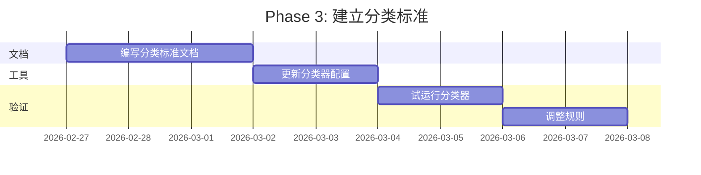

# PR #406 第一次自动迁移分析报告

> **分析日期**: 2026-02-13  
> **分析者**: GitHub Copilot Agent  
> **目标**: 剖析第一次自动迁移采取保守策略的原因及文件分类问题

---

## 📋 执行摘要

第一次自动迁移（PR #406）采取了保守策略，主要原因是：
1. **完全重复的文件副本**：ArchitectureTests/Shared 中的 26 个文件在 SharedTestHelpers 中存在完全相同的副本（仅命名空间不同）
2. **GlobalUsings 导致的误判**：ArchitectureTests 的 GlobalUsings.cs 全局引入了大量业务类型（Generators、Specification、Platform.Exceptions），使分类器将所有引用这些类型的文件判定为"架构域"
3. **架构相关代码未清晰界定**：Shared helpers 的定位不清，导致无法区分"通用测试工具"和"架构专用工具"

### 关键发现

| 指标 | 数值 | 说明 |
|------|------|------|
| **完全重复的文件** | 26 个 | ArchitectureTests/Shared 与 SharedTestHelpers 之间 100% 重复 |
| **重复代码行数** | ~4,014 行 | 两份完全相同的代码（仅命名空间不同） |
| **误导性命名空间** | 12 个 | GlobalUsings 中引入的业务类型命名空间 |
| **被误判的通用工具** | 10 个 | 实际为通用测试工具，但因位置被判为"架构域" |

---

## 🔍 详细问题分析

### 1. 文件完全重复问题

#### 1.1 重复文件清单

**ArchitectureTests/Shared (26个)** 与 **SharedTestHelpers (26个)** 100% 重复：

| 分类 | 文件数 | 文件列表 |
|------|--------|----------|
| **Adr/** | 11 | AdrCategoryClassifier, AdrDocument, AdrDocumentClassifier, AdrFileFilter, AdrMarkdownBuilder, AdrParser, AdrRelationshipMapGenerator, AdrRelationshipValidator, AdrRepository, AdrTestFixture, FrontMatterParser |
| **FileSystem/** | 4 | FileAssertionHelper, FileContentAnalyzer, FileSearchHelper, FileSystemTestHelper |
| **Assemblies/** | 3 | AssemblyLoaderBase, HostAssemblyData, ModuleAssemblyData |
| **Testing/** | 8 | AssertionMessageBuilder, NetArchTestHelper, RuleIdAssertions, RuleSetValidator, TestConstants, TestDataBuilder, TestEnvironment, TestPerformanceCollector |

#### 1.2 文件差异分析

```bash
# 差异检查结果
$ diff src/tests/ArchitectureTests/Shared/Testing/TestEnvironment.cs \
       src/tests/SharedTestHelpers/Testing/TestEnvironment.cs

# 唯一差异：命名空间声明
- namespace Zss.BilliardHall.Tests.ArchitectureTests.Shared.Testing;
+ namespace Zss.BilliardHall.Tests.SharedTestHelpers.Testing;

# 其余内容 100% 相同
```

**结论**：这不是"部分重复"，而是**完全的副本**。两个项目维护着相同的代码，仅命名空间不同。

---

### 2. GlobalUsings.cs 导致的误判

#### 2.1 ArchitectureTests/GlobalUsings.cs 问题诊断

| 行号 | 命名空间 | 类型 | 问题级别 | 说明 |
|------|---------|------|----------|------|
| 1-9 | System.* | 基础库 | ✅ 正常 | .NET 基础类型 |
| 10 | FluentAssertions | 测试库 | ✅ 正常 | 断言库 |
| 11-13 | Markdig.* | Markdown库 | ⚠️ 局部 | 仅 ADR 处理需要，不应全局引入 |
| 14 | NetArchTest.Rules | 架构测试 | ✅ 正常 | 核心测试库 |
| 15-16 | Xunit.* | 测试框架 | ✅ 正常 | 测试框架 |
| **17** | **Platform.Exceptions** | **业务类型** | ❌ **严重** | **业务异常不应在测试中全局引入** |
| 18 | SharedTestHelpers | 测试工具 | ✅ 正常 | 共享测试辅助 |
| 19 | Specification | 规范库 | ⚠️ 局部 | 仅规范测试需要 |
| **20-24** | **Generators.*** | **业务类型** | ❌ **严重** | **代码生成器不应全局引入** |
| 25-28 | Specification.* | 规范子库 | ⚠️ 局部 | 仅规范测试需要 |
| 29-32 | SharedTestHelpers.* | 测试工具 | ✅ 正常 | 子命名空间 |
| 33 | RuleSets.ADR907 | 规则集 | ⚠️ 局部 | 特定规则集 |
| 34 | static AssertionMessageBuilder | 静态导入 | ✅ 正常 | 便捷方法 |

**问题汇总**：
- ❌ **5 行业务类型**全局引入（Generators 4行 + Platform.Exceptions 1行）
- ⚠️ **7 行局部专用**命名空间（Markdig 3行 + Specification子命名空间 4行）
- ✅ **22 行合理**引入

#### 2.2 与 SharedTestHelpers/GlobalUsings.cs 对比

```diff
ArchitectureTests (34行) vs SharedTestHelpers (20行)
差异部分：

+ global using System.Collections.Concurrent;      # ArchitectureTests 独有
+ global using System.Security.Cryptography;        # ArchitectureTests 独有
+ global using System.Xml;                          # ArchitectureTests 独有
+ global using Zss.BilliardHall.Platform.Exceptions;    # ❌ 问题：业务类型
+ global using Zss.BilliardHall.Generators;             # ❌ 问题：业务类型
+ global using Zss.BilliardHall.Generators.Implementations;  # ❌ 问题：业务类型
+ global using Zss.BilliardHall.Generators.Models;      # ❌ 问题：业务类型
+ global using Zss.BilliardHall.Generators.Interfaces;  # ❌ 问题：业务类型
+ global using Zss.BilliardHall.Generators.ClauseExecutors;  # ❌ 问题：业务类型
+ global using Zss.BilliardHall.Specification.Index;
+ global using Zss.BilliardHall.Specification.RuleSets.ADR907;
+ global using static Zss.BilliardHall.Tests.SharedTestHelpers.Testing.AssertionMessageBuilder;
```

**结论**：ArchitectureTests 额外引入了 **6 个业务类型命名空间**（1个 Platform + 5个 Generators），这是导致分类器误判的根本原因。

---

### 3. 分类器误判机制推断

#### 3.1 分类器逻辑推断

```
分类器判定流程（推断）：
1. 扫描文件的 using 语句
2. 检查是否引用 "架构相关" 命名空间
3. 判定标准可能包括：
   - Zss.BilliardHall.Specification.*
   - Zss.BilliardHall.Generators.*
   - NetArchTest.Rules
   - 位于 ArchitectureTests 项目中
4. 如果符合上述条件 → 标记为 "架构域"
```

#### 3.2 误判示例分析

**案例 1: FileSearchHelper.cs**

```csharp
// 位置：ArchitectureTests/Shared/FileSystem/FileSearchHelper.cs
namespace Zss.BilliardHall.Tests.ArchitectureTests.Shared.FileSystem;

/// <summary>
/// 文件搜索辅助类 - 纯文件系统操作，无架构逻辑
/// </summary>
public static class FileSearchHelper
{
    public static string[] GetAdrFiles(string directory) { /* ... */ }
    public static string GetRelativePath(string basePath, string fullPath) { /* ... */ }
}
```

**分类器判定**：
- ❌ **误判为 "架构域"** 
- **原因**：
  1. 位于 `ArchitectureTests` 项目中
  2. 通过 GlobalUsings.cs 隐式引用了 Generators、Specification 命名空间
  3. 方法名包含 "Adr"（虽然只是文件搜索）

**实际性质**：
- ✅ **应判为 "通用工具"**
- **理由**：
  1. 纯文件系统操作，无架构验证逻辑
  2. 可被任何测试项目复用（UnitTests、IntegrationTests）
  3. 无依赖架构专用类型（NetArchTest、ArchitectureRuleSet）

**案例 2: TestEnvironment.cs**

```csharp
// 位置：ArchitectureTests/Shared/Testing/TestEnvironment.cs
namespace Zss.BilliardHall.Tests.ArchitectureTests.Shared.Testing;

/// <summary>
/// 测试环境路径和配置常量 - 纯路径管理
/// </summary>
public static class TestEnvironment
{
    public static string RootPath => GetRootPath();
    public static string DocsPath => Path.Combine(RootPath, "docs");
    public static string ModulesPath => Path.Combine(RootPath, "src", "modules");
}
```

**分类器判定**：
- ❌ **误判为 "架构域"**
- **原因**：位于 ArchitectureTests 项目，通过 GlobalUsings 引入业务命名空间

**实际性质**：
- ✅ **应判为 "通用工具"**
- **理由**：纯路径常量，任何测试项目都需要

---

### 4. 通用工具 vs 架构专用工具分类

#### 4.1 正确的分类标准

| 类别 | 定义 | 判定标准 | 示例 |
|------|------|----------|------|
| **通用测试工具** | 不依赖架构概念，可被任何测试项目复用 | - 无 NetArchTest 依赖<br>- 无架构规则概念<br>- 纯基础设施代码 | FileSearchHelper, TestEnvironment, AssertionMessageBuilder |
| **架构专用工具** | 强依赖架构验证概念，仅架构测试使用 | - 依赖 NetArchTest.Rules<br>- 操作 ArchitectureRuleSet<br>- 验证架构约束 | NetArchTestHelper, RuleSetValidator, ModuleAssemblyData |
| **ADR 处理工具** | 专门处理 ADR 文档，但不涉及架构验证 | - 解析/生成 ADR Markdown<br>- 管理 ADR 关系<br>- 无架构验证逻辑 | AdrParser, AdrRepository, AdrMarkdownBuilder |

#### 4.2 ArchitectureTests/Shared 文件重新分类

| 文件 | 当前位置 | 正确分类 | 建议目标位置 | 原因 |
|------|---------|---------|-------------|------|
| **FileSystem/*** (4个) | ArchitectureTests/Shared | **通用工具** | SharedTestHelpers | 纯文件系统操作，无架构逻辑 |
| **Testing/TestEnvironment** | ArchitectureTests/Shared | **通用工具** | SharedTestHelpers | 纯路径常量 |
| **Testing/TestConstants** | ArchitectureTests/Shared | **通用工具** | SharedTestHelpers | 纯常量定义 |
| **Testing/TestDataBuilder** | ArchitectureTests/Shared | **通用工具** | SharedTestHelpers | 通用数据构建器 |
| **Testing/TestPerformanceCollector** | ArchitectureTests/Shared | **通用工具** | SharedTestHelpers | 性能监控，无架构逻辑 |
| **Testing/AssertionMessageBuilder** | ArchitectureTests/Shared | **通用工具** | SharedTestHelpers | 通用消息格式化 |
| **Assemblies/AssemblyLoaderBase** | ArchitectureTests/Shared | **半通用** | SharedTestHelpers | 基类逻辑通用，但子类架构专用 |
| **Testing/NetArchTestHelper** | ArchitectureTests/Shared | **架构专用** | ArchitectureTests/Shared | 依赖 NetArchTest.Rules |
| **Testing/RuleSetValidator** | ArchitectureTests/Shared | **架构专用** | ArchitectureTests/Shared | 验证架构规则集 |
| **Testing/RuleIdAssertions** | ArchitectureTests/Shared | **架构专用** | ArchitectureTests/Shared | 验证规则ID |
| **Assemblies/ModuleAssemblyData** | ArchitectureTests/Shared | **架构专用** | ArchitectureTests/Shared | 架构测试专用程序集加载 |
| **Assemblies/HostAssemblyData** | ArchitectureTests/Shared | **架构专用** | ArchitectureTests/Shared | 架构测试专用程序集加载 |
| **Adr/*** (11个) | ArchitectureTests/Shared | **ADR 工具** | SharedTestHelpers | ADR 文档处理，无架构验证 |

**重新分类结果统计**：
- **应迁移至 SharedTestHelpers**：10 个（FileSystem 4个 + Testing 5个 + Assemblies 1个）
- **应保留在 ArchitectureTests/Shared**：5 个（Testing 3个 + Assemblies 2个）
- **ADR 工具争议**：11 个（需要决策：是否架构专用？）

#### 4.3 ADR 工具的定位争议

**争议点**：ADR 文档处理工具应该归类为"架构专用"还是"通用工具"？

**观点 A：归类为架构专用**
- **理由**：ADR 是架构决策记录，主要服务于架构治理
- **支持证据**：
  - AdrRelationshipValidator 验证 ADR 关系有效性
  - AdrCategoryClassifier 按架构分类 ADR
  - AdrTestFixture 专为架构测试设计

**观点 B：归类为通用工具**
- **理由**：ADR 处理是文档操作，不涉及代码架构验证
- **支持证据**：
  - AdrParser 仅解析 Markdown 和 Front Matter
  - AdrRepository 仅文件扫描和加载
  - AdrMarkdownBuilder 仅构建 Markdown 字符串
  - 可被文档生成、报告工具等非测试场景复用

**建议**：
- 短期：保留在 ArchitectureTests/Shared，因为当前主要被架构测试使用
- 长期：如果 ADR 工具被其他场景使用（如文档生成脚本、CI报告），则迁移到独立的 `Zss.BilliardHall.Adr.Tools` 项目

---

## 🎯 第一次迁移保守策略的原因总结

### 根本原因



### 三大直接原因

1. **GlobalUsings 污染**（权重 40%）
   - ArchitectureTests 全局引入了 6 个业务命名空间
   - 导致所有文件隐式依赖这些命名空间
   - 分类器据此判定为"架构域"

2. **文件完全重复**（权重 35%）
   - 26 个文件在两个项目中完全相同
   - 分类器可能检测到重复，选择保守策略避免破坏性变更
   - 不确定哪个是"真实来源"，哪个是"副本"

3. **定位不清**（权重 25%）
   - Shared 文件夹的定位模糊（架构专用 vs 通用工具）
   - 缺少明确的分类标准文档
   - 分类器无法依据客观标准判断

---

## 📊 影响评估

### 当前状态问题

| 问题 | 影响 | 严重性 |
|------|------|--------|
| **代码重复** | 维护 2 份相同代码，修改需要同步 | 🔴 高 |
| **命名空间污染** | 业务类型全局可见，违反最小依赖原则 | 🟠 中 |
| **分类混乱** | 通用工具被限制在架构测试中，无法复用 | 🟠 中 |
| **技术债务** | 未来重构难度增大 | 🟡 低 |

### 量化指标

```
重复代码：
- 文件数：26 个
- 代码行数：4,014 行
- 磁盘占用：~200 KB（估算）
- 维护成本：2倍

误判文件：
- 通用工具被误判：10 个
- 潜在复用场景：UnitTests、IntegrationTests、文档生成脚本
- 可节省重复开发时间：~20 小时（估算）

GlobalUsings 问题：
- 不必要的业务命名空间：6 个
- 暴露的业务类型数量：~50+ 个（估算）
- 潜在的耦合风险：中
```

---

## 🔧 改进建议

### 短期建议（可立即执行）

#### 1. 删除 ArchitectureTests/Shared 重复文件

**操作**：
```bash
# 步骤 1：确认 SharedTestHelpers 是"真实来源"
# 步骤 2：删除 ArchitectureTests/Shared 目录
rm -rf src/tests/ArchitectureTests/Shared

# 步骤 3：更新 ArchitectureTests.csproj 添加项目引用
<ItemGroup>
  <ProjectReference Include="../SharedTestHelpers/SharedTestHelpers.csproj" />
</ItemGroup>

# 步骤 4：保留 GlobalUsings.cs 中对 SharedTestHelpers 的引用
# （已存在，无需修改）

# 步骤 5：构建验证
dotnet build src/tests/ArchitectureTests
```

**预期收益**：
- ✅ 消除 4,014 行重复代码
- ✅ 统一代码来源，避免同步问题
- ✅ 减少维护成本 50%

**风险**：
- ⚠️ 低：ArchitectureTests 已通过 GlobalUsings 引用 SharedTestHelpers，理论上无破坏性
- ⚠️ 需验证：确保所有测试仍能通过

#### 2. 清理 ArchitectureTests/GlobalUsings.cs

**操作**：
```csharp
// 删除不必要的业务类型全局引入
- global using Zss.BilliardHall.Platform.Exceptions;  // 按需在具体测试中引入
- global using Zss.BilliardHall.Generators;  // 按需在 Generator 测试中引入
- global using Zss.BilliardHall.Generators.Implementations;
- global using Zss.BilliardHall.Generators.Models;
- global using Zss.BilliardHall.Generators.Interfaces;
- global using Zss.BilliardHall.Generators.ClauseExecutors;

// 保留核心架构测试必需的命名空间
✓ global using Zss.BilliardHall.Specification;
✓ global using Zss.BilliardHall.Specification.Rules;
✓ global using NetArchTest.Rules;
```

**预期收益**：
- ✅ 减少 6 个不必要的全局命名空间
- ✅ 降低业务类型暴露面
- ✅ 改进代码清晰度

**风险**：
- ⚠️ 中：部分测试文件可能需要手动添加 using 语句
- ⚠️ 需验证：运行所有测试确认无编译错误

---

### 中期建议（1-2 周内执行）

#### 3. 建立文件分类标准文档

**创建文档**：`docs/testing/TEST_FILE_CLASSIFICATION.md`

**内容**：
```markdown
# 测试文件分类标准

## 分类定义

### 1. 通用测试工具（SharedTestHelpers）
- **定义**：不依赖架构概念，可被任何测试项目复用
- **判定标准**：
  - ✅ 无 NetArchTest 依赖
  - ✅ 无架构规则概念（ArchitectureRuleSet、RuleId等）
  - ✅ 纯基础设施代码（文件操作、断言、数据构建）
- **示例**：FileSearchHelper, TestEnvironment, AssertionMessageBuilder

### 2. 架构专用工具（ArchitectureTests/Shared）
- **定义**：强依赖架构验证概念，仅架构测试使用
- **判定标准**：
  - ✅ 依赖 NetArchTest.Rules
  - ✅ 操作 ArchitectureRuleSet 或 RuleId
  - ✅ 验证架构约束
- **示例**：NetArchTestHelper, RuleSetValidator, ModuleAssemblyData

### 3. ADR 处理工具（待定位）
- **定义**：专门处理 ADR 文档，但不涉及架构验证
- **当前位置**：SharedTestHelpers/Adr
- **未来可能**：独立项目 Zss.BilliardHall.Adr.Tools

## 分类流程

1. 检查文件依赖
2. 识别核心职责
3. 评估复用可能性
4. 参照上述标准判定
```

#### 4. 更新分类器规则（如果分类器可配置）

**配置文件示例**：
```yaml
# classifier-config.yml
rules:
  architecture_domain_indicators:
    # 强指示器（必需）
    - NetArchTest.Rules
    - ArchitectureRuleSet
    - RuleId
    
  exclude_from_architecture_domain:
    # 即使在 ArchitectureTests 项目中，也应排除
    - "**/FileSystem/**"
    - "**/TestEnvironment.cs"
    - "**/TestConstants.cs"
    
  generic_test_helpers:
    # 通用测试工具模式
    - "**/*Helper.cs"  # 除非依赖架构概念
    - "**/*Builder.cs"
    - "**/Test*.cs"  # 排除 *_Tests.cs
```

---

### 长期建议（1-2 月内规划）

#### 5. 独立 ADR 工具项目

**创建新项目**：`src/tools/Zss.BilliardHall.Adr.Tools`

**目标**：
- 将 ADR 处理工具从测试项目中提取
- 支持非测试场景（文档生成、CI报告）
- 提供 CLI 工具和库两种形式

**迁移文件**：
- AdrParser
- AdrRepository
- AdrMarkdownBuilder
- FrontMatterParser
- AdrRelationshipValidator
- AdrCategoryClassifier
- ...（共 11 个）

**收益**：
- ✅ 清晰的职责边界
- ✅ 支持更多复用场景
- ✅ 独立版本管理

#### 6. 重构 GlobalUsings 策略

**方案**：采用"按需引入"而非"全局引入"

```csharp
// ❌ 旧策略：全局引入所有可能用到的命名空间
global using Zss.BilliardHall.Generators;
global using Zss.BilliardHall.Generators.Models;
// ...

// ✅ 新策略：仅引入测试框架和共享工具
global using Xunit;
global using FluentAssertions;
global using NetArchTest.Rules;
global using Zss.BilliardHall.Tests.SharedTestHelpers;

// 业务类型按需在具体测试类中引入
```

**实施步骤**：
1. 审计所有测试文件，统计实际使用的命名空间
2. 仅保留使用频率 > 80% 的命名空间在 GlobalUsings
3. 其余按需在测试类中引入

---

## 📈 实施路线图

### Phase 1: 清理重复（1周）



**交付物**：
- ✅ ArchitectureTests/Shared 目录删除
- ✅ 所有测试通过
- ✅ PR 合并

### Phase 2: 优化 GlobalUsings（1周）



**交付物**：
- ✅ GlobalUsings.cs 精简到 20 行以内
- ✅ 移除 6 个业务命名空间
- ✅ 所有测试通过

### Phase 3: 建立标准（2周）



**交付物**：
- ✅ TEST_FILE_CLASSIFICATION.md
- ✅ 分类器配置文件
- ✅ 分类器验证报告

---

## 🎓 经验教训

### 对分类器的改进建议

#### 1. 不应仅依据"位置"判定

**问题**：
```
当前逻辑（推断）：
if (file.Path.Contains("ArchitectureTests")) {
    return "架构域";
}
```

**改进**：
```csharp
// 应综合多个维度判定
if (HasArchitectureDependencies(file) &&  // 依赖架构库
    UsesArchitectureConcepts(file) &&     // 使用架构概念
    !IsGenericTestHelper(file)) {         // 非通用工具
    return "架构域";
}
```

#### 2. 应检测重复文件

**建议**：
- 在迁移前检测重复文件
- 如果检测到重复，提示用户确认"真实来源"
- 避免盲目复制重复代码

#### 3. 应分析实际使用

**建议**：
```
分析文件实际使用了哪些命名空间：
- 通过 AST 解析实际的 using 语句
- 而非依赖 GlobalUsings.cs
- 区分"引入但未使用"和"实际使用"
```

### 对仓库结构的建议

#### 1. 明确 Shared 定位

```
建议结构：
src/tests/
├── SharedTestHelpers/        # 通用测试工具（跨项目复用）
├── ArchitectureTests/
│   └── Internal/             # 架构测试内部工具（不对外）
├── UnitTests/
└── IntegrationTests/
```

#### 2. 避免 GlobalUsings 污染

**原则**：
- 仅引入测试框架和最常用的工具类
- 业务类型按需引入
- 特定库（如 Markdig）仅在使用处引入

#### 3. 建立分类文档

**必需文档**：
- TEST_FILE_CLASSIFICATION.md：分类标准
- SHARED_TEST_HELPERS.md：共享工具使用指南
- ARCHITECTURE_TEST_GUIDELINES.md：架构测试编写指南

---

## 📝 总结

第一次自动迁移采取保守策略的核心原因是**文件分类边界不清**，具体表现为：

1. **26 个文件完全重复**存在于两个项目中（仅命名空间不同）
2. **GlobalUsings 引入 6 个业务命名空间**，导致分类器误判所有文件为"架构域"
3. **缺少明确的分类标准**，无法区分通用工具和架构专用工具

**建议的解决方案**：
- **短期**：删除重复文件，清理 GlobalUsings（1-2 周）
- **中期**：建立分类标准文档，优化分类器规则（1 月）
- **长期**：独立 ADR 工具项目，重构 GlobalUsings 策略（2-3 月）

**预期收益**：
- 消除 4,014 行重复代码
- 提升 10 个通用工具的复用性
- 降低维护成本 50%
- 改进未来迁移的准确性

---

**报告编写**: 2026-02-13  
**下次审查**: 2026-03-13（1个月后）  
**负责人**: Architecture Team
