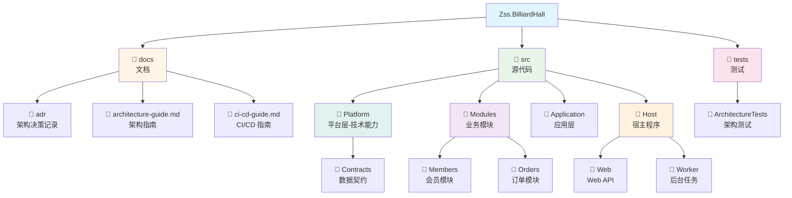
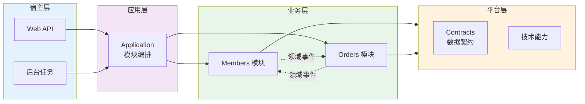

# Zss.BilliardHall

台球馆管理系统 - 采用模块化单体架构与垂直切片设计

## 项目概述

本项目是一个台球馆业务管理系统，采用现代化的软件架构模式：

- **模块化单体架构** (Modular Monolith) - 清晰的业务边界，单一部署单元
- **垂直切片架构** (Vertical Slice) - 按用例组织功能，减少横向依赖
- **自动化架构测试** - 通过测试强制执行架构约束

## 快速开始

### 环境要求

- .NET 10.0 或更高版本
- PostgreSQL (用于 Marten 数据库)

### 构建项目

```bash
# 克隆仓库
git clone https://github.com/douhuaa/Zss.BilliardHall.git
cd Zss.BilliardHall

# 恢复依赖
dotnet restore

# 构建
dotnet build

# 运行架构测试
dotnet test src/tests/ArchitectureTests/ArchitectureTests.csproj
```

### 运行应用

```bash
# 启动 Web API
dotnet run --project src/Host/Web/Web.csproj

# 或启动 Worker
dotnet run --project src/Host/Worker/Worker.csproj
```

## 架构文档

> 💡 **唯一入口**：所有文档通过 **[文档导航中心 (docs/index.md)](docs/index.md)** 统一访问
>
> 按角色和任务快速找到所需文档，避免在多个 README 间跳转

完整的架构文档请查看 [docs/](docs/) 目录：

- **[📍 文档导航中心](docs/index.md)** - 按角色和任务的快速导航（主入口）
- **[快速开始指南](docs/QUICK-START.md)** - 15 分钟极速上手 / 60 分钟完整入门
- **[架构指南](docs/architecture-guide.md)** - 架构概述和开发指南
- **[CI/CD 指南](docs/ci-cd-guide.md)** - 持续集成和测试
- **[ADR-0001](docs/adr/constitutional/ADR-0001-modular-monolith-vertical-slice-architecture.md)** - 架构决策记录

## 🤖 AI 驱动的架构治理体系

本项目采用 **"AI 驱动"** 的架构治理模式，通过 **ADR + Agents + Instructions + Prompts + Skills** 五层体系，实现架构约束的自动化执行和智能化监督。

### 核心理念

```
┌───────────────────────────────────────────────────────┐
│            架构治理体系的"三权分立"                      │
├───────────────────────────────────────────────────────┤
│  立法权    │  ADR（架构决策记录）          │  宪法    │
│  司法权    │  ArchitectureTests（测试）    │  法院    │
│  行政权    │  CI/CD Pipeline               │  执法    │
│  ─────────────────────────────────────────────────────│
│  辅助角色  │  AI Agents                     │  法务    │
│            │  - 解释宪法（ADR）            │  秘书    │
│            │  - 教人如何不违法             │  +      │
│            │  - 辅助修复违规               │  教官    │
└───────────────────────────────────────────────────────┘
```

### 五层治理体系

```
┌─────────────────────────────────────┐
│  第 0 层：ADR（Law）                 │  ← 架构事实源
│  - 宪法级别的架构决策                │
└──────────────┬──────────────────────┘
               ↓
┌─────────────────────────────────────┐
│  第 1 层：Instructions（Roles）      │  ← 职责边界定义
│  - 定义 AI 的身份与行为边界           │
└──────────────┬──────────────────────┘
               ↓
┌─────────────────────────────────────┐
│  第 2 层：Agents（Actors）           │  ← 执行主体
│  - 带特定职责的 AI 实例               │
└──────────────┬──────────────────────┘
               ↓
┌─────────────────────────────────────┐
│  第 3 层：Prompts（Execution）       │  ← 场景触发
│  - ADR 的场景化翻译                   │
└──────────────┬──────────────────────┘
               ↓
┌─────────────────────────────────────┐
│  第 4 层：Skills（Tools）            │  ← 工具能力
│  - 实际执行的工具函数                 │
└─────────────────────────────────────┘
```

完整说明请查看：[📘 架构治理系统总览](docs/ARCHITECTURE-GOVERNANCE-SYSTEM.md)

### 快速开始

#### 📚 理解 AI 治理体系

- **[架构治理系统总览](docs/ARCHITECTURE-GOVERNANCE-SYSTEM.md)** - 完整的五层体系说明
- **[Agents 体系](.github/agents/README.md)** - 6 个标准 Agent 及其职责
- **[Instructions 体系](.github/instructions/README.md)** - AI 的行为边界定义
- **[Prompts 库](docs/copilot/README.md)** - ADR 的场景化执行手册
- **[Skills 体系](.github/skills/README.md)** - 实际执行的工具函数

#### 🔧 使用 AI Agents

**场景 1：开发新功能前（使用 architecture-guardian）**

```
@architecture-guardian
我想在 Orders 模块中添加一个新的用例，有哪些架构约束？
```

**场景 2：架构测试失败（使用 test-enforcer）**

```
@test-enforcer
请根据以下架构测试失败日志，解释违规原因并提供修复建议

[粘贴失败日志]
```

**场景 3：提交 PR 前（使用 adr-reviewer）**

```
@adr-reviewer
请基于 ADR-0001 至 ADR-0005 审查本 PR 的变更，检查是否存在架构违规。
```

**场景 4：检查模块边界（使用 module-boundary-checker）**

```
@module-boundary-checker
这种跨模块调用方式是否符合 ADR-0001 的要求？
```

### 三大核心价值

1. **预防架构违规** - 通过 Agents 在编码阶段就识别潜在问题
2. **人话翻译 ADR** - 通过 Prompts 将架构规则翻译为具体的开发指导
3. **新人快速上手** - 通过 Instructions 实现对话式学习架构约束

### PR 要求

所有 PR 必须完成 [AI 参与检查清单](.github/PULL_REQUEST_TEMPLATE.md#-ai-参与检查清单)：

- ✅ 已使用 Architecture Guardian 审查架构合规性
- ✅ AI Agents 未发现违规问题或已修复
- ✅ 已评估并采纳 AI Agents 的合理建议
- ✅ 理解并遵守所有相关 ADR

---

## 项目结构

### 目录结构



### 架构层次关系



<details>
<summary>📝 文本格式目录树（点击展开）</summary>

> 💡 **提示**：文本格式便于复制粘贴使用，而上方的可视化图表更直观易懂。建议先通过图表理解结构，需要时再复制文本格式。

```
Zss.BilliardHall/
├── docs/                      # 文档
│   ├── adr/                   # 架构决策记录
│   ├── architecture-guide.md  # 架构指南
│   └── ci-cd-guide.md         # CI/CD 指南
├── src/
│   ├── Platform/              # 平台层（技术能力）
│   │   └── Contracts/         # 数据契约
│   ├── Modules/               # 业务模块
│   │   ├── Members/           # 会员模块
│   │   └── Orders/            # 订单模块
│   ├── Application/           # 应用层
│   └── Host/                  # 宿主程序
│       ├── Web/               # Web API
│       └── Worker/            # 后台任务
└── tests/
    └── ArchitectureTests/     # 架构测试
```

</details>

## 核心概念

### 模块化单体

项目按业务能力划分为独立模块：

- **Members** - 会员管理
- **Orders** - 订单管理
- 更多模块待添加...

每个模块：

- 拥有独立的程序集
- 不能直接引用其他模块
- 通过领域事件或数据契约通信

### 垂直切片

每个功能按垂直切片组织，包含该用例的所有层次：

```
Features/CreateMember/
├── CreateMemberCommand.cs         # 命令
├── CreateMemberCommandHandler.cs  # 处理器
└── CreateMemberEndpoint.cs        # API 端点
```

避免传统的分层架构（Controller/Service/Repository）。

### 架构测试

所有架构约束通过自动化测试强制执行：

```bash
dotnet test src/tests/ArchitectureTests/ArchitectureTests.csproj
```

测试覆盖：

- ✅ 模块隔离（不能相互引用）
- ✅ 垂直切片（禁止横向 Service）
- ✅ 契约使用规则
- ✅ Platform 层约束

## 开发指南

### 添加新功能

1. 确定功能所属模块
2. 在 `Features/` 下创建新切片
3. 实现 Command/Query、Handler 和 Endpoint
4. 运行架构测试验证

详见 [架构指南](docs/architecture-guide.md#开发指南)。

### 模块间通信

模块之间不能直接引用，使用以下方式通信：

1. **领域事件** - 异步通知状态变更
2. **数据契约** - 只读数据传递（仅限查询）
3. **命令编排** - 在 Application 层编排

详见 [架构指南 - 模块间通信](docs/architecture-guide.md#模块间通信)。

## 贡献

### 开发流程

1. Fork 项目
2. 创建特性分支
3. 实现功能并添加测试
4. 运行架构测试确保合规
5. 提交 Pull Request

### 架构约束

所有代码必须遵守架构约束：

- ❌ 模块之间不能直接引用
- ❌ 不能创建横向 Service
- ❌ Command Handler 不能依赖其他模块的查询
- ❌ Platform 不能包含业务逻辑

架构测试失败将阻止 PR 合并。

## 技术栈

- **.NET 10.0** - 应用框架
- **Wolverine** - 消息总线和中介者
- **Marten** - 事件存储和文档数据库
- **PostgreSQL** - 数据库
- **xUnit** - 测试框架
- **NetArchTest** - 架构测试

## 许可证

[MIT License](LICENSE)

## 联系方式

- 项目主页: https://github.com/douhuaa/Zss.BilliardHall
- 问题反馈: https://github.com/douhuaa/Zss.BilliardHall/issues

---

📖 更多信息请查看 [文档目录](docs/README.md)
