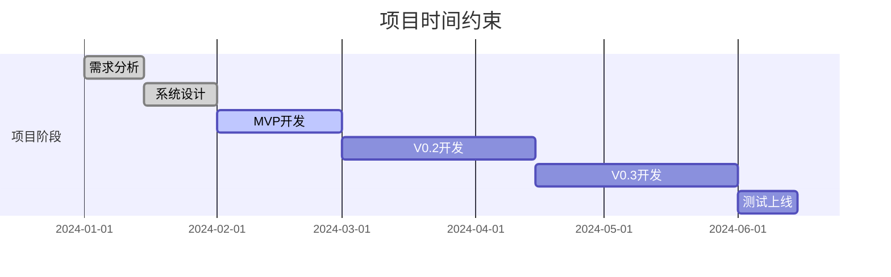

# 🚧 1.4 约束与假设条件

> **当前位置**: [首页](../自助台球系统项目文档.md) > [项目概述](README.md) > 约束与假设条件

## 🔒 技术约束

### 开发技术栈约束

#### 后端技术限制
- **框架约束**: 必须使用 ASP.NET Core + ABP 框架
- **数据库要求**: 使用 MySQL 8.0+ 或 PostgreSQL 12+
- **ORM限制**: 必须采用 EF Core Code First 模式
- **容器化**: 必须支持 Docker 容器化部署
- **云平台**: 优先支持阿里云和腾讯云部署

#### 前端技术限制
- **移动端**: 仅支持微信小程序，不开发独立APP
- **管理后台**: 基于现代浏览器（Chrome 90+, Edge 90+）
- **兼容性**: 小程序需支持微信版本 7.0.0+
- **响应式**: 管理后台必须支持平板和桌面设备

#### 集成约束
- **支付渠道**: 仅支持微信支付和支付宝
- **消息推送**: 仅支持微信模板消息
- **地图服务**: 使用腾讯地图或高德地图API
- **短信服务**: 使用阿里云或腾讯云短信服务

---

## 💰 资源约束

### 人力资源约束

| 角色 | 人数 | 时间投入 | 技能要求 |
|------|------|----------|----------|
| **项目经理** | 1人 | 100% | PMP认证，3年以上经验 |
| **架构师** | 1人 | 80% | .NET Core专家，5年以上经验 |
| **后端开发** | 2人 | 100% | ASP.NET Core, EF Core |
| **前端开发** | 1人 | 100% | 微信小程序，Vue.js |
| **UI设计师** | 1人 | 60% | 移动端UI设计经验 |
| **测试工程师** | 1人 | 80% | 自动化测试，性能测试 |
| **运维工程师** | 1人 | 40% | Docker, K8s, 云平台 |

### 硬件资源约束

#### 开发环境约束
- **开发设备**: 每人配置不低于 16GB 内存的开发机
- **测试环境**: 至少3套独立的测试环境
- **网络带宽**: 开发团队需要稳定的网络环境

#### 生产环境约束
- **服务器配置**: 最低4核8GB内存云服务器
- **数据库**: 独立的数据库服务器实例
- **存储空间**: 至少500GB SSD存储
- **网络**: 100M带宽，99.9%可用性保证

### 预算约束

| 项目 | 预算范围 | 备注 |
|------|----------|------|
| **人力成本** | 80万-120万 | 6个月开发周期 |
| **硬件设备** | 10万-15万 | 包含测试设备 |
| **云服务费用** | 5万-8万/年 | 包含服务器、存储、带宽 |
| **第三方服务** | 2万-3万/年 | 支付、短信、地图等API |
| **总预算** | 100万-150万 | 首年总投入 |

---

## ⏰ 时间约束

### 项目里程碑约束

### 关键时间节点

| 里程碑 | 截止日期 | 不可延期原因 |
|--------|----------|--------------|
| **MVP版本** | 2024-03-01 | 投资人要求的演示版本 |
| **V0.2版本** | 2024-04-15 | 试运营门店开业时间 |
| **正式版本** | 2024-06-15 | 连锁门店批量上线计划 |

### 外部时间依赖

- **硬件到货**: 设备供应商交付周期4-6周
- **场地装修**: 试点门店装修完成时间
- **证照办理**: 相关许可证和资质申请时间
- **支付审核**: 微信支付商户号审核周期

---

## 🏛️ 业务约束

### 合规性约束

#### 法律法规要求
- **数据保护**: 严格遵循《个人信息保护法》
- **支付合规**: 符合人民银行支付监管要求
- **税务合规**: 支持正规发票开具和税务申报
- **消防安全**: 符合娱乐场所消防安全规范

#### 行业标准约束
- **服务标准**: 符合娱乐服务业标准
- **设备标准**: 硬件设备需要3C认证
- **网络安全**: 等保2.0三级安全要求
- **质量体系**: ISO 9001质量管理体系

### 运营约束

#### 营业时间约束
- **营业时段**: 10:00-24:00，总共14小时
- **维护时间**: 每日2:00-6:00系统维护窗口
- **节假日**: 春节等重要节假日可能停业

#### 服务水平约束
- **响应时间**: 系统响应时间不超过3秒
- **可用性**: 年度可用性不低于99.5%
- **客服响应**: 客户问题24小时内响应
- **故障恢复**: 关键故障4小时内恢复

---

## 🤔 关键假设条件

### 市场假设

#### 用户行为假设
- ✅ **移动支付普及**: 目标用户90%以上使用移动支付
- ✅ **小程序接受度**: 用户愿意使用小程序而非独立APP
- ✅ **自助服务意愿**: 用户接受无人值守的自助服务模式
- ⚠️ **学习成本**: 用户能在5分钟内学会基本操作

#### 市场规模假设
- 📈 **市场需求**: 自助台球市场有足够的增长空间
- 🏢 **扩张计划**: 6个月内能拓展到10家门店
- 💰 **付费意愿**: 用户愿意为便利性支付适当溢价
- 🎯 **复购率**: 月活跃用户复购率达到40%以上

### 技术假设

#### 基础设施假设
- 🌐 **网络稳定**: 门店有稳定的宽带网络接入
- ⚡ **电力保障**: 具备UPS电源保护和应急预案
- 📱 **设备兼容**: 现有硬件设备支持网络控制
- 🔧 **维护能力**: 门店具备基础的设备维护能力

#### 第三方服务假设
- 💳 **支付稳定**: 微信支付、支付宝服务稳定可用
- ☁️ **云服务**: 云服务商提供稳定的基础设施
- 📡 **API可用**: 第三方API服务稳定且不会大幅调价
- 🛡️ **安全保障**: 第三方服务商提供足够的安全保障

### 组织假设

#### 团队能力假设
- 👥 **技术能力**: 开发团队具备相应的技术栈经验
- 🎯 **项目管理**: 项目团队有成功交付类似项目的经验
- 🏃 **执行效率**: 团队能按照敏捷开发模式高效协作
- 📚 **学习能力**: 团队能快速学习和适应新技术

#### 资源投入假设
- 💰 **资金充足**: 项目资金按计划及时到位
- ⏰ **时间保证**: 核心团队成员有足够的时间投入
- 🏢 **场地支持**: 有合适的开发和测试场地
- 🛠️ **工具支持**: 有完善的开发工具和环境支持

---

## ⚠️ 风险评估

### 高风险项

| 风险项 | 风险等级 | 影响程度 | 应对策略 |
|--------|----------|----------|----------|
| **关键人员离职** | 🔴 高 | 项目延期 | 知识分享、文档完善、人员备份 |
| **硬件兼容性问题** | 🔴 高 | 功能缺失 | 提前验证、备选方案、供应商支持 |
| **支付政策变更** | 🟡 中 | 功能调整 | 多渠道接入、政策跟踪 |
| **网络安全事件** | 🔴 高 | 停服整改 | 安全加固、应急预案、保险保障 |

### 中等风险项

| 风险项 | 风险等级 | 影响程度 | 应对策略 |
|--------|----------|----------|----------|
| **第三方服务中断** | 🟡 中 | 服务降级 | 多供应商、降级预案 |
| **用户接受度不高** | 🟡 中 | 推广困难 | 用户调研、体验优化 |
| **竞品快速跟进** | 🟡 中 | 市场竞争 | 技术护城河、快速迭代 |

---

## 📋 约束管理

### 约束变更流程

1. **约束识别**: 项目过程中识别新的约束条件
2. **影响分析**: 评估对项目范围、时间、成本的影响
3. **方案制定**: 制定应对方案和调整建议
4. **决策审批**: 项目委员会审批约束变更
5. **计划更新**: 更新项目计划和文档

### 假设验证机制

- **定期review**: 每月Review假设条件的有效性
- **市场调研**: 定期进行用户调研验证市场假设
- **技术验证**: 通过原型和POC验证技术假设
- **风险监控**: 持续监控高风险假设条件

---

## 🔗 相关章节

- **项目范围**: [项目范围](项目范围.md)
- **系统架构**: [系统架构设计](../03_系统架构设计/README.md)
- **风险管理**: [项目风险管理](../12_版本与变更管理/README.md)
- **质量保证**: [测试方案](../09_测试方案/README.md)

---

**返回**: [项目概述](README.md) | **下一章**: [需求规格说明](../02_需求规格说明/README.md)
