# 🧭 导航路径
[🏠 首页](../自助台球系统项目文档.md) > [📋 第二章：需求规格说明书](README.md) > [🔄 业务流程图](业务流程图.md)

# 🔄 2.4 业务流程图设计

## 🎯 业务流程概述

业务流程图详细描绘了自助台球系统的核心业务流程，展示了用户操作、系统响应和业务规则的完整交互过程，是系统设计和开发的重要参考。

## 🏓 1. 核心业务流程总览

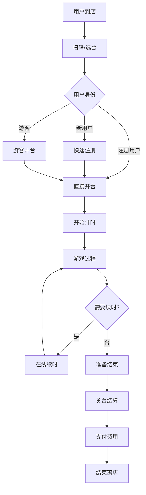

## 🔑 2. 用户注册与登录流程

### 2.1 微信授权登录流程

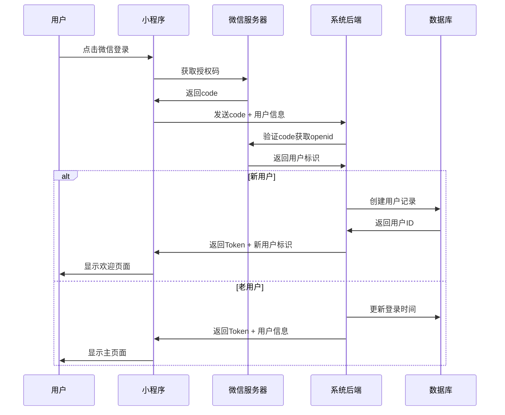

### 2.2 游客模式流程

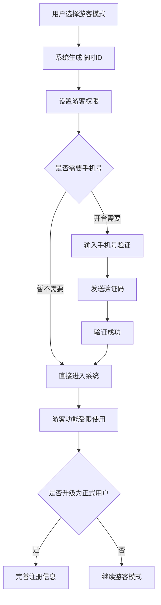

## 🎮 3. 开台业务流程

### 3.1 标准开台流程

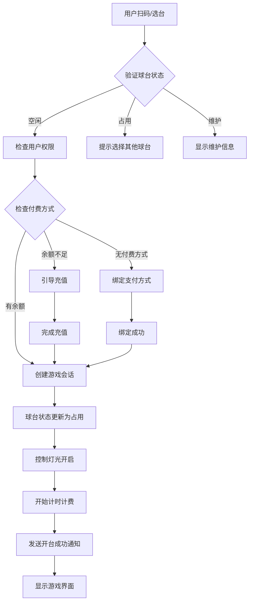

### 3.2 会员开台增强流程

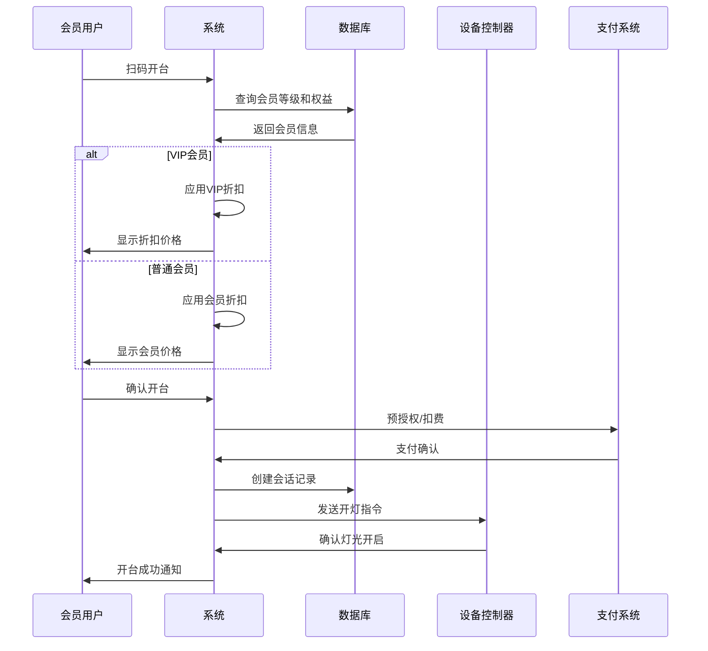

## 💳 4. 支付与结算流程

### 4.1 标准支付流程

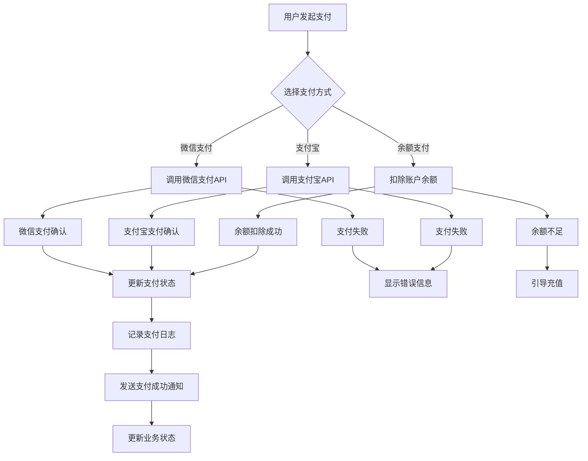

### 4.2 分摊付费流程

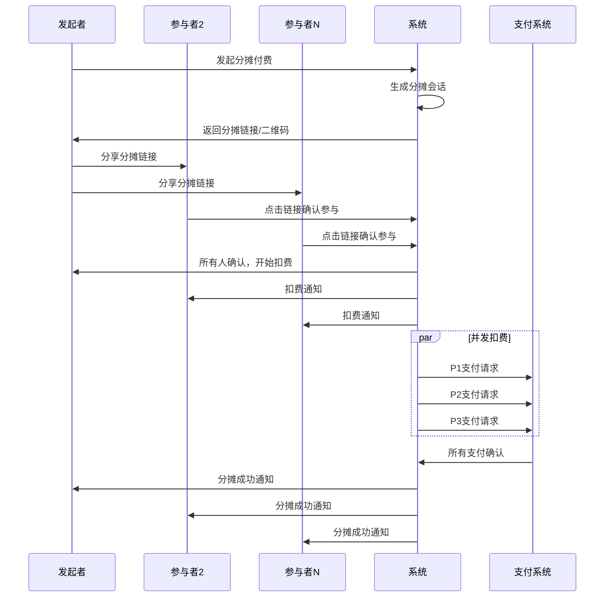

## 🔧 5. 设备控制流程

### 5.1 设备控制与监控流程

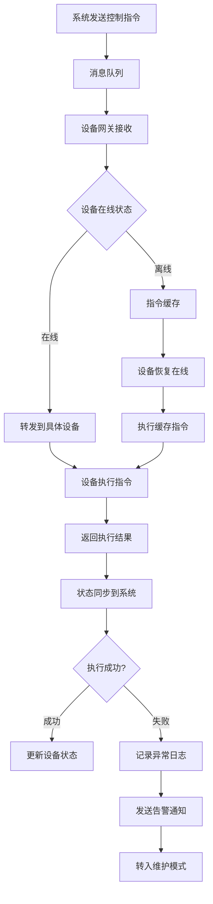

### 5.2 设备故障处理流程

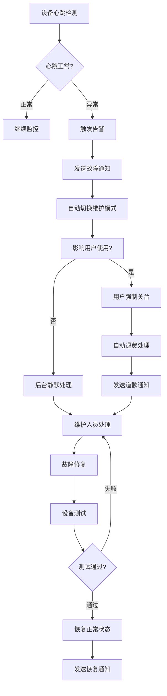

## 🏪 6. 会员管理流程

### 6.1 会员升级流程

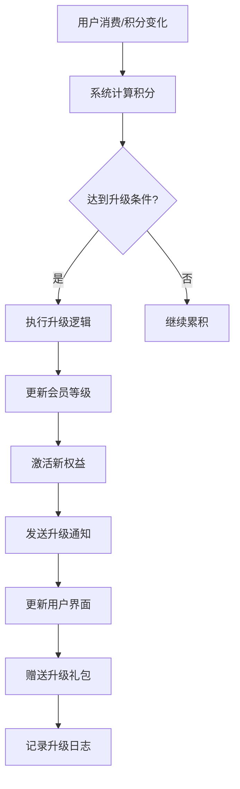

### 6.2 积分兑换流程

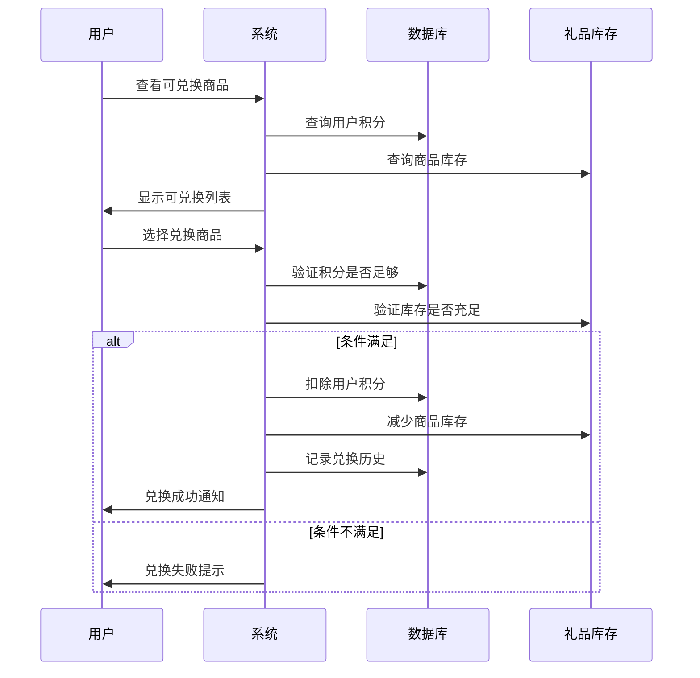

## 📊 7. 数据统计与报表流程

### 7.1 实时数据处理流程

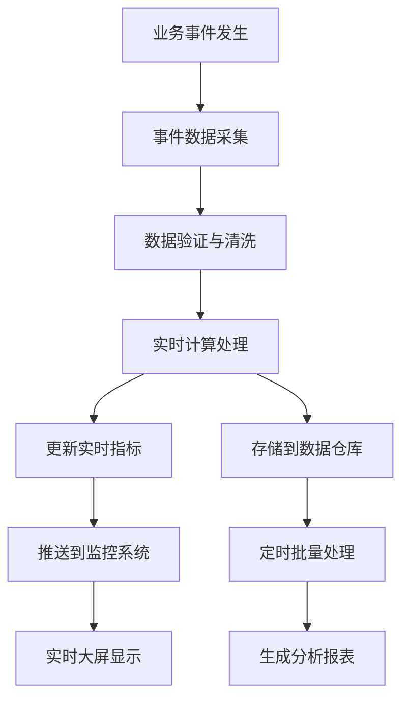

### 7.2 定期报表生成流程

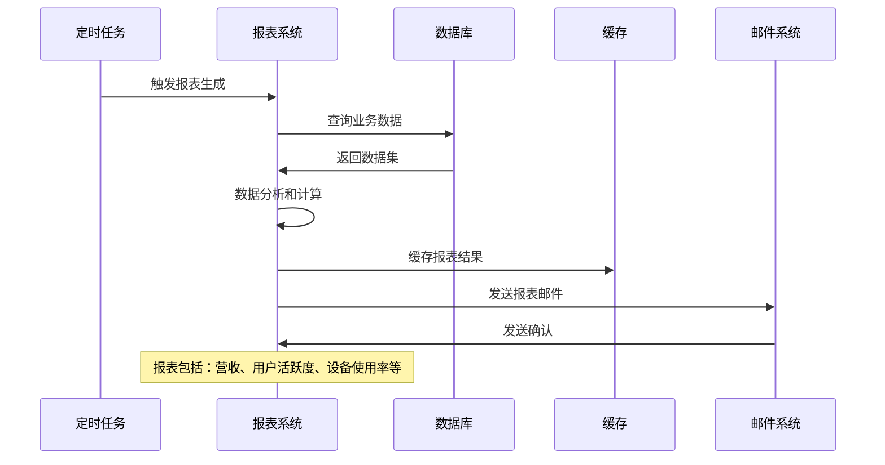

## ⚠️ 8. 异常处理流程

### 8.1 系统异常处理流程

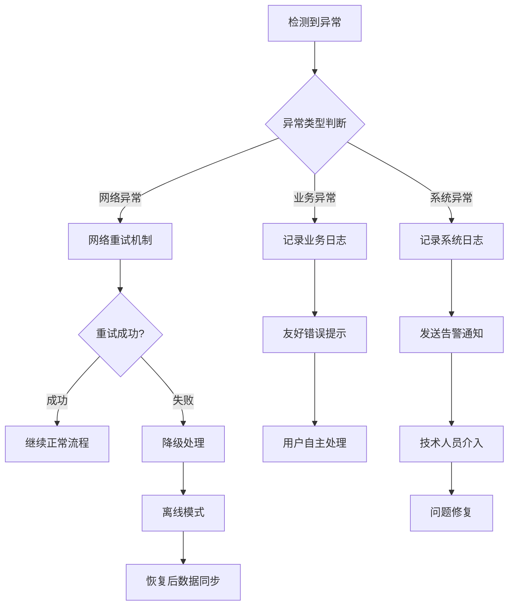

### 8.2 支付异常处理流程

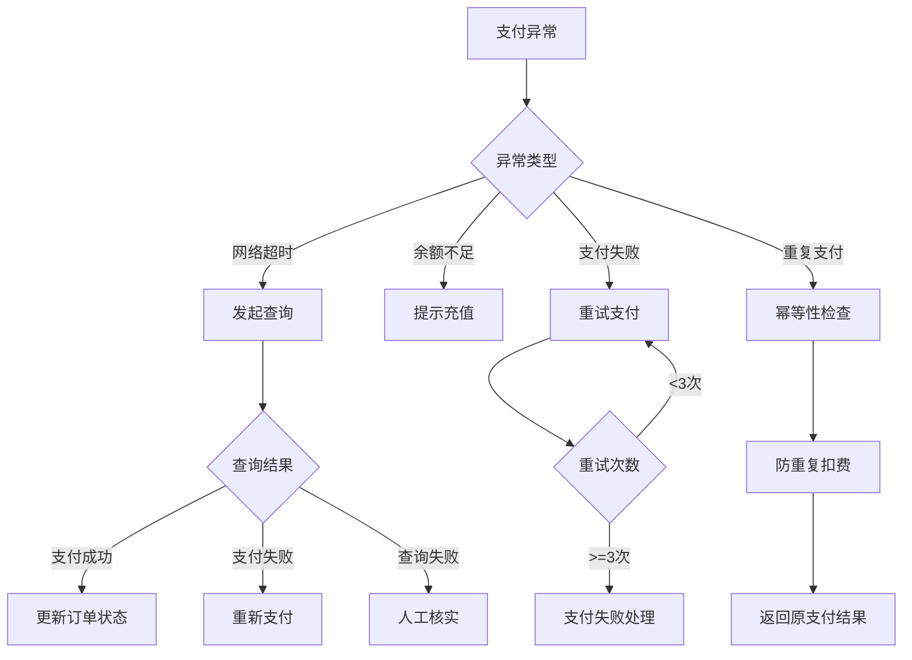

## 📋 流程优化建议

### 关键性能指标 (KPI)
- **开台成功率**: ≥ 99.5%
- **支付成功率**: ≥ 99.9%
- **平均开台时间**: ≤ 30秒
- **设备响应时间**: ≤ 2秒
- **用户投诉率**: ≤ 0.1%

### 持续改进计划
1. **用户体验优化**: 基于用户行为数据优化操作流程
2. **异常处理增强**: 完善异常情况的自动化处理
3. **性能监控**: 建立完整的业务流程性能监控体系
4. **智能化升级**: 引入AI辅助的智能推荐和预测

## 🔗 相关文档
- [功能需求](功能需求.md) - 详细功能需求说明
- [用例图](用例图.md) - 系统用例建模
- [非功能需求](非功能需求.md) - 性能和质量要求
- [系统架构设计](../03_系统架构设计/README.md) - 技术架构支撑
