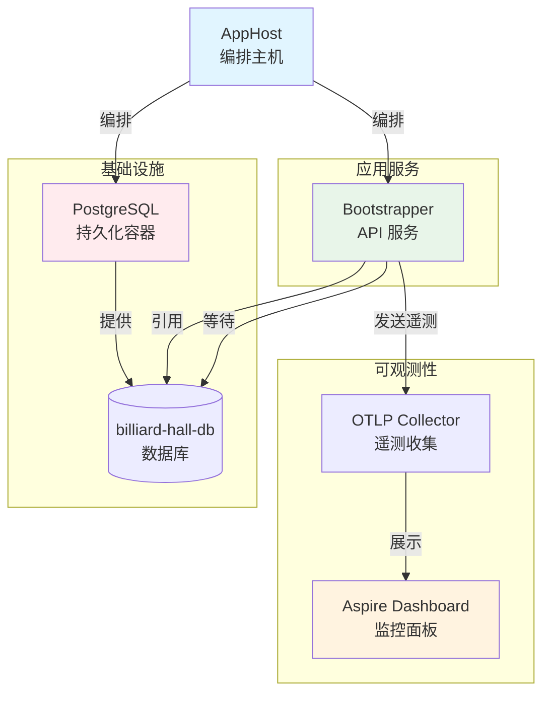
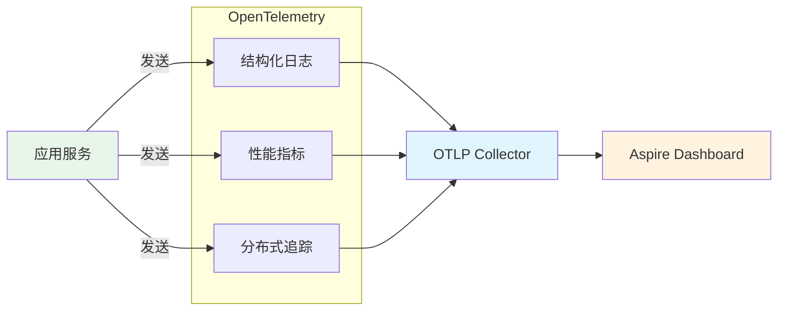

# Aspire 编排架构

## 1. 概述

.NET Aspire 是微软推出的云原生应用编排框架，专为分布式应用的本地开发和部署优化。在台球厅管理系统中，Aspire 负责：

- **服务编排**：统一管理应用服务、数据库、消息队列等组件
- **服务发现**：自动解析服务间的通信地址
- **可观测性**：内置 OpenTelemetry，统一收集日志、指标和追踪
- **健康检查**：自动监控服务健康状态
- **开发体验**：一键启动所有依赖，简化本地开发

> **版本要求**: .NET Aspire 13.x，要求 .NET 10 SDK

---

## 2. Aspire 核心概念

### 2.1 AppHost（应用主机）

AppHost 是 Aspire 应用的入口点，负责声明和编排所有资源。

**项目位置**: `src/Wolverine/Aspire/Zss.BilliardHall.Wolverine.AppHost/`

**核心职责**:
- 定义应用拓扑（哪些服务、哪些依赖）
- 配置资源引用关系（服务 A 依赖数据库 B）
- 管理容器生命周期（开发时持久化数据）
- 提供统一的仪表盘和监控界面

### 2.2 ServiceDefaults（服务默认配置）

ServiceDefaults 是所有服务共享的基础配置库，封装了通用的基础设施关注点。

**项目位置**: `src/Wolverine/Aspire/Zss.BilliardHall.Wolverine.ServiceDefaults/`

**核心功能**:
- **服务发现**: 自动解析服务名称到实际地址（如 `http+https://bootstrapper` → `https://localhost:7001`）
- **健康检查**: `/health` (就绪检查) 和 `/alive` (存活检查)
- **OpenTelemetry**: 自动配置日志、指标和分布式追踪
- **HTTP 弹性**: 标准的重试、断路器、超时策略
- **标准化配置**: 确保所有服务遵循统一的可观测性和通信标准

### 2.3 资源类型

Aspire 支持多种资源类型：

| 资源类型 | 说明 | 示例 |
|---------|------|------|
| **Project** | .NET 项目 | Bootstrapper API 服务 |
| **Container** | Docker 容器 | PostgreSQL、Redis、RabbitMQ |
| **Executable** | 本地可执行文件 | Node.js 前端开发服务器 |
| **Connection** | 连接字符串 | 数据库连接、消息队列连接 |
| **Parameter** | 参数化配置 | 数据库密码、API Key |

---

## 3. 台球厅系统 Aspire 架构

### 3.1 当前架构拓扑



### 3.2 AppHost 实现

**文件**: `src/Wolverine/Aspire/Zss.BilliardHall.Wolverine.AppHost/AppHost.cs`

```csharp
var builder = DistributedApplication.CreateBuilder(args);

// 1. 定义 PostgreSQL 容器（持久化数据卷）
var postgres = builder
    .AddPostgres("postgres")                        // 服务名称
    .WithDataVolume()                               // 数据持久化到本地卷
    .WithLifetime(ContainerLifetime.Persistent);    // 容器持久化，重启不删除

// 2. 定义数据库
var db = postgres.AddDatabase("billiard-hall-db"); // 数据库名称

// 3. 定义应用服务，引用数据库
builder.AddProject<Projects.Bootstrapper>("bootstrapper")
    .WithReference(db)                              // 注入数据库连接字符串
    .WaitFor(db);                                   // 等待数据库就绪后再启动

builder.Build().Run();
```

**关键设计决策**:

| 决策 | 理由 |
|------|------|
| `WithDataVolume()` | 避免每次重启丢失数据，提升开发体验 |
| `WithLifetime(Persistent)` | 容器持久化，不随 AppHost 退出而销毁 |
| `WaitFor(db)` | 确保数据库完全就绪后再启动应用，避免启动失败 |

### 3.3 ServiceDefaults 集成

每个应用服务在 `Program.cs` 中集成 ServiceDefaults：

```csharp
var builder = WebApplication.CreateBuilder(args);

// 添加 Aspire 服务默认配置（一行代码搞定）
builder.AddServiceDefaults();

var app = builder.Build();

// 映射健康检查端点（开发环境）
app.MapDefaultEndpoints();

app.Run();
```

**自动启用的功能**:
- ✅ 服务发现（ServiceDiscovery）
- ✅ 健康检查（HealthChecks）
- ✅ OpenTelemetry 日志、指标、追踪
- ✅ HTTP 客户端弹性（标准重试、断路器）
- ✅ 结构化日志增强

详见：[ServiceDefaults 集成指南](../../06_开发规范/ServiceDefaults集成指南.md)

---

## 4. 服务发现机制

### 4.1 工作原理

Aspire 使用 **基于配置的服务发现**，在本地开发时自动注入服务地址。

**传统方式** vs. **Aspire 方式**:

```csharp
// ❌ 传统硬编码
var client = new HttpClient { BaseAddress = new Uri("https://localhost:7001") };

// ✅ Aspire 服务发现
services.ConfigureHttpClientDefaults(http => http.AddServiceDiscovery());
var client = httpClientFactory.CreateClient();
client.BaseAddress = new Uri("http+https://bootstrapper"); // 自动解析
```

### 4.2 服务名称约定

| 服务名称 | 解析地址（示例） | 说明 |
|---------|-----------------|------|
| `http+https://postgres` | `postgresql://localhost:5432` | PostgreSQL 容器 |
| `http+https://bootstrapper` | `https://localhost:7001` | Bootstrapper API |
| `http+https://members-api` | `https://localhost:7002` | 会员模块 API（未来） |

**Scheme 说明**:
- `http+https://` - 自动选择 HTTPS（本地开发）或 HTTP（容器内）
- `https://` - 强制 HTTPS
- `http://` - 强制 HTTP

### 4.3 数据库连接注入

AppHost 通过 `.WithReference(db)` 自动注入连接字符串：

```json
// 自动生成的配置（无需手动配置）
{
  "ConnectionStrings": {
    "billiard-hall-db": "Host=localhost;Port=5432;Database=billiard-hall-db;Username=postgres;Password=..."
  }
}
```

应用代码直接读取：

```csharp
var connectionString = builder.Configuration.GetConnectionString("billiard-hall-db");
```

---

## 5. 健康检查架构

### 5.1 健康检查端点

ServiceDefaults 自动映射两个端点（仅开发环境，限制 localhost）：

| 端点 | 类型 | 检查内容 | 用途 |
|------|------|---------|------|
| `/health` | 就绪检查 (Readiness) | 所有健康检查 | 负载均衡器决定是否接收流量 |
| `/alive` | 存活检查 (Liveness) | 仅 "live" 标签检查 | Kubernetes 决定是否重启 Pod |

### 5.2 默认健康检查

所有服务自动包含 `self` 检查：

```csharp
// 由 AddDefaultHealthChecks() 自动注册
builder.Services.AddHealthChecks()
    .AddCheck("self", () => HealthCheckResult.Healthy(), ["live"]);
```

### 5.3 扩展健康检查

根据依赖添加更多检查：

```csharp
builder.Services.AddHealthChecks()
    .AddCheck("self", () => HealthCheckResult.Healthy(), ["live"])
    .AddNpgSql(connectionString, name: "postgres", tags: ["db"])      // 数据库检查
    .AddRedis(redisConnection, name: "redis", tags: ["cache"])        // Redis 检查
    .AddRabbitMQ(rabbitConnection, name: "rabbitmq", tags: ["mq"]);   // RabbitMQ 检查
```

### 5.4 安全考虑

**为什么只在开发环境启用？**

健康检查端点会暴露系统信息（依赖关系、版本号、状态），存在信息泄露风险。

**生产环境建议**:
- 仅对内部监控系统开放（如 Kubernetes）
- 使用认证保护端点
- 限制 IP 白名单

参考：[Microsoft Docs - Health Checks Security](https://aka.ms/dotnet/aspire/healthchecks)

---

## 6. 可观测性（OpenTelemetry）

### 6.1 三大支柱

Aspire 自动配置 OpenTelemetry 的三大支柱：



### 6.2 自动仪器化

**无需手动配置**，ServiceDefaults 自动启用：

| 仪器化类型 | 内容 | 用途 |
|-----------|------|------|
| **ASP.NET Core** | HTTP 请求/响应 | 跟踪 API 调用 |
| **HttpClient** | 出站 HTTP 请求 | 跟踪服务间调用 |
| **Runtime** | GC、线程池、异常 | 监控运行时健康 |
| **Database** | SQL 查询（需额外配置） | 跟踪数据库性能 |

### 6.3 日志增强

结构化日志自动包含上下文：

```csharp
// 自动增强的日志属性
{
    "Timestamp": "2024-01-15T10:30:45Z",
    "Level": "Information",
    "Message": "用户登录成功",
    "TraceId": "4bf92f3577b34da6a3ce929d0e0e4736",    // 追踪 ID（自动）
    "SpanId": "00f067aa0ba902b7",                    // Span ID（自动）
    "ServiceName": "bootstrapper",                    // 服务名（自动）
    "Environment": "Development",                     // 环境（自动）
    "UserId": "123e4567-e89b-12d3-a456-426614174000" // 业务属性（手动）
}
```

### 6.4 配置 OTLP Exporter

**开发环境**:
- 默认发送到 Aspire Dashboard（自动配置，无需设置）

**生产环境**:
- 需配置 `OTEL_EXPORTER_OTLP_ENDPOINT` 环境变量

```bash
# 示例：使用 Jaeger
export OTEL_EXPORTER_OTLP_ENDPOINT=http://jaeger:4317

# 示例：使用 Azure Monitor
export APPLICATIONINSIGHTS_CONNECTION_STRING="InstrumentationKey=...;IngestionEndpoint=..."
```

---

## 7. HTTP 客户端弹性

### 7.1 标准弹性策略

ServiceDefaults 为所有 HttpClient 自动配置弹性处理：

```csharp
// 由 ConfigureHttpClientDefaults() 自动应用
services.ConfigureHttpClientDefaults(http =>
{
    http.AddStandardResilienceHandler(); // 标准弹性策略
    http.AddServiceDiscovery();          // 服务发现
});
```

### 7.2 标准策略内容

| 策略 | 配置 | 说明 |
|------|------|------|
| **重试** | 3次，指数退避（2s, 4s, 8s） | 瞬时故障自动重试 |
| **断路器** | 失败率 > 50%（10秒窗口）时熔断 | 快速失败，避免雪崩 |
| **超时** | 30秒总超时 | 防止请求长时间挂起 |
| **限流** | 100 并发请求 | 保护下游服务 |

### 7.3 自定义弹性策略

针对特定场景覆盖默认策略：

```csharp
services.AddHttpClient("PaymentApi", client =>
{
    client.BaseAddress = new Uri("http+https://payment-api");
})
.AddStandardResilienceHandler(options =>
{
    // 支付 API 需要更严格的超时
    options.TotalRequestTimeout.Timeout = TimeSpan.FromSeconds(10);
    
    // 减少重试次数（避免重复扣款）
    options.AttemptTimeout.MaxRetryAttempts = 1;
});
```

---

## 8. 本地开发工作流

### 8.1 启动 Aspire 应用

**方式 1: Visual Studio / Rider**

1. 设置 AppHost 为启动项目
2. 按 F5 运行
3. 浏览器自动打开 Aspire Dashboard（默认 `https://localhost:17001`）

**方式 2: 命令行**

```bash
cd src/Wolverine/Aspire/Zss.BilliardHall.Wolverine.AppHost
dotnet run
```

### 8.2 Aspire Dashboard 界面

Dashboard 提供统一的监控视图：

| Tab | 功能 |
|-----|------|
| **Resources** | 查看所有资源状态（服务、容器、数据库） |
| **Console** | 查看服务实时日志 |
| **Traces** | 分布式追踪时间线 |
| **Metrics** | 性能指标图表（CPU、内存、HTTP 请求） |
| **Health** | 健康检查状态 |

### 8.3 数据持久化

默认配置使用 Docker Volume 持久化数据：

```bash
# 查看 Aspire 创建的数据卷
docker volume ls | grep aspire

# 清空数据（重新开始）
docker volume rm <volume-name>
```

### 8.4 调试技巧

**调试单个服务**:
- AppHost 启动后，在 IDE 中附加到进程调试

**查看连接字符串**:
- Dashboard → Resources → 点击服务 → Environment Variables

**重启单个服务**:
- Dashboard → Resources → 点击服务 → Restart

---

## 9. 生产部署考虑

### 9.1 Aspire 部署模式

Aspire 支持多种部署方式：

| 模式 | 适用场景 | 说明 |
|------|---------|------|
| **Docker Compose** | 小型部署 | 使用 `azd` 生成 docker-compose.yml |
| **Kubernetes** | 生产环境 | 使用 `azd` 生成 Helm Charts |
| **Azure Container Apps** | 云原生 | 直接部署到 Azure（推荐） |

### 9.2 使用 azd 部署

Azure Developer CLI (azd) 可从 AppHost 生成部署清单：

```bash
# 初始化 azd 项目
azd init

# 预览生成的 Kubernetes 清单
azd infra synth

# 部署到 Azure
azd up
```

### 9.3 ServiceDefaults 在生产环境

**健康检查端点**:
- 默认不在生产环境映射（安全考虑）
- 需要时手动启用并配置认证

**OTLP Exporter**:
- 必须配置 `OTEL_EXPORTER_OTLP_ENDPOINT`
- 或使用 Azure Monitor（配置 `APPLICATIONINSIGHTS_CONNECTION_STRING`）

**服务发现**:
- 生产环境替换为 DNS、Consul 或 Kubernetes Service

---

## 10. 最佳实践

### 10.1 项目结构约定

```
src/Wolverine/Aspire/
├── Zss.BilliardHall.Wolverine.AppHost/           # AppHost 项目
│   ├── AppHost.cs                                 # 编排定义
│   └── appsettings.json                           # AppHost 配置
├── Zss.BilliardHall.Wolverine.ServiceDefaults/   # ServiceDefaults 库
│   ├── Extensions.cs                              # 扩展方法
│   └── README.md                                  # 使用说明
└── Zss.BilliardHall.Wolverine.ServiceDefaults.Tests/  # 单元测试
    └── ServiceDefaultsIntegrationTests.cs
```

### 10.2 命名约定

| 类型 | 命名规则 | 示例 |
|------|---------|------|
| 资源名称 | 小写，连字符分隔 | `billiard-hall-db`, `payment-api` |
| 服务名称 | 与项目名一致 | `bootstrapper`, `members-api` |
| 连接字符串 Key | 与数据库名称一致 | `billiard-hall-db` |

### 10.3 ServiceDefaults 扩展指南

**何时扩展 ServiceDefaults**:
- ✅ 所有服务需要的通用配置（如公共认证中间件）
- ✅ 跨服务的标准化设置（如统一的错误处理）

**何时不应扩展 ServiceDefaults**:
- ❌ 特定领域的业务逻辑
- ❌ 单个服务的特殊配置
- ❌ 频繁变更的实验性功能

### 10.4 安全注意事项

1. **避免硬编码密钥**:
   - 使用 `.AddParameter(..., secret: true)` 管理密钥
   - 生产环境集成 Azure Key Vault

2. **限制健康检查端点**:
   - 仅开发环境或内部网络可访问
   - 添加认证保护

3. **审计日志**:
   - 避免记录敏感信息（密码、Token、PII）
   - 结构化日志便于后续分析

---

## 11. 故障排查

### 11.1 常见问题

| 问题 | 原因 | 解决方案 |
|------|------|---------|
| 服务无法启动 | 数据库未就绪 | 使用 `.WaitFor(db)` 确保依赖就绪 |
| 连接字符串为空 | 未引用资源 | 检查 `.WithReference(db)` 是否正确 |
| 健康检查 404 | 未调用 `MapDefaultEndpoints()` | 在 Program.cs 中添加映射 |
| Dashboard 无追踪数据 | OTLP 端点未配置 | 开发环境自动配置，检查环境变量 |

### 11.2 诊断命令

```bash
# 查看 Aspire 容器状态
docker ps -a | grep aspire

# 查看服务日志
docker logs <container-id>

# 查看网络配置
docker network inspect <network-name>

# 验证健康检查
curl http://localhost:5001/health
curl http://localhost:5001/alive
```

### 11.3 调试日志级别

临时启用详细日志：

```bash
# 环境变量方式
export LOGGING__LOGLEVEL__DEFAULT=Debug

# 或在 appsettings.Development.json
{
  "Logging": {
    "LogLevel": {
      "Default": "Debug",
      "Microsoft.Extensions.ServiceDiscovery": "Trace"
    }
  }
}
```

---

## 12. 扩展阅读

### 12.1 官方文档

- [.NET Aspire 概述](https://learn.microsoft.com/dotnet/aspire/)
- [ServiceDefaults 模板](https://aka.ms/dotnet/aspire/service-defaults)
- [健康检查最佳实践](https://aka.ms/dotnet/aspire/healthchecks)
- [OpenTelemetry 集成](https://learn.microsoft.com/dotnet/aspire/fundamentals/telemetry)

### 12.2 相关文档

- [ServiceDefaults 集成指南](../../06_开发规范/ServiceDefaults集成指南.md) - 详细使用说明
- [Aspire 本地开发指南](../../10_部署与运维/Aspire本地开发指南.md) - 本地运行指南
- [技术选型](./技术选型.md) - Aspire 选型理由
- [Secrets 管理](../../08_配置管理/Secrets管理.md) - 密钥管理策略

---

## 13. 版本历史

| 版本 | 日期 | 变更说明 | 作者 |
|------|------|---------|------|
| 1.0.0 | 2024-01-15 | 初始版本，涵盖 Aspire 核心概念和最佳实践 | 架构团队 |

---

**最后更新**: 2024-01-15  
**负责人**: 架构团队  
**审核状态**: ✅ 已审核
