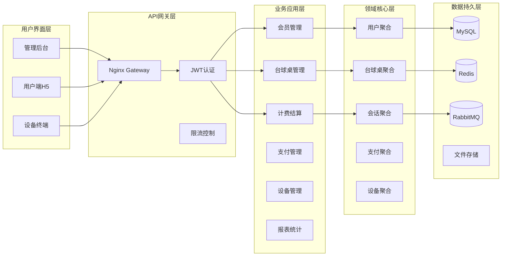

---
title: "总体架构图"
description: "自助台球系统总体架构设计图和说明"
section: "3.2"
version: "1.0.0"
author: "架构师"
maintainer: "架构师"
created: "2024-01-15"
updated: "2024-01-15"
category: "系统架构"
level: "必读"
audience: ["架构师", "开发工程师", "技术主管", "项目经理"]
keywords: ["架构图", "系统设计", "分层架构", "部署架构", "微服务"]
tags: ["architecture", "system-design", "layered-architecture"]
status: "完成"
dependencies: ["技术选型", "系统模块划分"]
related_docs: ["技术选型.md", "系统模块划分.md", "设计原则.md"]
---

# 🏗️ 3.2 总体架构图

<!-- Breadcrumb Navigation -->
**导航路径**: [🏠 项目文档首页](../自助台球系统项目文档.md) > [🏗️ 系统架构设计](README.md) > 🏗️ 总体架构图

<!-- Keywords for Search -->
**关键词**: `架构图` `系统设计` `分层架构` `部署架构` `微服务`

## 🎯 架构设计概述

自助台球系统采用**分层架构**结合**领域驱动设计(DDD)**的架构模式，基于ABP框架构建，确保系统的可维护性、可扩展性和可测试性。

## 🏛️ 1. 逻辑架构设计

### 1.1 四层架构总览

### 1.2 核心模块架构

## 🌐 2. 物理部署架构

### 2.1 生产环境部署

### 2.2 Docker容器化部署

## 🔧 3. 技术架构集成

### 3.1 技术栈集成图

### 3.2 数据流向架构

## 🏢 4. 模块架构设计

### 4.1 业务模块架构

### 4.2 跨模块交互

## 🚀 5. 高可用架构

### 5.1 服务高可用

### 5.2 性能优化架构

## 📊 6. 架构质量属性

### 6.1 质量属性支撑

| 质量属性 | 架构支撑策略 | 实现方案 |
|---------|-------------|----------|
| **可扩展性** | 分层架构、模块化设计 | 水平扩展、垂直扩展 |
| **可维护性** | DDD设计、代码分离 | 清晰边界、统一规范 |
| **高可用性** | 冗余部署、故障转移 | 99.9%可用性目标 |
| **高性能** | 缓存优化、异步处理 | <3s响应时间 |
| **安全性** | 分层防护、权限控制 | 多重安全机制 |
| **可测试性** | 依赖注入、接口抽象 | 单元测试、集成测试 |

### 6.2 架构演进路径

## 🔍 7. 架构决策记录(ADR)

### ADR-001: 采用分层架构
**决策**: 采用经典的四层架构模式
**理由**: 职责分离清晰，便于团队协作和维护
**状态**: ✅ 已采纳

### ADR-002: 选择MySQL作为主数据库
**决策**: 使用MySQL 8.0作为主要数据存储
**理由**: 性能优秀、成本可控、团队熟悉
**状态**: ✅ 已采纳

### ADR-003: 使用EF Core Code First
**决策**: 采用Code First数据库开发方式
**理由**: 保持代码与数据库同步，便于版本控制
**状态**: ✅ 已采纳

### ADR-004: 引入Redis缓存
**决策**: 使用Redis作为分布式缓存
**理由**: 提升查询性能，支持复杂数据结构
**状态**: ✅ 已采纳

## 🔗 相关文档

- [技术选型](技术选型.md) - 详细的技术选型说明
- [系统模块划分](系统模块划分.md) - 业务模块设计
- [外部接口](外部接口.md) - 第三方系统集成
- [设计原则](设计原则.md) - 架构设计原则

---

💡 **说明**: 架构图将随着系统演进持续更新，请及时关注版本变更。如需高清矢量图，请联系架构团队。
