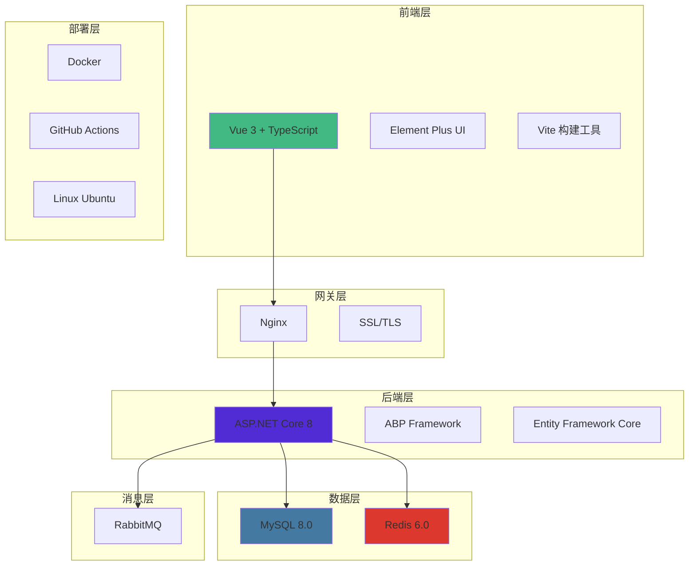
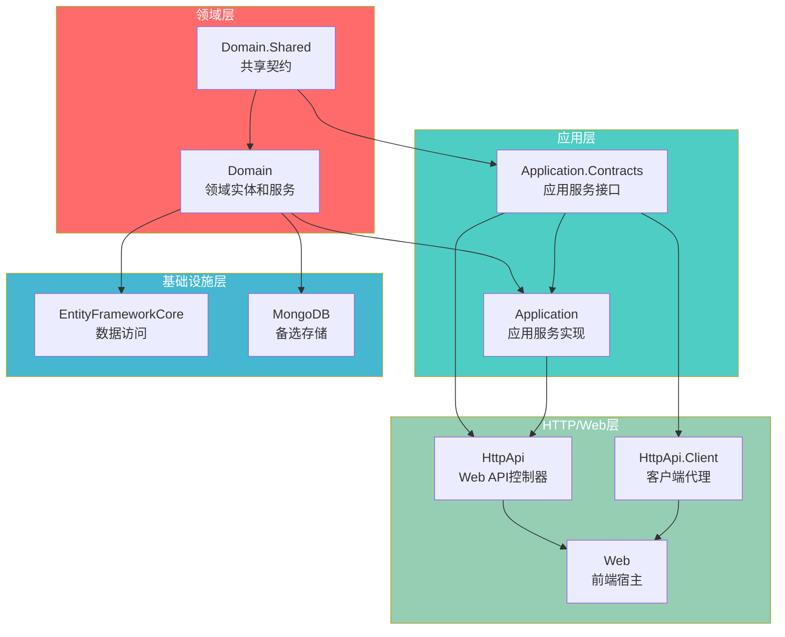
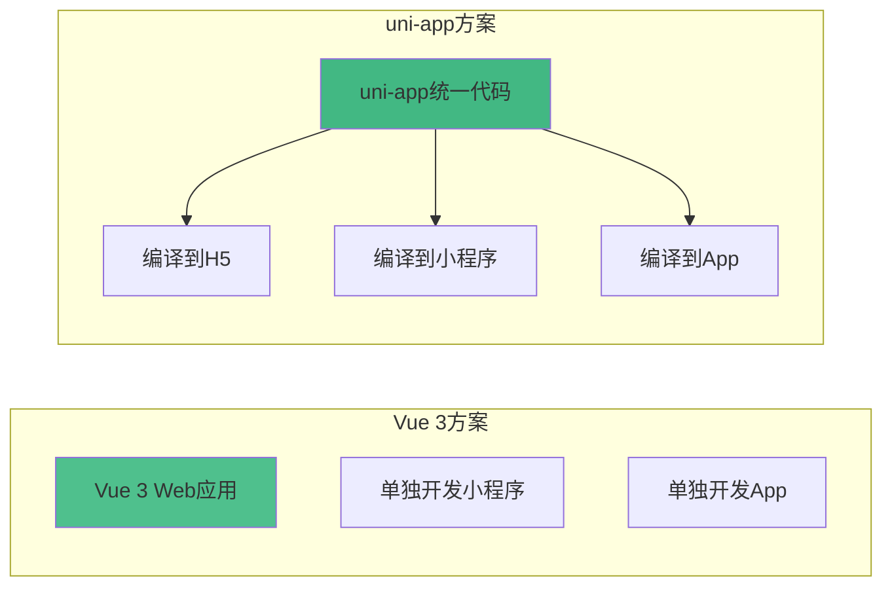

# 🛠️ 3.1 技术选型方案

<!-- Breadcrumb Navigation -->
**导航路径**: [🏠 项目文档首页](../自助台球系统项目文档.md) > [🏗️ 系统架构设计](README.md) > 🛠️ 技术选型方案

<!-- Keywords for Search -->
**关键词**: `技术选型` `.NET 8` `EF Core` `Vue 3` `MySQL` `Redis` `Docker`

## 🎯 技术选型概述

基于自助台球系统的业务特点、非功能需求和团队技术栈，经过详细调研和对比分析，最终确定以下技术选型方案。选型原则：**主流稳定、易于维护、团队熟悉、扩展性强**。

## 🚀 技术架构总览



## 🔧 1. 后端开发框架

### 1.1 ASP.NET Core 8.0

**选择理由**:
- ✅ **高性能**: 经过多年优化，性能领先于大多数Web框架
- ✅ **跨平台**: 支持Linux、Windows、macOS部署
- ✅ **生态成熟**: 拥有丰富的第三方库和工具链
- ✅ **长期支持**: LTS版本，Microsoft官方长期维护
- ✅ **团队熟悉**: 团队对.NET技术栈有深度经验

**关键特性**:
```csharp
// 示例：最小API设计
var builder = WebApplication.CreateBuilder(args);
var app = builder.Build();

app.MapGet("/api/tables/{id}/status", 
    (int id) => new { TableId = id, Status = "Available" });
```

**性能指标**:
- 支持 100,000+ RPS (简单API)
- 内存占用 < 100MB (基础应用)
- 启动时间 < 2秒

### 1.2 ABP Framework 7.0+

**选择理由**:
- ✅ **快速开发**: 提供完整的应用程序基础设施
- ✅ **DDD支持**: 内置领域驱动设计最佳实践
- ✅ **模块化**: 支持模块化开发和部署
- ✅ **多租户**: 天然支持多门店数据隔离
- ✅ **审计日志**: 自动记录数据变更历史

**ABP模块架构**:


**核心功能**:
- 用户管理和权限控制
- 多语言支持 (i18n)
- 设置管理和配置
- 后台作业系统
- 事件总线机制

### 1.3 Entity Framework Core 8.0

**选择理由**:
- ✅ **Code First**: 代码优先，保持代码与数据库同步
- ✅ **类型安全**: 编译时检查，减少运行时错误
- ✅ **迁移机制**: 自动化数据库版本管理
- ✅ **查询优化**: 自动查询优化和缓存
- ✅ **跨数据库**: 支持多种数据库提供程序

**开发效率提升**:
```csharp
// LINQ查询示例
var availableTables = await context.BilliardTables
    .Where(t => t.Status == TableStatus.Available)
    .Where(t => t.Store.IsActive)
    .Include(t => t.Store)
    .ToListAsync();
```

## 🎨 2. 前端开发框架

### 2.1 Vue 3 + TypeScript

**选择理由**:
- ✅ **易学易用**: 学习曲线平缓，开发效率高
- ✅ **组件化**: 可复用组件，便于维护
- ✅ **生态丰富**: 成熟的生态系统和社区支持
- ✅ **性能优秀**: 虚拟DOM优化，渲染性能强
- ✅ **TypeScript**: 类型安全，提高代码质量

**技术栈组合**:
```typescript
// 组合式API示例
import { ref, computed } from 'vue'

export function useTableManagement() {
  const tables = ref<BilliardTable[]>([])
  const availableTablesCount = computed(() => 
    tables.value.filter(t => t.status === 'available').length
  )
  
  return { tables, availableTablesCount }
}
```

### 2.1.1 备选方案：uni-app跨平台框架

**适用场景**: 如果需要同时支持H5、小程序、App多端时可考虑

**优势对比**:


| 对比维度 | Vue 3 | uni-app |
|---------|--------|---------|
| **开发效率** | ✅ Web端高效 | ✅ 多端统一开发 |
| **性能表现** | ✅ Web端优秀 | ⚠️ 跨平台有损耗 |
| **生态丰富度** | ✅ 非常丰富 | ⚠️ 相对有限 |
| **学习成本** | ✅ 较低 | ⚠️ 需要了解多端差异 |
| **维护成本** | ⚠️ 多端分别维护 | ✅ 统一代码维护 |

**选择建议**: 
- **V1.0阶段**: 优先Vue 3，专注Web端体验
- **V2.0阶段**: 如需多端支持，可考虑uni-app重构

### 2.2 Element Plus UI框架

**选择理由**:
- ✅ **企业级**: 专为企业级应用设计
- ✅ **组件丰富**: 60+高质量组件
- ✅ **设计统一**: 一致的设计语言
- ✅ **Vue 3适配**: 完美支持Vue 3生态
- ✅ **国际化**: 内置多语言支持

### 2.3 Vite 构建工具

**选择理由**:
- ✅ **开发速度**: HMR热更新，开发体验极佳
- ✅ **构建性能**: 基于Rollup，构建速度快
- ✅ **现代化**: 原生ES模块支持
- ✅ **插件生态**: 丰富的插件生态系统

## 🗄️ 3. 数据库选型

### 3.1 主数据库：MySQL 8.0

**选择理由**:
- ✅ **成本优势**: 开源免费，无许可费用
- ✅ **性能优秀**: 经过多年优化，OLTP性能强劲
- ✅ **生态成熟**: 工具链完善，社区活跃
- ✅ **JSON支持**: 原生JSON字段，满足灵活数据存储需求
- ✅ **运维成熟**: 团队有丰富的MySQL运维经验

**vs SQL Server对比**:

| 维度 | MySQL 8.0 | SQL Server 2022 |
|------|-----------|------------------|
| **许可成本** | ✅ 免费开源 | ❌ 商业许可昂贵 |
| **跨平台支持** | ✅ 全平台支持 | ✅ 支持Linux |
| **JSON支持** | ✅ 原生JSON | ✅ 原生JSON |
| **性能** | ✅ 优秀 | ✅ 优秀 |
| **运维成本** | ✅ 相对较低 | ❌ 相对较高 |
| **生态工具** | ✅ 丰富 | ✅ 丰富 |

**关键配置**:
```sql
-- MySQL 8.0 关键配置
SET innodb_buffer_pool_size = 4G;
SET max_connections = 500;
SET innodb_log_file_size = 256M;
SET query_cache_size = 0;  -- 禁用查询缓存
```

### 3.2 备选方案：PostgreSQL 15

**适用场景**: 如果对复杂查询、JSON处理、并发写入有更高要求

**PostgreSQL优势详析**:

**vs MySQL详细对比**:

| 对比维度 | MySQL 8.0 | PostgreSQL 15 | 推荐指数 |
|---------|-----------|---------------|----------|
| **许可成本** | ✅ 完全免费 | ✅ 完全免费 | 平局 |
| **学习成本** | ✅ 相对简单 | ⚠️ 学习曲线稍陡 | MySQL |
| **ACID支持** | ✅ 良好 | ✅ 更严格完整 | PostgreSQL |
| **并发控制** | ✅ 表级/行级锁 | ✅ MVCC无锁读 | PostgreSQL |
| **JSON支持** | ✅ JSON字段 | ✅ JSONB二进制优化 | PostgreSQL |
| **复杂查询** | ✅ 基础SQL | ✅ 高级SQL特性 | PostgreSQL |
| **全文搜索** | ⚠️ 基础支持 | ✅ 原生强大支持 | PostgreSQL |
| **扩展性** | ⚠️ 有限扩展 | ✅ 丰富扩展生态 | PostgreSQL |
| **团队经验** | ✅ 丰富经验 | ❌ 需要学习 | MySQL |
| **运维成熟度** | ✅ 工具丰富 | ✅ 工具完善 | 平局 |

**PostgreSQL特殊优势**:
```sql
-- 高级JSON查询能力
SELECT table_id, config->'pricing'->>'hourly_rate' as rate
FROM billiard_tables 
WHERE config @> '{"type": "snooker"}';

-- 数组类型支持
CREATE TABLE user_preferences (
    user_id UUID,
    favorite_table_types TEXT[],
    play_times TSRANGE[]
);

-- 全文搜索
SELECT * FROM stores 
WHERE to_tsvector('chinese', name || ' ' || description) 
      @@ plainto_tsquery('chinese', '台球 娱乐');
```

**选择建议**:
- **推荐MySQL的场景**:
  - 团队MySQL经验丰富
  - 业务逻辑相对简单
  - 快速上线要求高
  - 运维成本敏感

- **推荐PostgreSQL的场景**:  
  - 复杂业务查询较多
  - 需要高级JSON处理
  - 数据一致性要求极高
  - 团队技术能力较强

**最终选择**: MySQL 8.0
- ✅ **团队契合度高**: 现有团队MySQL经验丰富
- ✅ **快速交付**: 减少学习成本，加速项目进度  
- ✅ **生态成熟**: 运维工具链完善
- ⚠️ **未来考虑**: V2.0可评估PostgreSQL迁移的收益

## ⚡ 4. 缓存与消息队列

### 4.1 Redis 6.0

**选择理由**:
- ✅ **高性能**: 内存存储，微秒级响应时间
- ✅ **数据结构丰富**: 支持多种数据类型
- ✅ **持久化**: 支持AOF和RDB两种持久化
- ✅ **集群支持**: 支持主从复制和集群部署
- ✅ **生态成熟**: 与.NET集成良好

**使用场景**:
```csharp
// 缓存使用示例
[AbpAuthorize]
public async Task<List<BilliardTable>> GetAvailableTablesAsync()
{
    var cacheKey = "available_tables";
    var cached = await _distributedCache.GetAsync(cacheKey);
    
    if (cached != null)
        return JsonSerializer.Deserialize<List<BilliardTable>>(cached);
    
    var tables = await _repository.GetAvailableTablesAsync();
    await _distributedCache.SetAsync(cacheKey, 
        JsonSerializer.SerializeToUtf8Bytes(tables),
        new DistributedCacheEntryOptions
        {
            SlidingExpiration = TimeSpan.FromMinutes(5)
        });
    
    return tables;
}
```

### 4.2 RabbitMQ 3.11

**选择理由**:
- ✅ **消息可靠性**: 确保消息不丢失
- ✅ **路由灵活**: 支持多种路由模式
- ✅ **管理界面**: 友好的Web管理界面
- ✅ **集群支持**: 支持高可用部署
- ✅ **.NET集成**: 与MassTransit集成良好

**vs 其他MQ对比**:

| 特性 | RabbitMQ | Apache Kafka | Azure Service Bus |
|------|----------|--------------|-------------------|
| **学习成本** | ✅ 较低 | ❌ 较高 | ✅ 较低 |
| **部署复杂度** | ✅ 简单 | ❌ 复杂 | ✅ 托管服务 |
| **消息模式** | ✅ 灵活 | ❌ 有限 | ✅ 丰富 |
| **成本** | ✅ 开源免费 | ✅ 开源免费 | ❌ 按使用付费 |

## 🔐 5. 认证与安全

### 5.1 JWT (JSON Web Token)

**选择理由**:
- ✅ **无状态**: 支持分布式部署
- ✅ **标准化**: 行业标准，互操作性好
- ✅ **性能**: 无需服务端存储，性能优异
- ✅ **安全**: 支持签名验证

### 5.2 ASP.NET Core Identity

**选择理由**:
- ✅ **集成性**: 与ABP框架深度集成
- ✅ **功能完整**: 用户管理、角色权限完整方案
- ✅ **可扩展**: 支持自定义用户属性
- ✅ **多因素认证**: 支持MFA

## 📋 6. API文档与测试

### 6.1 Swagger (Swashbuckle)

**选择理由**:
- ✅ **自动生成**: 基于代码注释自动生成文档
- ✅ **交互式**: 支持在线测试API
- ✅ **标准化**: 遵循OpenAPI规范
- ✅ **团队协作**: 便于前后端协作

### 6.2 单元测试：xUnit + Moq

**选择理由**:
- ✅ **微软推荐**: .NET官方推荐测试框架
- ✅ **功能强大**: 支持参数化测试、并行执行
- ✅ **ABP集成**: ABP提供测试基类
- ✅ **Mock支持**: Moq提供优秀的模拟支持

## 📊 7. 监控与日志

### 7.1 Serilog

**选择理由**:
- ✅ **结构化日志**: 支持结构化日志记录
- ✅ **性能优异**: 异步写入，性能损耗小
- ✅ **输出灵活**: 支持多种输出目标
- ✅ **.NET集成**: 与ASP.NET Core深度集成

### 7.2 Application Insights / Prometheus

**选择理由**:
- ✅ **应用监控**: 性能指标、异常监控
- ✅ **分布式跟踪**: 支持分布式链路追踪
- ✅ **告警功能**: 支持自定义告警规则
- ✅ **可视化**: 丰富的可视化图表

## 🚀 8. 部署与运维

### 8.1 Docker容器化

**选择理由**:
- ✅ **环境一致**: 开发、测试、生产环境一致
- ✅ **部署简单**: 一键部署，快速扩容
- ✅ **资源隔离**: 容器级别资源隔离
- ✅ **微服务**: 支持微服务架构

**Docker配置示例**:
```dockerfile
# Dockerfile
FROM mcr.microsoft.com/dotnet/aspnet:8.0 AS base
WORKDIR /app
EXPOSE 80

FROM mcr.microsoft.com/dotnet/sdk:8.0 AS build
WORKDIR /src
COPY ["src/Zss.BilliardHall.HttpApi.Host/Zss.BilliardHall.HttpApi.Host.csproj", "src/Zss.BilliardHall.HttpApi.Host/"]
RUN dotnet restore
COPY . .
WORKDIR "/src/src/Zss.BilliardHall.HttpApi.Host"
RUN dotnet build -c Release -o /app/build

FROM build AS publish
RUN dotnet publish -c Release -o /app/publish

FROM base AS final
WORKDIR /app
COPY --from=publish /app/publish .
ENTRYPOINT ["dotnet", "Zss.BilliardHall.HttpApi.Host.dll"]
```

### 8.2 CI/CD：GitHub Actions

**选择理由**:
- ✅ **免费额度**: 公开仓库免费使用
- ✅ **集成性**: 与GitHub完美集成
- ✅ **灵活性**: 支持自定义工作流
- ✅ **生态**: 丰富的Action市场

**工作流示例**:
```yaml
# .github/workflows/build.yml
name: Build and Deploy
on:
  push:
    branches: [ main ]
    
jobs:
  build:
    runs-on: ubuntu-latest
    steps:
    - uses: actions/checkout@v3
    - name: Setup .NET
      uses: actions/setup-dotnet@v3
      with:
        dotnet-version: 8.0.x
    - name: Restore dependencies
      run: dotnet restore
    - name: Build
      run: dotnet build --no-restore
    - name: Test
      run: dotnet test --no-build --verbosity normal
```

## 📈 9. 技术选型总结

### 9.1 技术栈汇总

| 层次 | 主选方案 | 备选方案 | 版本 | 选择理由 |
|------|---------|----------|------|----------|
| **前端框架** | Vue 3 + TypeScript | uni-app | 3.3+ | 易学易用、生态成熟 |
| **UI组件库** | Element Plus | uni-ui | 2.4+ | 企业级、组件丰富 |
| **构建工具** | Vite | HBuilderX | 4.0+ | 开发体验佳、构建快速 |
| **后端框架** | ASP.NET Core | - | 8.0 | 高性能、跨平台 |
| **应用框架** | ABP Framework | - | 7.0+ | 模块化、DDD支持 |
| **ORM框架** | Entity Framework Core | - | 8.0 | Code First、类型安全 |
| **数据库** | MySQL | PostgreSQL | 8.0/15 | 团队熟悉、成本优化 |
| **缓存** | Redis | - | 6.0 | 高性能、功能丰富 |
| **消息队列** | RabbitMQ | - | 3.11 | 可靠性高、管理便捷 |
| **容器化** | Docker | - | 20.10+ | 环境一致、部署简单 |
| **CI/CD** | GitHub Actions | - | - | 集成性好、使用方便 |

### 9.2 架构特点

- **分层清晰**: 表现层、应用层、领域层、基础设施层
- **模块化**: 基于ABP的模块化设计，支持Domain.Shared→Domain→Application→Infrastructure的清晰依赖
- **多端就绪**: Vue 3专注Web端，uni-app备选支持多端统一
- **数据库灵活**: MySQL主选，PostgreSQL备选，支持不同场景需求
- **可扩展**: 支持水平扩展和垂直扩展  
- **可维护**: 代码规范、文档完整
- **可测试**: 单元测试、集成测试覆盖

### 9.3 风险评估

| 风险项 | 风险等级 | 缓解措施 |
|--------|----------|----------|
| **技术学习成本** | 🟡 中等 | 提供培训文档和示例代码 |
| **第三方依赖** | 🟡 中等 | 选择成熟稳定的开源项目 |
| **性能瓶颈** | 🟢 较低 | 使用缓存、优化查询 |
| **安全风险** | 🟡 中等 | 遵循安全最佳实践 |
| **运维复杂度** | 🟢 较低 | Docker化部署、自动化运维 |

## 🔄 10. 技术演进规划

### 10.1 短期目标 (MVP)
- 完成核心技术栈搭建
- 实现基础功能模块
- 建立开发规范和流程

### 10.2 中期目标 (V1.0)
- 引入分布式锁 (Redis)
- 实现读写分离
- 增加监控告警

### 10.3 长期目标 (V2.0+)
- 微服务拆分
- 引入服务网格
- AI智能优化

## 🔗 相关文档

- [总体架构图](总体架构图.md) - 系统整体架构设计
- [系统模块划分](系统模块划分.md) - 模块设计详细说明
- [外部接口](外部接口.md) - 外部系统集成方案
- [设计原则](设计原则.md) - 架构设计原则和约束

---

💡 **说明**: 本技术选型方案基于项目实际需求和团队技术栈制定，如有技术栈调整需求，请及时更新本文档。
