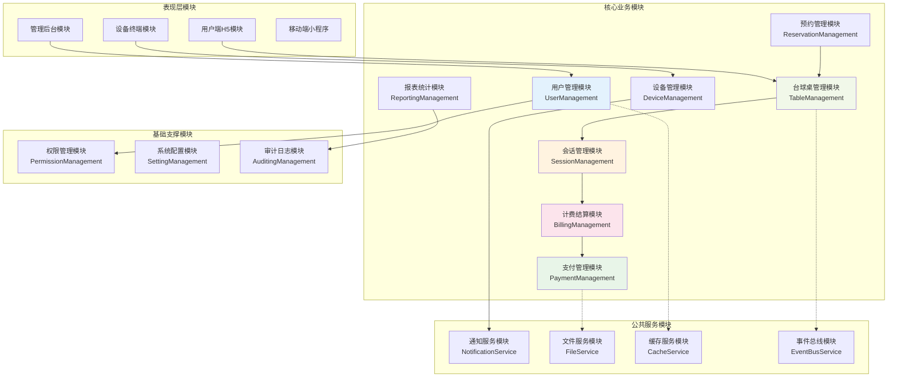
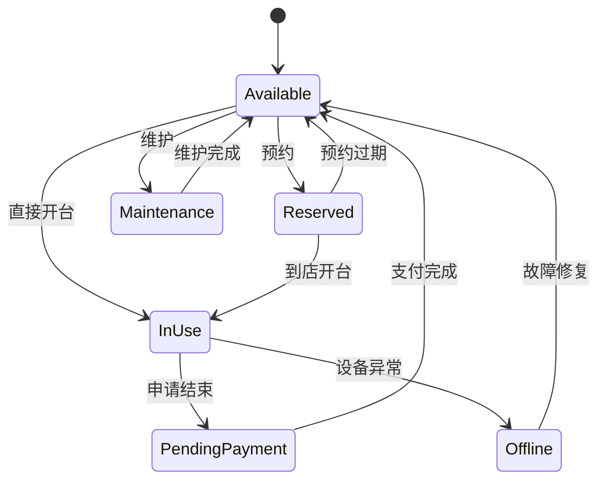
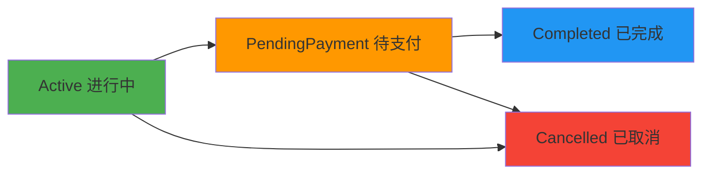
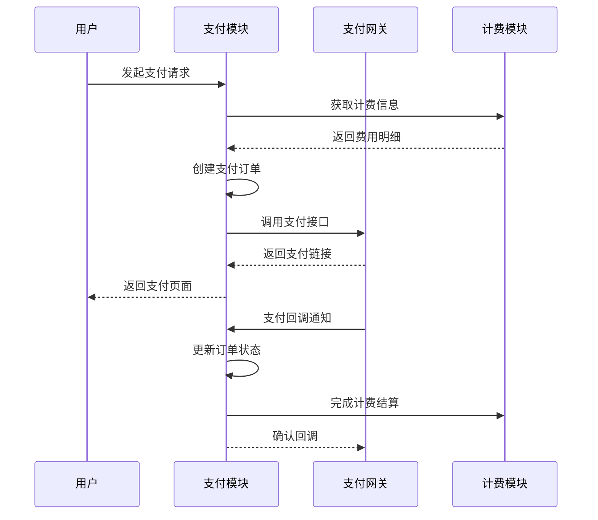
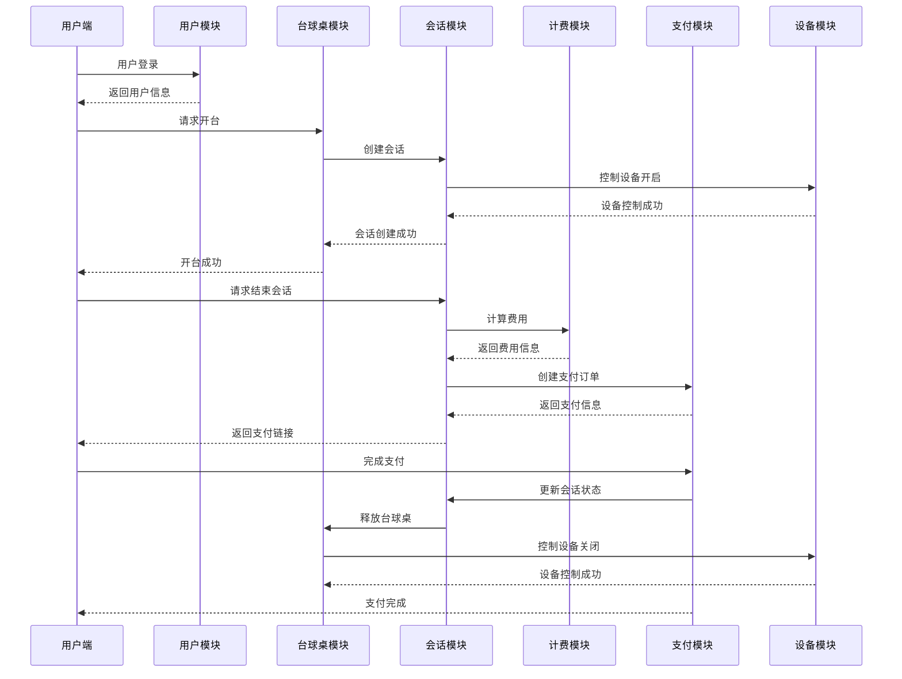
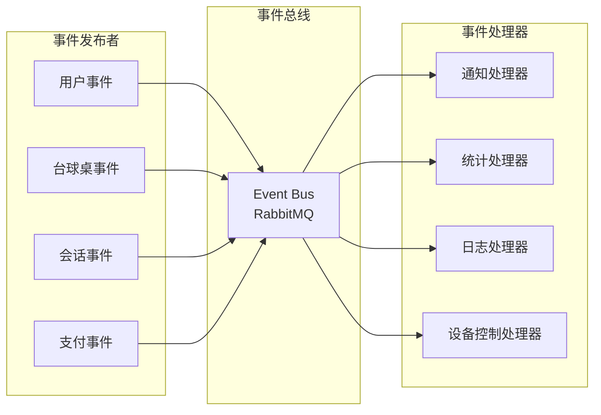
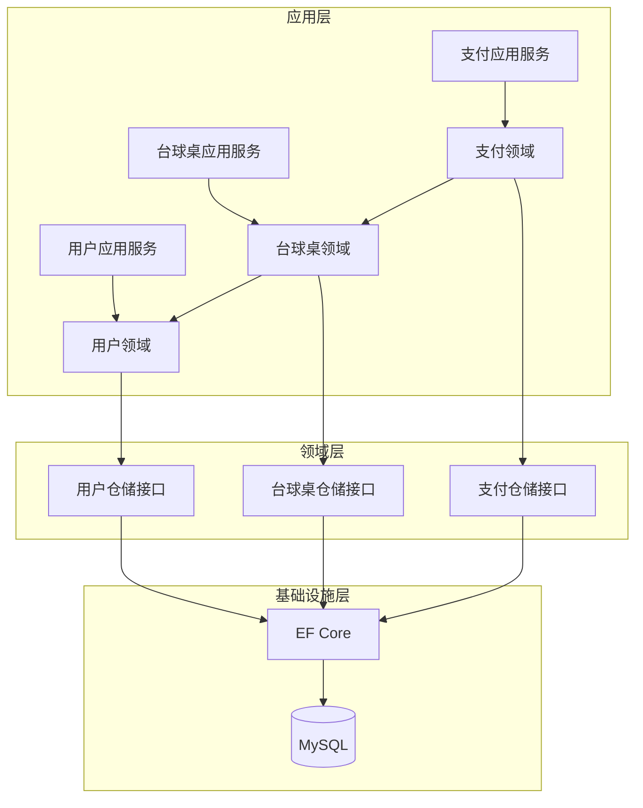

# ⚙️ 3.3 系统模块划分

<!-- Breadcrumb Navigation -->
**导航路径**: [🏠 项目文档首页](../自助台球系统项目文档.md) > [🏗️ 系统架构设计](README.md) > ⚙️ 系统模块划分

<!-- Keywords for Search -->
**关键词**: `模块设计` `职责边界` `接口定义` `领域划分`

## 🎯 模块设计概述

基于**领域驱动设计(DDD)**和**ABP框架**，将自助台球系统划分为8个核心业务模块和3个基础支撑模块，每个模块职责清晰、边界明确、低耦合高内聚。

## 🏗️ 模块总览架构



## 📋 1. 核心业务模块详述

### 1.1 用户管理模块 (UserManagement)

**模块职责**:
- 用户注册、登录、注销
- 用户信息管理和维护
- 会员等级和权益管理
- 用户余额和消费记录

**核心实体**:
```csharp
// 用户聚合根
public class User : FullAuditedAggregateRoot<Guid>
{
    public string UserName { get; set; }
    public string PhoneNumber { get; set; }
    public decimal Balance { get; set; }
    public UserType UserType { get; set; }
    public DateTime? LastLoginTime { get; set; }
}

// 会员信息
public class Membership : Entity<Guid>
{
    public Guid UserId { get; set; }
    public MembershipLevel Level { get; set; }
    public DateTime ExpireDate { get; set; }
    public decimal DiscountRate { get; set; }
}
```

**关键接口**:
```csharp
public interface IUserAppService : IApplicationService
{
    Task<UserDto> GetAsync(Guid id);
    Task<UserDto> CreateAsync(CreateUserDto input);
    Task<UserDto> UpdateAsync(Guid id, UpdateUserDto input);
    Task<decimal> GetBalanceAsync(Guid userId);
    Task ChargeBalanceAsync(Guid userId, decimal amount);
}
```

**数据表**:
- `Users` - 用户基本信息
- `UserMemberships` - 会员信息
- `UserBalanceRecords` - 余额变动记录

### 1.2 台球桌管理模块 (TableManagement)

**模块职责**:
- 台球桌状态管理(空闲/使用中/维护等)
- 台球桌基本信息维护
- 台球桌使用统计
- 台球桌分配和释放

**状态机设计**:


**核心实体**:
```csharp
public class BilliardTable : FullAuditedAggregateRoot<int>
{
    public string Code { get; set; } // 台球桌编号
    public Guid StoreId { get; set; } // 所属门店
    public TableStatus Status { get; set; } // 当前状态
    public Guid? CurrentSessionId { get; set; } // 当前会话
    public DateTime? LastUsedTime { get; set; } // 最后使用时间
    public bool IsActive { get; set; } // 是否启用
    
    // 状态转换方法
    public void StartSession(Guid sessionId)
    {
        if (Status != TableStatus.Available && Status != TableStatus.Reserved)
            throw new BusinessException("台球桌当前状态不允许开台");
            
        Status = TableStatus.InUse;
        CurrentSessionId = sessionId;
        LastUsedTime = Clock.Now;
        
        AddLocalEvent(new TableSessionStartedEto(Id, sessionId));
    }
}
```

**关键接口**:
```csharp
public interface ITableAppService : IApplicationService
{
    Task<PagedResultDto<BilliardTableDto>> GetListAsync(GetTableListDto input);
    Task<BilliardTableDto> GetAsync(int id);
    Task<List<BilliardTableDto>> GetAvailableTablesAsync(Guid storeId);
    Task StartSessionAsync(int tableId, StartSessionDto input);
    Task EndSessionAsync(int tableId);
}
```

**数据表**:
- `BilliardTables` - 台球桌基本信息
- `TableStatusLogs` - 台球桌状态变更日志

### 1.3 会话管理模块 (SessionManagement)

**模块职责**:
- 开台会话创建和管理
- 会话状态跟踪
- 会话时长计算
- 会话结束处理

**核心实体**:
```csharp
public class TableSession : FullAuditedAggregateRoot<Guid>
{
    public Guid UserId { get; set; } // 用户ID
    public int TableId { get; set; } // 台球桌ID
    public Guid StoreId { get; set; } // 门店ID
    public SessionStatus Status { get; set; } // 会话状态
    public DateTime StartTime { get; set; } // 开始时间
    public DateTime? EndTime { get; set; } // 结束时间
    public int DurationMinutes => CalculateDuration(); // 时长(分钟)
    public decimal TotalAmount { get; set; } // 总费用
    public string SessionToken { get; set; } // 会话令牌(防重复)
    
    // 业务方法
    public void EndSession()
    {
        if (Status != SessionStatus.Active)
            throw new BusinessException("会话状态不允许结束");
            
        Status = SessionStatus.PendingPayment;
        EndTime = Clock.Now;
        
        AddLocalEvent(new SessionEndRequestedEto(Id, UserId, TotalAmount));
    }
    
    private int CalculateDuration()
    {
        var endTime = EndTime ?? Clock.Now;
        return (int)Math.Ceiling((endTime - StartTime).TotalMinutes);
    }
}
```

**会话状态流转**:


### 1.4 计费结算模块 (BillingManagement)

**模块职责**:
- 实时计费规则管理
- 费用计算和快照
- 优惠券和折扣处理
- 计费历史记录

**计费规则设计**:
```csharp
public class PricingRule : Entity<Guid>
{
    public string Name { get; set; } // 规则名称
    public Guid? StoreId { get; set; } // 门店ID(全局规则为null)
    public PricingType Type { get; set; } // 定价类型
    public string RuleConfig { get; set; } // 规则配置JSON
    public TimeSpan? ValidFrom { get; set; } // 生效时间
    public TimeSpan? ValidTo { get; set; } // 失效时间
    public bool IsActive { get; set; }
}

// 计费快照
public class BillingSnapshot : Entity<Guid>
{
    public Guid SessionId { get; set; }
    public int OriginalMinutes { get; set; } // 原始时长
    public decimal BaseAmount { get; set; } // 基础费用
    public string AppliedRules { get; set; } // 应用规则JSON
    public decimal DiscountAmount { get; set; } // 折扣金额
    public decimal FinalAmount { get; set; } // 最终金额
    public DateTime CreatedTime { get; set; }
}
```

**计费算法**:
```csharp
public interface IBillingService : IDomainService
{
    Task<BillingResult> CalculateBillingAsync(Guid sessionId);
    Task<BillingSnapshot> CreateSnapshotAsync(Guid sessionId);
}

public class BillingService : DomainService, IBillingService
{
    public async Task<BillingResult> CalculateBillingAsync(Guid sessionId)
    {
        var session = await _sessionRepository.GetAsync(sessionId);
        var rules = await GetApplicableRulesAsync(session);
        
        var result = new BillingResult
        {
            SessionId = sessionId,
            OriginalMinutes = session.DurationMinutes,
            BaseAmount = CalculateBaseAmount(session.DurationMinutes, rules)
        };
        
        // 应用折扣和优惠券
        result.FinalAmount = ApplyDiscounts(result.BaseAmount, session.UserId);
        
        return result;
    }
}
```

### 1.5 支付管理模块 (PaymentManagement)

**模块职责**:
- 支付订单创建和管理
- 多渠道支付对接
- 支付状态跟踪
- 退款处理

**支付流程设计**:


**核心实体**:
```csharp
public class PaymentOrder : FullAuditedAggregateRoot<Guid>
{
    public string OrderNo { get; set; } // 订单号
    public Guid UserId { get; set; } // 用户ID
    public Guid? SessionId { get; set; } // 关联会话
    public PaymentType Type { get; set; } // 支付类型
    public decimal Amount { get; set; } // 支付金额
    public PaymentStatus Status { get; set; } // 支付状态
    public PaymentChannel Channel { get; set; } // 支付渠道
    public string ThirdPartyOrderNo { get; set; } // 第三方订单号
    public DateTime? PaidTime { get; set; } // 支付时间
    public string CallbackData { get; set; } // 回调数据
    
    // 支付成功处理
    public void MarkAsPaid(string thirdPartyOrderNo, string callbackData)
    {
        if (Status != PaymentStatus.Pending)
            throw new BusinessException("订单状态不允许支付");
            
        Status = PaymentStatus.Paid;
        ThirdPartyOrderNo = thirdPartyOrderNo;
        CallbackData = callbackData;
        PaidTime = Clock.Now;
        
        AddLocalEvent(new PaymentCompletedEto(Id, UserId, Amount));
    }
}
```

### 1.6 设备管理模块 (DeviceManagement)

**模块职责**:
- 设备信息管理
- 设备状态监控
- 设备控制指令
- 设备告警处理

**设备类型设计**:
```csharp
public class Device : FullAuditedAggregateRoot<Guid>
{
    public Guid StoreId { get; set; } // 所属门店
    public int? TableId { get; set; } // 关联台球桌
    public string SerialNumber { get; set; } // 设备序列号
    public DeviceType Type { get; set; } // 设备类型
    public string Name { get; set; } // 设备名称
    public DeviceStatus Status { get; set; } // 设备状态
    public string FirmwareVersion { get; set; } // 固件版本
    public DateTime? LastHeartbeatTime { get; set; } // 最后心跳时间
    public string LastHeartbeatData { get; set; } // 心跳数据
    
    // 更新心跳
    public void UpdateHeartbeat(string data)
    {
        LastHeartbeatTime = Clock.Now;
        LastHeartbeatData = data;
        
        // 判断设备状态
        if (Status == DeviceStatus.Offline)
        {
            Status = DeviceStatus.Online;
            AddLocalEvent(new DeviceOnlineEto(Id));
        }
    }
}

// 设备心跳记录
public class DeviceHeartbeat : Entity<Guid>
{
    public Guid DeviceId { get; set; }
    public DateTime Timestamp { get; set; }
    public string MetricsData { get; set; } // JSON格式的指标数据
}
```

**设备控制接口**:
```csharp
public interface IDeviceControlService : IDomainService
{
    Task<DeviceCommandResult> SendCommandAsync(Guid deviceId, DeviceCommand command);
    Task<bool> CheckDeviceStatusAsync(Guid deviceId);
    Task ProcessHeartbeatAsync(Guid deviceId, string data);
}
```

### 1.7 预约管理模块 (ReservationManagement)

**模块职责**:
- 预约时段管理
- 预约冲突检测
- 预约转开台处理
- 预约过期处理

**预约实体设计**:
```csharp
public class Reservation : FullAuditedAggregateRoot<Guid>
{
    public Guid UserId { get; set; } // 预约用户
    public int TableId { get; set; } // 预约台球桌
    public DateTime ReservationTime { get; set; } // 预约时间
    public int DurationMinutes { get; set; } // 预约时长
    public ReservationStatus Status { get; set; } // 预约状态
    public decimal DepositAmount { get; set; } // 押金金额
    public DateTime ExpireTime { get; set; } // 过期时间
    public Guid? SessionId { get; set; } // 转换的会话ID
    
    // 预约转开台
    public void ConvertToSession(Guid sessionId)
    {
        if (Status != ReservationStatus.Confirmed)
            throw new BusinessException("预约状态不允许开台");
            
        Status = ReservationStatus.Used;
        SessionId = sessionId;
        
        AddLocalEvent(new ReservationUsedEto(Id, UserId, TableId));
    }
}
```

**冲突检测算法**:
```csharp
public class ReservationConflictChecker : IDomainService
{
    public async Task<bool> HasConflictAsync(int tableId, DateTime startTime, int durationMinutes)
    {
        var endTime = startTime.AddMinutes(durationMinutes);
        
        var conflictingReservations = await _reservationRepository
            .Where(r => r.TableId == tableId)
            .Where(r => r.Status == ReservationStatus.Confirmed)
            .Where(r => r.ReservationTime < endTime && 
                       r.ReservationTime.AddMinutes(r.DurationMinutes) > startTime)
            .AnyAsync();
            
        return conflictingReservations;
    }
}
```

### 1.8 报表统计模块 (ReportingManagement)

**模块职责**:
- 经营数据统计
- 用户行为分析
- 设备使用分析
- 财务报表生成

**报表类型设计**:
```csharp
public abstract class BaseReport : Entity<Guid>
{
    public string ReportName { get; set; }
    public ReportType Type { get; set; }
    public DateTime ReportDate { get; set; }
    public Guid? StoreId { get; set; } // null表示全局报表
    public string ReportData { get; set; } // JSON格式数据
    public DateTime CreatedTime { get; set; }
}

// 日营业报表
public class DailyOperationReport : BaseReport
{
    public int TotalSessions { get; set; } // 总会话数
    public decimal TotalRevenue { get; set; } // 总收入
    public int ActiveTables { get; set; } // 活跃台球桌数
    public double AverageSessionDuration { get; set; } // 平均会话时长
    public int NewUsers { get; set; } // 新用户数
}
```

## 🔧 2. 基础支撑模块

### 2.1 权限管理模块 (PermissionManagement)

**基于ABP权限系统**:
```csharp
public class BilliardHallPermissions
{
    public const string GroupName = "BilliardHall";
    
    public static class Users
    {
        public const string Default = GroupName + ".Users";
        public const string Create = Default + ".Create";
        public const string Edit = Default + ".Edit";
        public const string Delete = Default + ".Delete";
    }
    
    public static class Tables
    {
        public const string Default = GroupName + ".Tables";
        public const string Manage = Default + ".Manage";
        public const string Control = Default + ".Control";
    }
}
```

### 2.2 系统配置模块 (SettingManagement)

**配置定义**:
```csharp
public class BilliardHallSettingDefinitionProvider : SettingDefinitionProvider
{
    public override void Define(ISettingDefinitionContext context)
    {
        context.Add(
            new SettingDefinition(
                BilliardHallSettings.DefaultSessionTimeoutMinutes,
                "30",
                displayName: L("默认会话超时时间(分钟)"),
                description: L("用户无操作自动结束会话的时间")
            ).WithProviders(
                DefaultValueSettingValueProvider.ProviderName,
                ConfigurationSettingValueProvider.ProviderName,
                GlobalSettingValueProvider.ProviderName,
                TenantSettingValueProvider.ProviderName
            )
        );
    }
}
```

### 2.3 审计日志模块 (AuditingManagement)

**基于ABP审计系统**:
```csharp
[Audited]
public class TableSession : FullAuditedAggregateRoot<Guid>
{
    // 自动记录创建时间、创建人、修改时间、修改人等信息
}

// 自定义审计属性
public class BilliardHallAuditPropertySetter : IAbpAuditPropertySetter
{
    public void SetCreationProperties(object targetObject)
    {
        AuditPropertySetterExtensions.SetCreationProperties(
            _abpSession,
            targetObject,
            _tenantId,
            _userId
        );
    }
}
```

## 🌐 3. 公共服务模块

### 3.1 通知服务模块 (NotificationService)

**通知类型支持**:
```csharp
public interface INotificationService : IDomainService
{
    Task SendSmsAsync(string phoneNumber, string message);
    Task SendEmailAsync(string email, string subject, string body);
    Task SendPushNotificationAsync(Guid userId, string title, string content);
    Task SendInAppNotificationAsync(Guid userId, string message);
}

// 通知模板
public class NotificationTemplate : Entity<Guid>
{
    public string Name { get; set; }
    public NotificationType Type { get; set; }
    public string Subject { get; set; }
    public string Content { get; set; }
    public string Variables { get; set; } // 可用变量JSON
}
```

### 3.2 事件总线模块 (EventBusService)

**基于ABP事件总线**:
```csharp
// 领域事件
public class SessionStartedEto
{
    public Guid SessionId { get; set; }
    public Guid UserId { get; set; }
    public int TableId { get; set; }
    public DateTime StartTime { get; set; }
}

// 事件处理器
public class SessionStartedEventHandler : 
    IDistributedEventHandler<SessionStartedEto>,
    ITransientDependency
{
    public async Task HandleEventAsync(SessionStartedEto eventData)
    {
        // 发送开台通知
        await _notificationService.SendInAppNotificationAsync(
            eventData.UserId,
            $"台球桌 {eventData.TableId} 开台成功"
        );
        
        // 更新统计数据
        await _statisticsService.IncrementSessionCountAsync();
    }
}
```

## 🔄 4. 模块间交互设计

### 4.1 核心业务流程



### 4.2 事件驱动架构



### 4.3 依赖关系图



## 📊 5. 模块接口规范

### 5.1 应用服务接口规范

```csharp
// 标准CRUD接口
public interface IStandardAppService<TEntityDto, TKey, TGetListInput, TCreateInput, TUpdateInput>
    : IApplicationService
{
    Task<TEntityDto> GetAsync(TKey id);
    Task<PagedResultDto<TEntityDto>> GetListAsync(TGetListInput input);
    Task<TEntityDto> CreateAsync(TCreateInput input);
    Task<TEntityDto> UpdateAsync(TKey id, TUpdateInput input);
    Task DeleteAsync(TKey id);
}

// 业务接口示例
public interface ITableAppService : IApplicationService
{
    // 查询接口
    Task<BilliardTableDto> GetAsync(int id);
    Task<PagedResultDto<BilliardTableDto>> GetListAsync(GetTableListDto input);
    Task<List<BilliardTableDto>> GetAvailableTablesAsync(Guid storeId);
    
    // 业务操作接口
    Task<StartSessionResultDto> StartSessionAsync(StartSessionDto input);
    Task EndSessionAsync(EndSessionDto input);
    Task<TableStatusDto> GetTableStatusAsync(int tableId);
}
```

### 5.2 领域服务接口规范

```csharp
public interface IBillingDomainService : IDomainService
{
    Task<BillingResult> CalculateAsync(Guid sessionId);
    Task<List<PricingRule>> GetApplicableRulesAsync(Guid storeId, DateTime dateTime);
    Task<decimal> ApplyDiscountAsync(decimal baseAmount, Guid userId);
}
```

### 5.3 数据传输对象(DTO)规范

```csharp
// 输入DTO
public class CreateUserDto
{
    [Required]
    [StringLength(50)]
    public string UserName { get; set; }
    
    [Required]
    [Phone]
    public string PhoneNumber { get; set; }
    
    [Range(0, double.MaxValue)]
    public decimal InitialBalance { get; set; }
}

// 输出DTO
public class UserDto : AuditedEntityDto<Guid>
{
    public string UserName { get; set; }
    public string PhoneNumber { get; set; }
    public decimal Balance { get; set; }
    public UserType UserType { get; set; }
    public MembershipDto Membership { get; set; }
}

// 查询DTO
public class GetUserListDto : PagedAndSortedResultRequestDto
{
    public string Filter { get; set; }
    public UserType? UserType { get; set; }
    public DateTime? CreatedFrom { get; set; }
    public DateTime? CreatedTo { get; set; }
}
```

## 🔍 6. 模块质量保证

### 6.1 单元测试规范

```csharp
[Collection(BilliardHallTestConsts.CollectionDefinitionName)]
public class UserAppServiceTests : BilliardHallApplicationTestBase
{
    private readonly IUserAppService _userAppService;
    
    public UserAppServiceTests()
    {
        _userAppService = GetRequiredService<IUserAppService>();
    }
    
    [Fact]
    public async Task Should_Create_User_With_Valid_Data()
    {
        // Arrange
        var createDto = new CreateUserDto
        {
            UserName = "test_user",
            PhoneNumber = "13800138000",
            InitialBalance = 100m
        };
        
        // Act
        var result = await _userAppService.CreateAsync(createDto);
        
        // Assert
        result.ShouldNotBeNull();
        result.UserName.ShouldBe(createDto.UserName);
        result.Balance.ShouldBe(createDto.InitialBalance);
    }
}
```

### 6.2 集成测试规范

```csharp
[Collection(BilliardHallTestConsts.CollectionDefinitionName)]
public class SessionIntegrationTests : BilliardHallWebTestBase
{
    [Fact]
    public async Task Should_Complete_Full_Session_Workflow()
    {
        // 创建测试用户
        var user = await CreateTestUserAsync();
        
        // 创建测试台球桌
        var table = await CreateTestTableAsync();
        
        // 开始会话
        var session = await StartSessionAsync(user.Id, table.Id);
        session.Status.ShouldBe(SessionStatus.Active);
        
        // 结束会话
        await EndSessionAsync(session.Id);
        
        // 验证状态
        var updatedSession = await GetSessionAsync(session.Id);
        updatedSession.Status.ShouldBe(SessionStatus.PendingPayment);
    }
}
```

## 🔗 相关文档

- [总体架构图](总体架构图.md) - 系统整体架构设计
- [技术选型](技术选型.md) - 技术栈选择说明  
- [外部接口](外部接口.md) - 第三方系统集成接口
- [设计原则](设计原则.md) - 模块设计原则和约束

---

💡 **说明**: 模块划分将根据业务发展进行调整，请及时关注模块边界的变化和接口的版本演进。
