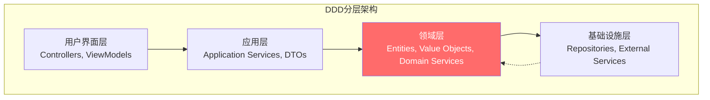
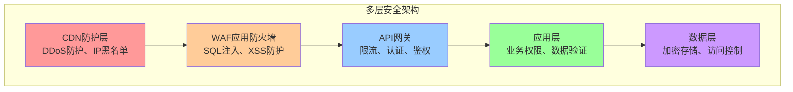

# 🏗️ 3.5 关键设计原则

<!-- Breadcrumb Navigation -->
**导航路径**: [🏠 项目文档首页](../自助台球系统项目文档.md) > [🏗️ 系统架构设计](README.md) > 🏗️ 关键设计原则

<!-- Keywords for Search -->
**关键词**: `设计原则` `DDD` `ABP框架` `架构约束` `最佳实践`

## 🎯 设计原则概述

基于多年企业级开发经验和业界最佳实践，结合自助台球系统的业务特点，制定以下架构设计原则。这些原则将指导整个系统的设计、开发和维护工作。

## 🏛️ 核心设计原则

### 1. 单一职责原则 (Single Responsibility Principle)

**原则说明**: 每个类、模块或服务只负责一个明确定义的职责

**应用实践**:
```csharp
// ✅ 好的设计 - 职责单一
public class BillingCalculator : IDomainService
{
    public async Task<BillingResult> CalculateAsync(Guid sessionId)
    {
        // 只负责计费计算逻辑
    }
}

public class PaymentProcessor : IDomainService
{
    public async Task<PaymentResult> ProcessAsync(PaymentOrder order)
    {
        // 只负责支付处理逻辑
    }
}

// ❌ 不好的设计 - 职责混乱
public class BillingAndPaymentService : IDomainService
{
    public async Task<BillingResult> CalculateAndPayAsync(Guid sessionId)
    {
        // 既负责计费又负责支付，职责不清
    }
}
```

### 2. 开闭原则 (Open-Closed Principle)

**原则说明**: 对扩展开放，对修改关闭

**应用实践**:
```csharp
// 定价规则策略接口
public interface IPricingStrategy
{
    Task<decimal> CalculateAsync(PricingContext context);
    bool IsApplicable(PricingContext context);
}

// 时长计费策略
public class HourlyPricingStrategy : IPricingStrategy
{
    public async Task<decimal> CalculateAsync(PricingContext context)
    {
        return context.Minutes * context.HourlyRate / 60;
    }
    
    public bool IsApplicable(PricingContext context)
    {
        return context.PricingType == PricingType.Hourly;
    }
}

// 包台计费策略 - 扩展新功能无需修改现有代码
public class PackagePricingStrategy : IPricingStrategy
{
    public async Task<decimal> CalculateAsync(PricingContext context)
    {
        return context.PackagePrice;
    }
    
    public bool IsApplicable(PricingContext context)
    {
        return context.PricingType == PricingType.Package;
    }
}
```

### 3. 依赖倒置原则 (Dependency Inversion Principle)

**原则说明**: 高层模块不应该依赖低层模块，两者都应该依赖抽象

**应用实践**:
```csharp
// 抽象接口
public interface IPaymentGateway
{
    Task<PaymentResult> ProcessPaymentAsync(PaymentRequest request);
}

// 应用服务依赖抽象，不依赖具体实现
public class PaymentAppService : ApplicationService
{
    private readonly IPaymentGateway _paymentGateway; // 依赖抽象
    
    public PaymentAppService(IPaymentGateway paymentGateway)
    {
        _paymentGateway = paymentGateway;
    }
    
    public async Task<PaymentDto> CreatePaymentAsync(CreatePaymentDto input)
    {
        // 使用抽象接口，不关心具体实现
        var result = await _paymentGateway.ProcessPaymentAsync(
            ObjectMapper.Map<PaymentRequest>(input));
        return ObjectMapper.Map<PaymentDto>(result);
    }
}

// 具体实现
public class AlipayGateway : IPaymentGateway, ITransientDependency
{
    public async Task<PaymentResult> ProcessPaymentAsync(PaymentRequest request)
    {
        // 支付宝具体实现
    }
}
```

## 🏗️ 架构设计原则

### 1. 领域驱动设计 (Domain-Driven Design)

**核心理念**: 将复杂的业务逻辑封装在领域层，保持业务逻辑的纯净性

**层次结构**:


**实现示例**:
```csharp
// 领域实体 - 包含业务逻辑
public class TableSession : FullAuditedAggregateRoot<Guid>
{
    // 业务属性
    public Guid UserId { get; private set; }
    public int TableId { get; private set; }
    public SessionStatus Status { get; private set; }
    public DateTime StartTime { get; private set; }
    public DateTime? EndTime { get; private set; }
    
    // 业务方法 - 封装业务规则
    public void EndSession(IBillingService billingService)
    {
        // 业务规则验证
        if (Status != SessionStatus.Active)
            throw new BusinessException("只有进行中的会话才能结束");
            
        if (DateTime.UtcNow - StartTime < TimeSpan.FromMinutes(1))
            throw new BusinessException("会话时间过短，不能结束");
        
        // 状态变更
        Status = SessionStatus.PendingPayment;
        EndTime = DateTime.UtcNow;
        
        // 发布领域事件
        AddLocalEvent(new SessionEndedDomainEvent(Id, UserId, CalculateDuration()));
    }
    
    // 领域计算
    public int CalculateDuration()
    {
        var endTime = EndTime ?? DateTime.UtcNow;
        return (int)Math.Ceiling((endTime - StartTime).TotalMinutes);
    }
}

// 领域服务 - 跨聚合的业务逻辑
public class BillingDomainService : DomainService
{
    public async Task<decimal> CalculateSessionBillingAsync(
        TableSession session, 
        List<PricingRule> rules)
    {
        // 复杂的计费逻辑
        var baseAmount = CalculateBaseAmount(session, rules);
        var discountAmount = await CalculateDiscountAsync(session.UserId);
        return Math.Max(0, baseAmount - discountAmount);
    }
}
```

### 2. CQRS (Command Query Responsibility Segregation)

**原则说明**: 命令和查询分离，读写操作使用不同的模型

**应用场景**:
```csharp
// 命令 - 用于修改数据
public class StartSessionCommand
{
    public Guid UserId { get; set; }
    public int TableId { get; set; }
    public string SessionToken { get; set; } // 幂等性保证
}

// 命令处理器
public class StartSessionCommandHandler : ICommandHandler<StartSessionCommand>
{
    public async Task HandleAsync(StartSessionCommand command)
    {
        // 业务逻辑处理
        var session = new TableSession(command.UserId, command.TableId);
        await _sessionRepository.InsertAsync(session);
    }
}

// 查询 - 用于读取数据，可以跨聚合查询
public class GetActiveSessionsQuery
{
    public Guid? UserId { get; set; }
    public int? StoreId { get; set; }
    public DateTime? FromDate { get; set; }
}

// 查询处理器 - 可以直接访问数据库，不通过领域模型
public class GetActiveSessionsQueryHandler : IQueryHandler<GetActiveSessionsQuery, List<SessionDto>>
{
    public async Task<List<SessionDto>> HandleAsync(GetActiveSessionsQuery query)
    {
        return await (from s in _dbContext.TableSessions
                     join t in _dbContext.BilliardTables on s.TableId equals t.Id
                     join u in _dbContext.Users on s.UserId equals u.Id
                     where s.Status == SessionStatus.Active
                     select new SessionDto
                     {
                         Id = s.Id,
                         TableCode = t.Code,
                         UserName = u.UserName,
                         StartTime = s.StartTime,
                         DurationMinutes = EF.Functions.DateDiffMinute(s.StartTime, DateTime.UtcNow)
                     }).ToListAsync();
    }
}
```

### 3. 事件驱动架构 (Event-Driven Architecture)

**原则说明**: 通过事件实现模块间的松耦合通信

**事件设计**:
```csharp
// 领域事件
public class SessionStartedDomainEvent : DomainEvent
{
    public Guid SessionId { get; set; }
    public Guid UserId { get; set; }
    public int TableId { get; set; }
    public DateTime StartTime { get; set; }
}

// 集成事件 - 跨边界上下文
public class SessionStartedIntegrationEvent : IntegrationEvent
{
    public Guid SessionId { get; set; }
    public Guid UserId { get; set; }
    public int TableId { get; set; }
    public DateTime StartTime { get; set; }
}

// 事件处理器
public class SessionStartedEventHandler : 
    ILocalEventHandler<SessionStartedDomainEvent>,
    IDistributedEventHandler<SessionStartedIntegrationEvent>
{
    // 领域内事件处理
    public async Task HandleEventAsync(SessionStartedDomainEvent eventData)
    {
        // 更新台球桌状态
        await _tableManager.UpdateStatusAsync(eventData.TableId, TableStatus.InUse);
        
        // 发布集成事件
        await _distributedEventBus.PublishAsync(
            ObjectMapper.Map<SessionStartedIntegrationEvent>(eventData));
    }
    
    // 跨边界事件处理
    public async Task HandleEventAsync(SessionStartedIntegrationEvent eventData)
    {
        // 发送通知
        await _notificationService.NotifySessionStartedAsync(eventData.UserId);
        
        // 记录统计数据
        await _statisticsService.RecordSessionStartAsync(eventData.TableId);
    }
}
```

## 🔒 安全设计原则

### 1. 纵深防御 (Defense in Depth)

**原则说明**: 多层安全防护，避免单点故障

**防护层次**:


### 2. 最小权限原则 (Principle of Least Privilege)

**实现方式**:
```csharp
// 权限定义
public class BilliardHallPermissions
{
    // 用户管理权限
    public static class Users
    {
        public const string Default = "BilliardHall.Users";
        public const string Create = Default + ".Create";
        public const string Edit = Default + ".Edit";
        public const string Delete = Default + ".Delete";
        public const string ViewSensitiveInfo = Default + ".ViewSensitiveInfo";
    }
}

// 权限控制
[AbpAuthorize(BilliardHallPermissions.Users.ViewSensitiveInfo)]
public async Task<UserDetailDto> GetUserDetailAsync(Guid id)
{
    // 只有具备敏感信息查看权限的用户才能访问
    var user = await _userRepository.GetAsync(id);
    return ObjectMapper.Map<UserDetailDto>(user);
}

// 数据过滤
[AbpMvcAuthorize]
public async Task<PagedResultDto<UserDto>> GetUsersAsync(GetUsersInput input)
{
    var query = await _userRepository.GetQueryableAsync();
    
    // 非管理员只能查看自己的数据
    if (!await _permissionChecker.IsGrantedAsync(BilliardHallPermissions.Users.Default))
    {
        query = query.Where(u => u.Id == AbpSession.UserId);
    }
    
    return await query.ToPagedResultAsync(input);
}
```

### 3. 输入验证原则

**验证策略**:
```csharp
// DTO验证
public class CreateUserDto : IValidatableObject
{
    [Required(ErrorMessage = "用户名不能为空")]
    [StringLength(50, MinimumLength = 2, ErrorMessage = "用户名长度必须在2-50个字符之间")]
    public string UserName { get; set; }
    
    [Required(ErrorMessage = "手机号不能为空")]
    [RegularExpression(@"^1[3-9]\d{9}$", ErrorMessage = "手机号格式不正确")]
    public string PhoneNumber { get; set; }
    
    [Range(0, 10000, ErrorMessage = "余额必须在0-10000之间")]
    public decimal InitialBalance { get; set; }
    
    public IEnumerable<ValidationResult> Validate(ValidationContext validationContext)
    {
        // 自定义验证逻辑
        if (UserName?.ToLower().Contains("admin") == true)
        {
            yield return new ValidationResult(
                "用户名不能包含admin关键字", 
                new[] { nameof(UserName) });
        }
    }
}

// 业务规则验证
public class UserManager : DomainService
{
    public async Task<User> CreateAsync(string userName, string phoneNumber)
    {
        // 重复性检查
        if (await _userRepository.AnyAsync(u => u.UserName == userName))
            throw new BusinessException("用户名已存在");
            
        if (await _userRepository.AnyAsync(u => u.PhoneNumber == phoneNumber))
            throw new BusinessException("手机号已被注册");
        
        // 创建用户
        return new User(GuidGenerator.Create(), userName, phoneNumber);
    }
}
```

## 🚀 性能设计原则

### 1. 缓存优先原则

**缓存策略**:
```csharp
public class TableAppService : ApplicationService
{
    [AbpCache] // ABP缓存拦截器
    public virtual async Task<List<BilliardTableDto>> GetAvailableTablesAsync(Guid storeId)
    {
        var tables = await _tableRepository.GetListAsync(
            t => t.StoreId == storeId && t.Status == TableStatus.Available);
        return ObjectMapper.Map<List<BilliardTableDto>>(tables);
    }
    
    // 手动缓存控制
    public async Task<BilliardTableDto> GetTableAsync(int tableId)
    {
        var cacheKey = $"table:{tableId}";
        
        return await _distributedCache.GetOrAddAsync(
            cacheKey,
            async () =>
            {
                var table = await _tableRepository.GetAsync(tableId);
                return ObjectMapper.Map<BilliardTableDto>(table);
            },
            TimeSpan.FromMinutes(10) // 缓存10分钟
        );
    }
}
```

### 2. 异步优先原则

**异步实现**:
```csharp
// 异步方法设计
public class SessionAppService : ApplicationService
{
    public async Task<SessionDto> StartSessionAsync(StartSessionDto input)
    {
        // 异步操作，不阻塞线程
        var session = await _sessionManager.StartAsync(input.UserId, input.TableId);
        
        // 异步发送通知，不等待结果
        _ = Task.Run(async () => 
        {
            await _notificationService.SendSessionStartNotificationAsync(session.Id);
        });
        
        return ObjectMapper.Map<SessionDto>(session);
    }
    
    // 批量操作异步化
    public async Task<List<SessionDto>> GetActiveSessionsAsync()
    {
        var sessions = await _sessionRepository
            .Where(s => s.Status == SessionStatus.Active)
            .Include(s => s.Table)
            .Include(s => s.User)
            .ToListAsync(); // EF Core异步查询
            
        return ObjectMapper.Map<List<SessionDto>>(sessions);
    }
}
```

### 3. 数据库优化原则

**查询优化**:
```csharp
// 使用索引
[Index(nameof(UserId), nameof(Status))] // 复合索引
public class TableSession : FullAuditedAggregateRoot<Guid>
{
    public Guid UserId { get; set; }
    public SessionStatus Status { get; set; }
}

// 避免N+1查询
public async Task<List<SessionWithDetailsDto>> GetSessionsWithDetailsAsync()
{
    return await (from s in _dbContext.TableSessions
                 join t in _dbContext.BilliardTables on s.TableId equals t.Id
                 join u in _dbContext.Users on s.UserId equals u.Id
                 select new SessionWithDetailsDto
                 {
                     SessionId = s.Id,
                     TableCode = t.Code,
                     UserName = u.UserName,
                     StartTime = s.StartTime,
                     Status = s.Status
                 }).ToListAsync();
}

// 分页查询
public async Task<PagedResultDto<SessionDto>> GetPagedSessionsAsync(PagedResultRequestDto input)
{
    var query = await _sessionRepository.GetQueryableAsync();
    
    var totalCount = await query.CountAsync();
    var sessions = await query
        .OrderByDescending(s => s.CreationTime)
        .PageBy(input) // ABP分页扩展
        .ToListAsync();
        
    return new PagedResultDto<SessionDto>(totalCount, 
        ObjectMapper.Map<List<SessionDto>>(sessions));
}
```

## 🔧 开发规范原则

### 1. 代码整洁原则

**命名规范**:
```csharp
// ✅ 好的命名 - 表意清晰
public class TableSessionManager : DomainService
{
    public async Task<TableSession> StartSessionAsync(Guid userId, int tableId)
    {
        var table = await _tableRepository.GetAsync(tableId);
        if (!table.IsAvailable())
            throw new BusinessException("台球桌不可用");
            
        return await CreateSessionAsync(userId, tableId);
    }
}

// ❌ 不好的命名 - 含义模糊
public class TSMgr : DomainService
{
    public async Task<TS> Start(Guid u, int t)
    {
        var tb = await _repo.Get(t);
        if (!tb.OK())
            throw new BusinessException("不可用");
            
        return await Create(u, t);
    }
}
```

### 2. 错误处理原则

**异常处理策略**:
```csharp
// 业务异常
public class InsufficientBalanceException : BusinessException
{
    public InsufficientBalanceException(decimal required, decimal available) 
        : base($"余额不足。需要：{required:C}，可用：{available:C}")
    {
        Data["RequiredAmount"] = required;
        Data["AvailableAmount"] = available;
    }
}

// 异常处理
public async Task<PaymentDto> CreatePaymentAsync(CreatePaymentDto input)
{
    try
    {
        var user = await _userRepository.GetAsync(input.UserId);
        if (user.Balance < input.Amount)
            throw new InsufficientBalanceException(input.Amount, user.Balance);
            
        var payment = await _paymentManager.CreateAsync(input);
        return ObjectMapper.Map<PaymentDto>(payment);
    }
    catch (BusinessException)
    {
        throw; // 业务异常直接抛出
    }
    catch (Exception ex)
    {
        Logger.LogError(ex, "创建支付订单失败：{UserId}, {Amount}", input.UserId, input.Amount);
        throw new BusinessException("系统异常，请稍后重试");
    }
}
```

### 3. 日志记录原则

**结构化日志**:
```csharp
public class PaymentAppService : ApplicationService
{
    public async Task<PaymentDto> ProcessPaymentAsync(ProcessPaymentDto input)
    {
        using var activity = Logger.BeginScope(new Dictionary<string, object>
        {
            ["UserId"] = input.UserId,
            ["OrderId"] = input.OrderId,
            ["Amount"] = input.Amount,
            ["Channel"] = input.Channel
        });
        
        Logger.LogInformation("开始处理支付请求");
        
        try
        {
            var result = await _paymentService.ProcessAsync(input);
            Logger.LogInformation("支付处理成功：{PaymentId}", result.Id);
            return ObjectMapper.Map<PaymentDto>(result);
        }
        catch (Exception ex)
        {
            Logger.LogError(ex, "支付处理失败");
            throw;
        }
    }
}
```

## 📊 监控与可观测性原则

### 1. 健康检查设计

```csharp
public class BilliardHallHealthCheck : IHealthCheck
{
    private readonly ITableRepository _tableRepository;
    private readonly IDistributedCache _distributedCache;
    
    public async Task<HealthCheckResult> CheckHealthAsync(
        HealthCheckContext context, 
        CancellationToken cancellationToken = default)
    {
        try
        {
            // 检查数据库连接
            await _tableRepository.CountAsync();
            
            // 检查缓存连接
            await _distributedCache.SetStringAsync("health_check", "ok", cancellationToken);
            
            return HealthCheckResult.Healthy("所有依赖服务正常");
        }
        catch (Exception ex)
        {
            return HealthCheckResult.Unhealthy("依赖服务异常", ex);
        }
    }
}
```

### 2. 指标监控设计

```csharp
public class SessionMetricsService : ITransientDependency
{
    private readonly IMetrics _metrics;
    
    public async Task RecordSessionStart(Guid sessionId, int tableId)
    {
        _metrics.Increment("sessions.started", tags: new[] 
        { 
            $"table:{tableId}"
        });
        
        _metrics.Gauge("sessions.active", GetActiveSessionCount());
    }
    
    public async Task RecordSessionDuration(TimeSpan duration)
    {
        _metrics.Timing("sessions.duration", duration.TotalMilliseconds);
    }
}
```

## 🔗 相关文档

- [技术选型](技术选型.md) - 技术栈选择依据
- [系统模块划分](系统模块划分.md) - 模块设计实践
- [总体架构图](总体架构图.md) - 架构图解说明
- [外部接口](外部接口.md) - 接口设计规范

---

💡 **说明**: 设计原则是架构设计的指导思想，应该在整个开发过程中持续遵循和优化。随着系统演进，原则也可能需要适当调整。
