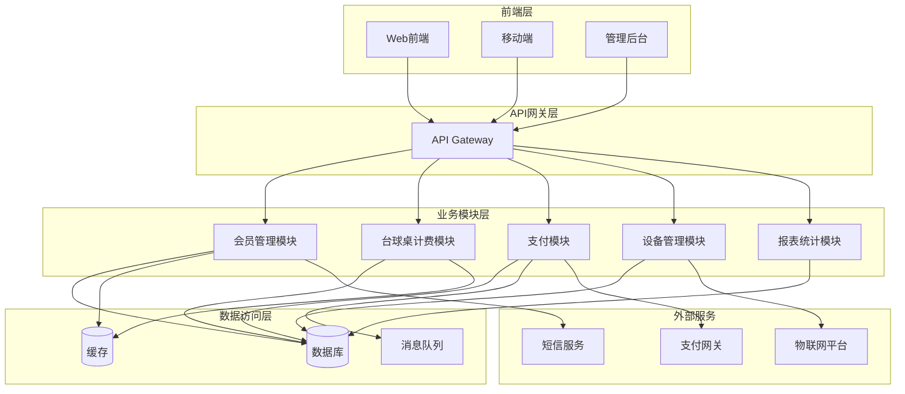
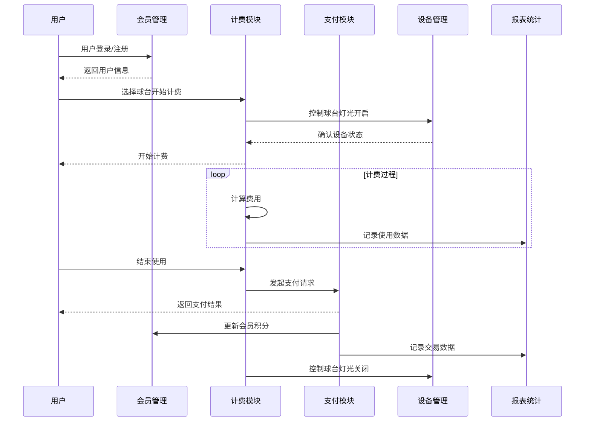
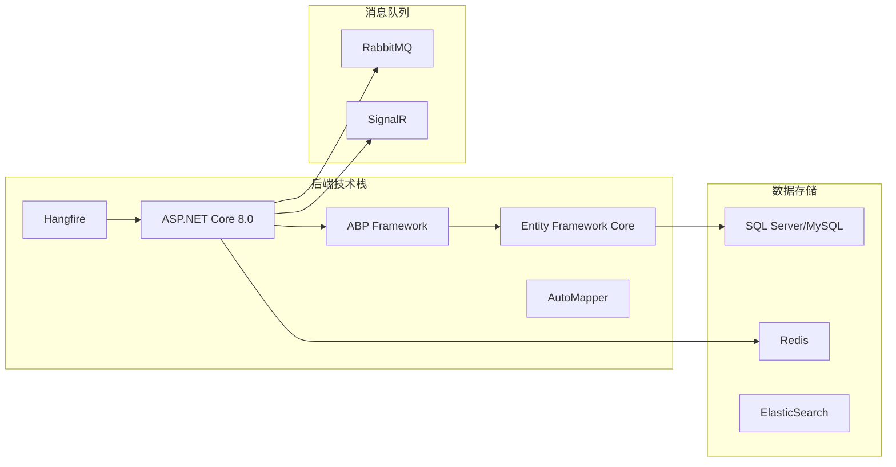

# 4. 模块设计

<!-- Breadcrumb Navigation -->
**导航路径**: [🏠 项目文档](../自助台球系统项目文档.md) > 📦 模块设计

<!-- Keywords for Search -->
**关键词**: `模块设计` `系统架构` `业务模块` `接口设计` `ABP框架`

---

## 📚 快速索引

| 模块 | 核心功能 | 技术重点 | 阅读建议 |
|------|----------|----------|----------|
| 🏃 [会员管理模块](会员管理模块.md) | 会员体系、积分管理 | 等级算法、权限控制 | 业务开发必读 |
| 💰 [台球桌计费模块](台球桌计费模块.md) | 计费规则、套餐管理 | 计时算法、价格策略 | 核心业务模块 |
| 💳 [支付模块](支付模块.md) | 支付流程、退款管理 | 幂等性、事务处理 | 支付集成必读 |
| 🖥️ [设备管理模块](设备管理模块.md) | 设备控制、状态监控 | 物联网协议、实时通信 | 硬件对接必读 |
| 📊 [报表与统计模块](报表与统计模块.md) | 数据分析、报表生成 | 数据聚合、可视化 | 数据分析参考 |

---

## 🏗️ 系统架构概览

### 模块关系图

### 核心业务流程

---

## 📦 模块详细说明

### 4.1 会员管理模块

**功能概述**: 负责用户注册、登录、会员等级管理、积分系统等功能。

**核心特性**:
- 🔐 用户身份认证与授权
- 🏆 会员等级体系设计
- 🎯 积分累计与消费管理
- 👥 用户画像与行为分析

**技术要点**: JWT认证、Redis缓存、会员等级算法

[➡️ 查看详细设计](会员管理模块.md)

### 4.2 台球桌计费模块

**功能概述**: 实现台球桌的计费规则、套餐管理、计时控制等核心业务逻辑。

**核心特性**:
- ⏰ 精确的计时计费算法
- 📦 灵活的套餐价格体系
- 🎲 多种计费模式支持
- ⚠️ 异常处理与补偿机制

**技术要点**: 定时任务、价格策略模式、分布式锁

[➡️ 查看详细设计](台球桌计费模块.md)

### 4.3 支付模块

**功能概述**: 集成多种支付方式，确保支付流程的安全性和可靠性。

**核心特性**:
- 💰 多支付渠道集成
- 🔒 支付安全与风控
- 🔄 幂等性与重试机制
- 📋 对账与结算管理

**技术要点**: 支付网关集成、幂等性设计、异步处理

[➡️ 查看详细设计](支付模块.md)

### 4.4 设备管理模块

**功能概述**: 管理台球桌硬件设备，实现远程控制和状态监控。

**核心特性**:
- 🎮 设备远程控制
- 📡 实时状态监控
- 🔧 设备故障诊断
- 📊 设备运行数据统计

**技术要点**: MQTT协议、WebSocket实时通信、设备SDK

[➡️ 查看详细设计](设备管理模块.md)

### 4.5 报表与统计模块

**功能概述**: 提供业务数据分析、报表生成和可视化展示功能。

**核心特性**:
- 📈 实时数据统计
- 📊 多维度报表生成
- 🎯 业务指标监控
- 📋 数据导出功能

**技术要点**: ElasticSearch、定时任务、数据聚合算法

[➡️ 查看详细设计](报表与统计模块.md)

---

## 🔧 技术架构要点

### 基础架构原则

1. **模块化设计**: 采用领域驱动设计(DDD)思想，按业务域划分模块
2. **微服务架构**: 支持模块独立部署和扩展
3. **事件驱动**: 使用领域事件实现模块间解耦
4. **CQRS模式**: 读写分离提升系统性能

### 技术栈选择

### 模块间通信

- **同步调用**: HTTP API + gRPC
- **异步消息**: RabbitMQ + 领域事件
- **实时通信**: SignalR Hub
- **数据共享**: Redis缓存 + 数据库视图

---

## 📋 开发规范

### 模块开发标准

1. **代码结构**: 遵循ABP分层架构规范
2. **接口设计**: RESTful API + Swagger文档
3. **错误处理**: 统一异常处理和错误码
4. **日志记录**: 结构化日志 + 链路追踪

### 质量保障

- ✅ 单元测试覆盖率 > 80%
- ✅ 集成测试覆盖核心业务流程
- ✅ 代码审查通过后方可合并
- ✅ 自动化部署和监控

---

## 🔗 相关文档

- **上级文档**: [系统架构设计](../03_系统架构设计/README.md)
- **关联文档**: [数据库设计](../05_数据库设计/README.md)
- **下级文档**: [API文档](../07_API文档/README.md)
- **返回**: [项目文档首页](../自助台球系统项目文档.md)

---

## 📞 联系方式

**文档维护**: 开发团队  
**技术咨询**: architecture@billiard-system.com  
**更新频率**: 每月更新  

---

*最后更新: 2024-01-15 | 版本: v1.0.0*