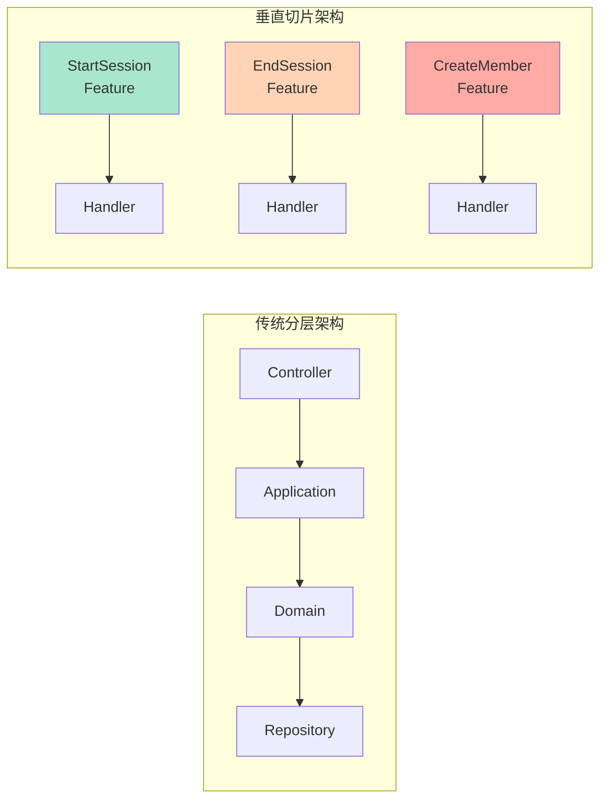
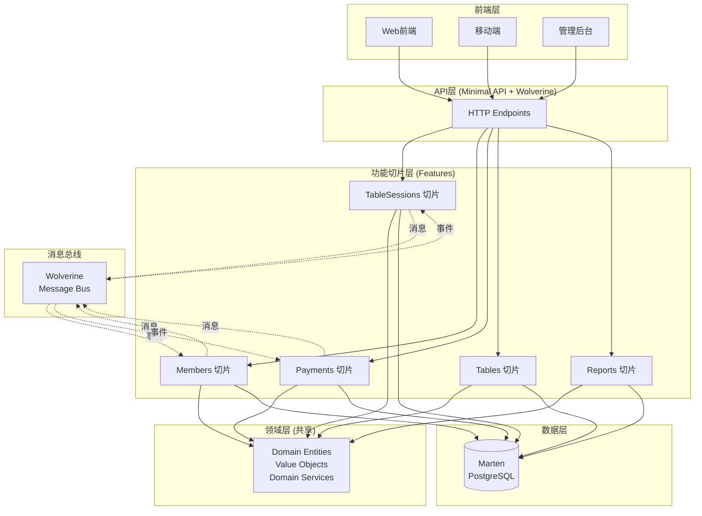
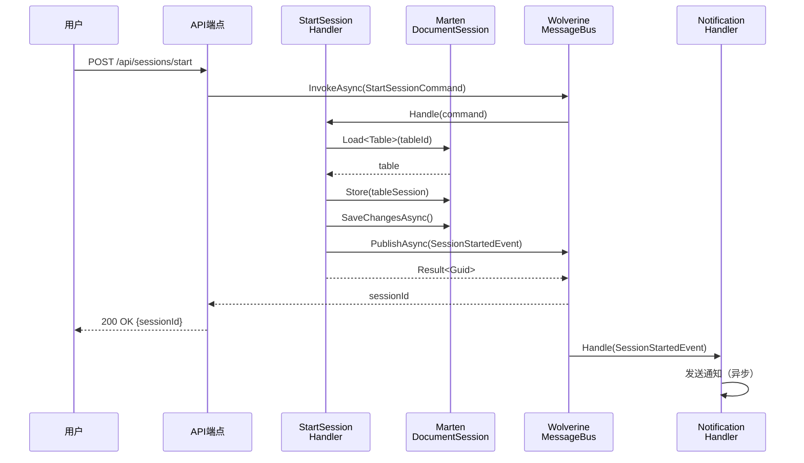
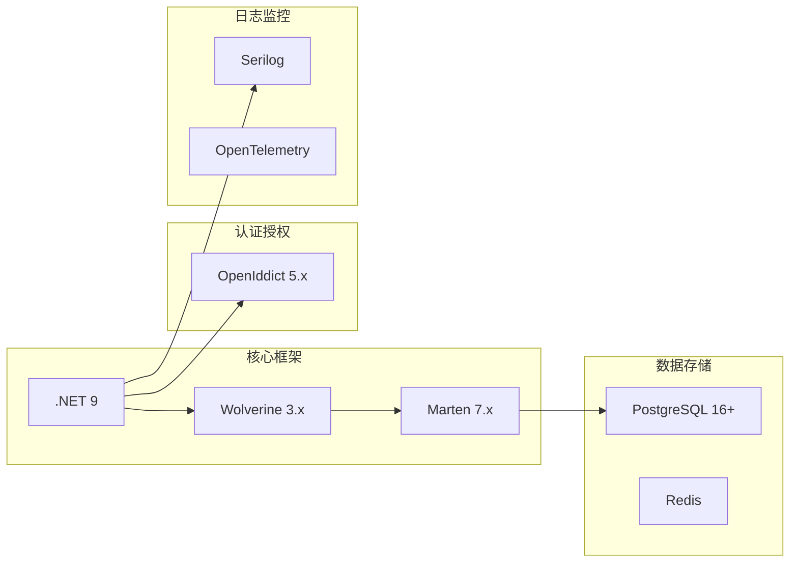

# 4. 模块设计

<!-- Breadcrumb Navigation -->
**导航路径**: [🏠 项目文档](../自助台球系统项目文档.md) > 📦 模块设计

<!-- Keywords for Search -->
**关键词**: `模块设计` `垂直切片架构` `业务功能` `Wolverine` `Marten`

---

> ⚠️ **架构迁移说明**
> 
> 本项目已从 ABP 分层架构迁移到 **Wolverine 垂直切片架构**。部分模块文档已完成重写。
> 
> **推荐阅读顺序**:
> 1. 先阅读 [Wolverine模块化架构蓝图](../03_系统架构设计/Wolverine模块化架构蓝图.md) ⭐⭐⭐ - 了解新架构
> 2. 参考 [系统模块划分](../03_系统架构设计/系统模块划分.md) ⭐⭐ - 了解 6 大模块边界
> 3. 再查阅本目录下的具体模块文档
> 
> **新架构核心变更**:
> - ❌ 不再使用：Application/Domain/Infrastructure 分层
> - ✅ 改用：Modules/{ModuleName}/{Feature}/ 垂直切片
> - ❌ 不再使用：IRepository 仓储模式
> - ✅ 改用：IDocumentSession (Marten) 直接访问
> - ❌ 不再使用：ApplicationService
> - ✅ 改用：Handler 即 Application Service
> 
> **历史文档**: 旧版本文档已移至 [legacy/](legacy/) 目录

---

## 📚 快速索引

| 模块 | 核心功能 | 技术重点 | 阅读建议 | 更新状态 |
|------|----------|----------|----------|---------|
| 🏃 [会员管理模块](会员管理模块.md) | 会员体系、积分管理 | 等级算法、权限控制 | 业务开发必读 | ✅ v3.0.0（完整重写）|
| 💰 [台球桌计费模块](台球桌计费模块.md) | 计费规则、套餐管理 | 计时算法、价格策略 | 核心业务模块 | ⚠️ v2.0.0（含旧架构内容）|
| 💳 [支付模块](支付模块.md) | 支付流程、退款管理 | 幂等性、事务处理 | 支付集成必读 | ⚠️ v2.0.0（含旧架构内容）|
| 🖥️ [设备管理模块](设备管理模块.md) | 设备控制、状态监控 | 物联网协议、实时通信 | 硬件对接必读 | ⚠️ v2.0.0（含旧架构内容）|
| 📊 [报表与统计模块](报表与统计模块.md) | 数据分析、报表生成 | 数据聚合、可视化 | 数据分析参考 | ⚠️ v2.0.0（含旧架构内容）|

**版本说明**:
- ✅ **v3.0.0**: 完全基于 Wolverine 架构重写，无旧架构内容
- ⚠️ **v2.0.0**: 顶部添加了架构迁移说明，但文档主体仍包含旧架构图和示例
- 📚 **v1.0.0**: 旧版本文档，已移至 [legacy/](legacy/) 目录

> 💡 **提示**: v3.0.0 文档完全基于 Wolverine 垂直切片架构，提供完整的代码示例和测试用例，可直接用于开发参考

---

## 🏗️ 垂直切片架构概览

### 架构理念

本项目采用**垂直切片架构**（Vertical Slice Architecture），以业务功能为中心组织代码，而非传统的技术分层。每个功能切片包含从 HTTP 端点到数据访问的完整实现路径。



**优势**:
- ✅ 功能内聚：一个功能的所有代码在一起
- ✅ 独立演化：功能之间松耦合
- ✅ 简化测试：每个切片可独立测试
- ✅ 并行开发：团队成员可以独立工作

详见：[垂直切片架构说明](../03_系统架构设计/垂直切片架构说明.md)

### 功能切片组织

```
src/Zss.BilliardHall/
  Features/                      # 所有功能切片
    TableSessions/               # 台球桌会话领域
      StartSession/              # 开台功能切片
        StartSessionCommand.cs
        StartSessionHandler.cs
        StartSessionValidator.cs
      EndSession/                # 关台功能切片
      PauseSession/              # 暂停功能切片
      ResumeSession/             # 恢复功能切片
    Members/                     # 会员领域
      RegisterMember/
      UpdateMemberProfile/
      TopUpBalance/
      GetMemberProfile/
    Payments/                    # 支付领域
      ProcessPayment/
      RefundPayment/
      ReconcilePayments/
    Tables/                      # 台球桌领域
      RegisterTable/
      UpdateTableStatus/
      GetTableAvailability/
    Reports/                     # 报表领域
      GenerateDailyReport/
      GetRevenueStatistics/
```

### 模块关系图



### 核心业务流程



---

## 📦 功能领域说明

### 4.1 TableSessions（台球桌会话领域）

**功能概述**: 管理台球桌的使用会话，包括开台、关台、暂停、恢复等核心业务逻辑。

**核心切片**:
- **StartSession**: 开始新会话
- **EndSession**: 结束会话并触发计费
- **PauseSession**: 暂停会话（暂停计费）
- **ResumeSession**: 恢复会话
- **GetActiveSession**: 查询活动会话

**技术要点**: 
- 使用 Marten 事件溯源记录会话历史
- 通过 Wolverine 消息总线通知其他领域
- 乐观并发控制防止状态冲突

**示例代码**:
```csharp
// Features/TableSessions/StartSession/StartSessionCommand.cs
public record StartSessionCommand(
    Guid TableId,
    Guid? MemberId,
    SessionType Type
);

// Features/TableSessions/StartSession/StartSessionHandler.cs
public class StartSessionHandler
{
    public async Task<Result<Guid>> Handle(
        StartSessionCommand command,
        IDocumentSession session,
        IMessageBus bus)
    {
        var table = await session.LoadAsync<Table>(command.TableId);
        if (table?.Status != TableStatus.Available)
            return Result.Fail<Guid>("台球桌不可用");

        var tableSession = TableSession.Start(
            command.TableId,
            command.MemberId,
            DateTime.UtcNow
        );
        
        session.Store(tableSession);
        await session.SaveChangesAsync();

        await bus.PublishAsync(new SessionStartedEvent(tableSession.Id));

        return Result.Ok(tableSession.Id);
    }
}
```

[➡️ 查看详细设计](台球桌计费模块.md)

### 4.2 Members（会员领域）

**功能概述**: 处理会员注册、登录、资料管理、余额充值等功能。

**核心切片**:
- **RegisterMember**: 注册新会员
- **UpdateMemberProfile**: 更新会员资料
- **TopUpBalance**: 余额充值
- **GetMemberProfile**: 查询会员信息
- **GetMemberTransactions**: 查询交易记录

**技术要点**:
- OpenIddict 身份认证
- 敏感信息加密存储
- 会员等级自动升级（后台任务）

**示例代码**:
```csharp
// Features/Members/RegisterMember/RegisterMemberCommand.cs
public record RegisterMemberCommand(
    string Name,
    string Phone,
    string Email,
    string Password
);

// Features/Members/RegisterMember/RegisterMemberHandler.cs
public class RegisterMemberHandler
{
    public async Task<Result<Guid>> Handle(
        RegisterMemberCommand command,
        IDocumentSession session,
        IPasswordHasher passwordHasher)
    {
        // 检查手机号是否已存在
        var existing = await session.Query<Member>()
            .FirstOrDefaultAsync(m => m.Phone == command.Phone);
        if (existing != null)
            return Result.Fail<Guid>("手机号已注册");

        var member = new Member
        {
            Id = Guid.NewGuid(),
            Name = command.Name,
            Phone = command.Phone,
            Email = command.Email,
            PasswordHash = passwordHasher.Hash(command.Password),
            Balance = 0,
            Level = MembershipLevel.Regular,
            CreatedAt = DateTime.UtcNow
        };

        session.Store(member);
        await session.SaveChangesAsync();

        return Result.Ok(member.Id);
    }
}
```

[➡️ 查看详细设计](会员管理模块.md)

### 4.3 Payments（支付领域）

**功能概述**: 集成支付网关，处理支付、退款、对账等功能。

**核心切片**:
- **ProcessPayment**: 处理支付请求
- **RefundPayment**: 处理退款
- **ReconcilePayments**: 对账
- **GetPaymentStatus**: 查询支付状态

**技术要点**: 
- 支付网关集成（微信、支付宝）
- 幂等性设计（OrderId 唯一）
- 持久化消息队列保证不丢失
- 自动重试机制

**示例代码**:
```csharp
// Features/Payments/ProcessPayment/ProcessPaymentCommand.cs
public record ProcessPaymentCommand(
    Guid OrderId,
    Guid MemberId,
    decimal Amount,
    PaymentMethod Method
);

// Features/Payments/ProcessPayment/ProcessPaymentHandler.cs
public class ProcessPaymentHandler
{
    public async Task<PaymentResult> Handle(
        ProcessPaymentCommand command,
        IDocumentSession session,
        IPaymentGateway gateway,
        ILogger<ProcessPaymentHandler> logger)
    {
        // 幂等性检查
        var existing = await session.Query<Payment>()
            .FirstOrDefaultAsync(p => p.OrderId == command.OrderId);
        if (existing != null)
            return PaymentResult.AlreadyProcessed(existing.Id);

        logger.LogInformation(
            "开始处理支付: {OrderId}, 金额: {Amount:F2}",
            command.OrderId, command.Amount);

        try
        {
            // 调用支付网关
            var gatewayResult = await gateway.ChargeAsync(
                command.OrderId,
                command.Amount,
                command.Method
            );

            var payment = new Payment
            {
                Id = Guid.NewGuid(),
                OrderId = command.OrderId,
                MemberId = command.MemberId,
                Amount = command.Amount,
                Method = command.Method,
                Status = PaymentStatus.Success,
                TransactionId = gatewayResult.TransactionId,
                CreatedAt = DateTime.UtcNow
            };

            session.Store(payment);
            await session.SaveChangesAsync();

            logger.LogInformation(
                "支付成功: {OrderId}, 交易ID: {TransactionId}",
                command.OrderId, gatewayResult.TransactionId);

            return PaymentResult.Success(payment.Id);
        }
        catch (PaymentGatewayException ex)
        {
            logger.LogError(ex, "支付失败: {OrderId}", command.OrderId);
            
            // Wolverine 会根据策略自动重试
            throw;
        }
    }
}
```

[➡️ 查看详细设计](支付模块.md)

### 4.4 Tables（台球桌领域）

**功能概述**: 管理台球桌信息、状态、可用性查询等。

**核心切片**:
- **RegisterTable**: 注册新台球桌
- **UpdateTableStatus**: 更新台球桌状态
- **GetTableAvailability**: 查询可用台球桌
- **GetTableDetails**: 查询台球桌详情

**技术要点**:
- 台球桌状态机
- 实时状态查询（缓存优化）
- 设备控制集成

### 4.5 Reports（报表领域）

**功能概述**: 生成各类业务报表和统计数据。

**核心切片**:
- **GenerateDailyReport**: 生成日报
- **GetRevenueStatistics**: 收入统计
- **GetMemberStatistics**: 会员统计
- **GetTableUsageStatistics**: 台球桌使用率统计

**技术要点**: 
- 定时任务（Wolverine Scheduled Jobs）
- 数据聚合查询（Marten SQL 查询）
- 报表缓存

[➡️ 查看详细设计](报表与统计模块.md)

---

## 🔧 技术架构要点

### 垂直切片架构原则

1. **功能内聚**: 每个切片包含实现该功能的所有代码
2. **独立演化**: 切片间通过消息通信，最小化耦合
3. **接受重复**: 优先考虑独立性而非代码复用
4. **薄处理器**: Handler 是薄的编排层，复杂逻辑在领域层

详见：[设计原则](../03_系统架构设计/设计原则.md)

### 技术栈选择



**核心组件**:
- **Wolverine**: 命令/查询处理、消息总线、后台任务
- **Marten**: 文档数据库、事件溯源
- **PostgreSQL**: 主数据库（JSONB 文档存储）
- **OpenIddict**: OIDC 认证授权
- **Serilog**: 结构化日志

详见：[技术选型](../03_系统架构设计/技术选型.md)

### 切片间通信模式

**1. 命令调用（同步）**:
```csharp
// 发送命令并等待结果
var result = await bus.InvokeAsync<Result<Guid>>(
    new CreateMemberCommand("张三", "138...")
);
```

**2. 事件发布（异步）**:
```csharp
// 发布事件，不等待
await bus.PublishAsync(new SessionStartedEvent(sessionId));

// 多个处理器可以订阅同一事件
public class AuditLogHandler
{
    public Task Handle(SessionStartedEvent evt) { /* 记录审计日志 */ }
}

public class NotificationHandler
{
    public Task Handle(SessionStartedEvent evt) { /* 发送通知 */ }
}
```

**3. 共享领域服务**:
```csharp
// 对于真正共享的领域逻辑
public interface IPricingService
{
    decimal CalculatePrice(TableSession session, TableType type);
}

// 在多个处理器中注入使用
public class CalculateBillingHandler
{
    public async Task<decimal> Handle(
        CalculateBillingCommand cmd,
        IPricingService pricingService)
    {
        return pricingService.CalculatePrice(session, tableType);
    }
}
```

---

## 📋 开发规范

### 切片开发标准

1. **切片命名**: 动词 + 名词（如 CreateMember、StartSession）
2. **文件组织**: 每个切片一个文件夹，包含 Command/Handler/Validator
3. **处理器约定**: 方法名必须是 `Handle` 或 `HandleAsync`
4. **测试覆盖**: 每个切片至少一个集成测试

**目录结构示例**:
```
Features/
  Members/
    CreateMember/
      CreateMemberCommand.cs       # 命令定义
      CreateMemberHandler.cs       # 处理器实现
      CreateMemberValidator.cs     # 验证规则
      CreateMemberTests.cs         # 测试（可选）
```

### 代码规范

```csharp
// ✅ 好的实践
public record CreateMemberCommand(string Name, string Phone, string Email);

public class CreateMemberHandler
{
    public async Task<Result<Guid>> Handle(
        CreateMemberCommand command,
        IDocumentSession session,
        ILogger<CreateMemberHandler> logger,
        CancellationToken ct)
    {
        // 1. 验证业务规则
        // 2. 执行业务逻辑
        // 3. 持久化数据
        // 4. 发布事件（如需要）
        // 5. 返回结果
    }
}

// ❌ 避免
public class CreateMemberHandler
{
    private readonly IRepository<Member> _repository;  // ❌ 不使用仓储模式
    
    public CreateMemberHandler(IRepository<Member> repository)
    {
        _repository = repository;
    }
}
```

### 质量保障

- ✅ 每个切片独立可测试
- ✅ 关键切片包含单元测试和集成测试
- ✅ 使用 FluentValidation 进行输入验证
- ✅ 结构化日志记录关键操作
- ✅ 代码审查确保符合架构原则

---

## 🔗 相关文档

### 核心架构文档（必读）⭐⭐⭐

- **[Wolverine模块化架构蓝图](../03_系统架构设计/Wolverine模块化架构蓝图.md)** - 完整的可落地实施指南
- **[Wolverine快速上手指南](../03_系统架构设计/Wolverine快速上手指南.md)** - 15分钟快速入门
- **[系统模块划分](../03_系统架构设计/系统模块划分.md)** - 6大模块边界与通信规则
- **[垂直切片架构说明](../03_系统架构设计/垂直切片架构说明.md)** - 架构理念与实践

### 技术框架文档

- **[Wolverine框架介绍](../03_系统架构设计/Wolverine框架介绍.md)** - 核心特性与使用
- **[Marten数据访问](../03_系统架构设计/Marten数据访问.md)** - 文档数据库使用

### 其他相关文档

- **上级文档**: [系统架构设计](../03_系统架构设计/README.md)
- **关联文档**: [数据库设计](../05_数据库设计/README.md)
- **下级文档**: [API文档](../07_API文档/README.md)
- **返回**: [项目文档首页](../自助台球系统项目文档.md)

---

## 📞 联系方式

**文档维护**: 开发团队  
**技术咨询**: architecture@billiard-system.com  
**更新频率**: 每月更新  

---

*最后更新: 2024-01-15 | 版本: v2.0.0 | 架构迁移: ✅ Members 模块已完整重写 (v3.0.0)，其他模块保留旧架构内容*