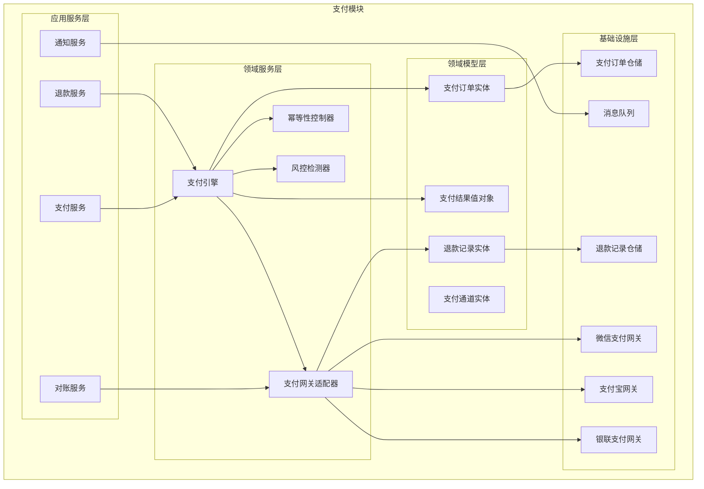
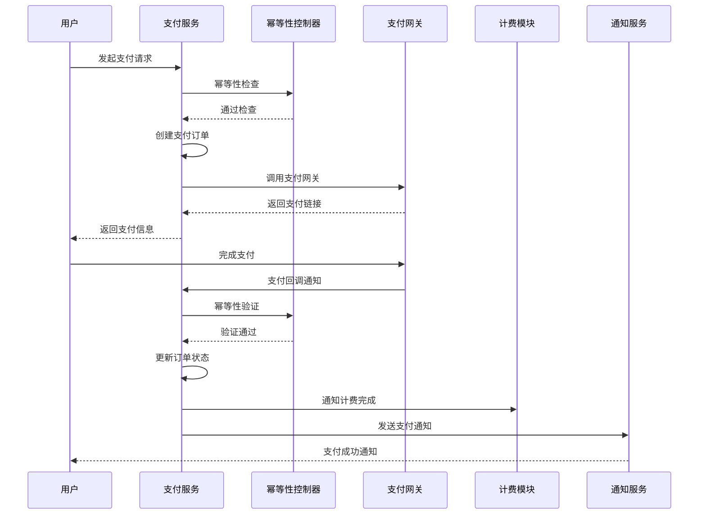
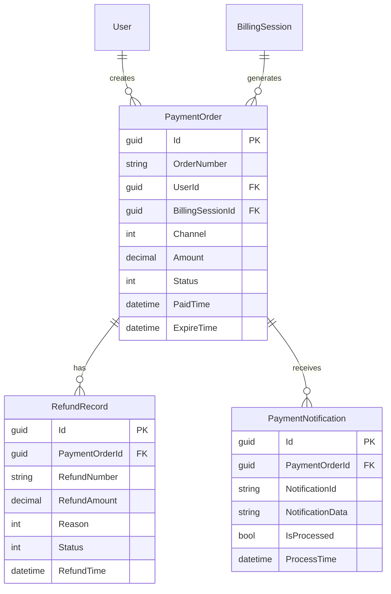
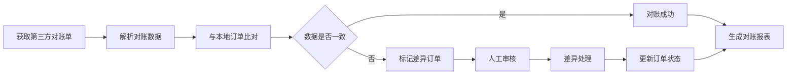

# 4.3 支付模块（Payments）

<!-- Breadcrumb Navigation -->
**导航路径**: [🏠 项目文档](../自助台球系统项目文档.md) > [📦 模块设计](README.md) > 💳 支付模块

<!-- Keywords for Search -->
**关键词**: `支付模块` `支付网关` `幂等性` `退款管理` `Wolverine` `垂直切片`

---

> ## ⚠️ 架构实现说明
> 
> 本文档描述支付模块的**业务需求和功能说明**。
> 
> **架构实现已迁移至 Wolverine + 垂直切片架构**。下文中的架构图和代码示例使用旧的 ABP 分层架构术语作为业务理解参考。
> 
> ### 📚 实际架构实现请参考：
> 
> 1. **[Wolverine模块化架构蓝图](../03_系统架构设计/Wolverine模块化架构蓝图.md)** ⭐⭐⭐
>    - 查看 Payments 模块的完整垂直切片实现方式
> 
> 2. **[系统模块划分 - Payments 模块](../03_系统架构设计/系统模块划分.md#6-payments-模块支付对账)** ⭐⭐
>    - Payments 模块的功能切片、领域模型、幂等性设计
> 
> 3. **[Wolverine快速上手指南 - 3.4节 Result 模式](../03_系统架构设计/Wolverine快速上手指南.md#34-场景-4使用-result-模式处理错误)** ⭐⭐
>    - 支付错误处理最佳实践
> 
> ### 📁 新架构目录结构：
> 
> ```
> src/Modules/Payments/
> ├── ProcessPayment/
> │   ├── ProcessPayment.cs
> │   ├── ProcessPaymentHandler.cs
> │   ├── ProcessPaymentEndpoint.cs
> │   └── ProcessPaymentValidator.cs
> ├── RefundPayment/
> │   ├── RefundPayment.cs
> │   └── RefundPaymentHandler.cs
> ├── ReconcilePayments/
> ├── GetPayment/
> ├── Events/
> │   ├── PaymentCompleted.cs
> │   ├── PaymentFailed.cs
> │   └── PaymentRefunded.cs
> └── Payment.cs                    # 聚合根
> ```
> 
> ### 🔄 架构变更要点：
> 
> | 旧架构（本文档） | 新架构（Wolverine） | 说明 |
> |----------------|-------------------|------|
> | 支付服务 (PaymentAppService) | ProcessPaymentHandler | 按功能切片 |
> | 支付网关适配器 | IPaymentGateway（注入 Handler） | 依赖注入简化 |
> | 幂等性控制 | Handler 内检查 OrderId | 业务逻辑内聚 |
> | 仓储 (Repository) | IDocumentSession (Marten) | 直接使用 Marten |
> | 重试策略 | Wolverine 策略配置 | 框架级支持 |

---

## 📋 模块概述

支付模块是自助台球系统的关键财务模块，负责集成多种支付方式、确保支付安全、处理退款申请、实现幂等性控制等功能。该模块为用户提供便捷、安全的支付体验，为业务提供可靠的资金结算保障。

### 核心职责

- 💰 **多渠道支付**: 支持微信支付、支付宝、银联等主流支付方式
- 🔒 **支付安全**: 支付数据加密、防重放攻击、风控检测
- 🔄 **幂等性控制**: 防重复支付、订单状态一致性保障
- 💸 **退款管理**: 自动/手动退款、退款状态跟踪
- 📊 **对账结算**: 支付数据对账、财务结算报表

---

## 🏗️ 架构设计

### 模块架构图



### 支付业务流程



---

## 📊 数据模型设计

### 核心实体

#### 支付订单实体 (PaymentOrder)

```csharp
public class PaymentOrder : AuditedAggregateRoot<Guid>
{
    public string OrderNumber { get; set; }
    public Guid UserId { get; set; }
    public Guid? BillingSessionId { get; set; }
    public PaymentChannel Channel { get; set; }
    public decimal Amount { get; set; }
    public string Currency { get; set; }
    public PaymentStatus Status { get; set; }
    public string Subject { get; set; }
    public string Description { get; set; }
    public string ExternalOrderId { get; set; }
    public string ExternalTransactionId { get; set; }
    public DateTime? PaidTime { get; set; }
    public DateTime ExpireTime { get; set; }
    public string NotifyUrl { get; set; }
    public string ReturnUrl { get; set; }
    public string ClientIp { get; set; }
    public string RiskInfo { get; set; }
    
    // 导航属性
    public User User { get; set; }
    public BillingSession BillingSession { get; set; }
    public ICollection<PaymentNotification> Notifications { get; set; }
    public ICollection<RefundRecord> RefundRecords { get; set; }
}

public enum PaymentChannel
{
    WeChat = 1,      // 微信支付
    Alipay = 2,      // 支付宝
    UnionPay = 3,    // 银联支付
    Balance = 4      // 余额支付
}

public enum PaymentStatus
{
    Pending = 1,     // 待支付
    Processing = 2,  // 处理中
    Paid = 3,        // 已支付
    Failed = 4,      // 支付失败
    Cancelled = 5,   // 已取消
    Refunded = 6,    // 已退款
    PartialRefund = 7 // 部分退款
}
```

#### 退款记录实体 (RefundRecord)

```csharp
public class RefundRecord : AuditedAggregateRoot<Guid>
{
    public Guid PaymentOrderId { get; set; }
    public string RefundNumber { get; set; }
    public decimal RefundAmount { get; set; }
    public RefundReason Reason { get; set; }
    public string ReasonDescription { get; set; }
    public RefundStatus Status { get; set; }
    public RefundType Type { get; set; }
    public string ExternalRefundId { get; set; }
    public DateTime? RefundTime { get; set; }
    public string ApprovalUser { get; set; }
    public DateTime? ApprovalTime { get; set; }
    public string ApprovalNotes { get; set; }
    
    // 导航属性
    public PaymentOrder PaymentOrder { get; set; }
    public ICollection<RefundNotification> Notifications { get; set; }
}

public enum RefundReason
{
    UserRequest = 1,     // 用户申请
    DeviceFailure = 2,   // 设备故障
    SystemError = 3,     // 系统错误
    ServiceIssue = 4     // 服务问题
}

public enum RefundStatus
{
    Pending = 1,     // 待处理
    Processing = 2,  // 处理中
    Completed = 3,   // 已完成
    Failed = 4,      // 退款失败
    Cancelled = 5    // 已取消
}

public enum RefundType
{
    Automatic = 1,   // 自动退款
    Manual = 2       // 手动退款
}
```

#### 支付通知实体 (PaymentNotification)

```csharp
public class PaymentNotification : CreationAuditedEntity<Guid>
{
    public Guid PaymentOrderId { get; set; }
    public PaymentChannel Channel { get; set; }
    public string NotificationId { get; set; }
    public string NotificationData { get; set; }
    public string Signature { get; set; }
    public bool IsVerified { get; set; }
    public bool IsProcessed { get; set; }
    public string ProcessResult { get; set; }
    public DateTime? ProcessTime { get; set; }
    public int RetryCount { get; set; }
    
    // 导航属性
    public PaymentOrder PaymentOrder { get; set; }
}
```

### 实体关系图



---

## 🔧 接口设计

### 支付管理接口

```csharp
public interface IPaymentAppService : IApplicationService
{
    Task<PaymentOrderDto> CreatePaymentOrderAsync(CreatePaymentOrderDto input);
    Task<PaymentResultDto> ProcessPaymentAsync(ProcessPaymentDto input);
    Task<PaymentOrderDto> GetPaymentOrderAsync(Guid orderId);
    Task<PaymentOrderDto> GetPaymentOrderByNumberAsync(string orderNumber);
    Task<string> HandlePaymentNotificationAsync(PaymentChannel channel, string notificationData);
    Task<List<PaymentOrderDto>> GetUserPaymentHistoryAsync(GetPaymentHistoryDto input);
}
```

### 退款管理接口

```csharp
public interface IRefundAppService : IApplicationService
{
    Task<RefundRecordDto> CreateRefundAsync(CreateRefundDto input);
    Task<RefundRecordDto> ProcessRefundAsync(ProcessRefundDto input);
    Task<RefundRecordDto> GetRefundRecordAsync(Guid refundId);
    Task<List<RefundRecordDto>> GetRefundHistoryAsync(GetRefundHistoryDto input);
    Task ApproveRefundAsync(Guid refundId, ApproveRefundDto input);
    Task RejectRefundAsync(Guid refundId, RejectRefundDto input);
}
```

### 支付网关接口

```csharp
public interface IPaymentGateway
{
    PaymentChannel Channel { get; }
    Task<PaymentResponseDto> CreatePaymentAsync(PaymentRequestDto request);
    Task<PaymentStatusDto> QueryPaymentStatusAsync(string externalOrderId);
    Task<RefundResponseDto> CreateRefundAsync(RefundRequestDto request);
    Task<RefundStatusDto> QueryRefundStatusAsync(string externalRefundId);
    bool VerifyNotification(string notificationData, string signature);
    PaymentNotificationDto ParseNotification(string notificationData);
}
```

---

## 🔒 支付安全设计

### 幂等性控制

```csharp
public class PaymentIdempotencyService
{
    private readonly IDistributedCache _cache;
    
    public async Task<bool> CheckIdempotencyAsync(string idempotencyKey, TimeSpan expiration)
    {
        var cacheKey = $"payment_idempotency:{idempotencyKey}";
        var existingValue = await _cache.GetStringAsync(cacheKey);
        
        if (existingValue != null)
        {
            return false; // 已存在，不允许重复执行
        }
        
        await _cache.SetStringAsync(cacheKey, DateTime.UtcNow.ToString(), 
            new DistributedCacheEntryOptions { AbsoluteExpirationRelativeToNow = expiration });
        
        return true; // 允许执行
    }
}
```

### 签名验证

```csharp
public class PaymentSignatureVerifier
{
    public bool VerifyWeChatSignature(string data, string signature, string key)
    {
        var computedSignature = ComputeHmacSha256(data, key);
        return string.Equals(signature, computedSignature, StringComparison.OrdinalIgnoreCase);
    }
    
    public bool VerifyAlipaySignature(string data, string signature, string publicKey)
    {
        using var rsa = RSA.Create();
        rsa.ImportFromPem(publicKey);
        
        var dataBytes = Encoding.UTF8.GetBytes(data);
        var signatureBytes = Convert.FromBase64String(signature);
        
        return rsa.VerifyData(dataBytes, signatureBytes, HashAlgorithmName.SHA256, RSASignaturePadding.Pkcs1);
    }
}
```

### 风控检测

```csharp
public class PaymentRiskDetector
{
    public async Task<RiskAssessmentResult> AssessPaymentRiskAsync(PaymentOrder order)
    {
        var riskScore = 0;
        var riskFactors = new List<string>();
        
        // 检查用户支付频率
        if (await IsHighFrequencyUserAsync(order.UserId))
        {
            riskScore += 20;
            riskFactors.Add("高频支付用户");
        }
        
        // 检查支付金额异常
        if (await IsAbnormalAmountAsync(order.UserId, order.Amount))
        {
            riskScore += 30;
            riskFactors.Add("异常支付金额");
        }
        
        // 检查IP地址风险
        if (await IsRiskyIpAsync(order.ClientIp))
        {
            riskScore += 40;
            riskFactors.Add("风险IP地址");
        }
        
        return new RiskAssessmentResult
        {
            RiskScore = riskScore,
            RiskLevel = GetRiskLevel(riskScore),
            RiskFactors = riskFactors
        };
    }
}
```

---

## 📋 业务规则

### 支付规则

| 支付方式 | 最小金额 | 最大金额 | 手续费 | 到账时间 |
|----------|----------|----------|---------|----------|
| 微信支付 | 0.01元 | 5000元 | 0.6% | 实时 |
| 支付宝 | 0.01元 | 5000元 | 0.55% | 实时 |
| 银联支付 | 1元 | 10000元 | 0.5% | T+1 |
| 余额支付 | 0.01元 | 账户余额 | 免费 | 实时 |

### 退款规则

**自动退款条件**:
- 🔧 设备故障导致无法正常使用
- ⚠️ 系统错误导致重复扣费
- 🕐 服务未开始前的取消申请
- 💰 充值后立即申请退款（7天内）

**退款处理时间**:
- 💳 微信支付：1-3个工作日
- 💳 支付宝：1-7个工作日  
- 💳 银联支付：3-15个工作日
- 💰 余额退款：实时到账

---

## ⚡ 性能优化

### 异步处理

```csharp
public class PaymentEventHandler : IEventHandler<PaymentCompletedEvent>
{
    public async Task HandleEventAsync(PaymentCompletedEvent eventData)
    {
        // 异步处理支付完成后的业务逻辑
        await Task.Run(async () =>
        {
            // 更新用户积分
            await _memberService.AddPointsAsync(eventData.UserId, eventData.Points);
            
            // 发送支付成功通知
            await _notificationService.SendPaymentSuccessNotificationAsync(eventData.OrderId);
            
            // 更新财务统计
            await _statisticsService.UpdatePaymentStatisticsAsync(eventData);
        });
    }
}
```

### 缓存策略

```csharp
// 支付订单缓存（30分钟）
[CachePut(CacheNames.PaymentOrder, "{orderId}", Duration = 1800)]
public async Task<PaymentOrder> GetPaymentOrderAsync(Guid orderId)

// 支付网关配置缓存（1小时）
[CachePut(CacheNames.PaymentGatewayConfig, Duration = 3600)]
public async Task<List<PaymentGatewayConfig>> GetGatewayConfigsAsync()
```

---

## 📊 监控与对账

### 监控指标

```csharp
public class PaymentMetrics
{
    // 支付成功率
    public decimal PaymentSuccessRate { get; set; }
    
    // 平均支付时间
    public TimeSpan AveragePaymentTime { get; set; }
    
    // 支付金额统计
    public PaymentAmountStatistics AmountStatistics { get; set; }
    
    // 渠道分布
    public Dictionary<PaymentChannel, int> ChannelDistribution { get; set; }
    
    // 异常订单数量
    public int ExceptionOrderCount { get; set; }
}
```

### 对账流程



---

## 🔗 相关文档

- **上级文档**: [模块设计总览](README.md)
- **关联文档**: [台球桌计费模块](台球桌计费模块.md) | [会员管理模块](会员管理模块.md)
- **技术文档**: [支付网关集成](../07_API文档/支付接口.md)
- **返回**: [项目文档首页](../自助台球系统项目文档.md)

---

*最后更新: 2024-01-15 | 版本: v1.0.0*
