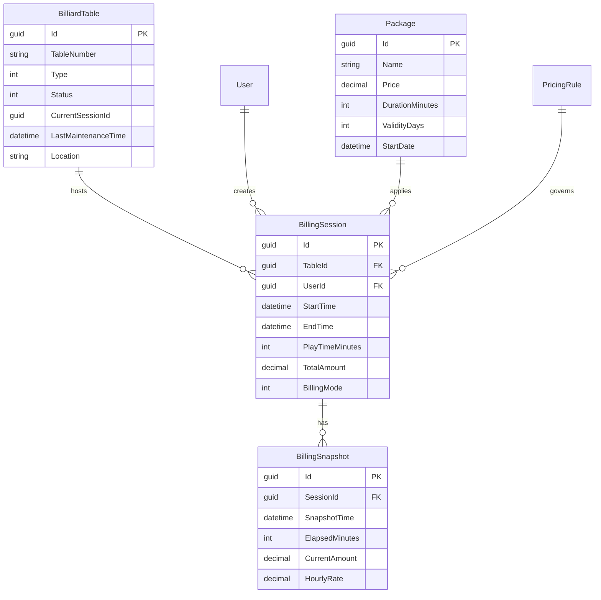

# 4.2 台球桌计费模块

<!-- Breadcrumb Navigation -->
**导航路径**: [🏠 项目文档](../自助台球系统项目文档.md) > [📦 模块设计](README.md) > 💰 台球桌计费模块

<!-- Keywords for Search -->
**关键词**: `计费模块` `台球桌管理` `计时算法` `价格策略`

---

## 📋 模块概述

台球桌计费模块是自助台球系统的核心业务模块，负责台球桌的计费规则管理、实时计时计费、套餐价格体系、异常处理等功能。该模块确保计费的准确性和公平性，支持多种计费模式和灵活的价格策略。

### 核心职责

- ⏰ **精准计时**: 毫秒级计时精度，确保计费准确性
- 💰 **计费算法**: 支持按时长、按局数等多种计费模式
- 📦 **套餐管理**: 包时套餐、会员套餐、活动套餐
- 🎯 **价格策略**: 分时段定价、节假日定价、会员折扣
- ⚠️ **异常处理**: 设备故障、网络断线等异常场景处理

---

## 🏗️ 架构设计

### 模块架构图

```mermaid
graph TB
    subgraph "计费模块"
        subgraph "应用服务层"
            AS1[计费服务]
            AS2[台球桌服务]
            AS3[套餐服务]
            AS4[定价服务]
        end
        
        subgraph "领域服务层"
            DS1[计费引擎]
            DS2[价格计算器]
            DS3[时间管理器]
            DS4[套餐处理器]
        end
        
        subgraph "领域模型层"
            E1[台球桌实体]
            E2[计费会话实体]
            E3[套餐实体]
            E4[价格规则实体]
            VO1[计费快照值对象]
        end
        
        subgraph "基础设施层"
            R1[台球桌仓储]
            R2[计费会话仓储]
            R3[套餐仓储]
            T1[定时任务]
            C1[缓存服务]
        end
    end
    
    AS1 --> DS1
    AS2 --> DS2
    AS3 --> DS4
    AS4 --> DS2
    
    DS1 --> E2
    DS1 --> VO1
    DS2 --> E4
    DS3 --> E2
    DS4 --> E3
    
    E1 --> R1
    E2 --> R2
    E3 --> R3
    E4 --> R3
    
    R1 --> C1
    R2 --> C1
    T1 --> DS1
```



### 计费业务流程

```mermaid
sequenceDiagram
    participant U as 用户
    participant T as 台球桌服务
    participant B as 计费引擎
    participant P as 价格计算器
    participant D as 设备管理
    participant S as 支付模块
    
    U->>T: 请求开台
    T->>B: 创建计费会话
    B->>P: 获取当前价格
    P-->>B: 返回价格规则
    B->>D: 发送开台指令
    D-->>B: 确认设备状态
    B-->>T: 返回会话信息
    T-->>U: 开台成功
    
    loop 计费循环
        B->>B: 更新计费时长
        B->>P: 计算当前费用
        P-->>B: 返回费用金额
        B->>B: 保存计费快照
    end
    
    U->>T: 请求结台
    T->>B: 结束计费会话
    B->>P: 计算最终费用
    P-->>B: 返回最终金额
    B->>S: 发起支付请求
    B->>D: 发送关台指令
    D-->>B: 确认设备关闭
    B-->>T: 返回结台信息
    T-->>U: 结台成功
```



---

## 📊 数据模型设计

### 核心实体

#### 台球桌实体 (BilliardTable)

```csharp
public class BilliardTable : AuditedAggregateRoot<Guid>
{
    public string TableNumber { get; set; }
    public TableType Type { get; set; }
    public TableStatus Status { get; set; }
    public Guid? CurrentSessionId { get; set; }
    public DateTime? LastMaintenanceTime { get; set; }
    public string Location { get; set; }
    public string Description { get; set; }
    public bool IsActive { get; set; }
    
    // 导航属性
    public ICollection<BillingSession> BillingSessions { get; set; }
    public ICollection<TableMaintenance> MaintenanceRecords { get; set; }
}

public enum TableType
{
    Standard = 1,     // 标准台
    Professional = 2, // 专业台
    VIP = 3          // VIP台
}

public enum TableStatus
{
    Available = 1,    // 可用
    InUse = 2,       // 使用中
    Maintenance = 3,  // 维护中
    OutOfService = 4  // 停用
}
```

#### 计费会话实体 (BillingSession)

```csharp
public class BillingSession : AuditedAggregateRoot<Guid>
{
    public Guid TableId { get; set; }
    public Guid UserId { get; set; }
    public string SessionToken { get; set; }
    public SessionStatus Status { get; set; }
    public DateTime StartTime { get; set; }
    public DateTime? EndTime { get; set; }
    public int PlayTimeMinutes { get; set; }
    public decimal HourlyRate { get; set; }
    public decimal TotalAmount { get; set; }
    public decimal DiscountAmount { get; set; }
    public decimal FinalAmount { get; set; }
    public BillingMode BillingMode { get; set; }
    public Guid? PackageId { get; set; }
    
    // 导航属性
    public BilliardTable Table { get; set; }
    public User User { get; set; }
    public Package Package { get; set; }
    public ICollection<BillingSnapshot> Snapshots { get; set; }
}

public enum SessionStatus
{
    Active = 1,      // 进行中
    Paused = 2,      // 暂停
    Completed = 3,   // 已完成
    Cancelled = 4,   // 已取消
    Exception = 5    // 异常
}

public enum BillingMode
{
    Hourly = 1,      // 按小时计费
    Package = 2,     // 套餐计费
    Membership = 3   // 会员计费
}
```

#### 计费快照实体 (BillingSnapshot)

```csharp
public class BillingSnapshot : CreationAuditedEntity<Guid>
{
    public Guid SessionId { get; set; }
    public DateTime SnapshotTime { get; set; }
    public int ElapsedMinutes { get; set; }
    public decimal CurrentAmount { get; set; }
    public decimal HourlyRate { get; set; }
    public string PricingRuleSnapshot { get; set; }
    public SnapshotType Type { get; set; }
    
    // 导航属性
    public BillingSession Session { get; set; }
}

public enum SnapshotType
{
    Regular = 1,     // 定时快照
    RateChange = 2,  // 费率变更
    Pause = 3,       // 暂停
    Resume = 4,      // 恢复
    Manual = 5       // 手动快照
}
```

#### 套餐实体 (Package)

```csharp
public class Package : AuditedAggregateRoot<Guid>
{
    public string Name { get; set; }
    public string Description { get; set; }
    public PackageType Type { get; set; }
    public decimal Price { get; set; }
    public int DurationMinutes { get; set; }
    public int ValidityDays { get; set; }
    public MemberLevel? RequiredMemberLevel { get; set; }
    public DateTime? StartDate { get; set; }
    public DateTime? EndDate { get; set; }
    public bool IsActive { get; set; }
    public int SortOrder { get; set; }
    
    // 导航属性
    public ICollection<PackageTableType> ApplicableTableTypes { get; set; }
    public ICollection<BillingSession> Sessions { get; set; }
}

public enum PackageType
{
    TimeBased = 1,   // 计时套餐
    Unlimited = 2,   // 不限时套餐
    Membership = 3   // 会员套餐
}
```

### 实体关系图



---

## 🔧 接口设计

### 台球桌管理接口

```csharp
public interface IBilliardTableAppService : IApplicationService
{
    Task<PagedResultDto<BilliardTableDto>> GetTablesAsync(GetTablesDto input);
    Task<BilliardTableDto> GetTableAsync(Guid tableId);
    Task<BilliardTableDto> CreateTableAsync(CreateTableDto input);
    Task<BilliardTableDto> UpdateTableAsync(Guid tableId, UpdateTableDto input);
    Task<TableStatusDto> GetTableStatusAsync(Guid tableId);
    Task SetTableMaintenanceAsync(Guid tableId, bool maintenance);
}
```

### 计费管理接口

```csharp
public interface IBillingAppService : IApplicationService
{
    Task<BillingSessionDto> StartBillingAsync(StartBillingDto input);
    Task<BillingSessionDto> EndBillingAsync(EndBillingDto input);
    Task<BillingSessionDto> PauseBillingAsync(Guid sessionId);
    Task<BillingSessionDto> ResumeBillingAsync(Guid sessionId);
    Task<CurrentBillingDto> GetCurrentBillingAsync(Guid sessionId);
    Task<List<BillingSnapshotDto>> GetBillingHistoryAsync(Guid sessionId);
    Task<BillingStatisticsDto> GetBillingStatisticsAsync(GetStatisticsDto input);
}
```

### 套餐管理接口

```csharp
public interface IPackageAppService : IApplicationService
{
    Task<List<PackageDto>> GetAvailablePackagesAsync(GetPackagesDto input);
    Task<PackageDto> GetPackageAsync(Guid packageId);
    Task<PackageDto> CreatePackageAsync(CreatePackageDto input);
    Task<PackageDto> UpdatePackageAsync(Guid packageId, UpdatePackageDto input);
    Task DeletePackageAsync(Guid packageId);
    Task<bool> ValidatePackageAsync(Guid packageId, Guid tableId);
}
```

---

## ⚙️ 计费算法

### 基础计费算法

```csharp
public class BillingCalculator
{
    public decimal CalculateAmount(BillingSession session, DateTime currentTime)
    {
        var elapsedTime = currentTime - session.StartTime;
        var totalMinutes = (int)Math.Ceiling(elapsedTime.TotalMinutes);
        
        switch (session.BillingMode)
        {
            case BillingMode.Hourly:
                return CalculateHourlyAmount(totalMinutes, session.HourlyRate);
            
            case BillingMode.Package:
                return CalculatePackageAmount(session.PackageId, totalMinutes);
            
            case BillingMode.Membership:
                return CalculateMembershipAmount(session.UserId, totalMinutes);
            
            default:
                throw new BusinessException("不支持的计费模式");
        }
    }
    
    private decimal CalculateHourlyAmount(int minutes, decimal hourlyRate)
    {
        // 不足一小时按一小时计算
        var hours = Math.Ceiling(minutes / 60.0);
        return (decimal)hours * hourlyRate;
    }
}
```

### 分时段定价

```csharp
public class TimeBasedPricingRule
{
    public List<PricingPeriod> PricingPeriods { get; set; }
    
    public decimal GetHourlyRate(DateTime dateTime, TableType tableType)
    {
        var currentTime = dateTime.TimeOfDay;
        var dayOfWeek = dateTime.DayOfWeek;
        
        var period = PricingPeriods
            .FirstOrDefault(p => p.IsApplicable(currentTime, dayOfWeek, tableType));
            
        return period?.HourlyRate ?? GetDefaultRate(tableType);
    }
}

public class PricingPeriod
{
    public TimeSpan StartTime { get; set; }
    public TimeSpan EndTime { get; set; }
    public DayOfWeek[] ApplicableDays { get; set; }
    public TableType[] ApplicableTableTypes { get; set; }
    public decimal HourlyRate { get; set; }
    public bool IsHoliday { get; set; }
}
```

---

## 📋 业务规则

### 计费规则

| 台球桌类型 | 平日价格 | 周末价格 | 会员折扣 |
|------------|----------|----------|----------|
| 标准台 | 30元/小时 | 40元/小时 | 9折 |
| 专业台 | 50元/小时 | 60元/小时 | 85折 |
| VIP台 | 80元/小时 | 100元/小时 | 8折 |

### 时段规则

- 🌅 **早间时段** (09:00-12:00): 8折优惠
- 🌞 **午间时段** (12:00-18:00): 标准价格
- 🌙 **晚间时段** (18:00-22:00): 标准价格  
- 🌃 **深夜时段** (22:00-24:00): 1.2倍价格

### 套餐规则

**时长套餐**:
- 📦 2小时套餐：9折优惠
- 📦 4小时套餐：85折优惠
- 📦 全天套餐：8折优惠

**会员套餐**:
- 🏆 月度套餐：30小时游戏时长
- 🏆 季度套餐：100小时游戏时长
- 🏆 年度套餐：500小时游戏时长

---

## ⚠️ 异常处理

### 异常场景处理

```mermaid
graph TD
    A[计费异常] --> B{异常类型}
    
    B --> C[设备故障]
    B --> D[网络断线]
    B --> E[系统崩溃]
    B --> F[用户异常退出]
    
    C --> G[暂停计费]
    D --> H[缓存计费数据]
    E --> I[从快照恢复]
    F --> J[按最后快照结算]
    
    G --> K[故障修复后恢复]
    H --> L[网络恢复后同步]
    I --> M[数据完整性检查]
    J --> N[发送账单确认]
```



### 补偿机制

```csharp
public class BillingCompensation
{
    // 设备故障补偿
    public async Task CompensateForDeviceFailure(Guid sessionId)
    {
        var session = await _sessionRepository.GetAsync(sessionId);
        var failureTime = await GetDeviceFailureTime(session.TableId);
        
        // 从故障时间点暂停计费
        await PauseBillingFromTime(sessionId, failureTime);
        
        // 发送故障通知
        await _notificationService.NotifyDeviceFailure(session.UserId);
    }
    
    // 网络断线补偿
    public async Task CompensateForNetworkIssue(Guid sessionId)
    {
        var session = await _sessionRepository.GetAsync(sessionId);
        var lastSnapshot = await GetLastValidSnapshot(sessionId);
        
        // 按最后有效快照计费
        session.EndTime = lastSnapshot.SnapshotTime;
        session.TotalAmount = lastSnapshot.CurrentAmount;
        
        await _sessionRepository.UpdateAsync(session);
    }
}
```

---

## ⚡ 性能优化

### 缓存策略

```csharp
// 台球桌状态缓存（实时更新）
[CachePut(CacheNames.TableStatus, "{tableId}", Duration = 60)]
public async Task<TableStatus> GetTableStatusAsync(Guid tableId)

// 价格规则缓存（1小时）
[CachePut(CacheNames.PricingRules, Duration = 3600)]
public async Task<List<PricingRule>> GetPricingRulesAsync()

// 当前计费缓存（5分钟）
[CachePut(CacheNames.CurrentBilling, "{sessionId}", Duration = 300)]
public async Task<CurrentBillingDto> GetCurrentBillingAsync(Guid sessionId)
```

### 计费快照策略

- ⏰ **定时快照**: 每5分钟自动保存计费快照
- 🔄 **变更快照**: 价格规则变更时立即保存快照
- ⏸️ **操作快照**: 暂停/恢复操作时保存快照
- 📊 **关键时刻**: 整点时刻强制保存快照

---

## 📈 监控指标

### 业务指标

- 💰 日均计费金额
- ⏰ 平均游戏时长  
- 📦 套餐使用率
- 🎯 计费准确率

### 技术指标

- ⚡ 计费计算响应时间
- 📊 快照保存成功率
- 🔄 缓存命中率
- ⚠️ 异常处理成功率

---

## 🔗 相关文档

- **上级文档**: [模块设计总览](README.md)
- **关联文档**: [设备管理模块](设备管理模块.md) | [支付模块](支付模块.md)
- **技术文档**: [定时任务设计](../08_配置管理/定时任务.md)
- **返回**: [项目文档首页](../自助台球系统项目文档.md)

---

*最后更新: 2024-01-15 | 版本: v1.0.0*
