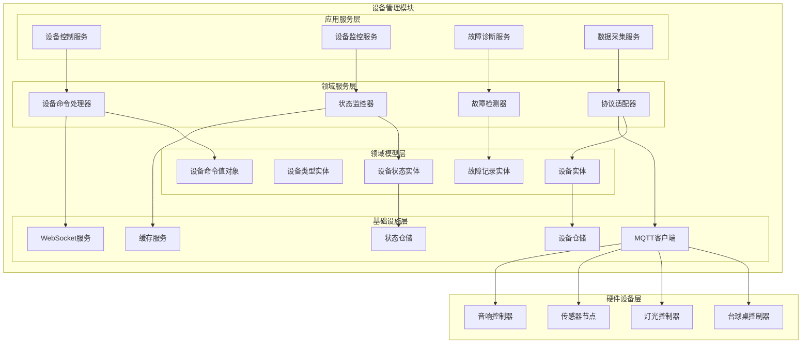
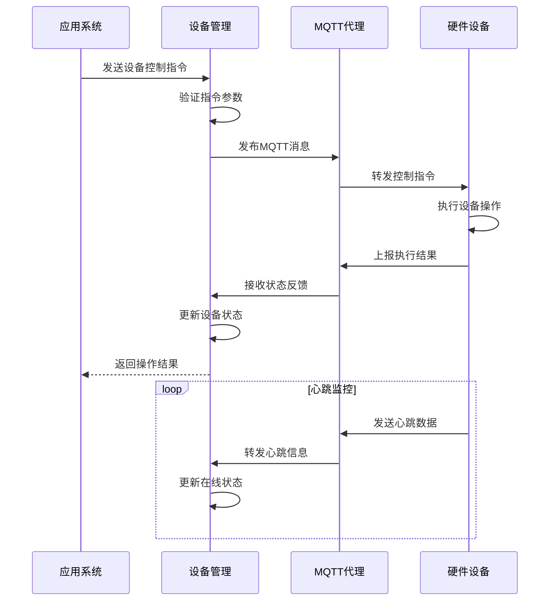
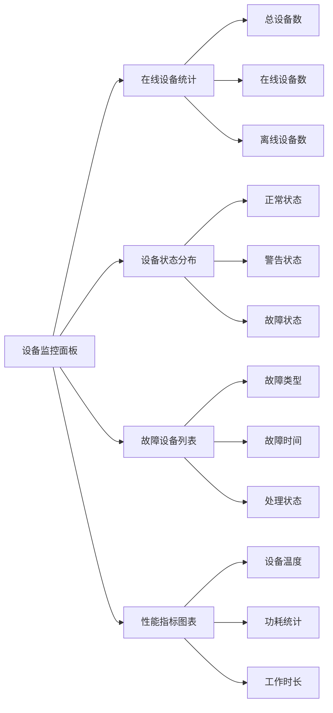

# 4.4 设备管理模块

<!-- Breadcrumb Navigation -->
**导航路径**: [🏠 项目文档](../自助台球系统项目文档.md) > [📦 模块设计](README.md) > 🖥️ 设备管理模块

<!-- Keywords for Search -->
**关键词**: `设备管理` `物联网` `MQTT` `设备控制`

---

## 📋 模块概述

设备管理模块负责自助台球系统中所有硬件设备的管理和控制，包括台球桌灯光控制、传感器数据采集、设备状态监控、故障诊断等功能。该模块是连接软件系统与硬件设备的重要桥梁。

### 核心职责

- 🎮 **设备控制**: 台球桌灯光、音响等设备的远程控制
- 📡 **状态监控**: 实时监控设备运行状态和健康状况  
- 🔧 **故障诊断**: 自动检测设备故障并生成维修工单
- 📊 **数据采集**: 采集设备运行数据用于分析优化
- 🌐 **协议适配**: 支持多种物联网通信协议

---

## 🏗️ 架构设计

### 模块架构图



### 设备通信流程



---

## 📊 数据模型设计

### 核心实体

#### 设备实体 (Device)

```csharp
public class Device : AuditedAggregateRoot<Guid>
{
    public string DeviceId { get; set; }
    public string DeviceName { get; set; }
    public DeviceType Type { get; set; }
    public Guid? TableId { get; set; }
    public string SerialNumber { get; set; }
    public string ModelNumber { get; set; }
    public string FirmwareVersion { get; set; }
    public string HardwareVersion { get; set; }
    public DeviceStatus Status { get; set; }
    public bool IsOnline { get; set; }
    public DateTime? LastHeartbeatTime { get; set; }
    public string Location { get; set; }
    public DateTime InstallationDate { get; set; }
    public string ConfigurationJson { get; set; }
    
    // 导航属性
    public BilliardTable Table { get; set; }
    public ICollection<DeviceStatusLog> StatusLogs { get; set; }
    public ICollection<DeviceFault> Faults { get; set; }
}

public enum DeviceType
{
    LightController = 1,    // 灯光控制器
    SensorNode = 2,        // 传感器节点
    AudioController = 3,   // 音响控制器
    TableController = 4,   // 台球桌控制器
    Gateway = 5           // 网关设备
}

public enum DeviceStatus
{
    Normal = 1,      // 正常
    Warning = 2,     // 警告
    Error = 3,       // 错误
    Maintenance = 4, // 维护中
    Offline = 5      // 离线
}
```

#### 设备状态日志实体 (DeviceStatusLog)

```csharp
public class DeviceStatusLog : CreationAuditedEntity<Guid>
{
    public Guid DeviceId { get; set; }
    public DeviceStatus Status { get; set; }
    public DeviceStatus? PreviousStatus { get; set; }
    public string StatusData { get; set; }
    public string EventType { get; set; }
    public string EventDescription { get; set; }
    public DateTime EventTime { get; set; }
    public string AdditionalData { get; set; }
    
    // 导航属性
    public Device Device { get; set; }
}
```

#### 设备故障记录实体 (DeviceFault)

```csharp
public class DeviceFault : AuditedAggregateRoot<Guid>
{
    public Guid DeviceId { get; set; }
    public string FaultCode { get; set; }
    public string FaultTitle { get; set; }
    public string FaultDescription { get; set; }
    public FaultLevel Level { get; set; }
    public FaultStatus Status { get; set; }
    public DateTime OccurredTime { get; set; }
    public DateTime? ResolvedTime { get; set; }
    public string ResolvedBy { get; set; }
    public string ResolutionNotes { get; set; }
    public bool AutoResolved { get; set; }
    
    // 导航属性
    public Device Device { get; set; }
    public ICollection<MaintenanceRecord> MaintenanceRecords { get; set; }
}

public enum FaultLevel
{
    Low = 1,      // 低级故障
    Medium = 2,   // 中级故障
    High = 3,     // 高级故障
    Critical = 4  // 严重故障
}

public enum FaultStatus
{
    Open = 1,        // 未处理
    InProgress = 2,  // 处理中
    Resolved = 3,    // 已解决
    Closed = 4       // 已关闭
}
```

---

## 🔧 接口设计

### 设备控制接口

```csharp
public interface IDeviceControlAppService : IApplicationService
{
    Task<DeviceCommandResult> SendCommandAsync(SendDeviceCommandDto input);
    Task<DeviceStatusDto> GetDeviceStatusAsync(Guid deviceId);
    Task<List<DeviceDto>> GetDevicesByTableAsync(Guid tableId);
    Task<List<DeviceDto>> GetDevicesByTypeAsync(DeviceType type);
    Task<bool> TestDeviceConnectionAsync(Guid deviceId);
}
```

### 设备监控接口

```csharp
public interface IDeviceMonitoringAppService : IApplicationService
{
    Task<DeviceHealthDto> GetDeviceHealthAsync(Guid deviceId);
    Task<List<DeviceStatusLogDto>> GetStatusHistoryAsync(GetStatusHistoryDto input);
    Task<DeviceStatisticsDto> GetDeviceStatisticsAsync(GetStatisticsDto input);
    Task<List<OfflineDeviceDto>> GetOfflineDevicesAsync();
    Task<AlertDto> CreateDeviceAlertAsync(CreateAlertDto input);
}
```

### 故障管理接口

```csharp
public interface IDeviceFaultAppService : IApplicationService
{
    Task<List<DeviceFaultDto>> GetActiveFaultsAsync();
    Task<DeviceFaultDto> ReportFaultAsync(ReportFaultDto input);
    Task<DeviceFaultDto> ResolveFaultAsync(Guid faultId, ResolveFaultDto input);
    Task<List<DeviceFaultDto>> GetFaultHistoryAsync(GetFaultHistoryDto input);
    Task<FaultStatisticsDto> GetFaultStatisticsAsync();
}
```

---

## 🌐 通信协议设计

### MQTT消息格式

```json
{
  "topic": "billiard/table/{tableId}/light/control",
  "payload": {
    "messageId": "msg_20240115_001",
    "timestamp": 1705123456789,
    "command": "turn_on",
    "parameters": {
      "brightness": 80,
      "color": "white",
      "duration": 3600
    }
  }
}
```

### 设备状态上报

```json
{
  "topic": "billiard/device/{deviceId}/status",
  "payload": {
    "deviceId": "light_ctrl_001",
    "timestamp": 1705123456789,
    "status": {
      "online": true,
      "working": true,
      "brightness": 80,
      "temperature": 45.2,
      "voltage": 220.1,
      "current": 0.8
    },
    "metrics": {
      "uptime": 86400,
      "workingHours": 8.5,
      "errorCount": 0
    }
  }
}
```

### 故障告警消息

```json
{
  "topic": "billiard/device/{deviceId}/fault",
  "payload": {
    "deviceId": "light_ctrl_001",
    "faultCode": "ERR_001",
    "faultTitle": "过温告警",
    "description": "设备温度超过安全阈值",
    "level": "High",
    "occurredTime": 1705123456789,
    "additionalData": {
      "temperature": 85.5,
      "threshold": 80.0
    }
  }
}
```

---

## ⚙️ 设备控制逻辑

### 台球桌灯光控制

```csharp
public class LightController : IDeviceController
{
    public async Task<DeviceCommandResult> TurnOnAsync(Guid tableId, LightControlParameters parameters)
    {
        var device = await GetLightDeviceByTableAsync(tableId);
        if (device == null)
        {
            return DeviceCommandResult.Failed("未找到灯光设备");
        }
        
        var command = new DeviceCommand
        {
            DeviceId = device.DeviceId,
            Command = "turn_on",
            Parameters = JsonSerializer.Serialize(parameters)
        };
        
        return await SendCommandAsync(command);
    }
    
    public async Task<DeviceCommandResult> TurnOffAsync(Guid tableId)
    {
        var device = await GetLightDeviceByTableAsync(tableId);
        if (device == null)
        {
            return DeviceCommandResult.Failed("未找到灯光设备");
        }
        
        var command = new DeviceCommand
        {
            DeviceId = device.DeviceId,
            Command = "turn_off"
        };
        
        return await SendCommandAsync(command);
    }
}
```

### 故障自动检测

```csharp
public class FaultDetectionService
{
    public async Task DetectFaultsAsync()
    {
        var devices = await _deviceRepository.GetActiveDevicesAsync();
        
        foreach (var device in devices)
        {
            // 检测设备离线
            if (await IsDeviceOfflineAsync(device))
            {
                await CreateFaultAsync(device.Id, "OFFLINE", "设备离线", FaultLevel.High);
            }
            
            // 检测设备过温
            if (await IsDeviceOverheatedAsync(device))
            {
                await CreateFaultAsync(device.Id, "OVERHEAT", "设备过温", FaultLevel.High);
            }
            
            // 检测通信异常
            if (await HasCommunicationErrorAsync(device))
            {
                await CreateFaultAsync(device.Id, "COMM_ERROR", "通信异常", FaultLevel.Medium);
            }
        }
    }
}
```

---

## 📊 设备监控

### 实时监控面板



### 告警规则

| 指标类型 | 阈值 | 告警级别 | 处理方式 |
|----------|------|----------|----------|
| 设备离线 | >30秒无心跳 | 高级 | 立即通知 |
| 设备过温 | >80°C | 高级 | 自动关闭 |
| 电压异常 | <200V或>240V | 中级 | 记录日志 |
| 通信超时 | >5秒无响应 | 低级 | 重试连接 |

---

## 🔧 维护管理

### 预防性维护

```csharp
public class PreventiveMaintenanceService
{
    public async Task ScheduleMaintenanceAsync()
    {
        var devices = await _deviceRepository.GetDevicesForMaintenanceAsync();
        
        foreach (var device in devices)
        {
            var maintenanceSchedule = CalculateMaintenanceSchedule(device);
            
            if (maintenanceSchedule.IsOverdue)
            {
                await CreateMaintenanceTaskAsync(device, maintenanceSchedule);
            }
        }
    }
    
    private MaintenanceSchedule CalculateMaintenanceSchedule(Device device)
    {
        var workingHours = CalculateWorkingHours(device);
        var lastMaintenance = GetLastMaintenanceDate(device);
        
        return new MaintenanceSchedule
        {
            DeviceId = device.Id,
            NextMaintenanceDate = CalculateNextMaintenanceDate(workingHours, lastMaintenance),
            MaintenanceType = DetermineMaintenanceType(workingHours),
            IsOverdue = DateTime.Now > CalculateNextMaintenanceDate(workingHours, lastMaintenance)
        };
    }
}
```

---

## ⚡ 性能优化

### 数据缓存策略

```csharp
// 设备状态缓存（1分钟）
[CachePut(CacheNames.DeviceStatus, "{deviceId}", Duration = 60)]
public async Task<DeviceStatusDto> GetDeviceStatusAsync(Guid deviceId)

// 设备配置缓存（30分钟）
[CachePut(CacheNames.DeviceConfig, "{deviceId}", Duration = 1800)]
public async Task<DeviceConfigDto> GetDeviceConfigAsync(Guid deviceId)
```

### 消息处理优化

- 📨 **批量处理**: 心跳消息批量入库，减少数据库压力
- 🔄 **异步处理**: 故障检测和告警通知异步处理
- 📊 **数据压缩**: 历史数据定期压缩存储
- 🚀 **连接池**: MQTT连接池管理，提高并发性能

---

## 🔗 相关文档

- **上级文档**: [模块设计总览](README.md)
- **关联文档**: [台球桌计费模块](台球桌计费模块.md) | [报表与统计模块](报表与统计模块.md)
- **技术文档**: [MQTT协议文档](../08_配置管理/消息队列.md)
- **返回**: [项目文档首页](../自助台球系统项目文档.md)

---

*最后更新: 2024-01-15 | 版本: v1.0.0*
