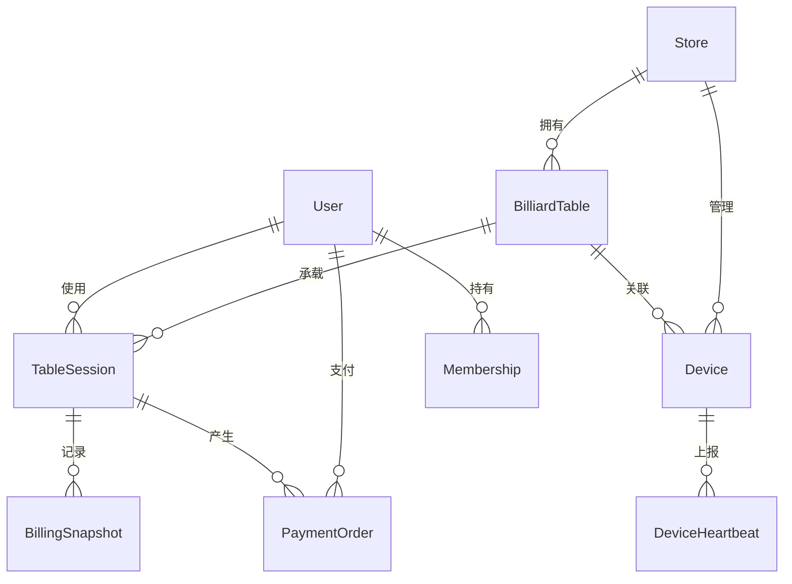

# 5. 数据库设计

<!-- Breadcrumb Navigation -->
**导航路径**: [🏠 项目文档首页](../自助台球系统项目文档.md) > 📊 数据库设计

<!-- Keywords for Search -->
**关键词**: `数据库设计` `EF Core` `Code First` `实体建模` `数据迁移` `表结构` `索引优化`

## 概述

本章节提供了自助台球系统完整的数据库设计文档，采用 **EF Core Code First** 方式开发，确保数据模型与业务代码的一致性。

## 🚀 快速索引

| 章节 | 核心内容 | 快速跳转 |
|------|----------|----------|
| **📊 概念模型** | ER图、实体关系 | [👆 跳转](#51-概念模型er-图) |
| **🏗️ 表结构定义** | 实体类、DbContext配置 | [👆 跳转](#52-表结构定义) |
| **💡 关键表说明** | 业务逻辑、使用场景 | [👆 跳转](#53-关键表说明) |
| **⚡ 索引优化** | 性能调优、查询优化 | [👆 跳转](#54-索引与优化) |
| **🔄 数据迁移** | Migrations、版本管理 | [👆 跳转](#55-数据迁移方案) |
| **⚙️ 开发工作流** | 完整流程、最佳实践 | [👆 跳转](#56-ef-core-开发工作流程) |

## 📋 文档导航表

| 章节 | 文档 | 主要内容 | 适用读者 |
|------|------|----------|----------|
| **5.1** | [概念模型（ER 图）](概念模型_ER图.md) | 实体关系设计、架构概览 | 架构师、业务分析师 |
| **5.2** | [表结构定义](表结构定义.md) | EF Core 实体定义、数据库映射 | 开发工程师、DBA |
| **5.3** | [关键表说明](关键表说明.md) | 业务逻辑分析、使用场景 | 开发工程师、测试工程师 |
| **5.4** | [索引与优化](索引与优化.md) | 性能优化、查询调优 | DBA、性能工程师 |
| **5.5** | [数据迁移方案](数据迁移方案.md) | EF Core Migrations、版本管理 | 开发工程师、运维工程师 |
| **5.6** | [EF Core 开发工作流程](EFCore开发工作流程.md) | 完整开发流程、最佳实践 | 全体开发人员 |

## 文档结构

### 5.1 [概念模型（ER 图）](概念模型_ER图.md)
- 实体关系图设计
- 数据库整体架构概览
- 实体间关系定义

### 5.2 [表结构定义](表结构定义.md)
- 完整的 EF Core 实体定义
- 数据库表结构 SQL 映射
- 字段类型和约束说明
- 索引策略设计

### 5.3 [关键表说明](关键表说明.md)
- 核心业务表详细说明
- 业务逻辑和使用场景
- 数据一致性保障策略
- 性能优化建议

### 5.4 [索引与优化](索引与优化.md)
- 查询性能优化策略
- 索引设计最佳实践
- 数据库调优建议

### 5.5 [数据迁移方案](数据迁移方案.md)
- EF Core Migrations 完整指南
- 数据库版本管理策略
- 生产环境部署流程
- 迁移最佳实践

### 5.6 [EF Core 开发工作流程](EFCore开发工作流程.md)
- Code First 开发完整流程
- 实体建模规范
- DbContext 配置指南
- 数据种子管理
- 环境管理和部署策略

## 技术特色

### 🚀 EF Core Code First
- **代码优先**：通过 C# 代码定义数据模型，保证代码与数据库同步
- **自动迁移**：使用 Migrations 管理数据库版本，支持团队协作
- **类型安全**：编译时检查，减少运行时错误
- **LINQ 查询**：强类型查询，提高开发效率

### 📊 ABP 框架集成
- **审计日志**：自动记录数据变更历史
- **软删除**：逻辑删除机制，数据安全可恢复
- **多租户**：支持多门店数据隔离
- **仓储模式**：统一数据访问接口

### 🔧 开发规范
- **中文文档**：完整的简体中文技术文档
- **命名规范**：统一的实体、字段、迁移命名标准
- **提交规范**：规范化的 Git 提交信息格式
- **代码审查**：完善的 Code Review 流程

## 快速开始

### 1. 环境准备

```bash
# 安装 EF Core 工具
dotnet tool install --global dotnet-ef

# 验证安装
dotnet ef --version
```

### 2. 创建数据库

```bash
# 更新到最新迁移
dotnet ef database update -p src/Zss.BilliardHall.EntityFrameworkCore -s src/Zss.BilliardHall.DbMigrator
```

### 3. 运行数据种子

```bash
# 运行迁移工具
dotnet run --project src/Zss.BilliardHall.DbMigrator
```

## 核心实体概览

| 实体 | 说明 | 关键特性 |
|------|------|----------|
| **Store** | 门店管理 | 多门店支持、营业时间控制 |
| **BilliardTable** | 球台管理 | 状态机管理、设备关联 |
| **User** | 用户管理 | 会员体系、余额管理 |
| **TableSession** | 会话管理 | 计费核心、状态跟踪 |
| **PaymentOrder** | 支付管理 | 第三方对接、幂等处理 |
| **BillingSnapshot** | 计费快照 | 历史追溯、纠纷处理 |
| **Device** | 设备管理 | IoT 设备、健康监控 |
| **Membership** | 会员管理 | 套餐管理、权益计算 |

## 数据库架构图



## 开发团队规范

### Git 提交规范
```bash
# 功能开发
git commit -m "feat(数据库): 添加会员管理相关表结构"

# Bug 修复
git commit -m "fix(迁移): 修复支付订单外键约束问题"

# 文档更新
git commit -m "docs(数据库): 更新 EF Core 开发流程文档"
```

### 迁移命名规范
```bash
# 添加新功能
dotnet ef migrations add AddMembershipModule

# 修改现有结构
dotnet ef migrations add UpdateUserAddBalance

# 性能优化
dotnet ef migrations add OptimizeTableSessionIndexes
```

## 相关链接

- [📋 产品需求文档](../02_需求规格说明/README.md)
- [🏗️ 系统架构设计](../03_系统架构设计/README.md)
- [📝 开发规范](../06_开发规范/README.md)
- [🔧 API 文档](../07_API文档/README.md)
- [🏠 返回项目文档首页](../自助台球系统项目文档.md)

---

💡 **提示**：本文档持续更新中，如有疑问请参考具体的子文档或联系开发团队。
