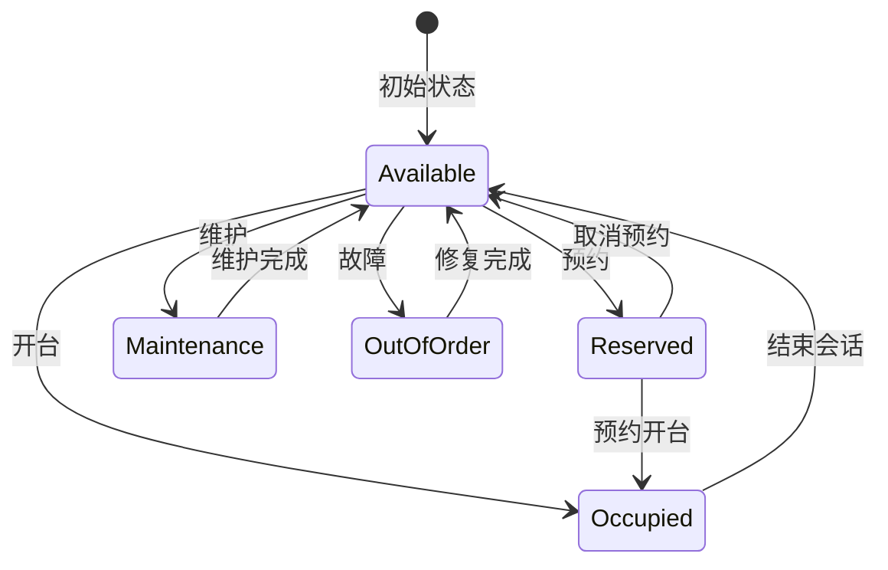
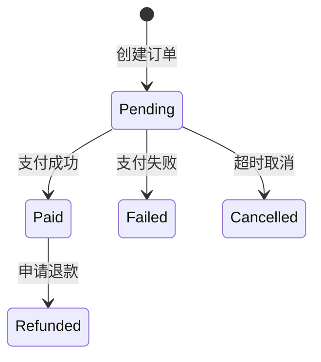

# 5.3 关键表说明

<!-- Breadcrumb Navigation -->
**导航路径**: [🏠 项目文档首页](../自助台球系统项目文档.md) > [📊 数据库设计](README.md) > 💡 关键表说明

<!-- Keywords for Search -->
**关键词**: `关键表` `业务逻辑` `数据模型` `实体关系` `业务规则` `数据一致性`

## 概述

本文档详细说明自助台球系统中的关键表设计思路、业务逻辑和使用场景，基于 EF Core Code First 方式实现。

> 💡 **相关章节**：
> - 实体类定义和数据库映射请参考 [5.2 表结构定义](表结构定义.md)
> - 数据库迁移和版本管理请参考 [5.5 数据迁移方案](数据迁移方案.md)
> - 性能优化策略请参考 [5.4 索引与优化](索引与优化.md)

## 核心业务表详细说明

### 1. 门店表 (Stores)

#### 业务作用
- 支持多门店管理，每个门店独立运营
- 作为球台、设备、员工等资源的管理边界
- 提供门店基本信息和营业时间管理

#### 关键字段说明

| 字段名 | 类型 | 说明 | 业务规则 |
|-------|------|------|----------|
| Name | string(100) | 门店名称 | 必填，同一运营商下不重复 |
| Address | string(500) | 详细地址 | 用于导航和配送 |
| ContactPhone | string(20) | 联系电话 | 客服和紧急联系 |
| Status | enum | 营业状态 | Active/Inactive/Maintenance |
| OpenTime | TimeSpan | 开始营业时间 | 用于自动开台限制 |
| CloseTime | TimeSpan | 结束营业时间 | 用于自动关台和结算 |

#### 关联关系
```csharp
// 一对多关系
public virtual ICollection<BilliardTable> Tables { get; set; }  // 门店下的球台
public virtual ICollection<Device> Devices { get; set; }        // 门店设备
public virtual ICollection<Employee> Employees { get; set; }    // 门店员工
```

#### 使用场景
1. **门店筛选**：用户选择就近门店
2. **营业控制**：根据营业时间自动启停服务
3. **设备管理**：按门店管理设备和球台
4. **数据隔离**：多门店数据权限隔离

### 2. 球台表 (BilliardTables)

#### 业务作用
- 台球厅的核心资产，承载用户消费的物理载体
- 管理球台状态，确保资源合理分配
- 记录设备健康状态和服务质量

#### 关键字段说明

| 字段名 | 类型 | 说明 | 业务规则 |
|-------|------|------|----------|
| TableNumber | string(20) | 台号 | 门店内唯一，如"001"、"VIP-A" |
| Status | enum | 台子状态 | Available/Occupied/Reserved/Maintenance/OutOfOrder |
| Type | enum | 球台类型 | Standard/Snooker/American，影响定价 |
| HourlyRate | decimal(18,2) | 小时基础价格 | 基准定价，可被促销规则覆盖 |
| IsOnline | bool | 设备在线状态 | 离线时不可开台 |
| LastHeartbeatTime | DateTime? | 最后心跳时间 | 用于判断设备故障 |

#### 状态转换逻辑



#### 关键业务规则
1. **原子性开台**：状态从 Available -> Occupied 必须原子操作
2. **设备关联**：离线设备不可开台
3. **时间限制**：超时未支付自动释放
4. **维护窗口**：营业时间外可进入维护状态

### 3. 用户表 (Users)

#### 业务作用
- 用户身份管理和会员体系核心
- 记录用户消费行为和偏好
- 支持精准营销和客户服务

#### 关键字段说明

| 字段名 | 类型 | 说明 | 业务规则 |
|-------|------|------|----------|
| Phone | string(50) | 手机号 | 唯一标识，注册登录凭证 |
| NickName | string(50) | 昵称 | 显示名称，可重复 |
| Balance | decimal(18,2) | 账户余额 | 充值和消费的基础 |
| PlayCount | int | 游戏次数 | 用户活跃度指标 |
| TotalPlayMinutes | int | 总游戏时长 | 用户粘性指标 |
| TotalSpent | decimal(18,2) | 累计消费 | 用户价值分层 |

#### 用户状态管理

```csharp
public enum UserStatus
{
    Active = 1,    // 正常用户，可正常消费
    Inactive = 0,  // 非活跃用户，需要激活
    Blocked = 2    // 被封禁用户，禁止消费
}
```

#### 业务规则
1. **手机号唯一性**：防止重复注册
2. **余额非负**：扣费前检查余额充足
3. **状态控制**：被封禁用户无法开台
4. **数据统计**：实时更新用户画像数据

### 4. 台球会话表 (TableSessions)

#### 业务作用
- 记录每次台球服务的完整生命周期
- 计费计算的基础数据
- 业务分析和用户行为分析的核心数据

#### 关键字段说明

| 字段名 | 类型 | 说明 | 业务规则 |
|-------|------|------|----------|
| SessionToken | string(36) | 会话标识 | 唯一标识，防止重复操作 |
| StartTime | DateTime | 开始时间 | 计费起点，精确到秒 |
| EndTime | DateTime? | 结束时间 | 计费终点，null表示进行中 |
| PlayMinutes | int | 实际游戏时长 | 去除暂停时间的净时长 |
| HourlyRate | decimal(18,2) | 当时价格 | 快照价格，不受后续调价影响 |
| TotalAmount | decimal(18,2) | 原始金额 | 基础计费金额 |
| DiscountAmount | decimal(18,2) | 优惠金额 | 各种折扣优惠总额 |
| FinalAmount | decimal(18,2) | 最终金额 | 实际收费金额 |

#### 会话状态管理

```csharp
public enum SessionStatus
{
    Active = 1,      // 进行中，正在计费
    Completed = 2,   // 已完成，正常结束
    Cancelled = 3,   // 已取消，异常结束
    Paused = 4       // 暂停中，暂停计费
}
```

#### 计费逻辑示例

```csharp
public void UpdateBilling()
{
    if (Status != SessionStatus.Active) return;
    
    var currentTime = DateTime.Now;
    PlayMinutes = (int)(currentTime - StartTime).TotalMinutes;
    
    // 基础金额计算
    TotalAmount = (decimal)PlayMinutes / 60 * HourlyRate;
    
    // 应用优惠规则
    DiscountAmount = CalculateDiscount();
    
    // 最终金额
    FinalAmount = TotalAmount - DiscountAmount;
}
```

### 5. 支付订单表 (PaymentOrders)

#### 业务作用
- 管理所有支付相关的交易记录
- 对接第三方支付平台的中间层
- 支持退款、对账等财务操作

#### 关键字段说明

| 字段名 | 类型 | 说明 | 业务规则 |
|-------|------|------|----------|
| OrderNo | string(32) | 系统订单号 | 唯一，格式：yyyyMMddHHmmss + 6位随机数 |
| PaymentType | enum | 支付类型 | SessionPayment/Recharge/Refund |
| PaymentMethod | enum | 支付方式 | WeChatPay/Alipay/Balance/Cash |
| Amount | decimal(18,2) | 支付金额 | 实际支付金额 |
| ThirdPartyOrderNo | string(100) | 第三方订单号 | 微信、支付宝返回的订单号 |
| CallbackData | string | 回调数据 | 完整的支付回调信息，用于对账 |

#### 支付状态流转



#### 幂等性设计

```csharp
public async Task<PaymentResult> ProcessPaymentAsync(string orderNo, PaymentCallbackData callback)
{
    // 幂等性检查
    var existingOrder = await _repository.FirstOrDefaultAsync(x => x.OrderNo == orderNo);
    if (existingOrder?.Status == PaymentStatus.Paid)
    {
        return PaymentResult.AlreadyProcessed(existingOrder);
    }
    
    // 处理支付逻辑...
}
```

### 6. 计费快照表 (BillingSnapshots)

#### 业务作用
- 记录计费过程中的关键时点数据
- 支持计费规则变更后的历史数据追溯
- 为计费纠纷提供详细的计算依据

#### 快照触发时机
1. 会话开始时创建初始快照
2. 价格规则变更时创建快照
3. 应用优惠时创建快照
4. 会话结束时创建最终快照

#### 数据结构示例

```json
{
  "pricingRules": {
    "baseRate": 30.00,
    "peakHourMultiplier": 1.2,
    "memberDiscount": 0.15,
    "appliedPromotions": [
      {
        "name": "新用户首单立减",
        "discount": 5.00
      }
    ]
  }
}
```

### 7. 设备管理表 (Devices & DeviceHeartbeats)

#### 设备表 (Devices)
- 管理门店内所有智能设备
- 支持设备远程控制和状态监控
- 为设备故障预警提供基础数据

#### 设备心跳表 (DeviceHeartbeats)
- 记录设备实时状态和性能指标
- 支持设备健康监控和故障预警
- 数据量大，需要考虑分区和归档策略

#### 心跳数据示例

```json
{
  "voltage": 12.5,
  "temperature": 35.2,
  "signalStrength": -45,
  "memoryUsage": 0.68,
  "cpuUsage": 0.23,
  "lastError": null
}
```

## 数据一致性保障

### 1. 事务边界设计

```csharp
[UnitOfWork]
public async Task<SessionResult> StartSessionAsync(StartSessionRequest request)
{
    using var uow = _unitOfWorkManager.Begin(requiresNew: true, isTransactional: true);
    
    try
    {
        // 1. 检查球台状态
        var table = await _tableRepository.GetAsync(request.TableId);
        if (table.Status != TableStatus.Available)
            throw new BusinessException("球台不可用");
        
        // 2. 原子性更新球台状态
        table.Status = TableStatus.Occupied;
        await _tableRepository.UpdateAsync(table);
        
        // 3. 创建会话记录
        var session = new TableSession
        {
            UserId = request.UserId,
            TableId = request.TableId,
            StartTime = DateTime.Now,
            Status = SessionStatus.Active,
            SessionToken = Guid.NewGuid().ToString("N"),
            HourlyRate = table.HourlyRate
        };
        
        await _sessionRepository.InsertAsync(session);
        
        // 4. 创建初始计费快照
        var snapshot = CreateInitialBillingSnapshot(session);
        await _billingRepository.InsertAsync(snapshot);
        
        await uow.CompleteAsync();
        return SessionResult.Success(session);
    }
    catch (Exception ex)
    {
        await uow.RollbackAsync();
        throw;
    }
}
```

### 2. 并发控制

```csharp
// 使用乐观锁防止并发开台
public class BilliardTable : FullAuditedAggregateRoot<long>
{
    [ConcurrencyCheck]
    public string ConcurrencyStamp { get; set; }
    
    // 其他属性...
}

// 更新时检查并发标记
var table = await _repository.GetAsync(tableId);
table.Status = TableStatus.Occupied;
table.ConcurrencyStamp = Guid.NewGuid().ToString();

try
{
    await _repository.UpdateAsync(table);
}
catch (DbUpdateConcurrencyException)
{
    throw new BusinessException("球台状态已被其他操作修改，请重试");
}
```

## 性能优化策略

### 1. 索引设计原则

```sql
-- 复合索引优化查询
CREATE INDEX IX_TableSessions_Table_Status_StartTime 
ON TableSessions (TableId, Status, StartTime);

-- 包含列索引减少回表
CREATE INDEX IX_PaymentOrders_User_Status_Amount 
ON PaymentOrders (UserId, Status) 
INCLUDE (Amount, CreationTime);
```

### 2. 分页查询优化

```csharp
public async Task<PagedResultDto<SessionDto>> GetUserSessionsAsync(GetUserSessionsInput input)
{
    var query = await _repository.GetQueryableAsync();
    
    // 避免使用 Skip/Take，使用游标分页
    query = query.Where(x => x.UserId == input.UserId)
                 .Where(x => x.Id > input.LastId)  // 游标分页
                 .OrderBy(x => x.Id)
                 .Take(input.MaxResultCount);
    
    var sessions = await query.ToListAsync();
    return new PagedResultDto<SessionDto>(sessions.Count, 
        ObjectMapper.Map<List<SessionDto>>(sessions));
}
```

### 3. 读写分离

```csharp
// 写操作使用主库
[UnitOfWork]
public async Task CreateSessionAsync(TableSession session)
{
    await _sessionRepository.InsertAsync(session);
}

// 读操作使用从库
[DisableAuditing]
public async Task<List<SessionStatDto>> GetSessionStatsAsync(DateTime date)
{
    var query = await _sessionRepository.WithDetailsAsync();
    // 标记为只读查询，路由到从库
    return await query.AsNoTracking()
                     .Where(x => x.StartTime.Date == date.Date)
                     .Select(x => new SessionStatDto { /* ... */ })
                     .ToListAsync();
}
```

---

## 📚 相关文档

### 同级文档
- [5.1 概念模型（ER 图）](概念模型_ER图.md)
- [5.2 表结构定义](表结构定义.md)
- [5.4 索引与优化](索引与优化.md)
- [5.5 数据迁移方案](数据迁移方案.md)
- [5.6 EF Core 开发工作流程](EFCore开发工作流程.md)

### 返回上级
- [🔙 数据库设计总览](README.md)
- [🏠 项目文档首页](../自助台球系统项目文档.md)

### 相关章节
- [2. 需求规格说明](../02_需求规格说明/README.md)
- [4. 模块设计说明](../04_模块设计说明/README.md)
- [9. 测试方案](../09_测试方案/README.md)
