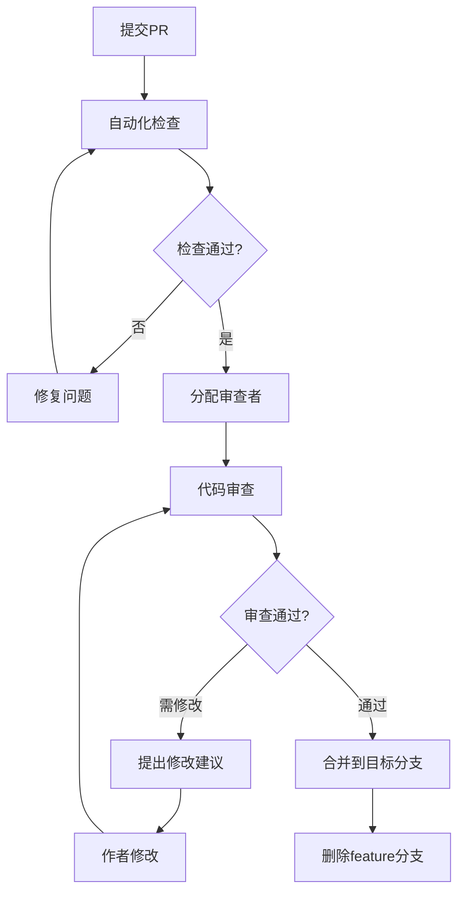

# 6.5 Code Review 流程

<!-- Breadcrumb Navigation -->
**导航路径**: [🏠 项目文档首页](../自助台球系统项目文档.md) > [📝 开发规范](README.md) > 👥 Code Review 流程

<!-- Keywords for Search -->
**关键词**: `Code Review` `代码审查` `PR模板` `审查流程` `代码质量` `团队协作`

## 概述

Code Review（代码审查）是保证代码质量、知识共享和团队协作的重要环节。本文档定义了自助台球系统项目的代码审查流程和标准。

## 审查原则

### 1. 审查目标

- **代码质量**：确保代码符合项目标准和最佳实践
- **业务逻辑**：验证业务逻辑的正确性和完整性
- **安全性**：识别潜在的安全风险和漏洞
- **性能**：评估代码性能影响和优化机会
- **可维护性**：确保代码易读、易懂、易维护
- **知识传递**：通过审查过程分享技术知识

### 2. 审查态度

- **建设性**：提供建设性的反馈和改进建议
- **尊重**：尊重作者的工作，友善地提出问题
- **学习**：将审查作为学习和成长的机会
- **客观**：基于技术标准进行客观评判
- **及时**：在合理时间内完成审查

## Pull Request 规范

### 1. PR 创建要求

#### 标题格式
```
[类型] 功能简述

示例：
[功能] 新增会员积分管理系统
[修复] 解决台球桌状态同步问题
[重构] 优化支付服务架构
[文档] 更新 EF Core 迁移指南
```

#### 描述模板

```markdown
## 变更概述
简要描述本次变更的背景、目的和主要内容。

## 变更类型
- [ ] ✨ 新功能 (feat)
- [ ] 🐛 Bug修复 (fix)
- [ ] 📚 文档更新 (docs)
- [ ] 🎨 代码重构 (refactor)
- [ ] ⚡ 性能优化 (perf)
- [ ] 🧪 测试相关 (test)
- [ ] 🔧 构建相关 (build)
- [ ] 📦 依赖更新 (deps)
- [ ] 🔀 其他变更 (chore)

## 技术实现
### 主要变更
- 变更点1：具体说明
- 变更点2：具体说明

### 技术架构影响
- 是否影响现有架构？
- 是否引入新的依赖？
- 是否需要数据库迁移？

## 测试验证
### 单元测试
- [ ] 新增功能的单元测试已编写
- [ ] 现有单元测试全部通过
- [ ] 测试覆盖率 >= 80%

### 集成测试
- [ ] 相关集成测试已执行
- [ ] API 接口测试通过
- [ ] 数据库操作测试通过

### 手动测试
- [ ] 核心功能手动测试验证
- [ ] 边界场景测试
- [ ] 异常处理测试

## 部署考虑
### 数据库变更
- [ ] 包含数据库迁移脚本
- [ ] 迁移脚本已在测试环境验证
- [ ] 考虑了数据迁移的回滚策略

### 配置变更
- [ ] 涉及配置项变更
- [ ] 已更新配置文档
- [ ] 考虑了向后兼容性

### 性能影响
- [ ] 评估了性能影响
- [ ] 进行了性能测试（如适用）
- [ ] 考虑了大数据量场景

## 相关Issue
关闭 #Issue编号

## 审查要点
请重点关注以下方面：
- [ ] 业务逻辑正确性
- [ ] 代码质量和规范
- [ ] 异常处理完整性
- [ ] 性能和安全考虑

## 额外说明
其他需要审查者了解的重要信息。
```

### 2. PR 大小控制

#### 理想大小
- **代码行数**：< 400 行变更
- **文件数量**：< 10 个文件
- **功能范围**：单一功能或问题

#### 大型 PR 处理
```bash
# 当PR过大时，考虑拆分
git log --oneline main..feature/large-feature

# 按功能模块拆分分支
git checkout -b feature/user-management-part1
git checkout -b feature/user-management-part2
```

## 审查流程

### 1. 自动化检查

#### CI/CD 流水线
```yaml
# .github/workflows/pr-check.yml
name: PR 代码检查

on:
  pull_request:
    branches: [ main, develop ]

jobs:
  code-quality:
    runs-on: ubuntu-latest
    steps:
    - uses: actions/checkout@v3
    
    - name: 设置 .NET
      uses: actions/setup-dotnet@v3
      with:
        dotnet-version: 8.0.x
    
    - name: 代码格式检查
      run: dotnet format --verify-no-changes --verbosity diagnostic
    
    - name: 代码分析
      run: dotnet build --configuration Release --verbosity normal
      
    - name: 单元测试
      run: dotnet test --configuration Release --logger trx --collect:"XPlat Code Coverage"
      
    - name: 测试覆盖率检查
      run: |
        dotnet tool install -g dotnet-reportgenerator-globaltool
        reportgenerator -reports:**/coverage.cobertura.xml -targetdir:coverage -reporttypes:Html
```

#### 代码质量检查

```xml
<!-- .editorconfig -->
root = true

[*.cs]
# 代码风格
dotnet_sort_system_directives_first = true
dotnet_separate_import_directive_groups = false

# 命名规则
dotnet_naming_rule.interface_should_be_prefixed_with_i.severity = warning
dotnet_naming_rule.interface_should_be_prefixed_with_i.symbols = interface
dotnet_naming_rule.interface_should_be_prefixed_with_i.style = prefix_interface_with_i

# 代码分析
dotnet_analyzer_diagnostic.CA1001.severity = error
dotnet_analyzer_diagnostic.CA1309.severity = warning
```

### 2. 人工审查流程

#### 审查角色分工

| 角色 | 职责 | 审查重点 |
|------|------|----------|
| **技术负责人** | 架构和设计审查 | 架构合理性、技术选型、性能影响 |
| **资深开发** | 代码质量审查 | 代码规范、最佳实践、重构建议 |
| **业务专家** | 业务逻辑审查 | 业务规则正确性、用户体验 |
| **测试工程师** | 测试覆盖审查 | 测试完整性、边界场景考虑 |

#### 审查步骤



### 3. 审查清单

#### 代码质量检查
```markdown
## 代码结构
- [ ] 类和方法职责单一，符合SOLID原则
- [ ] 代码复用性良好，避免重复代码
- [ ] 依赖关系合理，避免循环依赖
- [ ] 接口设计合理，抽象程度适当

## 命名规范
- [ ] 类名使用帕斯卡命名法（PascalCase）
- [ ] 方法名动词在前，表达清楚操作意图
- [ ] 变量名有意义，避免拼音或无意义缩写
- [ ] 常量使用全大写加下划线

## 异常处理
- [ ] 关键操作包含适当的异常处理
- [ ] 异常信息清晰，便于问题排查
- [ ] 使用合适的异常类型
- [ ] 避免捕获但不处理异常

## 性能考虑
- [ ] 数据库查询优化，避免N+1问题
- [ ] 合理使用缓存
- [ ] 避免不必要的对象创建
- [ ] 异步操作使用async/await

## 安全检查
- [ ] 输入验证和参数校验
- [ ] SQL注入防护
- [ ] 敏感信息不在代码中硬编码
- [ ] 适当的权限控制
```

#### 业务逻辑检查
```markdown
## 业务规则
- [ ] 业务逻辑实现正确
- [ ] 边界条件处理完善
- [ ] 状态转换逻辑正确
- [ ] 并发场景考虑周全

## 数据一致性
- [ ] 事务边界合理
- [ ] 数据完整性约束
- [ ] 幂等性设计
- [ ] 补偿机制考虑

## 用户体验
- [ ] 错误提示用户友好
- [ ] 操作响应及时
- [ ] 界面逻辑符合用户习惯
```

### 4. 审查反馈规范

#### 反馈分类

```markdown
# 反馈类型标记
🔴 **必须修改** (MUST): 严重问题，必须在合并前解决
🟡 **建议修改** (SHOULD): 改进建议，建议采纳
🔵 **讨论** (DISCUSS): 需要进一步讨论的问题
💡 **提示** (TIP): 知识分享或替代方案
👍 **好评** (PRAISE): 好的实现，值得学习
```

#### 反馈示例

```markdown
🔴 **必须修改**: 第42行存在SQL注入风险
```csharp
// 问题代码
var sql = $"SELECT * FROM Users WHERE Name = '{userName}'";

// 建议修改
var users = await _userRepository.GetListAsync(x => x.Name == userName);
```

🟡 **建议修改**: 建议使用更具体的异常类型
```csharp
// 当前代码
throw new Exception("用户不存在");

// 建议改为
throw new UserNotFoundException($"用户 {userId} 不存在");
```

🔵 **讨论**: 这里使用缓存是否合适？
考虑到数据的实时性要求，建议讨论缓存策略。

💡 **提示**: 可以考虑使用工厂模式
这种场景下工厂模式可能更灵活，可以参考 [设计模式文档]。

👍 **好评**: 异常处理很完善
错误场景考虑得很周全，日志记录也很详细。
```

---

## 📚 相关文档

### 同级文档
- [6.1 代码风格](代码风格.md)
- [6.2 分层约束](分层约束.md)
- [6.3 日志规范](日志规范.md)
- [6.4 Git分支规范](Git分支规范.md)

### 返回上级
- [🔙 开发规范总览](README.md)
- [🏠 项目文档首页](../自助台球系统项目文档.md)

### 相关章节
- [5. 数据库设计](../05_数据库设计/README.md)
- [9. 测试方案](../09_测试方案/README.md)
- [12. 版本与变更管理](../12_版本与变更管理/README.md)
