# Book API 集成架构图

## 整体架构

## 数据流详解

### 1. 获取图书列表流程

### 2. 认证流程

### 3. 错误处理流程

## 组件关系图

## ABP 约定式路由映射

## 数据模型

## 权限控制

## 部署架构

## 性能优化策略

```mermaid
mindmap
  root((性能优化))
    前端优化
      分页加载
      虚拟列表
      图片懒加载
      请求防抖
      本地缓存
    网络优化
      HTTP/2
      GZIP 压缩
      CDN 加速
      请求合并
    后端优化
      数据库索引
      查询优化
      Redis 缓存
      异步处理
      连接池
    架构优化
      负载均衡
      读写分离
      微服务拆分
      消息队列
```

## 监控与日志

## 相关文档

- [接口清单](./接口清单.md) - 详细的 API 端点说明
- [README](./README.md) - API 文档总览
- [认证与授权](./认证与授权.md) - 认证机制说明
- [实现总结](../../IMPLEMENTATION_SUMMARY.md) - 实现细节和使用指南
