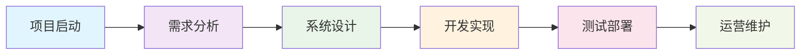

# 📋 1. 项目概述

> **导航路径**: [项目首页](../../README.md) → 01_项目概述

**关键词**: `项目概述` `业务背景` `目标设定` `范围管理` `角色定义` `约束分析`

## 🎯 章节概览

本章节为自助台球系统项目提供全面的概述信息，包括项目背景、目标、范围、角色定义和约束条件。这是理解整个项目的起点文档。

### 🗺️ 快速索引

| 📑 文档 | 📖 内容概览 | 👥 适用读者 | ⏱️ 阅读时长 |
|---------|-------------|-------------|-------------|
| [1.1 背景与目标](背景与目标.md) | 项目背景分析、市场研究、目标设定 | 所有项目成员 | 10分钟 |
| [1.2 项目范围](项目范围.md) | 功能边界、交付范围、排除项 | 项目经理、开发团队 | 8分钟 |
| [1.3 角色与使用场景](角色与使用场景.md) | 用户角色、典型场景、业务流程 | 产品经理、UI/UX设计师 | 12分钟 |
| [1.4 约束与假设条件](约束与假设条件.md) | 技术约束、资源限制、风险评估 | 架构师、项目经理 | 6分钟 |

## 🌟 项目核心价值

### 💡 核心理念
构建一个智能化的无人自助台球管理系统，通过技术手段提升运营效率，优化用户体验，实现台球厅的数字化转型。

### 🎪 业务价值
- **运营自动化**: 减少人工干预，降低运营成本
- **用户体验优化**: 提供便捷的自助服务体验
- **数据驱动决策**: 通过数据分析优化经营策略
- **标准化管理**: 建立统一的服务标准和流程

### 🔧 技术特色
- **垂直切片架构**: 采用功能优先的架构模式，提高开发效率
- **Wolverine 消息处理**: 现代化的命令/查询处理框架
- **Marten 文档数据库**: PostgreSQL JSONB 灵活的数据模型
- **实时监控**: 设备状态实时监控和告警
- **弹性扩展**: 支持多门店和高并发场景

## 📊 项目统计

### 📈 项目规模
- **开发周期**: 6个月（3个迭代版本）
- **核心功能模块**: 9个主要业务模块
- **数据表设计**: 15-20个核心业务表
- **API接口**: 60+个RESTful接口
- **支持门店规模**: 初期1-5家，后期可扩展

## 🔗 相关章节导航

### 📚 后续章节
- [2. 需求分析](../02_需求分析/README.md) - 详细的功能需求和非功能需求
- [3. 系统设计](../03_系统设计/README.md) - 架构设计和技术方案
- [4. 用户界面设计](../04_用户界面设计/README.md) - UI/UX设计规范
- [5. 数据库设计](../05_数据库设计/README.md) - EF Core数据建模

### 🎯 关键文档
- [PRD - 产品需求文档](../../docs/prd/PRD.md) - 产品功能详细说明
- [实施路线图](../../docs/implementation-roadmap.md) - 开发计划和里程碑
- [产品故事](../../docs/product-story.md) - 用户价值和业务场景

## 📋 快速开始

### 🎪 新成员入门建议
1. **第一步**: 阅读 [背景与目标](背景与目标.md) 了解项目背景
2. **第二步**: 查看 [项目范围](项目范围.md) 明确工作边界  
3. **第三步**: 研读 [角色与使用场景](角色与使用场景.md) 理解业务流程
4. **第四步**: 了解 [约束与假设条件](约束与假设条件.md) 掌握项目限制

### 🚀 关键角色快速通道
- **🧑‍💼 项目经理**: 重点关注项目范围和约束条件
- **👨‍💻 开发工程师**: 重点关注技术约束和系统架构
- **🎨 产品经理**: 重点关注用户角色和业务场景
- **📊 业务分析师**: 重点关注背景分析和需求映射

---

## 📞 联系方式

如对本章节内容有疑问，请联系：
- **文档维护**: 项目团队
- **业务咨询**: 产品经理
- **技术支持**: 架构师团队

---
**导航**: [📂 返回项目首页](../../README.md) | [➡️ 下一章：需求分析](../02_需求分析/README.md)