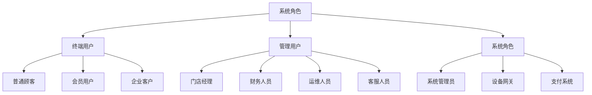
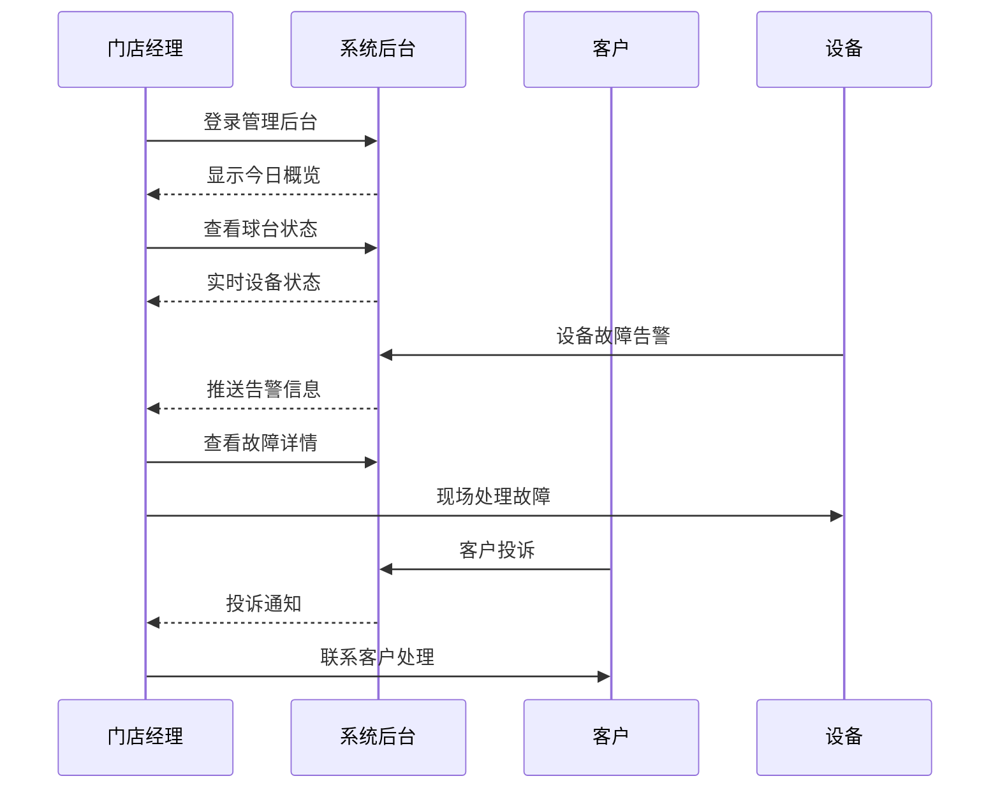
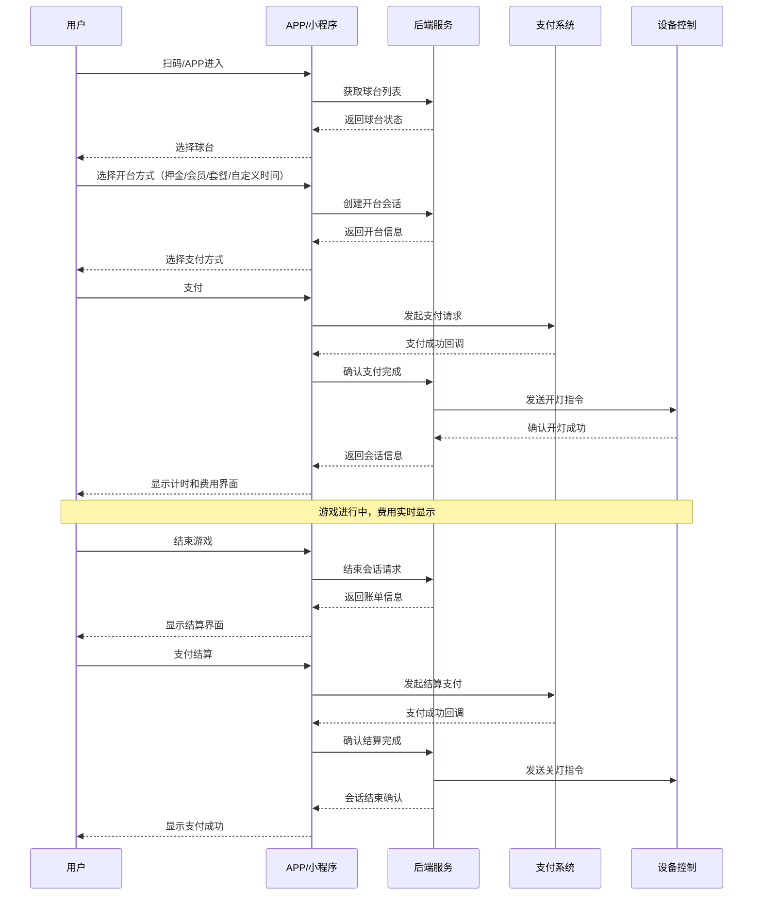
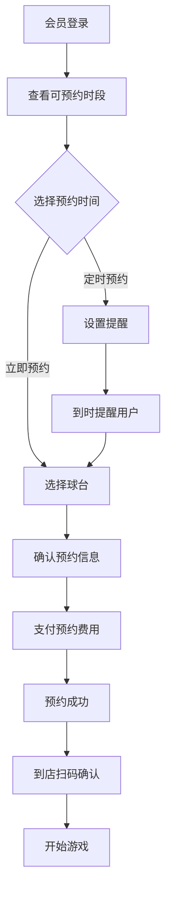

# 👥 1.3 角色与使用场景

> **当前位置**: [首页](../自助台球系统项目文档.md) > [项目概述](README.md) > 角色与使用场景

## 🎭 系统角色定义

### 用户角色分类

---

## 👤 终端用户角色

### 1. 普通顾客 (Casual Customer)

#### 角色特征
- **年龄段**: 18-45岁
- **技术水平**: 中等，熟悉移动支付
- **使用频率**: 偶尔（月1-2次）
- **消费特点**: 价格敏感，注重便利性

#### 典型用户画像
> **张小明** - 25岁软件工程师  
> 工作压力大，偶尔和朋友来台球厅放松。希望操作简单，结账快速，不愿意排队等服务员。

#### 主要需求
- ✅ **快速开台**: 扫码即可开始游戏
- ✅ **透明计费**: 实时显示费用和剩余时间
- ✅ **便捷支付**: 支持微信、支付宝等常用支付方式
- ✅ **简单操作**: 界面简洁，操作步骤最少

#### 关键场景
1. **扫码开台** → **支付** → **游戏过程** → **查看费用** → **结束**
2. **预定开台**→ **到店确认** → **开始游戏** → **结束结算**
3. **游戏中途** → **换台**、**延长时间** → **结束离开**

---

### 2. 会员用户 (VIP Member)

#### 角色特征
- **年龄段**: 25-50岁
- **技术水平**: 中高等
- **使用频率**: 频繁（周2-3次）
- **消费特点**: 价值导向，注重服务质量

#### 典型用户画像
> **王总** - 35岁企业高管  
> 台球爱好者，每周固定时间和商业伙伴切磋。重视服务品质，愿意为优质体验付费。

#### 主要需求
- ✅ **会员特权**: 优先预约、专属折扣、积分奖励
- ✅ **预约功能**: 提前预约心仪的时间段和球台
- ✅ **消费记录**: 详细的历史记录和消费分析
- ✅ **个性化服务**: 定制化推荐和专属客服

#### 关键场景
1. **提前预约** → **到店确认** → **会员开台** → **享受折扣**
2. **充值续费** → **查看积分** → **兑换优惠** → **推荐朋友**

---

### 3. 企业客户 (Corporate Client)

#### 角色特征
- **类型**: 公司团建、商务接待
- **决策模式**: 集体决策
- **消费特点**: 批量消费，注重效率

#### 典型用户画像
> **李HR** - 30岁人力资源经理  
> 负责组织公司团队建设活动，需要能容纳10-20人的场地和便捷的批量结算方式。

#### 主要需求
- ✅ **批量预约**: 同时预约多个球台
- ✅ **集中结算**: 统一账单和发票开具
- ✅ **团队管理**: 分组管理和时间协调
- ✅ **活动套餐**: 团建专属套餐和优惠政策

---

## 👨‍💼 管理用户角色

### 1. 门店经理 (Store Manager)

#### 角色特征
- **职责范围**: 门店日常运营管理
- **关注重点**: 营收、客户满意度、设备正常率
- **技能水平**: 管理经验丰富，基础IT技能

#### 主要需求
- 📊 **实时监控**: 门店运营状态实时掌握
- 💰 **营收分析**: 日/周/月收入统计和趋势分析
- 🔧 **设备管理**: 球台状态监控和故障处理
- 👥 **客户服务**: 处理客户投诉和问题反馈

#### 典型工作场景

---

### 2. 财务人员 (Finance Staff)

#### 角色特征
- **职责范围**: 财务核算、对账、报表
- **关注重点**: 数据准确性、合规性
- **技能水平**: 财务专业，基础系统操作

#### 主要需求
- 📈 **财务报表**: 收入、成本、利润分析
- 🔍 **对账功能**: 与第三方支付平台对账
- 📋 **流水查询**: 详细的交易记录查询
- 📊 **数据导出**: Excel格式的报表导出

---

### 3. 运维人员 (Operations Staff)

#### 角色特征
- **职责范围**: 系统维护、技术支持
- **关注重点**: 系统稳定性、性能优化
- **技能水平**: 技术专业，系统管理经验

#### 主要需求
- 🖥️ **系统监控**: 服务器性能、网络状态
- 🔧 **维护工具**: 数据备份、日志分析
- ⚠️ **告警处理**: 系统异常告警和处理
- 📱 **移动运维**: 移动端运维管理工具

---

## 🎯 核心使用场景

### 场景1: 即时开台消费（典型流程）

用户可通过扫码或APP进入系统，按照以下流程完成开台与结算：

1. **扫码/APP进入**：用户通过扫描球台二维码或打开APP进入系统首页。
2. **选择球台**：在界面上选择空闲球台。
3. **选择开台方式**：
   - 押金开台：需支付押金后开台，游戏结束后结算退还押金。
   - 会员免押：会员用户可直接开台，无需押金。
   - 套餐开台：选择套餐（如包时/包场/团建等），按套餐规则计费。
   - 自定义时间开台：用户自定义游戏时长，按时计费。
4. **选择支付方式**：支持微信、支付宝等主流支付方式。
5. **支付成功**：完成支付后，系统自动开台，设备响应开灯。
6. **开始游戏**：进入游戏状态，界面实时显示费用和剩余时间。
7. **游戏中显示费用**：每分钟自动更新费用，用户可随时查看。
8. **结束游戏**：用户主动点击结束或时间到自动结束。
9. **支付结算**：系统生成账单，用户完成最终支付（如有补差价），设备关闭。

#### 关键节点
1. **扫码/APP进入**：2秒内识别球台信息
2. **开台响应**：3秒内完成开台操作
3. **多种开台方式**：支持押金、会员免押、套餐、自定义时间
4. **实时计费**：每分钟更新一次费用
5. **支付处理**：30秒内完成支付确认
6. **设备控制**：5秒内响应开关灯指令
7. **结算支付**：结束后自动生成账单并完成支付

---

### 场景2: 会员预约流程

---

### 场景3: 管理员日常运营

#### 晨间检查流程
1. **系统状态检查** (8:30-9:00)
   - 登录管理后台查看夜间运营数据
   - 检查设备在线状态和故障记录
   - 查看客户反馈和投诉处理

2. **设备维护** (9:00-10:00)
   - 现场检查球台和设备状态
   - 清洁球台和更换易损耗品
   - 测试灯光控制和网络连接

3. **营业准备** (10:00-10:30)
   - 更新当日活动信息和价格
   - 检查支付通道和网络稳定性
   - 确认预约信息和特殊安排

#### 运营期间监控
- **实时监控**: 每30分钟检查系统运行状态
- **客户服务**: 及时响应客户咨询和投诉
- **设备维护**: 快速处理设备故障和异常

#### 营业结束处理
- **数据核对**: 对账当日收入和支付记录
- **设备关闭**: 统一关闭球台设备和照明
- **日报生成**: 生成当日运营报告

---

## 🎪 特殊场景处理

### 异常场景1: 网络中断

**场景描述**: 门店网络临时中断，用户正在游戏中

**处理流程**:
1. **本地缓存**: 设备继续计时，本地存储数据
2. **用户通知**: 小程序显示网络异常提示
3. **恢复处理**: 网络恢复后自动同步数据
4. **补偿机制**: 网络中断时间不计费

### 异常场景2: 设备故障

**场景描述**: 球台灯光控制器故障，无法正常开关

**处理流程**:
1. **故障检测**: 系统自动检测设备离线
2. **告警通知**: 立即通知门店管理员
3. **手动介入**: 管理员现场处理或手动控制
4. **用户补偿**: 向受影响用户提供折扣或免单

### 异常场景3: 支付失败

**场景描述**: 用户游戏结束后支付失败

**处理流程**:
1. **重试机制**: 自动重试支付3次
2. **多种方式**: 提供多种支付方式选择
3. **线下处理**: 无法在线解决时转为线下处理
4. **黑名单保护**: 防止恶意逃费行为

---

## 📈 场景优先级

| 场景类型 | 优先级 | 实现阶段 | 重要程度 |
|----------|--------|----------|----------|
| **即时开台消费** | P0 | MVP | 🔴 核心功能 |
| **在线支付结算** | P0 | MVP | 🔴 核心功能 |
| **设备状态监控** | P0 | MVP | 🔴 核心功能 |
| **会员预约系统** | P1 | V0.2 | 🟡 增值功能 |
| **财务报表分析** | P1 | V0.2 | 🟡 运营功能 |
| **批量企业预约** | P2 | V0.3 | 🟢 扩展功能 |
| **营销活动管理** | P2 | V0.3 | 🟢 运营优化 |

---

## 🔗 相关章节

- **技术约束**: [约束与假设条件](约束与假设条件.md)
- **详细需求**: [需求规格说明](../02_需求规格说明/README.md)
- **系统设计**: [系统架构设计](../03_系统架构设计/README.md)
- **数据设计**: [数据库设计](../05_数据库设计/README.md)

---

**返回**: [项目概述](README.md) | **下一节**: [约束与假设条件](约束与假设条件.md)
