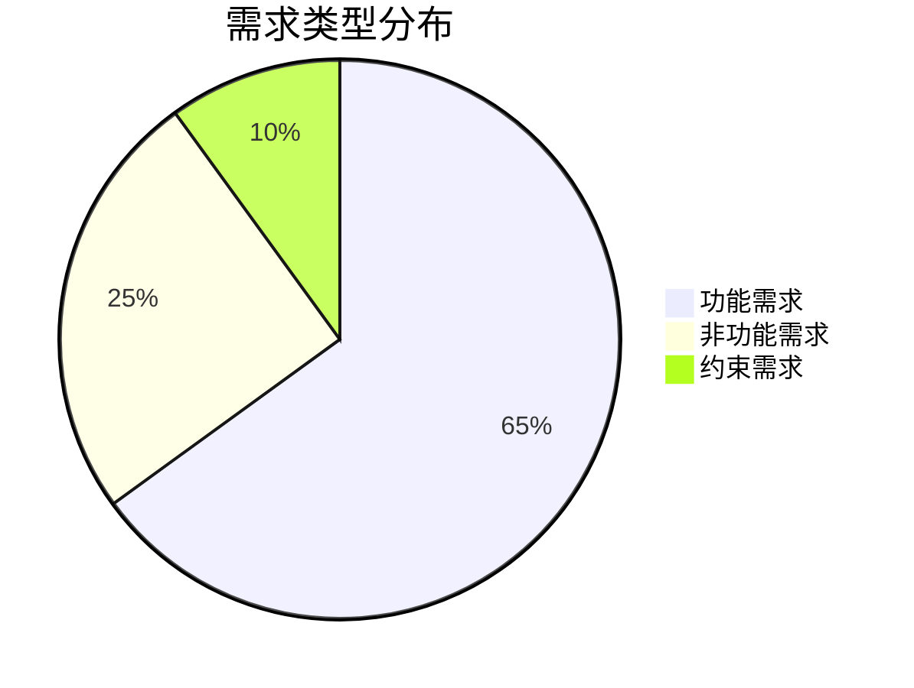
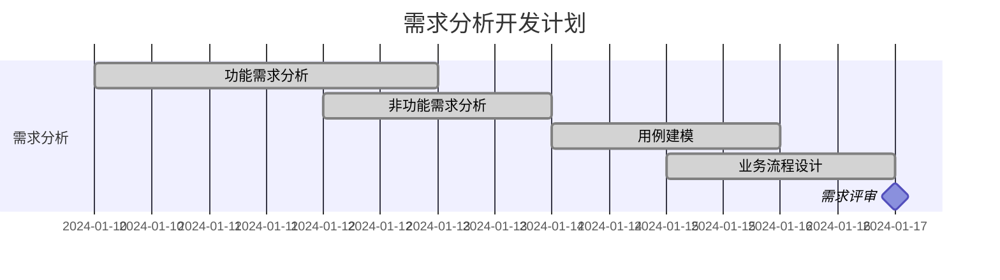

# 🧭 导航路径
[🏠 首页](../自助台球系统项目文档.md) > [📋 第二章：需求规格说明书](README.md)

# 📖 第二章：需求规格说明书 (SRS)

## 🎯 章节概述

本章节提供完整的需求规格说明书（Software Requirements Specification），详细定义自助台球系统的功能需求、非功能需求和用例建模。本文档是后续系统设计和开发的重要依据。

### 🔍 核心价值

- **需求明确性**: 精确定义系统应具备的功能和特性
- **设计指导**: 为系统架构和详细设计提供明确依据
- **测试基准**: 为功能测试和验收测试提供验证标准
- **沟通媒介**: 促进业务方与技术团队的有效沟通

## 🚀 快速索引

| 📄 文档 | 📝 内容概览 | 👥 适用读者 | ⏱️ 阅读时长 |
|---------|------------|-----------|------------|
| [📋 功能需求](功能需求.md) | 系统核心功能详细说明 | 需求分析师、开发工程师 | 15分钟 |
| [⚡ 非功能需求](非功能需求.md) | 性能、安全、可用性要求 | 架构师、运维工程师 | 12分钟 |
| [👤 用例图](用例图.md) | 用户角色与系统交互建模 | 需求分析师、测试工程师 | 10分钟 |
| [🔄 业务流程图](业务流程图.md) | 核心业务流程可视化 | 产品经理、业务分析师 | 18分钟 |

## 📊 需求概览统计

## 🎯 本章节目标

### 📋 主要目标

1. **功能完整性**: 全面覆盖台球系统的所有功能需求
2. **需求可测试性**: 确保每个需求都可以被验证和测试
3. **业务对齐**: 需求与业务目标保持一致
4. **技术可行性**: 所有需求在技术上都是可实现的

### 🔧 交付标准

- ✅ 所有功能需求都有明确的验收标准
- ✅ 非功能需求都有量化的性能指标
- ✅ 用例图完整覆盖所有用户角色
- ✅ 业务流程图清晰展示核心业务逻辑

## 📈 开发时间线

## 🔗 相关章节

### 📚 前置阅读
- [第一章：项目概述](../01_项目概述/README.md) - 了解项目背景和目标

### 📖 后续阅读
- [第三章：系统架构设计](../03_系统架构设计/README.md) - 基于需求的架构设计
- [第五章：数据库设计](../05_数据库设计/README.md) - 数据需求的具体实现

## 💡 新手入门建议

### 🎯 推荐阅读顺序
1. 首先阅读 **功能需求** 了解系统核心功能
2. 然后查看 **用例图** 理解用户交互
3. 接着阅读 **业务流程图** 掌握业务逻辑
4. 最后查看 **非功能需求** 了解技术约束

### 📞 联系方式
- 需求相关问题：需求分析师
- 技术可行性咨询：架构师
- 业务逻辑确认：产品经理
