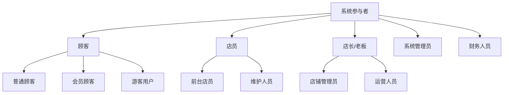
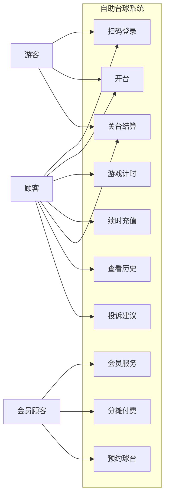
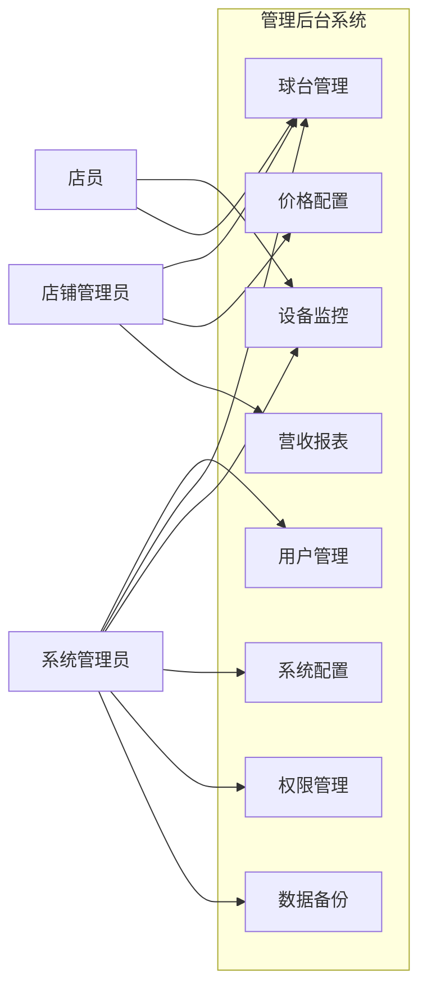
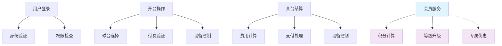
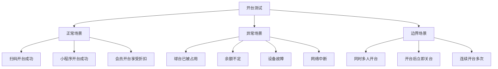

# 🧭 导航路径
[🏠 首页](../自助台球系统项目文档.md) > [📋 第二章：需求规格说明书](README.md) > [👤 用例图](用例图.md)

# 👤 2.3 系统用例建模

## 🎯 用例建模概述

用例图是从用户角度描述系统功能的重要工具，展示了不同角色（参与者）与系统的交互方式，是功能需求的可视化表达。

## 👥 系统参与者 (Actors)

### 主要参与者

### 参与者详细描述

| 参与者 | 描述 | 主要职责 |
|--------|------|----------|
| **普通顾客** | 注册用户，无会员等级 | 开台、付费、基础功能使用 |
| **会员顾客** | 具有会员等级的用户 | 享受会员权益、积分兑换 |
| **游客用户** | 未注册的临时用户 | 临时开台、基础付费功能 |
| **前台店员** | 门店服务人员 | 协助顾客、处理异常、现金收银 |
| **维护人员** | 设备维护技术人员 | 设备检修、故障处理 |
| **店铺管理员** | 门店管理人员 | 门店配置、员工管理、经营分析 |
| **运营人员** | 运营管理人员 | 活动配置、会员管理、营销推广 |
| **系统管理员** | 技术管理人员 | 系统配置、用户权限、技术支持 |
| **财务人员** | 财务管理人员 | 财务对账、报表审核、结算管理 |

## 🏓 核心用例图

### 顾客用例图

### 管理员用例图

## 📋 详细用例规格说明

### UC-001: 用户开台

**参与者**: 顾客（主要）、店员（次要）
**前置条件**: 用户已登录，选择的球台处于空闲状态
**后置条件**: 球台状态变更为使用中，开始计时计费

**主要流程**:
1. 顾客扫描球台二维码或在小程序中选择球台
2. 系统验证球台状态是否可用
3. 系统验证用户身份和付费方式
4. 系统创建使用会话，开始计时
5. 系统控制球台灯光开启
6. 系统向用户发送开台成功通知

**异常流程**:
- E1: 球台不可用 → 提示选择其他球台
- E2: 余额不足 → 引导充值或绑定支付方式
- E3: 设备故障 → 自动切换维护模式，通知管理员
- E4: 网络异常 → 本地缓存，网络恢复后同步

### UC-002: 分摊付费

**参与者**: 多个顾客（主要）
**前置条件**: 存在活跃的游戏会话，发起者有权限邀请他人
**后置条件**: 费用按约定比例分摊，所有参与者确认付费

**主要流程**:
1. 发起者在游戏过程中选择"分摊付费"
2. 系统生成分摊付费链接或二维码
3. 发起者分享链接给其他参与者
4. 其他参与者扫码确认参与分摊
5. 系统计算每人应付金额
6. 所有参与者确认后同时扣费
7. 系统发送付费成功通知

**业务规则**:
- 最多支持8人分摊
- 分摊确认时限为10分钟
- 发起者可以自定义分摊比例

### UC-003: 设备监控

**参与者**: 维护人员（主要）、系统（次要）
**前置条件**: 用户具有设备监控权限
**后置条件**: 设备状态得到及时监控和处理

**主要流程**:
1. 系统实时监控设备在线状态
2. 设备定期向系统发送心跳信号
3. 系统检测到异常时自动报警
4. 维护人员接收报警信息
5. 维护人员登录后台查看设备详情
6. 维护人员进行相应处理操作

**监控指标**:
- 设备在线状态
- 灯光控制响应时间
- 网络连接质量
- 设备硬件状态

## 🔄 用例关系图

### 用例包含和扩展关系

**关系说明**:
- **包含关系（include）**: 必须执行的子用例
- **扩展关系（extend）**: 可选执行的功能扩展
- **继承关系**: 参与者之间的继承关系

## 📊 用例优先级矩阵

| 用例名称 | 业务价值 | 技术复杂度 | 开发优先级 | 测试优先级 |
|----------|----------|------------|------------|------------|
| 用户登录 | 高 | 中 | P0 | P0 |
| 开台操作 | 高 | 高 | P0 | P0 |
| 支付处理 | 高 | 高 | P0 | P0 |
| 关台结算 | 高 | 中 | P0 | P0 |
| 分摊付费 | 中 | 高 | P1 | P1 |
| 预约功能 | 中 | 中 | P1 | P2 |
| 会员管理 | 中 | 中 | P2 | P2 |
| 报表统计 | 低 | 中 | P2 | P3 |

## 🎯 用例测试场景

### 开台用例测试场景

### 测试验收标准

**功能验收**:
- ✅ 所有主流程能够正常执行
- ✅ 异常场景处理符合预期
- ✅ 用户界面友好易用
- ✅ 数据一致性得到保证

**性能验收**:
- ✅ 用例执行时间符合性能要求
- ✅ 并发场景下系统稳定
- ✅ 内存和CPU使用率合理
- ✅ 网络延迟在可接受范围

## 📈 用例进化规划

### 版本1.0 核心用例
- 用户登录注册
- 基础开台关台
- 简单支付结算
- 基础设备控制

### 版本2.0 增强用例  
- 会员管理系统
- 预约功能
- 分摊付费
- 营销活动

### 版本3.0 高级用例
- 智能推荐
- 数据分析
- 多门店管理
- API开放平台

## 🔗 相关文档
- [功能需求](功能需求.md) - 详细功能规格说明
- [业务流程图](业务流程图.md) - 业务流程可视化
- [非功能需求](非功能需求.md) - 性能和质量要求
- [测试用例设计](../09_测试方案/README.md) - 基于用例的测试设计
