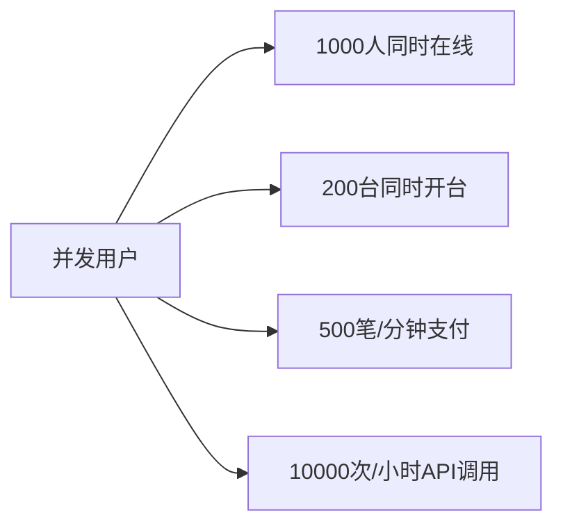
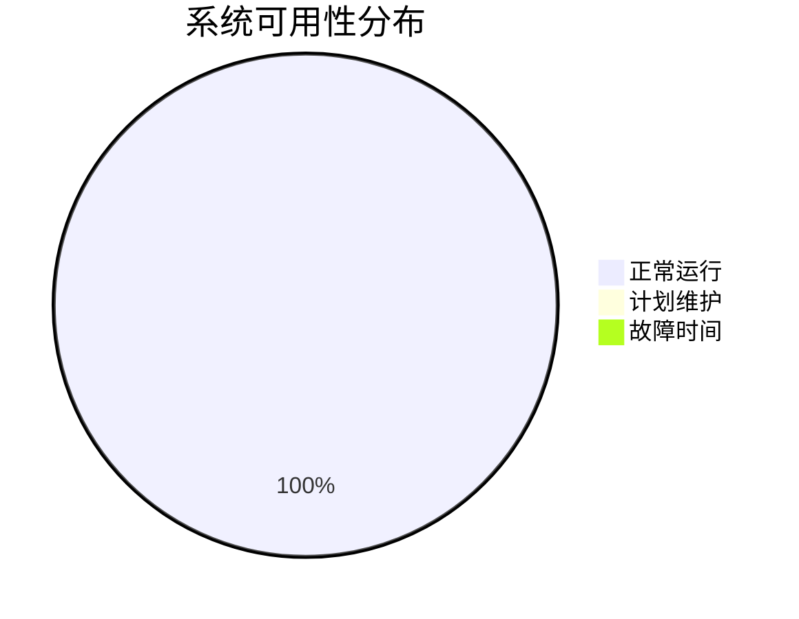
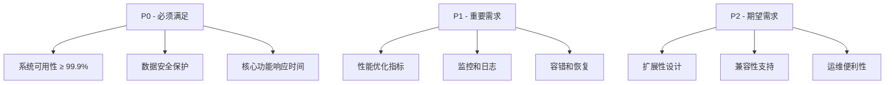

# 🧭 导航路径
[🏠 首页](../../README.md) > [📋 第二章：需求规格说明书](README.md) > [⚡ 非功能需求](非功能需求.md)

# ⚡ 2.2 非功能需求规格说明

## 🎯 非功能需求概述

非功能需求定义了系统在性能、安全、可用性等方面的质量属性要求，是系统架构设计和技术选型的重要依据。

## 📈 1. 性能需求 (Performance Requirements)

### 1.1 响应时间要求

| 功能模块 | 响应时间要求 | 峰值响应时间 | 备注 |
|---------|-------------|-------------|------|
| 用户登录 | < 2秒 | < 5秒 | 包含第三方认证 |
| 开台操作 | < 3秒 | < 8秒 | 包含设备控制 |
| 支付处理 | < 10秒 | < 30秒 | 包含第三方支付 |
| 数据查询 | < 1秒 | < 3秒 | 普通业务查询 |
| 报表生成 | < 30秒 | < 2分钟 | 复杂统计报表 |

### 1.2 吞吐量要求

**具体指标**:
- **并发用户数**: 支持1000个用户同时在线使用
- **并发开台**: 支持200个球台同时开台操作
- **支付并发**: 支持500笔/分钟的支付交易
- **API吞吐**: 支持10000次/小时的API调用

### 1.3 数据处理能力

- **数据库查询**: 单表查询 < 100ms，复杂联表查询 < 500ms
- **批量处理**: 支持10000条记录的批量操作，完成时间 < 30秒
- **实时计算**: 实时计费计算延迟 < 1秒
- **数据同步**: 多系统间数据同步延迟 < 5秒

## 🔒 2. 安全性需求 (Security Requirements)

### 2.1 数据安全

**敏感数据保护**:
- 用户密码采用bcrypt加密存储
- 支付信息采用AES-256加密
- 数据传输采用HTTPS协议
- 数据库连接采用SSL加密

**数据脱敏**:
- 手机号中间4位脱敏显示
- 身份证号仅显示前3位后3位
- 支付账号仅显示后4位
- 日志记录不包含敏感信息

### 2.2 访问控制

**身份认证**:
- 支持多因素认证（MFA）
- JWT Token有效期 ≤ 24小时
- 刷新Token有效期 ≤ 30天
- 异常登录自动锁定账户

**权限管理**:
- 基于RBAC的权限控制
- 最小权限原则
- 权限变更审计日志
- 敏感操作二次确认

### 2.3 系统安全

**安全防护**:
- SQL注入防护
- XSS攻击防护  
- CSRF攻击防护
- 暴力破解防护（限流+验证码）

**安全监控**:
- 异常访问实时监控
- 安全事件自动报警
- 安全审计日志完整记录
- 入侵检测与响应

## 🛡️ 3. 可用性需求 (Availability Requirements)

### 3.1 系统可用性

**可用性指标**:
- **系统可用性**: ≥ 99.9% (年停机时间 < 8.76小时)
- **业务可用性**: ≥ 99.95% (核心业务功能)
- **数据可用性**: ≥ 99.99% (数据完整性保证)

### 3.2 容错设计

**故障处理**:
- 服务降级策略：非核心功能优先降级
- 熔断机制：异常率超过10%时自动熔断
- 限流保护：API调用频率限制
- 重试机制：网络异常自动重试3次

**备份策略**:
- 数据库主从热备份
- 应用服务多实例部署
- 关键配置文件定期备份
- 业务数据每日全量备份

### 3.3 恢复能力

**故障恢复**:
- **RTO (恢复时间目标)**: ≤ 30分钟
- **RPO (恢复点目标)**: ≤ 15分钟
- **数据恢复**: 支持任意时间点恢复
- **服务恢复**: 自动故障转移

## 🔧 4. 可维护性需求 (Maintainability Requirements)

### 4.1 代码质量

**代码标准**:
- 代码覆盖率 ≥ 80%
- 圈复杂度 ≤ 10
- 代码重复率 ≤ 5%
- 遵循统一编码规范

**文档要求**:
- API文档完整准确
- 代码注释覆盖率 ≥ 60%
- 架构文档及时更新
- 运维手册详细完整

### 4.2 监控与日志

**监控指标**:
- 系统性能监控（CPU、内存、磁盘、网络）
- 业务指标监控（交易量、用户活跃度等）
- 错误率监控（4XX、5XX响应）
- 自定义业务监控

**日志标准**:
- 结构化日志格式（JSON）
- 统一日志级别标准
- 关键业务操作完整记录
- 日志保留期 ≥ 90天

### 4.3 部署与运维

**部署要求**:
- 支持Docker容器化部署
- 支持蓝绿部署和滚动更新
- 数据库迁移脚本自动化
- 配置管理标准化

**运维便利性**:
- 健康检查接口完善
- 服务状态实时可见
- 告警规则合理设置
- 故障定位工具完备

## 📊 5. 扩展性需求 (Scalability Requirements)

### 5.1 水平扩展

**扩展能力**:
- 应用服务支持水平扩展
- 数据库支持读写分离
- 缓存系统支持集群部署
- 消息队列支持分布式部署

**扩展指标**:
- 单机支持100个并发用户
- 支持10个应用实例集群
- 数据库支持5个只读副本
- 缓存集群支持10个节点

### 5.2 垂直扩展

**资源扩展**:
- CPU：支持多核扩展至32核
- 内存：支持扩展至128GB
- 存储：支持SSD存储扩展至10TB
- 网络：支持万兆网卡

### 5.3 业务扩展

**业务适应性**:
- 支持多门店部署
- 支持多种运营模式
- 支持个性化配置
- 支持第三方系统集成

## 🌍 6. 兼容性需求 (Compatibility Requirements)

### 6.1 浏览器兼容性

| 浏览器 | 版本要求 | 支持程度 |
|--------|----------|----------|
| Chrome | ≥ 88 | 完全支持 |
| Safari | ≥ 14 | 完全支持 |
| Firefox | ≥ 85 | 完全支持 |
| Edge | ≥ 88 | 完全支持 |
| IE | 不支持 | - |

### 6.2 移动端兼容性

- **iOS**: ≥ 13.0
- **Android**: ≥ 8.0 (API Level 26)
- **微信小程序**: 最新版本
- **响应式设计**: 适配多种屏幕尺寸

### 6.3 系统兼容性

**服务器环境**:
- **操作系统**: Linux (Ubuntu 20.04+, CentOS 8+)
- **容器平台**: Docker 20.10+, Kubernetes 1.20+
- **数据库**: MySQL 8.0+, Redis 6.0+
- **.NET**: .NET 6.0+

## 📏 7. 合规性需求 (Compliance Requirements)

### 7.1 法律法规

- **数据保护**: 遵循《个人信息保护法》
- **网络安全**: 符合《网络安全法》要求
- **支付合规**: 符合人民银行支付业务规定
- **税务合规**: 支持电子发票和税务申报

### 7.2 行业标准

- **信息安全**: 符合ISO 27001标准
- **质量管理**: 符合ISO 9001标准
- **API设计**: 遵循RESTful API设计规范
- **数据格式**: 遵循JSON和XML标准

## 🎯 非功能需求优先级

## 🔍 验证方法

### 性能测试
- **压力测试**: 验证系统在高负载下的表现
- **负载测试**: 验证系统的处理能力上限
- **性能基准测试**: 建立性能基准线

### 安全测试
- **渗透测试**: 模拟攻击验证安全防护
- **安全扫描**: 自动化安全漏洞检测
- **合规性审计**: 第三方安全评估

### 可用性测试
- **故障注入**: 模拟故障验证恢复能力
- **灾难恢复演练**: 验证备份和恢复策略
- **监控有效性验证**: 验证告警和监控

## 🔗 相关文档
- [功能需求](功能需求.md) - 功能需求详细说明
- [系统架构设计](../03_系统架构设计/README.md) - 架构设计方案
- [性能测试方案](../09_测试方案/README.md) - 性能测试计划
- [安全设计方案](../03_系统架构设计/README.md) - 系统安全设计
