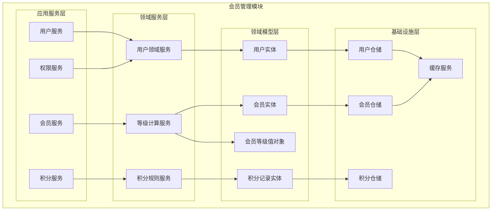
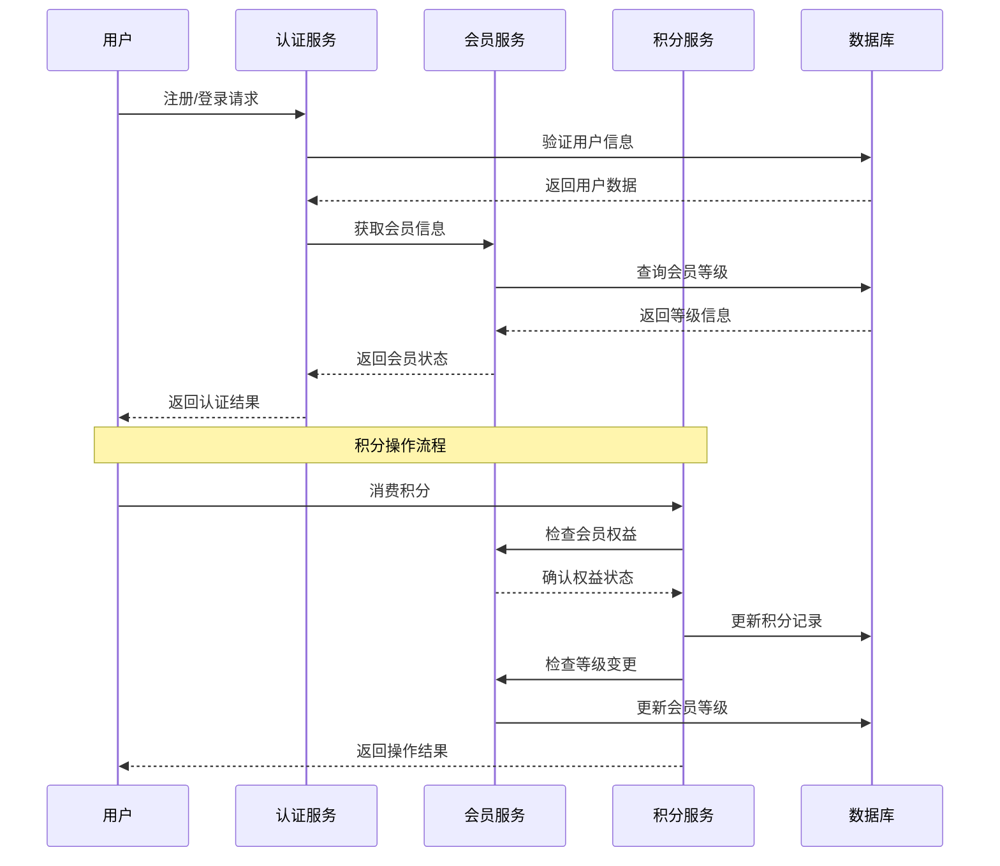
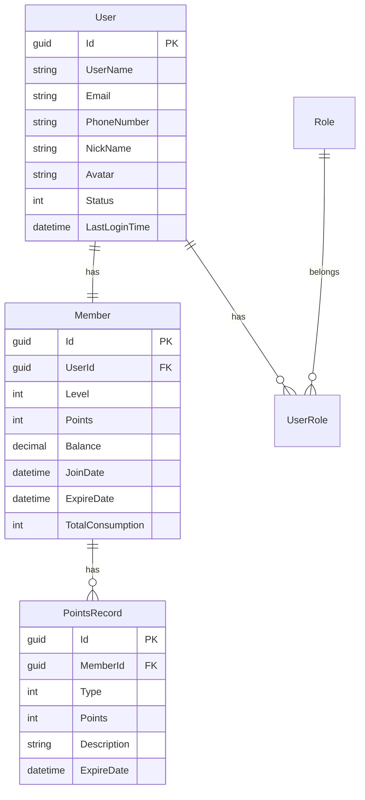

# 4.1 会员管理模块（Members）

<!-- Breadcrumb Navigation -->
**导航路径**: [🏠 项目文档](../自助台球系统项目文档.md) > [📦 模块设计](README.md) > 🏃 会员管理模块

<!-- Keywords for Search -->
**关键词**: `会员管理` `用户系统` `积分体系` `等级管理` `Wolverine` `垂直切片`

---

> ## ⚠️ 架构实现说明
> 
> 本文档描述会员管理模块的**业务需求和功能说明**。
> 
> **架构实现已迁移至 Wolverine + 垂直切片架构**。下文中的架构图和代码示例使用旧的 ABP 分层架构术语作为业务理解参考。
> 
> ### 📚 实际架构实现请参考：
> 
> 1. **[Wolverine模块化架构蓝图](../03_系统架构设计/Wolverine模块化架构蓝图.md)** ⭐⭐⭐
>    - 查看 Members 模块的完整垂直切片实现方式
> 
> 2. **[系统模块划分 - Members 模块](../03_系统架构设计/系统模块划分.md#7-members-模块会员体系)** ⭐⭐
>    - Members 模块的功能切片、领域模型、事件定义
> 
> 3. **[Wolverine快速上手指南](../03_系统架构设计/Wolverine快速上手指南.md)** ⭐⭐⭐
>    - 如何实现会员相关功能（RegisterMember、TopUpBalance 等）
> 
> ### 🔄 架构变更要点：
> 
> | 旧架构（本文档） | 新架构（Wolverine） | 说明 |
> |----------------|-------------------|------|
> | 应用服务层 (Application) | Handler | Handler 即应用服务 |
> | 领域服务层 (Domain Service) | Handler 内联或共享 Domain Service | 按需决定 |
> | 仓储 (Repository) | IDocumentSession (Marten) | 直接使用 Marten 会话 |
> | `IUserAppService` | `RegisterMemberHandler` 等 | 按功能切片组织 |
> | `UserController` | `RegisterMemberEndpoint` | Wolverine HTTP 端点 |
> 
> ### 📁 新架构目录结构：
> 
> ```
> src/Modules/Members/
> ├── RegisterMember/
> │   ├── RegisterMember.cs          # Command
> │   ├── RegisterMemberHandler.cs   # Handler
> │   ├── RegisterMemberEndpoint.cs  # HTTP 端点
> │   └── RegisterMemberValidator.cs # 验证器
> ├── TopUpBalance/
> │   ├── TopUpBalance.cs
> │   └── TopUpBalanceHandler.cs
> ├── UpdateMemberProfile/
> ├── GetMember/
> ├── Events/
> │   ├── MemberRegistered.cs
> │   └── BalanceToppedUp.cs
> └── Member.cs                      # 聚合根
> ```

---

## 📋 模块概述

会员管理模块是自助台球系统的核心用户模块，负责用户的注册登录、会员等级管理、积分累计消费、用户画像分析等功能。该模块为其他业务模块提供统一的用户身份认证和权限管理服务。

### 核心职责

- 🔐 **用户身份管理**: 注册、登录、认证授权
- 🏆 **会员等级体系**: 等级划分、权益管理、升级规则
- 🎯 **积分系统**: 积分获取、消费、兑换管理
- 👥 **用户画像**: 行为分析、偏好统计、精准营销
- 📱 **多端账户**: 支持Web、移动端、小程序统一账户

---

## 🏗️ 架构设计

### 模块架构图



### 业务流程图



---

## 📊 数据模型设计

### 核心实体

#### 用户实体 (User)

```csharp
public class User : AuditedAggregateRoot<Guid>
{
    public string UserName { get; set; }
    public string Email { get; set; }
    public string PhoneNumber { get; set; }
    public string NickName { get; set; }
    public string Avatar { get; set; }
    public UserStatus Status { get; set; }
    public DateTime? LastLoginTime { get; set; }
    public string LastLoginIp { get; set; }
    
    // 导航属性
    public Member Member { get; set; }
    public ICollection<UserRole> UserRoles { get; set; }
}

public enum UserStatus
{
    Active = 1,      // 激活
    Inactive = 0,    // 未激活
    Suspended = -1   // 停用
}
```

#### 会员实体 (Member)

```csharp
public class Member : AuditedEntity<Guid>
{
    public Guid UserId { get; set; }
    public MemberLevel Level { get; set; }
    public int Points { get; set; }
    public decimal Balance { get; set; }
    public DateTime JoinDate { get; set; }
    public DateTime? ExpireDate { get; set; }
    public int TotalConsumption { get; set; }
    public int TotalPlayTime { get; set; }
    
    // 导航属性
    public User User { get; set; }
    public ICollection<PointsRecord> PointsRecords { get; set; }
}

public enum MemberLevel
{
    Bronze = 1,   // 铜牌会员
    Silver = 2,   // 银牌会员
    Gold = 3,     // 金牌会员
    Platinum = 4, // 白金会员
    Diamond = 5   // 钻石会员
}
```

#### 积分记录实体 (PointsRecord)

```csharp
public class PointsRecord : CreationAuditedEntity<Guid>
{
    public Guid MemberId { get; set; }
    public PointsType Type { get; set; }
    public int Points { get; set; }
    public string Description { get; set; }
    public string RelatedOrderId { get; set; }
    public DateTime ExpireDate { get; set; }
    
    // 导航属性
    public Member Member { get; set; }
}

public enum PointsType
{
    Earned = 1,    // 获得
    Consumed = 2,  // 消费
    Expired = 3,   // 过期
    Gift = 4       // 赠送
}
```

### 实体关系图



---

## 🔧 接口设计

### 用户管理接口

```csharp
public interface IUserAppService : IApplicationService
{
    Task<UserDto> RegisterAsync(RegisterDto input);
    Task<LoginResultDto> LoginAsync(LoginDto input);
    Task<UserDto> GetCurrentUserAsync();
    Task<UserDto> UpdateProfileAsync(UpdateUserDto input);
    Task ChangePasswordAsync(ChangePasswordDto input);
    Task SendVerificationCodeAsync(string phoneNumber);
    Task ResetPasswordAsync(ResetPasswordDto input);
}
```

### 会员管理接口

```csharp
public interface IMemberAppService : IApplicationService
{
    Task<MemberDto> GetMemberInfoAsync(Guid userId);
    Task<MemberDto> UpgradeMemberLevelAsync(Guid memberId);
    Task<List<MemberBenefitDto>> GetMemberBenefitsAsync(MemberLevel level);
    Task<MemberStatisticsDto> GetMemberStatisticsAsync(Guid memberId);
    Task<PagedResultDto<MemberDto>> GetMemberListAsync(GetMemberListDto input);
}
```

### 积分管理接口

```csharp
public interface IPointsAppService : IApplicationService
{
    Task<int> GetPointsBalanceAsync(Guid memberId);
    Task<PointsRecordDto> AddPointsAsync(AddPointsDto input);
    Task<PointsRecordDto> ConsumePointsAsync(ConsumePointsDto input);
    Task<PagedResultDto<PointsRecordDto>> GetPointsHistoryAsync(GetPointsHistoryDto input);
    Task<List<PointsRuleDto>> GetPointsRulesAsync();
}
```

---

## 📋 业务规则

### 会员等级规则

| 等级 | 条件 | 权益 |
|------|------|------|
| 铜牌 | 新用户默认 | 基础折扣5% |
| 银牌 | 消费满500元 | 折扣8%，生日优惠券 |
| 金牌 | 消费满2000元 | 折扣10%，免费时长30分钟/月 |
| 白金 | 消费满5000元 | 折扣12%，免费时长60分钟/月 |
| 钻石 | 消费满10000元 | 折扣15%，免费时长120分钟/月 |

### 积分规则

**获取规则**:
- 💰 消费1元获得1积分
- 🎂 生日当天额外100积分
- 📝 完成评价获得10积分
- 👥 邀请好友注册获得50积分

**消费规则**:
- 💵 100积分 = 1元现金
- ⏰ 500积分 = 免费游戏1小时
- 🎁 1000积分 = 专属礼品兑换
- 🏆 积分有效期为获得后12个月

---

## ⚡ 性能优化

### 缓存策略

```csharp
// 用户信息缓存（30分钟）
[CachePut(CacheNames.User, "{userId}", Duration = 1800)]
public async Task<UserDto> GetUserAsync(Guid userId)

// 会员等级缓存（1小时）
[CachePut(CacheNames.MemberLevel, "{memberId}", Duration = 3600)]
public async Task<MemberLevel> GetMemberLevelAsync(Guid memberId)

// 积分余额缓存（10分钟）
[CachePut(CacheNames.Points, "{memberId}", Duration = 600)]
public async Task<int> GetPointsBalanceAsync(Guid memberId)
```

### 性能指标

- 👤 用户登录响应时间 < 200ms
- 🔍 会员信息查询 < 100ms
- 📊 积分计算处理 < 50ms
- 📈 并发用户支持 > 10000

---

## 🔒 安全控制

### 权限设计

```csharp
public static class MemberPermissions
{
    public const string Default = GroupName + ".Default";
    public const string ViewProfile = GroupName + ".ViewProfile";
    public const string EditProfile = GroupName + ".EditProfile";
    public const string ManagePoints = GroupName + ".ManagePoints";
    public const string ViewStatistics = GroupName + ".ViewStatistics";
}
```

### 数据保护

- 🔐 密码使用BCrypt加密存储
- 🛡️ 敏感信息（手机号、邮箱）脱敏显示
- 🚫 API接口实现频率限制
- 📱 短信验证码5分钟有效期

---

## 📈 监控指标

### 业务指标

- 👥 日活跃用户数 (DAU)
- 📊 会员注册转化率
- 💰 会员消费频次
- 🎯 积分使用率

### 技术指标

- ⚡ 接口平均响应时间
- 🔄 缓存命中率
- ❌ 错误率统计
- 📊 并发连接数

---

## 🔗 相关文档

- **上级文档**: [模块设计总览](README.md)
- **关联文档**: [支付模块](支付模块.md) | [台球桌计费模块](台球桌计费模块.md)
- **技术文档**: [用户认证设计](../07_API文档/认证授权.md)
- **返回**: [项目文档首页](../自助台球系统项目文档.md)

---

*最后更新: 2024-01-15 | 版本: v1.0.0*
