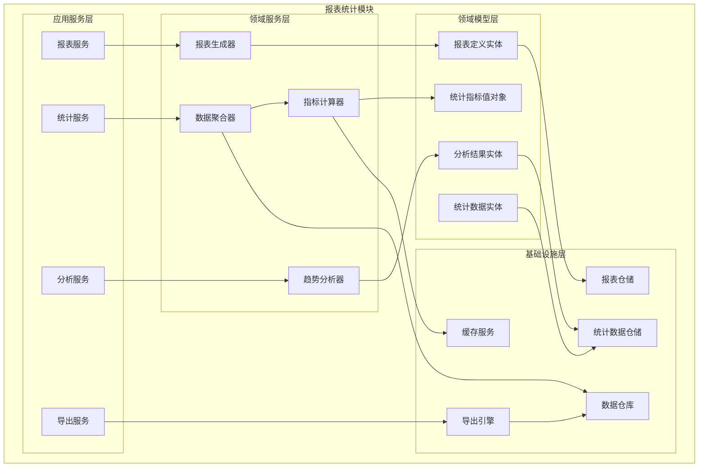
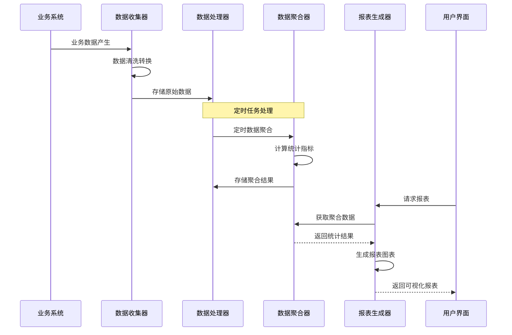
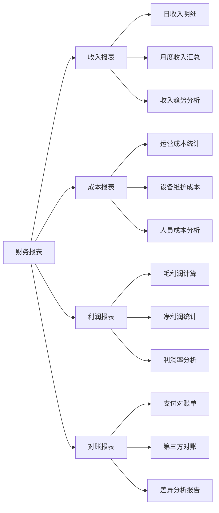
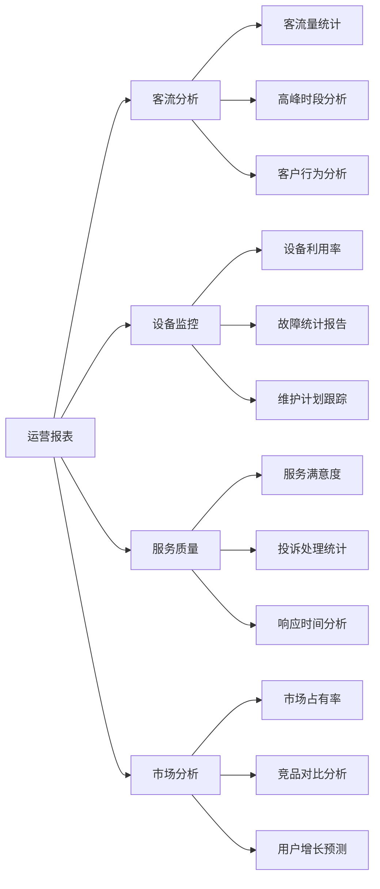

# 4.5 报表与统计模块（Reports）

<!-- Breadcrumb Navigation -->
**导航路径**: [🏠 项目文档](../自助台球系统项目文档.md) > [📦 模块设计](README.md) > 📊 报表与统计模块

<!-- Keywords for Search -->
**关键词**: `报表统计` `数据分析` `业务指标` `可视化` `Wolverine` `垂直切片`

---

> ## ⚠️ 架构实现说明
> 
> 本文档描述报表与统计模块的**业务需求和功能说明**。
> 
> **架构实现已迁移至 Wolverine + 垂直切片架构**。下文中的架构图和代码示例使用旧的 ABP 分层架构术语作为业务理解参考。
> 
> ### 📚 实际架构实现请参考：
> 
> 1. **[Wolverine模块化架构蓝图](../03_系统架构设计/Wolverine模块化架构蓝图.md)** ⭐⭐⭐
>    - 查看 Reports 模块的完整垂直切片实现方式（定时任务、数据聚合）
> 
> 2. **[Wolverine框架介绍 - 2.5节 后台任务](../03_系统架构设计/Wolverine框架介绍.md#25-后台任务和定时任务)** ⭐⭐
>    - 使用 Wolverine 定时任务生成报表
> 
> 3. **[Marten数据访问](../03_系统架构设计/Marten数据访问.md)** ⭐⭐
>    - 使用 Marten 进行复杂数据查询和聚合
> 
> ### 📁 新架构目录结构：
> 
> ```
> src/Modules/Reports/
> ├── GenerateDailyReport/
> │   ├── GenerateDailyReport.cs
> │   ├── GenerateDailyReportHandler.cs
> │   └── DailyReportScheduledJob.cs  # 定时任务
> ├── GetRevenueStatistics/
> │   ├── GetRevenueStatistics.cs
> │   ├── GetRevenueStatisticsHandler.cs
> │   └── GetRevenueStatisticsEndpoint.cs
> ├── GetMemberStatistics/
> ├── GetTableUsageStatistics/
> └── DailyReport.cs                   # 报表聚合根
> ```
> 
> ### 🔄 架构变更要点：
> 
> | 旧架构（本文档） | 新架构（Wolverine） | 说明 |
> |----------------|-------------------|------|
> | 报表服务 (ReportAppService) | GenerateDailyReportHandler | 按功能切片 |
> | 定时任务 (Background Job) | Wolverine Scheduled Job | 框架级支持 |
> | 数据聚合查询 | Marten SQL 查询 | 使用 PostgreSQL 聚合能力 |
> | 仓储 (Repository) | IDocumentSession (Marten) | 直接使用 Marten |
> 
> ### 💡 定时任务示例：
> 
> ```csharp
> // 每天凌晨 1 点生成日报
> [Schedule("0 1 * * *")]  // Cron 表达式
> public static async Task GenerateDailyReportJob(
>     IDocumentSession session,
>     ILogger<GenerateDailyReportHandler> logger)
> {
>     // 生成昨日报表
>     var yesterday = DateOnly.FromDateTime(DateTime.UtcNow.AddDays(-1));
>     await session.InvokeAsync(new GenerateDailyReport(yesterday));
> }
> ```

---

## 📋 模块概述

报表与统计模块为自助台球系统提供全方位的数据分析和报表服务，包括业务数据统计、趋势分析、用户行为分析、财务报表等功能。该模块为运营决策提供数据支撑，帮助优化业务运营和提升用户体验。

### 核心职责

- 📈 **业务指标统计**: 收入、客流量、设备利用率等核心指标
- 👥 **用户行为分析**: 用户画像、消费习惯、活跃度分析
- 💰 **财务报表**: 收支明细、对账报表、利润分析
- 🏪 **运营分析**: 门店对比、时段分析、趋势预测
- 📊 **可视化展示**: 图表展示、仪表板、数据导出

---

## 🏗️ 架构设计

### 模块架构图



### 数据处理流程



---

## 📊 数据模型设计

### 核心实体

#### 报表定义实体 (ReportDefinition)

```csharp
public class ReportDefinition : AuditedAggregateRoot<Guid>
{
    public string Name { get; set; }
    public string Title { get; set; }
    public string Description { get; set; }
    public ReportCategory Category { get; set; }
    public ReportType Type { get; set; }
    public string DataSource { get; set; }
    public string QueryTemplate { get; set; }
    public string ParametersConfig { get; set; }
    public string ChartConfig { get; set; }
    public string[] RequiredRoles { get; set; }
    public bool IsEnabled { get; set; }
    public int SortOrder { get; set; }
    public TimeSpan? CacheTimeout { get; set; }
    
    // 导航属性
    public ICollection<ReportExecution> Executions { get; set; }
}

public enum ReportCategory
{
    Business = 1,    // 业务报表
    Financial = 2,   // 财务报表
    Operational = 3, // 运营报表
    Technical = 4    // 技术报表
}

public enum ReportType
{
    Table = 1,      // 表格报表
    Chart = 2,      // 图表报表
    Dashboard = 3   // 仪表板
}
```

#### 统计数据实体 (StatisticsData)

```csharp
public class StatisticsData : CreationAuditedEntity<Guid>
{
    public string MetricName { get; set; }
    public StatisticsType Type { get; set; }
    public DateTime StatisticsDate { get; set; }
    public TimeGranularity Granularity { get; set; }
    public string Dimensions { get; set; }
    public decimal Value { get; set; }
    public string Unit { get; set; }
    public string AdditionalData { get; set; }
    public Guid? StoreId { get; set; }
}

public enum StatisticsType
{
    Revenue = 1,        // 收入
    UserCount = 2,      // 用户数
    SessionCount = 3,   // 会话数
    TableUtilization = 4, // 台球桌利用率
    DeviceStatus = 5    // 设备状态
}

public enum TimeGranularity
{
    Hour = 1,    // 小时
    Day = 2,     // 日
    Week = 3,    // 周
    Month = 4,   // 月
    Quarter = 5, // 季度
    Year = 6     // 年
}
```

#### 分析结果实体 (AnalysisResult)

```csharp
public class AnalysisResult : CreationAuditedEntity<Guid>
{
    public string AnalysisName { get; set; }
    public AnalysisType Type { get; set; }
    public DateTime AnalysisDate { get; set; }
    public string InputParameters { get; set; }
    public string ResultData { get; set; }
    public string Summary { get; set; }
    public string Recommendations { get; set; }
    public decimal Confidence { get; set; }
    public DateTime? ExpiryDate { get; set; }
}

public enum AnalysisType
{
    TrendAnalysis = 1,      // 趋势分析
    UserSegmentation = 2,   // 用户分群
    PredictiveAnalysis = 3, // 预测分析
    AnomalyDetection = 4    // 异常检测
}
```

---

## 🔧 接口设计

### 报表管理接口

```csharp
public interface IReportAppService : IApplicationService
{
    Task<List<ReportDefinitionDto>> GetReportsAsync(GetReportsDto input);
    Task<ReportResultDto> ExecuteReportAsync(ExecuteReportDto input);
    Task<ReportDefinitionDto> CreateReportAsync(CreateReportDto input);
    Task<ReportDefinitionDto> UpdateReportAsync(Guid reportId, UpdateReportDto input);
    Task DeleteReportAsync(Guid reportId);
    Task<byte[]> ExportReportAsync(ExportReportDto input);
}
```

### 统计分析接口

```csharp
public interface IStatisticsAppService : IApplicationService
{
    Task<BusinessMetricsDto> GetBusinessMetricsAsync(GetMetricsDto input);
    Task<UserAnalyticsDto> GetUserAnalyticsAsync(GetUserAnalyticsDto input);
    Task<RevenueStatisticsDto> GetRevenueStatisticsAsync(GetRevenueStatsDto input);
    Task<DeviceUtilizationDto> GetDeviceUtilizationAsync(GetUtilizationDto input);
    Task<List<TrendDataDto>> GetTrendAnalysisAsync(GetTrendDto input);
}
```

### 仪表板接口

```csharp
public interface IDashboardAppService : IApplicationService
{
    Task<DashboardDataDto> GetDashboardDataAsync(GetDashboardDto input);
    Task<List<KpiCardDto>> GetKpiCardsAsync();
    Task<List<ChartDataDto>> GetChartDataAsync(GetChartsDto input);
    Task<AlertSummaryDto> GetAlertSummaryAsync();
    Task RefreshDashboardCacheAsync();
}
```

---

## 📈 核心业务指标

### 收入相关指标

```csharp
public class RevenueMetrics
{
    // 总收入
    public decimal TotalRevenue { get; set; }
    
    // 日收入
    public decimal DailyRevenue { get; set; }
    
    // 平均客单价
    public decimal AverageOrderValue { get; set; }
    
    // 收入增长率
    public decimal RevenueGrowthRate { get; set; }
    
    // 按时段收入分布
    public Dictionary<string, decimal> HourlyRevenue { get; set; }
    
    // 按支付方式分布
    public Dictionary<string, decimal> PaymentMethodRevenue { get; set; }
}
```

### 用户相关指标

```csharp
public class UserMetrics
{
    // 总用户数
    public int TotalUsers { get; set; }
    
    // 活跃用户数
    public int ActiveUsers { get; set; }
    
    // 新增用户数
    public int NewUsers { get; set; }
    
    // 用户留存率
    public decimal UserRetentionRate { get; set; }
    
    // 用户活跃度分布
    public Dictionary<string, int> UserActivityDistribution { get; set; }
    
    // 会员等级分布
    public Dictionary<MemberLevel, int> MemberLevelDistribution { get; set; }
}
```

### 设备利用率指标

```csharp
public class DeviceUtilizationMetrics
{
    // 总体利用率
    public decimal OverallUtilizationRate { get; set; }
    
    // 按台球桌类型利用率
    public Dictionary<TableType, decimal> UtilizationByTableType { get; set; }
    
    // 按时段利用率
    public Dictionary<string, decimal> HourlyUtilization { get; set; }
    
    // 平均使用时长
    public TimeSpan AverageUsageDuration { get; set; }
    
    // 设备故障率
    public decimal DeviceFailureRate { get; set; }
}
```

---

## 📊 报表类型

### 财务报表



### 运营报表



---

## 🎯 数据分析算法

### 趋势分析

```csharp
public class TrendAnalysisService
{
    public async Task<TrendAnalysisResult> AnalyzeTrendAsync(TrendAnalysisRequest request)
    {
        var data = await GetHistoricalDataAsync(request.MetricName, request.TimeRange);
        
        // 移动平均计算
        var movingAverage = CalculateMovingAverage(data, request.WindowSize);
        
        // 趋势方向计算
        var trendDirection = CalculateTrendDirection(movingAverage);
        
        // 季节性分析
        var seasonality = AnalyzeSeasonality(data);
        
        // 预测未来值
        var forecast = GenerateForecast(data, request.ForecastPeriods);
        
        return new TrendAnalysisResult
        {
            TrendDirection = trendDirection,
            Seasonality = seasonality,
            MovingAverage = movingAverage,
            Forecast = forecast,
            Confidence = CalculateConfidence(data, forecast)
        };
    }
    
    private List<decimal> CalculateMovingAverage(List<decimal> data, int windowSize)
    {
        var result = new List<decimal>();
        for (int i = windowSize - 1; i < data.Count; i++)
        {
            var window = data.Skip(i - windowSize + 1).Take(windowSize);
            result.Add(window.Average());
        }
        return result;
    }
}
```

### 用户分群算法

```csharp
public class UserSegmentationService
{
    public async Task<UserSegmentationResult> SegmentUsersAsync()
    {
        var users = await GetUsersWithBehaviorDataAsync();
        
        // RFM分析（最近一次消费、消费频率、消费金额）
        var rfmScores = CalculateRFMScores(users);
        
        // K-means聚类
        var clusters = PerformKMeansClustering(rfmScores, clusterCount: 5);
        
        // 用户分群标签
        var segments = AssignSegmentLabels(clusters);
        
        return new UserSegmentationResult
        {
            Segments = segments,
            SegmentStatistics = CalculateSegmentStatistics(segments),
            Recommendations = GenerateMarketingRecommendations(segments)
        };
    }
    
    private Dictionary<Guid, RFMScore> CalculateRFMScores(List<UserBehaviorData> users)
    {
        var result = new Dictionary<Guid, RFMScore>();
        
        foreach (var user in users)
        {
            result[user.UserId] = new RFMScore
            {
                Recency = CalculateRecencyScore(user.LastPurchaseDate),
                Frequency = CalculateFrequencyScore(user.PurchaseCount),
                Monetary = CalculateMonetaryScore(user.TotalAmount)
            };
        }
        
        return result;
    }
}
```

---

## ⚡ 性能优化

### 数据预聚合

```csharp
public class DataAggregationService
{
    // 定时任务：每小时聚合数据
    [Hangfire.RecurringJob("0 * * * *")]
    public async Task AggregateHourlyDataAsync()
    {
        var endTime = DateTime.Now.AddHours(-1);
        var startTime = endTime.AddHours(-1);
        
        // 聚合收入数据
        await AggregateRevenueDataAsync(startTime, endTime, TimeGranularity.Hour);
        
        // 聚合用户活动数据
        await AggregateUserActivityAsync(startTime, endTime, TimeGranularity.Hour);
        
        // 聚合设备使用数据
        await AggregateDeviceUsageAsync(startTime, endTime, TimeGranularity.Hour);
    }
    
    private async Task AggregateRevenueDataAsync(DateTime start, DateTime end, TimeGranularity granularity)
    {
        var revenueData = await _paymentRepository
            .GetPaymentsInPeriodAsync(start, end);
            
        var aggregated = revenueData
            .GroupBy(p => new { p.CreationTime.Hour, p.Channel })
            .Select(g => new StatisticsData
            {
                MetricName = "hourly_revenue",
                Type = StatisticsType.Revenue,
                StatisticsDate = new DateTime(start.Year, start.Month, start.Day, g.Key.Hour, 0, 0),
                Granularity = granularity,
                Dimensions = $"channel:{g.Key.Channel}",
                Value = g.Sum(p => p.Amount)
            });
            
        await _statisticsRepository.BulkInsertAsync(aggregated);
    }
}
```

### 缓存策略

```csharp
// 报表结果缓存（30分钟）
[CachePut(CacheNames.ReportResult, "{reportId}_{parameters}", Duration = 1800)]
public async Task<ReportResultDto> ExecuteReportAsync(ExecuteReportDto input)

// 实时指标缓存（5分钟）
[CachePut(CacheNames.RealTimeMetrics, Duration = 300)]
public async Task<BusinessMetricsDto> GetRealTimeMetricsAsync()
```

---

## 📋 报表配置示例

### 收入趋势报表配置

```json
{
  "reportId": "revenue_trend",
  "name": "收入趋势分析",
  "category": "Business",
  "type": "Chart",
  "dataSource": "statistics_data",
  "queryTemplate": "SELECT statistics_date, SUM(value) as revenue FROM statistics_data WHERE metric_name = 'daily_revenue' AND statistics_date BETWEEN @startDate AND @endDate GROUP BY statistics_date ORDER BY statistics_date",
  "parameters": [
    {
      "name": "startDate",
      "type": "date",
      "required": true,
      "defaultValue": "30DaysAgo"
    },
    {
      "name": "endDate", 
      "type": "date",
      "required": true,
      "defaultValue": "Today"
    }
  ],
  "chartConfig": {
    "type": "line",
    "xAxis": "statistics_date",
    "yAxis": "revenue",
    "title": "每日收入趋势"
  }
}
```

---

## 🔗 相关文档

- **上级文档**: [模块设计总览](README.md)
- **关联文档**: [所有业务模块](README.md#模块详细说明)
- **技术文档**: [数据仓库设计](../05_数据库设计/数据仓库.md)
- **返回**: [项目文档首页](../自助台球系统项目文档.md)

---

*最后更新: 2024-01-15 | 版本: v1.0.0*
