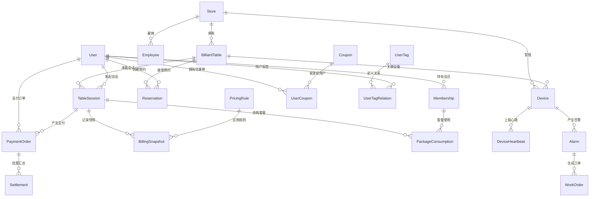
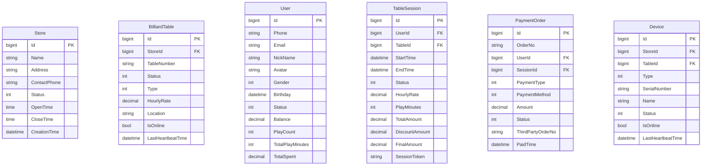
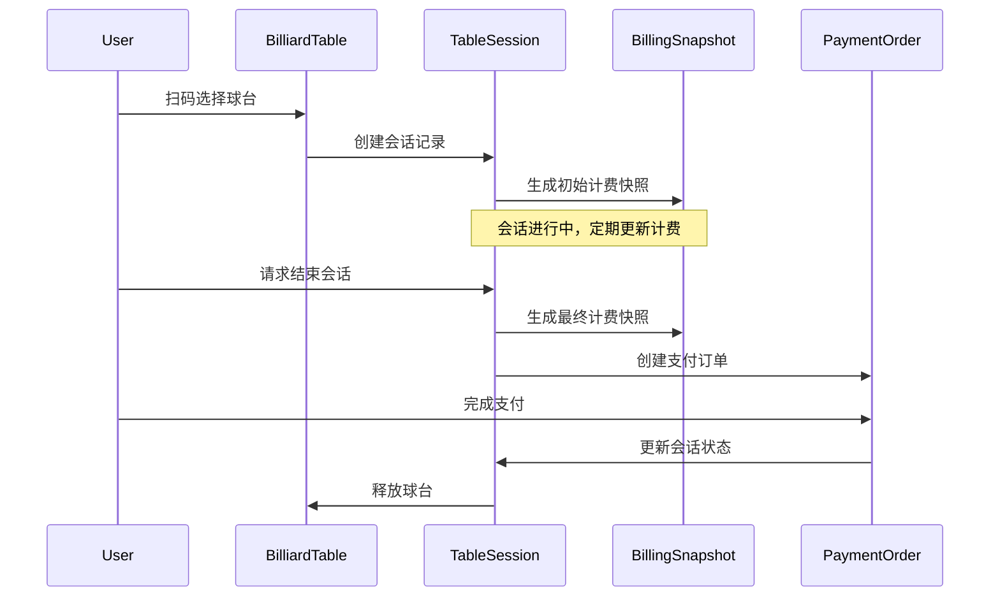
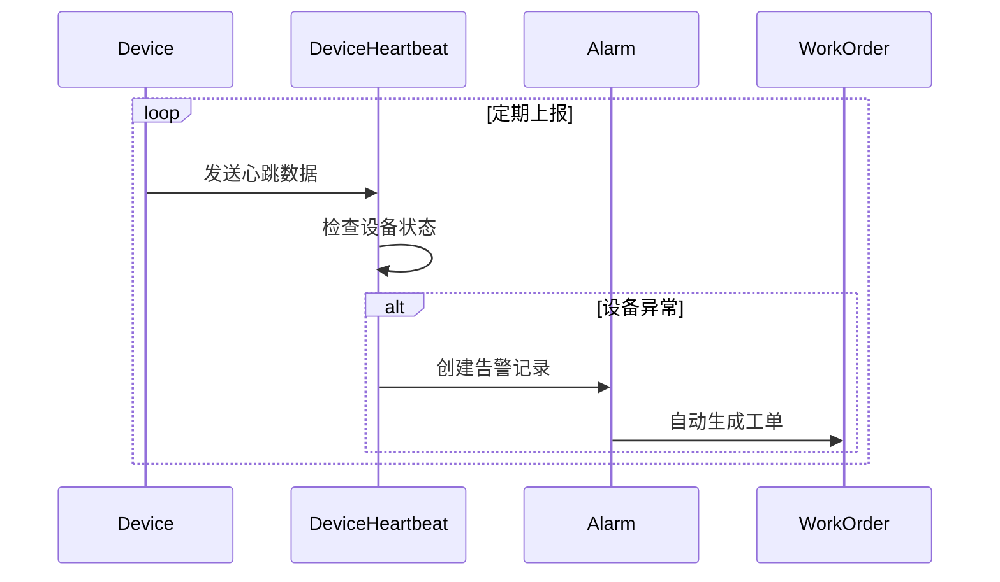

# 5.1 概念模型 (ER 图)

<!-- Breadcrumb Navigation -->
**导航路径**: [🏠 项目首页](../../README.md) > [📊 数据库设计](README.md) > 📊 概念模型 (ER 图)

<!-- Keywords for Search -->
**关键词**: `ER图` `实体关系` `数据建模` `概念设计` `数据库架构`

## 概述

本文档展示了自助台球系统的数据库概念模型和实体关系图，基于 EF Core Code First 方式设计，为系统的数据架构提供清晰的概念框架。

> 💡 **相关章节**：具体的实体定义请参考 [5.2 表结构定义](表结构定义.md)，业务逻辑说明请参考 [5.3 关键表说明](关键表说明.md)。

## 核心实体关系图

### 主要实体关系



### 实体属性概览



## 业务领域建模

### 1. 门店管理域

**核心实体**：Store, Employee, Device
**主要职责**：
- 门店基础信息管理
- 员工权限和排班管理
- 设备状态监控和维护

### 2. 球台服务域

**核心实体**：BilliardTable, TableSession, Reservation
**主要职责**：
- 球台状态管理和调度
- 用户会话生命周期管理
- 预约系统和时间管理

### 3. 用户会员域

**核心实体**：User, Membership, UserCoupon, UserTag
**主要职责**：
- 用户身份认证和信息管理
- 会员权益和套餐管理
- 用户画像和标签系统

### 4. 支付计费域

**核心实体**：PaymentOrder, BillingSnapshot, PricingRule, Settlement
**主要职责**：
- 计费规则引擎
- 支付流程管理
- 财务结算和对账

### 5. 设备监控域

**核心实体**：Device, DeviceHeartbeat, Alarm, WorkOrder
**主要职责**：
- 设备健康监控
- 故障告警和处理
- 维护工单管理

## 数据完整性约束

### 主键约束
- 所有实体都使用 `bigint` 类型的自增主键
- 继承 ABP 框架的 `Entity<long>` 基类

### 外键约束
```sql
-- 门店关联
ALTER TABLE BilliardTables ADD CONSTRAINT FK_BilliardTables_Store 
    FOREIGN KEY (StoreId) REFERENCES Stores(Id) ON DELETE CASCADE;

-- 用户会话关联
ALTER TABLE TableSessions ADD CONSTRAINT FK_TableSessions_User
    FOREIGN KEY (UserId) REFERENCES Users(Id) ON DELETE RESTRICT;

ALTER TABLE TableSessions ADD CONSTRAINT FK_TableSessions_BilliardTable
    FOREIGN KEY (TableId) REFERENCES BilliardTables(Id) ON DELETE RESTRICT;

-- 支付订单关联
ALTER TABLE PaymentOrders ADD CONSTRAINT FK_PaymentOrders_User
    FOREIGN KEY (UserId) REFERENCES Users(Id) ON DELETE RESTRICT;

ALTER TABLE PaymentOrders ADD CONSTRAINT FK_PaymentOrders_TableSession
    FOREIGN KEY (SessionId) REFERENCES TableSessions(Id) ON DELETE RESTRICT;
```

### 唯一性约束
```sql
-- 业务唯一性约束
CREATE UNIQUE INDEX IX_BilliardTables_Store_TableNumber 
    ON BilliardTables (StoreId, TableNumber);

CREATE UNIQUE INDEX IX_Users_Phone 
    ON Users (Phone) WHERE Phone IS NOT NULL;

CREATE UNIQUE INDEX IX_TableSessions_SessionToken 
    ON TableSessions (SessionToken);

CREATE UNIQUE INDEX IX_PaymentOrders_OrderNo 
    ON PaymentOrders (OrderNo);

CREATE UNIQUE INDEX IX_Devices_SerialNumber 
    ON Devices (SerialNumber);
```

## 数据流转图

### 用户开台流程



### 设备监控流程



## 索引设计策略

### 查询优化索引
```sql
-- 高频查询索引
CREATE INDEX IX_TableSessions_Table_Status_StartTime 
    ON TableSessions (TableId, Status, StartTime);

CREATE INDEX IX_PaymentOrders_User_Status_CreationTime 
    ON PaymentOrders (UserId, Status, CreationTime);

CREATE INDEX IX_DeviceHeartbeats_Device_Timestamp 
    ON DeviceHeartbeats (DeviceId, Timestamp DESC);

-- 覆盖索引减少回表
CREATE INDEX IX_BilliardTables_Store_Status_Online 
    ON BilliardTables (StoreId, Status) 
    INCLUDE (TableNumber, HourlyRate, IsOnline);
```

## 扩展性考虑

### 水平分区策略
- **DeviceHeartbeats**: 按时间分区，保留近3个月数据
- **TableSessions**: 按创建时间分区，便于历史数据归档
- **PaymentOrders**: 按支付时间分区，支持财务报表查询

### 多租户支持
- 通过 `StoreId` 实现逻辑隔离
- ABP 框架提供多租户基础设施
- 数据访问层自动过滤租户数据

---

## 📚 相关文档

### 同级文档
- [5.2 表结构定义](表结构定义.md)
- [5.3 关键表说明](关键表说明.md)
- [5.4 索引与优化](索引与优化.md)
- [5.5 数据迁移方案](数据迁移方案.md)
- [5.6 数据访问最佳实践](数据访问最佳实践.md)

### 返回上级
- [🔙 数据库设计总览](README.md)
- [🏠 项目首页](../../README.md)

### 相关章节
- [2. 需求规格说明](../02_需求规格说明/README.md)
- [4. 模块设计说明](../04_模块设计说明/README.md)
