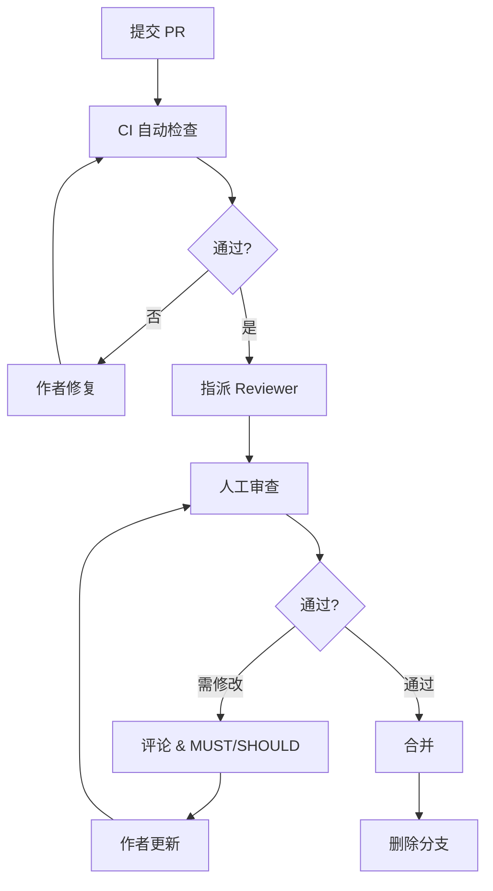

# 6.5 Code Review 流程

**导航路径**: [🏠 项目文档首页](../自助台球系统项目文档.md) > [📝 开发规范](README.md) > 👥 Code Review 流程

**关键词**: `Code Review` `质量` `协作` `PR模板` `审查流程`

---

## 1. 概述

Code Review（代码审查）用于：提升质量、传播知识、降低缺陷、增强可维护性。本文档规定审查角色、流程、清单与 SLA，并与以下文档协同：

- `Git分支规范.md`（分支 / 提交类型）
- `代码风格.md`（格式 / 命名 / 异常）
- `分层约束.md`（架构边界）
- `日志规范.md`（结构化日志与敏感信息）

> 提交类型统一参考：`Git分支规范.md` 中“提交类型（统一清单）”。

---

## 2. 审查原则

### 2.1 目标

| 维度 | 说明 | 典型关注点 |
|------|------|------------|
| 正确性 | 业务与场景符合需求 | 状态流转 / 边界条件 |
| 可维护 | 结构清晰、职责单一 | 过长方法 / 重复代码 |
| 性能 | 资源高效、无明显浪费 | N+1 / 不必要同步阻塞 |
| 安全 | 不引入漏洞 / 泄露 | 输入校验 / 日志脱敏 |
| 一致性 | 遵循团队规范 | 命名 / 分层依赖 / 异常模式 |
| 可演进 | 为未来扩展预留合理点 | 过度或不足抽象 |

### 2.2 态度

建设性、尊重、客观、及时、互相学习。评论针对“代码与设计”，不针对个人。

### 2.3 SLA（响应与完成）

| 优先级 | 场景 | 首次响应 | 初次完整审查 | 备注 |
|--------|------|----------|---------------|------|
| P0 | 线上紧急 / 阻断 | 30 分钟内 | 2 小时内 | 可跳过次要风格，补后审 |
| P1 | 待发布关键功能 | 4 小时 | 1 工作日 | 超时需提醒或换 Reviewer |
| P2 | 常规迭代 | 1 工作日 | 2 工作日 | 默认 |
| P3 | 重构 / 技术债 | 2 工作日 | 3 工作日 | 可分段审查 |

> 超 SLA：作者可 1) 提醒 2) 更换 Reviewer 3) 拆分减小认知负担。

---

## 3. Pull Request 规范

### 3.1 标题格式

优先使用 Conventional Commit 风格（与首个主要提交一致）：

```text
<type>(<scope>): <中文简述>
```

示例：

```text
feat(积分): 支持积分结算与过期回收
fix(支付): 修复签名大小写导致的验签失败
refactor(计费): 抽离计费策略为独立服务
```

允许临时 `[功能] xxx` 形式做草稿，合并前需规整。

### 3.2 作者自检清单（请求评审前必须满足）

| 类别 | 自检项 | 验证方式 | 不满足时处理 |
|------|--------|----------|---------------|
| 构建 | 本地可编译 | `dotnet build` | 修复后再建 PR |
| 格式 | 已执行格式化 | `dotnet format` | 补格式化提交 |
| 分层 | 无跨层违规 | 依赖树 / Solution | 调整到正确层 |
| 数据访问 | Application 不直接用 DbContext | 搜索 `new DbContext` | 改为仓储接口 |
| 安全 | 无硬编码 Secret/Token | grep / diff | 改用配置或 KeyVault |
| 日志 | 关键失败路径含业务标识 | 查异常/失败分支 | 添加结构化日志 |
| 迁移 | 有 Schema 变更 => 包含迁移 | EF 迁移目录 | 生成 & 命名规范化 |
| 测试 | 新逻辑有相应测试 | `dotnet test` | 补最小测试 |
| 覆盖率 | 未显著下降 | 报告对比 | 增补测试或注明原因 |
| 文档 | 公共接口/DTO 更新 | README/API 变更 | 更新对应章节 |
| Issue | 描述含 Closes/Fixes | PR 描述 | 补关键字 |

### 3.3 精简 PR 描述（最小必填）

```markdown
## 变更概述
一句话 + 必要背景

## 关联 Issue
Closes #123

## 评审关注点
列出 2~5 个 Reviewer 需优先思考的问题
```

> 完整字段（测试、风险、回滚、兼容性等）已在 `.github/pull_request_template.md` 模板中集中维护，避免重复。

### 3.4 PR 状态

- Draft：结构 / 方向讨论；可不全量测试。
- Ready for Review：通过自检 + CI；接受正式审查。
- Changes Requested：等待作者修订。
- Approved：满足合并条件，待最终合并。

---

## 4. PR 大小控制

| 指标 | 建议阈值 | 说明 |
|------|----------|------|
| 行数（增+删绝对值） | < 400 | 超过请考虑拆分 |
| 文件数 | < 10 | 减少上下文切换 |
| 范围 | 单一业务/问题 | 避免“功能+重构+升级”混合 |

过大 PR 处理：

```bash
# 查看 main..feature 范围内提交
git log --oneline main..feature/large-feature

# 拆分为多个主题
git checkout -b feature/积分-接口
git checkout -b feature/积分-前端同步
```

---

## 5. 审查流程

### 5.1 自动化检查（CI）

```yaml
# .github/workflows/pr-check.yml (示例)
name: pr-check
on:
  pull_request:
    branches: [ main ]
jobs:
  quality:
    runs-on: ubuntu-latest
    steps:
      - uses: actions/checkout@v3
      - uses: actions/setup-dotnet@v3
        with:
          dotnet-version: 8.0.x
      - name: Format
        run: dotnet format --verify-no-changes
      - name: Build (Analyzers)
        run: dotnet build -c Release
      - name: Test
        run: dotnet test -c Release --logger trx --collect:"XPlat Code Coverage"
      - name: Coverage Report
        run: |
          dotnet tool install -g dotnet-reportgenerator-globaltool
          reportgenerator -reports:**/coverage.cobertura.xml -targetdir:coverage -reporttypes:Html
```

### 5.2 代码质量配置示例

```xml
<!-- 摘自 .editorconfig 关键规则 -->
[*.cs]
dotnet_sort_system_directives_first = true
dotnet_analyzer_diagnostic.CA1001.severity = error
dotnet_analyzer_diagnostic.CA1309.severity = warning
```

### 5.3 人工审查前置条件

1. CI 通过（构建 / 测试 / 分析）。
2. 与 `main` 差异不陈旧（落后 > 20 提交需 rebase）。
3. 无合并冲突。
4. PR 状态为 Ready for Review。

### 5.4 角色分工

| 角色 | 职责 | 审查重点 |
|------|------|----------|
| 技术负责人 | 架构与边界 | 依赖方向 / 可扩展性 / 性能风险 |
| 资深开发 | 代码质量 | 分层、抽象、重复、复杂度 |
| 业务专家 | 业务正确性 | 规则、流程、可用性 |
| 测试工程师 | 测试保障 | 覆盖、边界、异常路径 |

### 5.5 审查步骤（Mermaid）



---

## 6. 审查清单

### 6.1 代码质量

```markdown
## 结构
- [ ] 类/方法职责单一 (SRP)
- [ ] 无重复代码 (DRY)
- [ ] 依赖方向合理，无循环引用
- [ ] 抽象层次适度（不欠/不过度）

## 命名
- [ ] 类/接口/方法符合规范
- [ ] 语义明确，避免拼音/模糊
- [ ] 常量/枚举清晰表达意图

## 异常
- [ ] 捕获合理，未吞异常
- [ ] 使用特定异常类型
- [ ] 错误信息可定位问题

## 性能
- [ ] 避免 N+1 查询
- [ ] 合理使用缓存/延迟执行
- [ ] 避免不必要的对象分配

## 安全
- [ ] 输入校验
- [ ] 无硬编码 Secret
- [ ] 权限/授权检查到位
```

### 6.2 业务逻辑

```markdown
## 规则
- [ ] 边界场景覆盖
- [ ] 状态流转合法

## 一致性
- [ ] 事务边界正确
- [ ] 幂等性（必要时）
- [ ] 补偿/回滚策略（必要时）

## 用户体验
- [ ] 友好错误信息
- [ ] 响应及时（避免阻塞）
```

---

## 7. 审查反馈规范

### 7.1 反馈分类

| 标记 | 等级 | 说明 | 合并前是否必须解决 |
|------|------|------|----------------------|
| 🔴 MUST | 阻塞问题 | 逻辑错误 / 安全 / 分层违规 | 是 |
| 🟡 SHOULD | 建议优化 | 重构/风格/性能提升 | 否（可跟进 Issue） |
| 🔵 DISCUSS | 讨论 | 需要共识的设计抉择 | 视结论 |
| 💡 TIP | 提示 | 知识分享 / 参考资料 | 否 |
| 👍 PRAISE | 认可 | 值得借鉴的实现 | - |

### 7.2 反馈示例

```markdown
🔴 MUST: 发现潜在 SQL 注入 (RepositoryX.cs:42)
建议使用表达式或参数化查询。

🟡 SHOULD: 方法过长 (>60 行)，建议拆分子步骤。

🔵 DISCUSS: 是否需要用策略模式替代多分支 if?

💡 TIP: 可复用已有的 Result<T> 统一错误结构。

👍 PRAISE: 费用计算的单元测试覆盖充分。
```

---

## 8. 快速合规清单（分层 / 安全 / 日志）

| 类别 | 核对要点 | 失败示例提示 |
|------|----------|--------------|
| 分层 | Domain 不直接依赖 EFCore/Http | "Domain 引入 EFCore 依赖" |
| 应用层 | Application 不 new DbContext | "直接使用 DbContext" |
| 控制器 | Controller 无复杂业务分支 | "复杂逻辑应下沉 Application" |
| 数据 | 查询避免 N+1 | "循环中多次仓储调用" |
| 日志 | 无敏感数据泄露 | "日志包含 Token" |
| 安全 | 无硬编码 Secret | "发现硬编码密钥" |
| OIDC | 未使用不允许的授权模式 | "检测到 password grant" |
| 测试 | 有最小回归/变更测试 | "缺少单元测试" |

> 不适用项须在 PR 描述“评审关注点”注明豁免原因。

---

## 9. 审批与合并策略

| 规则 | 说明 |
|------|------|
| 必要审批 | 至少 1 个 Approve；涉架构/安全 ≥2 |
| 自合并 | 作者仅在全部 MUST 关闭后可合并 |
| 历史整洁 | 默认 Squash；需保留阶段语义时可 Merge Commit |
| Rebase 要求 | 落后 main >20 提交或冲突必须更新 |
| 强制变更 | 破坏性改动需 `BREAKING CHANGE:` 说明 |

---

## 10. 反馈处理约定

- 同类问题（≥3 处）Reviewer 可点一次，作者全局处理。
- 分歧 2 轮未决：升级技术负责人，结论加 “决策记录” 注释。
- 讨论结束后将 DISCUSS 标记转为 MUST/SHOULD 或关闭。

---

## 11. 自动化工具结果使用

| 工具 | 目标 | 合并前标准 |
|------|------|------------|
| dotnet format | 一致格式 | 无差异 |
| 编译 + 分析器 | 规则与安全 | Error=0；Warning < 阈值(可演进) |
| 单元测试 | 正确性 | 100% 通过 |
| 覆盖率 | 质量趋势 | 不低于基线（例如 70%） |
| 报告留存 | 追溯 | 主要步骤产出 artifact |

> 未来可引入差异覆盖率（Patch Coverage）指标辅助决策。

---

## 12. 与 PR 模板对应

| 模板区块 | 对应来源 | 说明 |
|----------|----------|------|
| 变更类型 | Git 分支规范提交类型 | 必须匹配，新增类型需同步更新 |
| 评审关注点 | 作者自定义 | 2~5 项，降低审查发散 |
| 风险与回滚 | 架构/数据/兼容性 | 是否需要 Feature Flag / 回滚脚本 |
| 兼容性 | 版本/外部接口 | 是否影响外部调用方 |
| 测试验证 | 测试方案文档 | 勾选具体执行范围 |

---

## 13. 指标与持续改进（可选）

建议采集：

1. MTFR（首次响应时间）
2. PR Lead Time（打开到合并）
3. 平均 MUST 评论数
4. 回滚 / Reopen 次数
5. 覆盖率变化趋势

双周回顾 5 分钟：仅展示异常波动与改进项。

---

## 14. 相关文档

- [6.1 代码风格](代码风格.md)
- [6.2 分层约束](分层约束.md)
- [6.3 日志规范](日志规范.md)
- [6.4 Git 分支规范](Git分支规范.md)
- [9. 测试方案](../09_测试方案/README.md)
- [12. 版本与变更管理](../12_版本与变更管理/README.md)

> 如发现本流程与其它文档冲突：以“分层约束”与“安全相关规范”为最高优先级；其次是“Git 分支规范”；解决后请同步修订引用区块。
