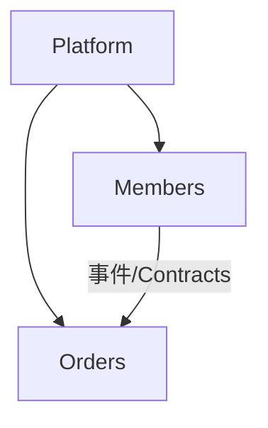

# ADR-0001：模块化单体与垂直切片架构（Vertical Slice + Module Isolation）

## Status

Accepted

## Context

随着业务复杂度增长，传统分层架构（Controller / Service / Repository）暴露出明显问题：

* 功能实现被横向拆散，单一业务需求需要跨多个层级修改
* 模块之间通过“共享领域模型 / Service”产生强耦合
* 架构边界依赖人为约定，缺乏可验证、可执行的约束
* 架构规则在演进过程中逐步被侵蚀，无法有效回溯

本项目核心目标：构建可长期演进、持续扩展、且边界清晰的业务系统。

因此，我们选择：

* 以 **Vertical Slice** 作为功能组织单元
* 以 **Module Isolation** 作为系统级约束
* 以 **自动化架构测试**作为架构裁决机制

### Out of Scope

本 ADR 不讨论：

* API 风格细节（REST / RPC / Minimal API）
* DTO 是否贫血、领域模型具体建模
* Event Sourcing / CQRS 实现细节
* UI / 前端架构设计

---

## Decision

### 1. 系统级模块划分

系统按业务能力划分为独立模块（Module），例如：

* Members
* Orders
* Payments

每个模块：

* 拥有独立 Assembly / 边界
* 对外仅暴露受控集成点
* 内部实现对其他模块不可见

模块是**隔离单元，而非命名空间习惯**。

```
Module Assembly
├─ Members
├─ Orders
└─ Payments
```

---

### 2. 功能组织方式：Vertical Slice

模块内部以 **用例（Use Case）** 为最小单元，每个 Vertical Slice 包含：

* Endpoint / API
* Command / Query
* Handler
* 业务规则与校验
* 持久化与集成逻辑

**禁止**将业务逻辑抽离成横向 Service。

---

### 3. 模块间通信规则

模块间 **只允许**通过：

1. **领域事件（Domain Events）**
2. **Contracts（只读、稳定的数据契约）**
3. **原始类型 / 标准库类型**

#### 禁止行为

* ❌ 引用其他模块的 Entity / Aggregate / ValueObject
* ❌ 在 Contracts 中表达行为意图或业务决策字段
* ❌ 将 Contracts 演变为跨模块 Service 接口

> Contracts 仅用于数据传递，不可用于业务决策。

---

### 4. 业务执行模型

| 角色              | 允许职责         | 禁止行为        |
| --------------- | ------------ | ----------- |
| Command / Query | 表达业务意图       | 包含业务逻辑      |
| Handler         | 承载业务规则与一致性判断 | 下沉业务决策到基础设施 |
| Domain Model    | 包含业务不变量      | 依赖跨模块实现     |

任何偏离以上分工视为架构违规。

---

### 5. Platform / Building Blocks 边界

Platform 层：

* 只提供技术能力（日志、事务、异常处理、序列化等）
* 禁止包含业务规则或判断

#### 判定标准

> Platform 层中出现 `if (业务状态 / 业务含义)` 即违规。

---

### 6. Contracts 使用规则（强制执行，8.x）

#### 6.1 白名单表格

| 使用角色                       | Contracts 使用 | 说明                  |
| -------------------------- | ------------ | ------------------- |
| Command Handler            | ❌            | 禁止依赖 Contracts 驱动决策 |
| Query Handler              | ✅            | 只读查询，允许访问 Contracts |
| Endpoint / API             | ✅            | 用于请求/响应映射及数据展示      |
| Projection / ReadModel     | ✅            | 用于构建视图模型            |
| Platform / Building Blocks | ❌            | 禁止依赖 Contracts      |

#### 6.2 示例代码

```csharp
// ❌ 违规 Command Handler
public class CreateOrderHandler
{
    public CreateOrderHandler(IMemberQueries queries) { ... } // ❌
}

// ✅ 合规 Query Handler
public class GetMemberQueryHandler
{
    public async Task<MemberDto> Handle(GetMemberById query) { ... } // ✅
}
```

#### 6.3 执行说明

* 类型依赖违规由 NetArchTest 捕获
* 语义级违规（如 if/switch 基于 Contracts 字段）需 Roslyn Analyzer 或 Review 检查
* 架构测试纳入 CI Pipeline，违规必须修复，不能放行

---

### 7. 自动化架构测试映射表

| 架构约束                   | 测试方式           | 工具 / 方法                       |
| ---------------------- | -------------- | ----------------------------- |
| 模块隔离（不得引用其他模块内部类型）     | 类型依赖分析         | NetArchTest                   |
| Vertical Slice 内禁止分层架构 | 命名空间 / 文件夹规则检查 | NetArchTest                   |
| Contracts 使用规则（8.x）    | 类型依赖 + 语义规则分析  | NetArchTest + Roslyn Analyzer |
| Platform 层禁止业务判断       | 代码扫描           | Roslyn Analyzer               |
| 架构测试必须 CI 门禁           | 构建失败触发         | CI Pipeline                   |

---

### 8. Enforcement

* 所有模块隔离、Contracts 使用规则必须由自动化测试验证
* 架构测试失败 = 构建失败
* 特例放行需 ADR 明确记录

Mermaid 模块依赖示意：



---

### 9. Consequences

**正面影响**

* 功能修改高度局部化，降低回归风险
* 模块边界清晰，可并行开发
* 架构规则可自动验证
* 新人可通过 Slice 理解完整业务流程

**负面成本**

* 初期代码量略高
* 需要团队遵守“不抽象过度”纪律
* 架构 Review 与测试负担增加

这些成本是**刻意接受的代价**。

---

### 10. Non-negotiable Rules

1. 任何模块不得引用其他模块内部实现
2. 所有模块隔离规则必须由自动化测试验证
3. 架构测试失败 = 构建失败
4. Contracts 不可驱动业务决策
5. ADR 为最终裁决依据

---

### 11. Decision Rationale

本 ADR 目标：

* 降低系统熵增速度
* 防止架构腐化
* 将架构决策从“口头共识”升级为“可执行规则”

> 长期演进为核心设计原则
