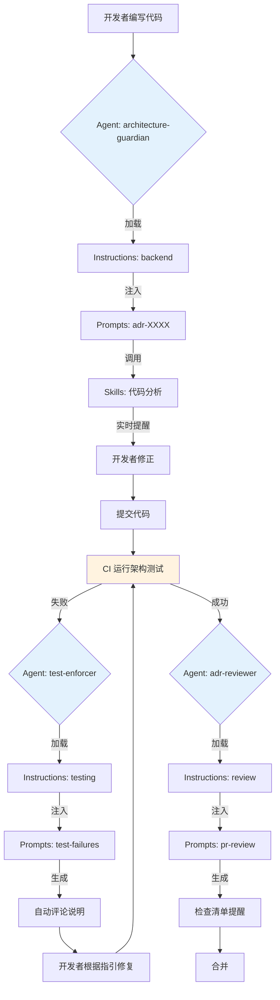

# 架构治理系统（Architecture Governance System）

> ⚠️ **无裁决力声明**：本文档仅供参考，不具备架构裁决权。
> 所有架构决策以相关 ADR 正文为准。详见 [ADR 目录](adr/README.md)。

**版本**：1.1  
**最后更新**：2026-01-27  
**状态**：Active

---

## 📍 文档定位

> **本文档专注于「架构治理体系」的设计**

### 本文档涵盖的内容

- ✅ 治理体系的四层架构（ADR → Instructions → Agents → Prompts → Skills）
- ✅ 各层级的定位、特征和职责边界
- ✅ Agent 配置和 Prompt 组织方式
- ✅ 治理闭环和执行链路
- ✅ 度量指标和成功标志

### 本文档不涵盖的内容

如需了解 **代码架构设计**（模块设计、垂直切片、编码规则），请参阅：
- 📘 [架构指南](guides/architecture-design-guide.md) - 模块化单体、垂直切片、模块设计规则
- 📘 [快速开始指南](guides/quick-start-guide.md) - 开发环境搭建和代码探索

---

## 一、系统定位

> **这是一个以「垂直切片 + 模块化单体」为核心、
> 通过 ADR + 架构测试 + AI 执行代理实现"可自动治理"的后端工程体系。**

### 核心目标

1. **业务复杂度持续增长，但不接受架构失控**
2. **团队扩张后，架构认知不可依赖"人治"**
3. **AI 编程普及后，必须防止"自动化制造技术债"**

### 治理原则

```
┌───────────────────────────────────────────────────────┐
│            架构治理体系的"三权分立"                      │
├───────────────────────────────────────────────────────┤
│  立法权    │  ADR（架构决策记录）          │  宪法    │
│  司法权    │  ArchitectureTests（测试）    │  法院    │
│  行政权    │  CI/CD Pipeline               │  执法    │
│  ─────────────────────────────────────────────────────│
│  辅助角色  │  AI Agents                     │  法务    │
│            │  - 解释宪法（ADR）            │  秘书    │
│            │  - 教人如何不违法             │  +      │
│            │  - 辅助修复违规               │  教官    │
└───────────────────────────────────────────────────────┘
```

---

## 二、四层架构体系

### 完整层级关系

```
┌─────────────────────────────────────┐
│     第 0 层：ADR（Law）              │  ← 架构事实源
│     - 宪法级别的架构决策              │
│     - 最高权威                       │
└──────────────┬──────────────────────┘
               ↓
┌─────────────────────────────────────┐
│  第 1 层：Instructions（Roles）      │  ← 职责边界定义
│  - 定义 AI 的身份与行为边界           │
│  - "我是什么样的助手？"               │
└──────────────┬──────────────────────┘
               ↓
┌─────────────────────────────────────┐
│  第 2 层：Agents（Actors）           │  ← 执行主体
│  - 带特定职责的 AI 实例               │
│  - "我在这个场景下的角色是什么？"      │
└──────────────┬──────────────────────┘
               ↓
┌─────────────────────────────────────┐
│  第 3 层：Prompts（Execution）       │  ← 场景触发
│  - ADR 的场景化翻译                   │
│  - "遇到 X 场景，我应该做什么？"       │
└──────────────┬──────────────────────┘
               ↓
┌─────────────────────────────────────┐
│  第 4 层：Skills（Tools）            │  ← 工具能力
│  - 实际执行的工具函数                 │
│  - "我能调用哪些工具？"               │
└─────────────────────────────────────┘
               ↓
        Architecture Tests
        （最终仲裁者）
```

### 层级特征对比

| 层级           | 稳定性 | 抽象度 | 变更频率 | 执行权 | 决策权 |
|--------------|-----|-----|------|-----|-----|
| ADR          | 极高  | 极高  | 极低   | ❌   | ✅   |
| Instructions | 高   | 高   | 低    | ❌   | ❌   |
| Agents       | 中   | 中   | 中    | ✅   | ❌   |
| Prompts      | 低   | 低   | 高    | ✅   | ❌   |
| Skills       | 中   | 极低  | 中    | ✅   | ❌   |

---

## 三、第 0 层：ADR（架构决策记录）

### 定位

**ADR = 系统宪法，最高裁决权威**

### 分类与优先级

```
docs/adr/
  ├── constitutional/     ← 宪法层（ADR-0001~0005）
  ├── governance/         ← 治理层（ADR-0000, 0900~0999）
  ├── structure/          ← 结构层（ADR-0100~0199）
  ├── runtime/            ← 运行层（ADR-0200~0299）
  └── technical/          ← 技术层（ADR-0300~0399）
```

### 关键原则

根据 [ADR-0007](adr/constitutional/ADR-0007-agent-behavior-permissions-constitution.md) 和 [ADR-0008](adr/constitutional/ADR-0008-documentation-governance-constitution.md)：

- ✅ ADR 是唯一的"事实来源"（Source of Truth）
- ✅ 所有层级服从 ADR
- ✅ ADR 冲突时按优先级裁决（ADR-0000.X）
- ❌ 不应绕过 ADR
- ❌ Prompts/Instructions 不应与 ADR 冲突

### 参考文档

- [ADR 目录](adr/README.md)
- [ADR-0000: 架构测试与 CI 治理宪法](adr/governance/ADR-0000-architecture-tests.md)
- [ADR-0007: Agent 行为与权限宪法](adr/constitutional/ADR-0007-agent-behavior-permissions-constitution.md)
- [ADR-0008: 文档编写与维护宪法](adr/constitutional/ADR-0008-documentation-governance-constitution.md)
- [ADR-900: ADR 新增与修订流程](adr/governance/ADR-900-adr-process.md)

---

## 四、第 1 层：Instructions（角色定义）

### 定位

**Instructions = AI 的"岗位职责说明书"**

定义 Copilot 在特定角色下的：
- 身份认知
- 行为边界
- 禁止事项
- 失败响应方式

### 文件组织

```
.github/instructions/
  ├── README.md                           ← 指令体系说明
  ├── base.instructions.md                ← 基础行为（始终激活）
  ├── backend.instructions.md             ← 后端开发
  ├── testing.instructions.md             ← 测试编写
  ├── documentation.instructions.md       ← 文档编写
  └── architecture-review.instructions.md ← 架构评审（最高风险）
```

### 特征

- **稳定性**：很少改变
- **抽象性**：不涉及具体代码
- **强制性**：覆盖所有 Prompts
- **不可协商**：不接受反驳

### 与 Prompts 的区别

| Instructions              | Prompts          |
|---------------------------|------------------|
| Copilot **是谁**            | Copilot **如何**工作 |
| 个性与边界                     | 具体程序             |
| 行为约束                      | 详细场景             |
| 绝不做什么                     | 何时做什么            |
| 很少变更                      | 随经验演进            |

### 参考文档

- [Instructions 体系说明](.github/instructions/README.md)
- [基础指令](.github/instructions/base.instructions.md)

---

## 五、第 2 层：Agents（执行主体）

### 定位

**Agent = 带特定职责的 Copilot 实例**

> **Agent ≠ Copilot 本体**  
> **Agent = 在特定职责下工作的 Copilot 角色**

### 核心概念

```
Agent = Instructions + 特定职责域 + ADR 约束视角
```

### 标准 Agent 定义

| Agent 名称                  | 职责域        | 监督的 ADR              | 风险等级 |
|---------------------------|------------|----------------------|------|
| architecture-guardian     | 架构约束守护     | 所有 ADR               | 极高   |
| adr-reviewer              | ADR 文档审查   | ADR-900             | 高    |
| test-generator            | 测试生成       | ADR-0000, 0122       | 中    |
| module-boundary-checker   | 模块边界检查     | ADR-0001             | 极高   |
| handler-pattern-enforcer  | Handler 规范执行 | ADR-0005             | 高    |
| documentation-maintainer  | 文档维护       | ADR-900, 文档规范       | 低    |

### Agent 的硬性约束

| 维度  | Agent 的能力 |
|-----|----------|
| 决策权 | ❌ 无      |
| 解释权 | ❌ 无      |
| 执行权 | ✅ 有（在 ADR 范围内） |
| 风险  | 越权       |

### Agent 配置文件结构

```
.github/agents/
  ├── README.md                              ← Agent 体系说明
  ├── architecture-guardian.agent.md         ← 架构守护者
  ├── adr-reviewer.agent.md                  ← ADR 审查者
  ├── test-generator.agent.md                ← 测试生成器
  ├── module-boundary-checker.agent.md       ← 模块边界检查器
  ├── handler-pattern-enforcer.agent.md      ← Handler 规范执行器
  └── documentation-maintainer.agent.md      ← 文档维护者
```

### 参考文档

- [Agents 体系说明](.github/agents/README.md)

---

## 六、第 3 层：Prompts（场景触发）

### 定位

**Prompts = ADR 的场景化翻译与执行手册**

> **Prompt ≠ 聊天问题**  
> **Prompt = "当你看到这种场景时，必须想起哪条 ADR"**

### 核心作用

```
Prompt = ADR → 开发现场的"翻译层"
```

| Prompt 在做什么 | 实际意义            |
|-------------|-----------------|
| 提醒约束        | 把 ADR 拉进上下文     |
| 阻止错误        | 在写代码时打断         |
| 解释 CI       | 把测试失败翻译成人话      |
| 对齐认知        | 新人不看 ADR 也不容易乱写 |

### 文件组织

```
docs/copilot/
  ├── README.md                           ← Copilot 角色定位
  ├── adr-0000.prompts.md                 ← ADR-0000 提示词
  ├── adr-0001.prompts.md                 ← ADR-0001 提示词
  ├── adr-0002.prompts.md                 ← ADR-0002 提示词
  ├── ...（每个 ADR 一个文件）
  ├── architecture-test-failures.md       ← 测试失败诊断指南
  ├── pr-review-pipeline.md               ← PR 审查流程
  └── pr-common-issues.prompts.md         ← 常见问题总结
```

### 标准 Prompt 结构

每个 `adr-XXXX.prompts.md` 包含：

1. **当我在写什么时，你应该提醒我哪些约束？**
2. **哪些写法必须阻止？**（反模式 + 正确做法）
3. **CI 失败时，你应该如何解释？**
4. **典型问答（FAQ）**
5. **快速检查清单**

### 参考文档

- [Copilot Prompts 库](copilot/README.md)
- [ADR-0001 提示词](copilot/adr-0001.prompts.md)

---

## 七、第 4 层：Skills（工具能力）

### 定位

**Skills = 实际"动手"的工具函数**

> ⚠️ **Skills 是最不重要、但最危险的一层**

因为：
- 权限大
- 行为具体
- 一旦越权，破坏力最大

### 核心约束

```
Skills 必须被 Agent + Instructions + ADR 三重约束包住
```

否则就是"会写代码的猴子"。

### Skills 分类

| 类别      | 示例                              | 风险等级 |
|---------|----------------------------------|------|
| 代码生成    | 生成 Handler、生成测试                 | 高    |
| 代码分析    | 扫描依赖、分析架构                        | 中    |
| 代码修改    | 批量重命名、批量移动文件                     | 极高   |
| 文档生成    | 生成 ADR、生成 Prompts                | 中    |
| 测试执行    | 运行架构测试、运行单元测试                    | 低    |
| CI/CD 集成 | 触发构建、发布评论                        | 中    |

### Skills 使用原则

| 原则           | 说明                    |
|--------------|----------------------------------|
| ✅ 明确授权      | 每个 Skill 必须在 Agent 中显式授权     |
| ✅ 单一职责      | 一个 Skill 只做一件事              |
| ✅ 可审计       | 所有 Skill 调用必须有日志            |
| ❌ 不可越权      | Skill 不能绕过 ADR               |
| ❌ 不可自主决策    | Skill 不能判断"应不应该执行"          |
| ❌ 不可修改 ADR  | Skill 不能修改架构规则              |

### Skills 文件组织

```
.github/skills/
  ├── README.md                    ← Skills 体系说明
  ├── code-generation/             ← 代码生成类
  │   ├── generate-handler.skill.md
  │   ├── generate-test.skill.md
  │   └── generate-endpoint.skill.md
  ├── code-analysis/               ← 代码分析类
  │   ├── scan-dependencies.skill.md
  │   ├── analyze-architecture.skill.md
  │   └── check-naming.skill.md
  ├── code-modification/           ← 代码修改类（高风险）
  │   ├── batch-rename.skill.md
  │   └── move-files.skill.md
  ├── documentation/               ← 文档生成类
  │   ├── generate-adr.skill.md
  │   └── generate-prompts.skill.md
  └── testing/                     ← 测试执行类
      ├── run-architecture-tests.skill.md
      └── run-unit-tests.skill.md
```

### 参考文档

- [Skills 体系说明](.github/skills/README.md)

---

## 八、执行链路（完整流程）

### 开发阶段 → PR → CI 的完整链路



### 关键检查点

| 阶段      | 执行主体                      | 依据              | 输出            |
|---------|---------------------------|-----------------|---------------|
| 设计阶段    | architecture-guardian     | ADR 全集          | 约束提醒          |
| 编码阶段    | architecture-guardian     | ADR + Prompts   | 实时阻止          |
| 提交前审查   | adr-reviewer              | ADR + Prompts   | 自检清单          |
| CI 测试   | Architecture Tests        | ADR-0000        | 通过/失败         |
| 失败诊断    | test-enforcer             | test-failures   | 人话解释 + 修复建议   |
| 成功提醒    | adr-reviewer              | pr-review       | 完成检查清单提醒      |

---

## 九、治理闭环

### 三道防线

```
┌─────────────────────────────────────────────────┐
│  第 1 道防线：Agents + Prompts（预防）            │
│  - 开发阶段实时提醒                               │
│  - 减少 60% 无意义的测试失败                      │
└─────────────────────────────────────────────────┘
              ↓
┌─────────────────────────────────────────────────┐
│  第 2 道防线：Architecture Tests（执法）          │
│  - CI 阶段自动化验证                              │
│  - 失败即阻断，无例外                             │
└─────────────────────────────────────────────────┘
              ↓
┌─────────────────────────────────────────────────┐
│  第 3 道防线：Agents + Prompts（解释）            │
│  - 失败后自动诊断                                 │
│  - 人话翻译 + 修复建议                            │
└─────────────────────────────────────────────────┘
```

### 持续改进循环

```
开发经验 → 补充到 Prompts
   ↓
测试失败模式 → 更新 test-failures.md
   ↓
架构演进 → 修订 ADR（ADR-900 流程）
   ↓
新 ADR → 生成新 Prompts + 新测试
   ↓
回到开发
```

---

## 十、关键原则

根据 [ADR-0007](adr/constitutional/ADR-0007-agent-behavior-permissions-constitution.md) 和 [ADR-0008](adr/constitutional/ADR-0008-documentation-governance-constitution.md)：

### 单向依赖原则

```
ADR → Instructions → Agents → Prompts → Skills
```

**不允许的反向关系**：

- ❌ Prompt 创造规则
- ❌ Agent 推翻 ADR
- ❌ Skills 直接决策架构
- ❌ Instructions 写具体实现

### 权威唯一性原则

> ⚖️ **绝对权威仅归属 ADR 正文**

- "ADR 正文"（如 `ADR-0001-modular-monolith-vertical-slice-architecture.md`）= 系统宪法
- "Instructions"、"Prompts" 等辅导材料，仅作辅助说明，不具备裁决力
- 若辅导材料与 ADR 正文冲突，一律以 ADR 正文为准

### AI 不可替代原则

> **Copilot 放大理解能力，不替代理解**

- ✅ 帮助你更快理解 ADR
- ✅ 更早捕获违规
- ✅ 建议合规解决方案
- ❌ 不让你绕过学习
- ❌ 不替代人工判断
- ❌ 不覆盖架构测试

---

## 十一、度量指标

### 量化指标

| 指标               | 当前基线 | 目标    | 测量方式    |
|------------------|------|-------|---------|
| 架构测试首次通过率        | 60%  | 85%   | CI 数据统计 |
| 新人 Onboarding 时间 | 2 周  | 1 周   | 新人反馈    |
| 架构违规修复时间         | 2 小时 | 30 分钟 | PR 时间统计 |
| 老员工被询问架构问题次数     | 基线   | -60%  | 人工统计    |

### 成功标志

当达成以下标志时，说明体系运作良好：

1. ✅ 架构测试首次通过率 > 85%
2. ✅ 新人能在 1 周内独立开发符合架构规范的功能
3. ✅ 老员工被询问架构问题的次数减少 60%
4. ✅ PR Review 中 AI 参与率 = 100%
5. ✅ 架构违规修复时间 < 30 分钟

---

## 十二、快速导航

### 按角色导航

| 角色   | 必读文档                                                                  |
|------|-----------------------------------------------------------------------|
| 新成员  | 本文档 → [快速开始](QUICK-START.md) → [Copilot 使用](copilot/README.md)     |
| 开发者  | [Instructions](../.github/instructions/) → [Prompts](copilot/)       |
| 架构师  | [ADR 目录](adr/README.md) → [ADR-0000](adr/governance/ADR-0000-architecture-tests.md) |
| 维护者  | [ADR-900](adr/governance/ADR-900-adr-process.md) → [Agents](.github/agents/) |

### 按任务导航

| 任务          | 参考文档                                          |
|-------------|-----------------------------------------------|
| 添加新功能       | [后端指令](../.github/instructions/backend.instructions.md) → [ADR-0001 Prompts](copilot/adr-0001.prompts.md) |
| 编写测试        | [测试指令](../.github/instructions/testing.instructions.md) → [ADR-0000 Prompts](copilot/adr-0000.prompts.md) |
| 审查 PR       | [评审指令](../.github/instructions/architecture-review.instructions.md) → [PR 流程](copilot/pr-review-pipeline.md) |
| 新增 ADR      | [ADR-900](adr/governance/ADR-900-adr-process.md) |
| 配置 Agent    | [Agents 说明](.github/agents/README.md)        |
| 开发 Skill    | [Skills 说明](.github/skills/README.md)        |

---

## 十三、版本历史

| 版本  | 日期         | 变更说明      |
|-----|------------|-----------|
| 1.0 | 2026-01-25 | 初始版本，建立四层体系 |

---

## 十四、联系与支持

### 问题反馈

- **架构治理系统问题**：在对应的文档中创建 Issue
- **Agent 行为问题**：在 `.github/agents/` 中创建 Issue
- **Prompt 错误或不准确**：在 `docs/copilot/` 中创建 Issue
- **使用问题**：在团队讨论频道提问

### 贡献指南

欢迎团队成员改进治理体系：

1. Fork 仓库
2. 在对应层级添加/修改文档
3. 提交 PR，标题格式：`docs(governance): 说明`
4. 经过 Review 后合并

---

**维护团队**：架构委员会  
**审核人**：@douhuaa  
**状态**：✅ Active
