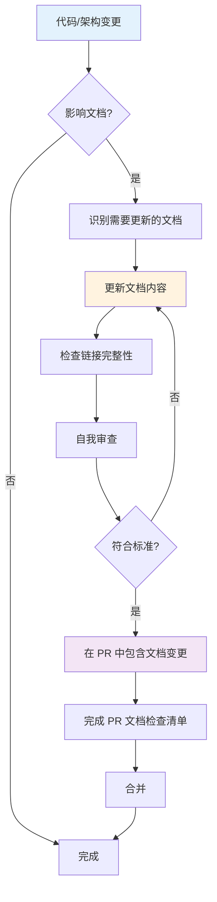
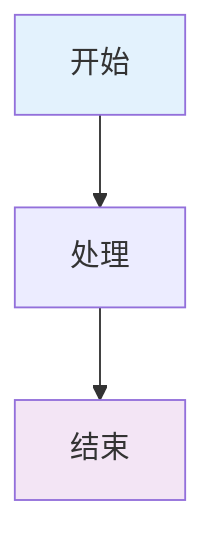

# 文档维护指南

**版本**：1.0  
**最后更新**：2026-01-22  
**状态**：Active

---

## 📋 概述

本指南定义了 Zss.BilliardHall 项目的文档维护流程和规范，确保文档始终保持准确、完整和易用。

---

## 🎯 文档维护原则

### 核心原则

1. **文档即代码**：文档与代码同等重要，必须同步更新
2. **单一真相来源**：避免重复，每项信息只在一处维护
3. **持续改进**：定期审查和优化文档结构
4. **用户导向**：从使用者角度组织文档

### 质量标准

| 维度 | 标准 | 评估方式 |
|------|------|----------|
| **准确性** | 内容与代码实际行为一致 | 代码审查时验证 |
| **完整性** | 覆盖所有核心功能和流程 | 定期 gap 分析 |
| **可查找性** | 5 次点击内找到任何信息 | 用户体验测试 |
| **时效性** | 文档更新不滞后代码超过 1 个 sprint | PR 检查清单 |

---

## 📂 文档组织结构

### 标准目录结构

```
docs/
├── index.md                          # 📍 导航中心（主入口）
├── README.md                         # 文档总览
├── architecture-guide.md             # 架构设计指南
├── ci-cd-guide.md                    # CI/CD 快速参考
├── architecture-automation-verification.md  # 自动化验证系统
├── DOCUMENTATION-MAINTENANCE.md      # 本文件
│
├── adr/                              # 架构决策记录
│   ├── README.md                     # ADR 索引
│   ├── constitutional/               # 宪法层 (ADR-0001~0009)
│   ├── governance/                   # 治理层 (ADR-0000, 900~999)
│   ├── structure/                    # 结构层 (ADR-100~199)
│   ├── runtime/                      # 运行层 (ADR-200~299)
│   └── technical/                    # 技术层 (ADR-300~399)
│
├── copilot/                          # Copilot 工作手册
│   ├── README.md                     # Copilot 角色定位
│   ├── adr-000X.prompts.md           # ADR 对应的 Prompts
│   ├── architecture-test-failures.md # 测试失败诊断
│   └── pr-review-pipeline.md         # PR 评审流程
│
└── summaries/                        # 改进总结
    ├── README.md                     # 总结目录
    ├── architecture/                 # 架构改进历史
    ├── testing/                      # 测试改进历史
    └── governance/                   # 治理改进历史
```

### 文档类型定义

| 类型 | 目的 | 更新频率 | 示例 |
|------|------|----------|------|
| **导航文档** | 帮助用户快速找到信息 | 每月审查 | `index.md`, `README.md` |
| **指南文档** | 说明如何做某事 | 随功能变更 | `architecture-guide.md` |
| **决策文档** | 记录架构决策和理由 | 很少变更 | ADR 文件 |
| **总结文档** | 记录改进历程和经验 | 改进后添加 | `summaries/` 下文件 |
| **参考文档** | 提供快速查询信息 | 随实现变更 | 快速参考表 |

---

## 🔄 文档更新流程

### 标准更新流程



### PR 文档检查清单

**每个 PR 必须完成以下检查**（在 PR 描述中勾选）：

#### 基础检查
- [ ] 已识别受影响的文档
- [ ] 已更新所有相关文档
- [ ] 已验证文档中的代码示例可运行
- [ ] 已检查并修复断裂的链接

#### 内容检查
- [ ] 新功能已添加到相关指南
- [ ] 重大变更已更新 ADR（如需要）
- [ ] 已更新版本号和日期
- [ ] 已检查术语一致性

#### 导航检查
- [ ] 新文档已添加到 `docs/index.md`
- [ ] 相关 README 已更新链接
- [ ] 交叉引用已双向链接

#### 特殊情况
- [ ] 如移动/重命名文件，已更新所有引用
- [ ] 如废弃功能，已标记相关文档为"已废弃"
- [ ] 如架构变更，已咨询架构师确认文档准确性

---

## 📝 文档编写规范

### Markdown 标准

#### 文件头部
每个文档必须包含：

```markdown
# 文档标题

**版本**：1.0  
**最后更新**：YYYY-MM-DD  
**状态**：Active / Draft / Deprecated  
**适用范围**：（可选）

---
```

#### 标题层级
```markdown
# H1：文档标题（每个文件只有一个）
## H2：主要章节
### H3：子章节
#### H4：详细内容（谨慎使用，不超过 H4）
```

#### 代码块
始终指定语言：
````markdown
```csharp
public class Example { }
```

```bash
dotnet test
```
````

#### 列表
```markdown
- 无序列表用于无顺序的项
- 使用 `- [ ]` 表示检查清单
- 使用 `- [x]` 表示已完成项

1. 有序列表用于有顺序的步骤
2. 自然继续编号
```

#### 表格
```markdown
| 列1 | 列2 | 列3 |
|-----|-----|-----|
| 内容 | 内容 | 内容 |
```

#### 标注
使用表情符号增强可读性：
```markdown
✅ 正确做法
❌ 错误做法
⚠️ 警告
💡 提示
📋 检查清单
🚩 危险信号
```

#### 链接
- 仓库内链接使用相对路径
- 外部链接使用完整 URL
- 链接文本要有意义

```markdown
✅ 正确：[架构指南](architecture-guide.md)
❌ 错误：[点击这里](architecture-guide.md)

✅ 正确：[ADR-0001](adr/constitutional/ADR-0001-modular-monolith-vertical-slice-architecture.md)
❌ 错误：[这个 ADR](adr/constitutional/ADR-0001-modular-monolith-vertical-slice-architecture.md)
```

### 图表规范

#### Mermaid 图表
优先使用 mermaid 绘制流程图、架构图：



**何时使用图表**：
- ✅ 复杂的关系难以用文字表达
- ✅ 架构概览
- ✅ 流程流
- ✅ 状态转换

**何时不使用图表**：
- ❌ 简单的列表（使用 markdown 列表）
- ❌ 单一关系（使用文字）
- ❌ 图表会比文字更复杂时

---

## 🎯 特定文档类型指南

### ADR（架构决策记录）

**结构**（必须遵循）：
```markdown
# ADR-XXXX：标题

**状态**：✅ 已采纳 / ⚠️ 草稿 / ❌ 已废弃
**级别**：架构约束 / 技术选型 / 最佳实践
**适用范围**：...
**生效时间**：...

## 本章聚焦内容（Focus）
明确说明本 ADR 的主轴和边界

## 术语表（Glossary）
定义关键术语

## 决策（Decision）
明确的决策内容

## 与其他 ADR 关系
说明依赖和引用关系

## 快速参考表
提供查询表格
```

**详见**：[ADR-0900：ADR 新增与修订流程](adr/governance/ADR-0900-adr-process.md)

### Copilot Prompts

**结构**（必须遵循）：
```markdown
# ADR-XXXX：标题 - Copilot 提示词库

## 一、当我在写什么时，你应该提醒我哪些约束？
场景化的触发条件和检查清单

## 二、哪些写法必须阻止？
反模式 + 正确做法对比

## 三、CI 失败时，你应该如何解释？
失败原因的人话翻译和修复步骤

## 四、典型问答（FAQ）
常见问题和答案

## 五、快速检查清单
PR 前的自检项
```

### 模块 README

**必须包含**：
1. 模块职责说明
2. 核心概念和术语
3. 典型用例列表
4. 模块依赖说明
5. 使用示例

### 改进总结

**必须包含**：
1. 改进背景（为什么）
2. 改进内容（改了什么）
3. 实施过程
4. 验证结果
5. 使用指南
6. 后续建议

---

## 🔍 文档审查机制

### 定期审查

#### 季度文档审查（每季度）

**检查项**：
- [ ] 所有链接是否有效
- [ ] 代码示例是否可运行
- [ ] 文档内容是否与当前代码一致
- [ ] 是否有新功能需要添加文档
- [ ] 是否有过时内容需要废弃

**输出**：
- 文档健康度报告
- 改进行动项
- 下季度文档计划

#### 月度导航审查（每月）

**检查项**：
- [ ] `docs/index.md` 导航是否完整
- [ ] 常见问题是否已有文档覆盖
- [ ] 新人反馈的文档问题

**输出**：
- 导航优化建议
- 缺失文档列表

### 即时审查

#### PR Review 时

**文档审查者必须验证**：
1. PR 描述中的文档检查清单已完成
2. 文档变更与代码变更匹配
3. 新增文档符合编写规范
4. 链接和引用正确

#### 新人 Onboarding 时

**收集反馈**：
- 哪些文档难以找到？
- 哪些内容难以理解？
- 缺少哪些关键信息？

**改进行动**：
- 在 1 周内更新相关文档
- 在 `docs/index.md` 中增强导航

---

## 📊 文档健康度度量

### 关键指标

| 指标 | 目标 | 测量方式 |
|------|------|----------|
| **链接有效率** | 100% | 自动化链接检查工具 |
| **文档覆盖率** | 90%+ | 功能 vs 文档清单 |
| **文档时效性** | < 1 sprint 滞后 | PR 审查统计 |
| **新人 Onboarding 时间** | < 1 周理解核心架构 | 新人反馈 |
| **文档查找效率** | < 5 次点击 | 用户路径分析 |

### 月度文档报告

**包含内容**：
1. 本月新增/更新文档列表
2. 文档健康度评分
3. 常见文档问题
4. 改进行动项

---

## 🛠️ 工具和自动化

### 推荐工具

#### 链接检查
```bash
# 使用 markdown-link-check
npm install -g markdown-link-check
markdown-link-check docs/**/*.md
```

#### Markdown 格式检查
```bash
# 使用 markdownlint
npm install -g markdownlint-cli
markdownlint docs/**/*.md
```

#### 文档生成
```bash
# 使用 Mermaid CLI 生成图表
npm install -g @mermaid-js/mermaid-cli
mmdc -i architecture.mmd -o architecture.svg
```

### Git Hooks

**pre-commit hook**（建议）：
```bash
#!/bin/sh
# 检查 Markdown 格式
markdownlint $(git diff --cached --name-only --diff-filter=ACM | grep '\.md$')
```

---

## 📋 常见问题（FAQ）

### Q: 代码变更但文档不确定如何更新怎么办？

**A:** 流程：
1. 在 PR 中标记 `documentation-needed`
2. 请架构师或 Tech Lead 评审
3. 在 PR 描述中说明不确定的点
4. 合并后 1 周内必须补充文档

### Q: 发现文档过时但不是我的 PR 范围怎么办？

**A:** 流程：
1. 创建 Issue 标记 `documentation-outdated`
2. 说明哪里过时、正确内容应该是什么
3. 如果简单可以直接提 PR 修复
4. 如果复杂由责任人或维护者处理

### Q: 如何处理重复的文档内容？

**A:** 原则：
1. 保留最完整的版本作为"单一真相来源"
2. 其他位置改为链接引用
3. 在 PR 中说明合并理由

### Q: 新增 ADR 需要同步更新哪些文档？

**A:** 必须更新：
1. `docs/adr/README.md` - ADR 索引
2. `docs/index.md` - 导航中心（如果是核心 ADR）
3. 创建对应的 `docs/copilot/adr-XXXX.prompts.md`
4. 创建对应的 `src/tests/ArchitectureTests/ADR/ADR_XXXX_Architecture_Tests.cs`

详见 [ADR-0900](adr/governance/ADR-0900-adr-process.md)

### Q: 如何废弃旧文档？

**A:** 流程：
1. 将状态改为 `❌ 已废弃`
2. 添加废弃日期和理由
3. 链接到替代文档
4. 保留文档不删除（供历史查询）
5. 从导航中移除但保留文件

---

## 🎯 行动清单

### 新成员加入时
- [ ] 阅读本文档
- [ ] 浏览 `docs/index.md`
- [ ] 理解文档组织结构
- [ ] 知道如何查找信息

### 提交 PR 时
- [ ] 完成 PR 文档检查清单
- [ ] 更新相关文档
- [ ] 验证链接有效性
- [ ] 检查代码示例

### 每月
- [ ] 审查导航完整性
- [ ] 收集文档反馈
- [ ] 更新月度报告

### 每季度
- [ ] 运行链接检查工具
- [ ] 审查文档准确性
- [ ] 更新文档健康度报告
- [ ] 制定下季度文档计划

---

## 🔗 相关资源

### 内部文档
- [文档导航中心](index.md)
- [ADR-0900：ADR 新增与修订流程](adr/governance/ADR-0900-adr-process.md)
- [改进总结目录](summaries/README.md)

### 外部参考
- [Markdown Guide](https://www.markdownguide.org/)
- [Mermaid Documentation](https://mermaid-js.github.io/mermaid/)
- [GitHub Flavored Markdown](https://github.github.com/gfm/)

---

## 📜 版本历史

| 版本 | 日期 | 变更说明 |
|------|------|----------|
| 1.0 | 2026-01-22 | 初始版本，建立文档维护机制 |

---

**维护人**：架构团队  
**审查周期**：每季度  
**下次审查**：2026-04-22
