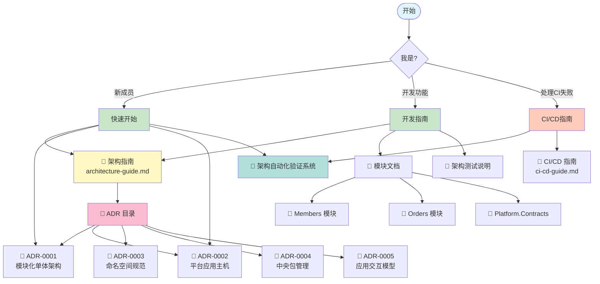
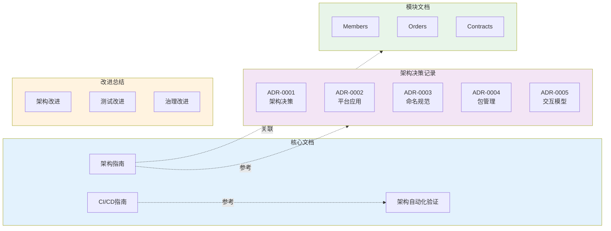

# 文档目录

> ⚠️ **无裁决力声明**：本文档仅供参考，不具备架构裁决权。
> 所有架构决策以相关 ADR 正文为准。详见 [ADR 目录](adr/README.md)。

> 💡 **唯一入口**：查看 **[文档导航中心 (index.md)](index.md)** 获取按角色和任务的快速导航
>
> 本 README 提供文档结构概览，实际使用请访问 [index.md](index.md)

## 📊 文档导航图

## 🗂️ 文档结构总览

## 架构文档

### 核心文档

- **[📍 文档导航中心 (index.md)](index.md)** - 按角色和任务的快速导航入口
- **[快速开始指南](QUICK-START.md)** - 60 分钟快速入门教程
- **[架构指南](architecture-guide.md)** - 项目架构概述、设计规则和开发指南
- **[测试完整指南](TESTING-GUIDE.md)** - 架构测试、单元测试、集成测试完整说明
- **[CI/CD 指南](ci-cd-guide.md)** - 持续集成、架构测试集成和违规处理
- **[架构自动化验证系统](architecture-automation-verification.md)** - 三层自动化防御体系和完整执行指南
- **[文档维护指南](DOCUMENTATION-MAINTENANCE.md)** - 文档更新流程和长效维护机制

### 架构决策记录 (ADR)

- [ADR 目录](adr/README.md) - ADR 完整索引和导航
  - [ADR-0001: 模块化单体与垂直切片架构决策](adr/ADR-0001-modular-monolith-vertical-slice-architecture.md)
  - [ADR-0002: 平台、应用与主机启动器架构决策](adr/ADR-0002-platform-application-host-bootstrap.md)
  - [ADR-0003: 命名空间与项目结构规范](adr/ADR-0003-namespace-rules.md)
  - [ADR-0004: 中央包管理与层级依赖规则](adr/ADR-0004-Cpm-Final.md)
  - [ADR-0005: 应用内交互模型与执行边界](adr/ADR-0005-Application-Interaction-Model-Final.md)

### 改进总结

- **[改进总结目录](summaries/README.md)** - 项目改进历程和经验总结（扁平化结构）
  - 架构改进 - ADR 重组、编号优化
  - 测试改进 - 架构测试体系升级
  - 治理改进 - 违规管理、Copilot 治理
  - 文档改进 - 文档结构优化

## 模块文档

### 业务模块

- [Members 模块](../src/Modules/Members/README.md) - 会员管理
- [Orders 模块](../src/Modules/Orders/README.md) - 订单管理

### 平台与基础设施

- [Platform.Contracts](../src/Platform/Contracts/README.md) - 数据契约使用指南

### 测试

- [Architecture Tests](../src/tests/ArchitectureTests/README.md) - 架构测试说明

## 快速开始

### 理解架构

1. 阅读 [架构指南](architecture-guide.md) 了解整体架构
2. 阅读 [ADR-0001](adr/ADR-0001-modular-monolith-vertical-slice-architecture.md) 了解架构决策背景
3. 阅读 [ADR-0002](adr/ADR-0002-platform-application-host-bootstrap.md) 了解启动器架构决策
4. 阅读 [架构自动化验证系统](architecture-automation-verification.md) 了解自动化执行体系

### 开发新功能

1. 参考 [架构指南 - 开发指南](architecture-guide.md#开发指南)
2. 查看模块示例代码（Members/Orders）
3. 运行架构测试验证

### 处理 CI 失败

1. 参考 [架构自动化验证系统 - 故障排除](architecture-automation-verification.md#故障排除)
2. 参考 [CI/CD 指南 - 处理架构违规](ci-cd-guide.md#处理架构违规)
3. 理解失败原因并修复

## 架构原则

### 核心原则

根据相关 ADR 文档，本项目遵循以下核心原则：

1. **模块隔离** - 业务模块之间不能直接相互引用（参见 [ADR-0001](adr/constitutional/ADR-0001-modular-monolith-vertical-slice-architecture.md)）
2. **垂直切片** - 按用例组织功能，而非技术层（参见 [ADR-0001](adr/constitutional/ADR-0001-modular-monolith-vertical-slice-architecture.md)）
3. **自动化测试** - 所有架构约束通过测试强制执行（参见 [ADR-0000](adr/governance/ADR-0000-architecture-tests.md)）

### 关键约束

根据 ADR 文档，以下为关键架构约束：

1. 模块不应直接引用其他模块实现（[ADR-0001](adr/constitutional/ADR-0001-modular-monolith-vertical-slice-architecture.md)）
2. 所有隔离规则通过自动化测试校验（[ADR-0000](adr/governance/ADR-0000-architecture-tests.md)）
3. 架构测试失败会阻止构建（[ADR-0000](adr/governance/ADR-0000-architecture-tests.md)）
4. 契约用于数据传递，不应驱动业务决策（[ADR-0005](adr/constitutional/ADR-0005-Application-Interaction-Model-Final.md)）
5. ADR 为架构裁决的最终依据（[ADR-0008](adr/constitutional/ADR-0008-documentation-governance-constitution.md)）

详见各 ADR 文档了解具体规则。

## 贡献指南

### 添加新模块

1. 在 `src/Modules/` 下创建模块目录
2. 创建模块 README 说明职责
3. 按垂直切片组织功能
4. 运行架构测试验证

### 更新架构规则

1. 创建新的 ADR 文档
2. 更新相关架构测试
3. 更新架构指南
4. 通知团队成员

### 文档维护

- 文档应保持最新
- 代码变更同步更新文档
- 定期评审文档准确性

## 资源链接

### 外部参考

- [Vertical Slice Architecture - Jimmy Bogard](https://www.jimmybogard.com/vertical-slice-architecture/)
- [Modular Monolith - Kamil Grzybek](https://www.kamilgrzybek.com/blog/posts/modular-monolith-primer)
- [NetArchTest.Rules](https://github.com/BenMorris/NetArchTest)

### 工具

- [NetArchTest](https://github.com/BenMorris/NetArchTest) - 架构测试框架
- [Wolverine](https://wolverinefx.net/) - 消息总线和中介者模式
- [Marten](https://martendb.io/) - 事件存储和文档数据库
