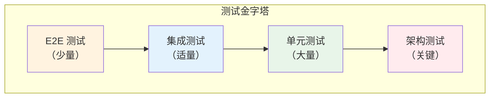
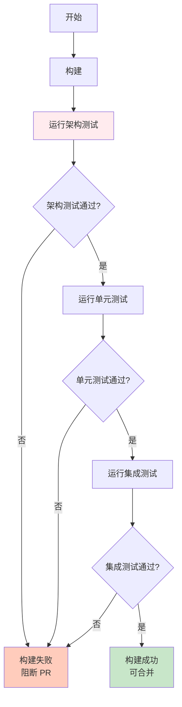

# 测试完整指南

**版本**：1.0  
**最后更新**：2026-01-22  
**状态**：Active

---

## 📋 概述

本指南整合了 Zss.BilliardHall 项目的所有测试相关信息，包括架构测试、单元测试、集成测试和 CI/CD 集成。

---

## 🎯 测试策略

### 测试金字塔



### 测试类型

| 测试类型 | 目的 | 数量 | 执行频率 | 失败影响 |
|---------|------|------|----------|---------|
| **架构测试** | 强制执行架构约束 | ~50 | 每次提交 | 阻断 PR |
| **单元测试** | 验证业务逻辑 | 大量 | 每次提交 | 阻断 PR |
| **集成测试** | 验证模块协作 | 适量 | 每次提交 | 阻断 PR |
| **E2E 测试** | 验证端到端流程 | 少量 | 定期 | 警告 |

---

## 🏛️ 架构测试

### 概述

架构测试是本项目的**最高优先级测试**，用于自动化验证所有 ADR 约束。

**位置**：`src/tests/ArchitectureTests/`

**框架**：NetArchTest.Rules

### 为什么架构测试最重要？

1. **架构退化的第一道防线**
   - 一旦架构违规合并，修复成本极高
   - 技术债务会快速积累

2. **自动化执行架构决策**
   - ADR 是文档，架构测试是执行
   - 测试失败 = 违反宪法

3. **团队共识的守护者**
   - 新成员可能不了解约束
   - 老成员可能疏忽

### ADR 与测试映射

每个 ADR 都有对应的测试类：

| ADR | 测试类 | 关键测试 |
|-----|--------|---------|
| [ADR-0001](adr/constitutional/ADR-0001-modular-monolith-vertical-slice-architecture.md) | `ADR_0001_Architecture_Tests.cs` | 模块隔离、垂直切片 |
| [ADR-0002](adr/constitutional/ADR-0002-platform-application-host-bootstrap.md) | `ADR_0002_Architecture_Tests.cs` | 层级依赖、启动体系 |
| [ADR-0003](adr/constitutional/ADR-0003-namespace-rules.md) | `ADR_0003_Architecture_Tests.cs` | 命名空间规则 |
| [ADR-0004](adr/constitutional/ADR-0004-Cpm-Final.md) | `ADR_0004_Architecture_Tests.cs` | 包管理 |
| [ADR-0005](adr/constitutional/ADR-0005-Application-Interaction-Model-Final.md) | `ADR_0005_Architecture_Tests.cs` | Handler 模式、CQRS |

### 运行架构测试

#### 本地运行

```bash
# 运行所有架构测试
dotnet test src/tests/ArchitectureTests/

# 运行特定 ADR 测试
dotnet test --filter "FullyQualifiedName~ADR_0001"

# 查看详细输出
dotnet test src/tests/ArchitectureTests/ --logger "console;verbosity=detailed"
```

#### IDE 中运行

**Visual Studio / Rider**：
1. 打开 Test Explorer
2. 右键 `ArchitectureTests` 项目
3. 选择 "Run Tests"

**VS Code**：
1. 安装 .NET Test Explorer 扩展
2. 在侧边栏打开 Testing 视图
3. 运行 ArchitectureTests

### 测试失败处理

#### 步骤 1：理解失败原因

复制失败日志并询问 Copilot：

```
请根据以下架构测试失败日志，解释违规原因并提供修复建议：

[粘贴失败日志]
```

详见：[架构测试失败诊断指南](copilot/architecture-test-failures.md)

#### 步骤 2：定位违规代码

失败消息通常包含：
- 违反的规则
- 违规的类型或程序集
- 相关的 ADR

示例：
```
Test Failed: Platform_Should_Not_Depend_On_Application
违规类型: Zss.BilliardHall.Platform.SomeClass
依赖了: Zss.BilliardHall.Application.SomeType
违反: ADR-0002
```

#### 步骤 3：修复违规

根据 ADR 和 Copilot 建议修复代码。

#### 步骤 4：重新测试

```bash
dotnet test src/tests/ArchitectureTests/
```

### 常见架构测试失败

| 失败测试 | 原因 | 修复方案 |
|---------|------|---------|
| `Modules_Should_Not_Reference_Other_Modules` | 模块间直接引用 | 使用事件/契约/原始类型 |
| `Platform_Should_Not_Depend_On_Application` | 层级依赖违规 | 移除依赖或重新设计 |
| `Namespaces_Should_Match_Folder_Structure` | 命名空间不匹配 | 调整命名空间或目录 |
| `Packages_Should_Use_Central_Management` | 包版本未集中管理 | 移到 Directory.Packages.props |
| `CommandHandlers_Should_Not_Return_DTOs` | Handler 返回类型错误 | 仅返回 ID |

---

## 🧪 单元测试

### 组织原则

**测试必须镜像源代码结构**：

```
src/
  Modules/
    Orders/
      UseCases/
        CreateOrder/
          CreateOrderHandler.cs
tests/
  Modules.Orders.Tests/
    UseCases/
      CreateOrder/
        CreateOrderHandlerTests.cs
```

### 编写单元测试

#### Handler 测试示例

```csharp
public class CreateOrderHandlerTests
{
    [Fact]
    public async Task Handle_ValidCommand_CreatesOrder()
    {
        // Arrange
        var repository = Substitute.For<IOrderRepository>();
        var eventBus = Substitute.For<IEventBus>();
        var handler = new CreateOrderHandler(repository, eventBus);
        var command = new CreateOrder(memberId: Guid.NewGuid(), items: []);
        
        // Act
        var orderId = await handler.Handle(command);
        
        // Assert
        await repository.Received(1).SaveAsync(Arg.Any<Order>());
        orderId.Should().NotBeEmpty();
    }
    
    [Fact]
    public async Task Handle_InvalidCommand_ThrowsException()
    {
        // Arrange
        var handler = new CreateOrderHandler(...);
        var invalidCommand = new CreateOrder(Guid.Empty, []);
        
        // Act & Assert
        await handler.Invoking(h => h.Handle(invalidCommand))
            .Should().ThrowAsync<InvalidOperationException>();
    }
}
```

#### 领域模型测试示例

```csharp
public class OrderTests
{
    [Fact]
    public void ApplyDiscount_ValidPercentage_AppliesDiscount()
    {
        // Arrange
        var order = new Order(memberId, items);
        
        // Act
        order.ApplyDiscount(10);
        
        // Assert
        order.Discount.Should().Be(10);
        order.DomainEvents.Should().ContainSingle()
            .Which.Should().BeOfType<DiscountApplied>();
    }
    
    [Theory]
    [InlineData(-10)]
    [InlineData(101)]
    public void ApplyDiscount_InvalidPercentage_ThrowsException(decimal percentage)
    {
        // Arrange
        var order = new Order(memberId, items);
        
        // Act & Assert
        order.Invoking(o => o.ApplyDiscount(percentage))
            .Should().Throw<InvalidDiscountException>();
    }
}
```

### 测试模式

#### ✅ 好的模式

```csharp
// 描述行为的清晰测试名称
[Fact]
public async Task Handle_InactiveMember_ThrowsException()

// 使用 FluentAssertions 提高可读性
result.Should().NotBeNull();
result.Orders.Should().HaveCount(3);

// Arrange-Act-Assert 结构清晰
var command = new CreateOrder(...); // Arrange
var result = await handler.Handle(command); // Act
result.Should().NotBeEmpty(); // Assert

// 每个测试只测试一件事
[Fact]
public async Task Handle_ValidInput_CreatesOrder() // 单一行为
```

#### ❌ 坏的模式

```csharp
// ❌ 模糊的测试名称
[Fact]
public async Task Test1()

// ❌ 测试多个无关的行为
[Fact]
public async Task Handle_Test()
{
    // 测试 5 个不同的东西
}

// ❌ 测试实现细节而非行为
[Fact]
public async Task Handle_CallsRepository() // 过于关注实现
```

### 运行单元测试

```bash
# 运行所有单元测试（排除架构测试）
dotnet test --filter "FullyQualifiedName!~ArchitectureTests"

# 运行特定模块的测试
dotnet test tests/Modules.Orders.Tests/

# 运行特定测试
dotnet test --filter "FullyQualifiedName~CreateOrderHandlerTests"
```

---

## 🔗 集成测试

### 目的

验证模块之间的协作和基础设施集成。

### 组织

```
tests/
  IntegrationTests/
    Orders/
      CreateOrderIntegrationTests.cs
    Members/
      RechargeBalanceIntegrationTests.cs
```

### 示例

```csharp
[Collection("Integration")]
public class CreateOrderIntegrationTests : IClassFixture<IntegrationTestFixture>
{
    private readonly IntegrationTestFixture _fixture;
    
    public CreateOrderIntegrationTests(IntegrationTestFixture fixture)
    {
        _fixture = fixture;
    }
    
    [Fact]
    public async Task CreateOrder_EndToEnd_Success()
    {
        // Arrange
        var client = _fixture.CreateClient();
        var request = new CreateOrderRequest 
        { 
            MemberId = Guid.NewGuid(),
            Items = [new OrderItem("table1", 2)]
        };
        
        // Act
        var response = await client.PostAsJsonAsync("/orders", request);
        
        // Assert
        response.StatusCode.Should().Be(HttpStatusCode.Created);
        var orderId = await response.Content.ReadFromJsonAsync<Guid>();
        orderId.Should().NotBeEmpty();
    }
}
```

---

## 🚀 CI/CD 集成

### GitHub Actions 工作流

```yaml
name: Build and Test

on:
  push:
    branches: [ main, develop ]
  pull_request:
    branches: [ main, develop ]

jobs:
  test:
    runs-on: ubuntu-latest
    
    steps:
    - uses: actions/checkout@v3
    
    - name: Setup .NET
      uses: actions/setup-dotnet@v3
      with:
        dotnet-version: '10.0.x'
    
    - name: Restore dependencies
      run: dotnet restore
    
    - name: Build
      run: dotnet build --no-restore --configuration Release
    
    # 架构测试优先运行
    - name: Run Architecture Tests
      run: dotnet test src/tests/ArchitectureTests/ --configuration Release --no-build
      
    # 只有架构测试通过才运行其他测试
    - name: Run Unit and Integration Tests
      run: dotnet test --filter "FullyQualifiedName!~ArchitectureTests" --configuration Release --no-build
```

### 测试执行顺序



### 本地 CI 模拟

提交前在本地运行完整的 CI 流程：

```bash
#!/bin/bash
# local-ci.sh

set -e

echo "🔨 Building..."
dotnet build --configuration Release

echo "🏛️ Running Architecture Tests..."
dotnet test src/tests/ArchitectureTests/ --configuration Release --no-build

echo "🧪 Running Unit Tests..."
dotnet test --filter "FullyQualifiedName!~ArchitectureTests" --configuration Release --no-build

echo "✅ All tests passed! Ready to push."
```

---

## 📊 测试覆盖率

### 目标

| 类型 | 目标覆盖率 | 说明 |
|------|----------|------|
| **架构测试** | 100% | 所有 ADR 必须有测试 |
| **领域模型** | 90%+ | 所有业务逻辑必须测试 |
| **Handler** | 85%+ | 所有用例必须测试 |
| **基础设施** | 60%+ | 关键路径必须测试 |

### 不追求 100% 覆盖率

**可以跳过**：
- ⏭️ 简单的 DTO/契约（无逻辑）
- ⏭️ 琐碎的属性 getter/setter
- ⏭️ 基础设施样板代码
- ⏭️ 自动生成的代码

**必须测试**：
- ✅ 领域模型中的所有业务逻辑
- ✅ 所有 Handler 编排流程
- ✅ 所有边界情况和验证
- ✅ 关键的集成路径

---

## 🛠️ 测试工具

### 推荐工具

| 工具 | 用途 | 安装 |
|------|------|------|
| **xUnit** | 测试框架 | 默认集成 |
| **FluentAssertions** | 断言库 | `dotnet add package FluentAssertions` |
| **NSubstitute** | Mock 框架 | `dotnet add package NSubstitute` |
| **NetArchTest.Rules** | 架构测试 | 已集成 |
| **Bogus** | 测试数据生成 | `dotnet add package Bogus` |

### 测试数据构建器

对于复杂的设置，使用构建器模式：

```csharp
public class OrderBuilder
{
    private Guid _memberId = Guid.NewGuid();
    private List<OrderItem> _items = [];
    
    public OrderBuilder WithMember(Guid memberId)
    {
        _memberId = memberId;
        return this;
    }
    
    public OrderBuilder WithItem(string productId, int quantity)
    {
        _items.Add(new OrderItem(productId, quantity));
        return this;
    }
    
    public Order Build() => new Order(_memberId, _items);
}

// 使用
var order = new OrderBuilder()
    .WithMember(memberId)
    .WithItem("product1", 2)
    .Build();
```

---

## 🚩 测试失败处理流程

### 架构测试失败

```mermaid
graph TB
    Fail[架构测试失败] --> Copy[复制失败日志]
    Copy --> Ask[询问 Copilot:<br/>"请解释失败原因"]
    Ask --> Understand[理解违规的 ADR]
    Understand --> Fix[修复代码]
    Fix --> Retest[重新运行测试]
    Retest --> Pass{测试通过?}
    Pass -->|否| Ask
    Pass -->|是| Done[继续开发]
    
    style Fail fill:#ffccbc
    style Ask fill:#e3f2fd
    style Done fill:#c8e6c9
```

**详见**：[架构测试失败诊断指南](copilot/architecture-test-failures.md)

### 单元测试失败

1. **确定是 bug 还是测试问题**
   - 查看测试是否正确描述了预期行为
   - 确认业务逻辑是否正确

2. **修复 bug 而非测试**
   - 除非测试本身有问题，否则修复代码

3. **确保所有相关测试通过**
   - 不要只修复失败的测试
   - 运行整个测试套件

---

## 📋 测试检查清单

### PR 提交前

- [ ] 所有架构测试通过
- [ ] 所有单元测试通过
- [ ] 新功能已添加测试
- [ ] 测试覆盖率未下降
- [ ] 测试名称清晰描述行为
- [ ] 使用了 Arrange-Act-Assert 模式
- [ ] 没有被注释掉的测试

### Code Review 时

- [ ] 测试覆盖了关键路径
- [ ] 测试了边界情况
- [ ] 测试了错误场景
- [ ] 测试是独立的（不依赖执行顺序）
- [ ] 测试数据是自包含的
- [ ] Mock 使用合理

---

## 📚 相关资源

### 内部文档
- [架构测试 README](../src/tests/ArchitectureTests/README.md)
- [架构测试失败诊断](copilot/architecture-test-failures.md)
- [CI/CD 指南](ci-cd-guide.md)
- [架构自动化验证系统](architecture-automation-verification.md)

### ADR
- [ADR-0000：架构测试与 CI 治理](adr/governance/ADR-0000-architecture-tests.md)
- [ADR-0001~0005：宪法层 ADR](adr/constitutional/)

### 外部参考
- [xUnit Documentation](https://xunit.net/)
- [FluentAssertions](https://fluentassertions.com/)
- [NetArchTest](https://github.com/BenMorris/NetArchTest)

---

## 💡 常见问题

### Q: 架构测试失败但我认为是误报怎么办？

**A:** 流程：
1. 复制失败日志给 Copilot 分析
2. 查阅相关 ADR 确认规则
3. 如果确实是误报，在 Issue 中讨论
4. 获得架构师批准后可以调整测试

### Q: 单元测试很难写怎么办？

**A:** 可能原因：
- 类的职责太多（违反单一职责原则）
- 依赖太多（考虑重构）
- 测试的是实现而非行为

建议咨询团队成员或架构师。

### Q: 测试覆盖率要求多少？

**A:** 不追求数字，追求质量：
- ✅ 所有业务逻辑有测试
- ✅ 所有边界情况有测试
- ✅ 所有错误场景有测试
- ⏭️ 简单的 DTO 可以跳过

---

## 🔧 常见错误场景与解决方案

### 场景 1：环境依赖问题

**错误信息**：
```
System.InvalidOperationException: Unable to resolve service for type 'IRepository'
```

**原因**：依赖注入配置缺失或测试 Fixture 未正确设置

**解决方案**：
```csharp
// 在测试 Fixture 中正确注册依赖
services.AddScoped<IRepository, TestRepository>();

// 或使用 Mock
var repository = Substitute.For<IRepository>();
```

---

### 场景 2：数据库连接问题

**错误信息**：
```
Npgsql.NpgsqlException: Connection refused
```

**原因**：PostgreSQL 未启动或连接字符串配置错误

**解决方案**：
```bash
# 检查 PostgreSQL 是否运行
sudo service postgresql status

# 或使用 Docker 启动测试数据库
docker run -d -p 5432:5432 -e POSTGRES_PASSWORD=test postgres:latest

# 更新测试配置文件中的连接字符串
"ConnectionStrings": {
  "DefaultConnection": "Host=localhost;Database=test;Username=postgres;Password=test"
}
```

---

### 场景 3：并发测试冲突

**错误信息**：
```
System.InvalidOperationException: A second operation started on this context
```

**原因**：多个测试共享 DbContext 实例

**解决方案**：
```csharp
// 每个测试使用独立的 DbContext
public class TestBase : IDisposable
{
    protected AppDbContext CreateContext()
    {
        var options = new DbContextOptionsBuilder<AppDbContext>()
            .UseInMemoryDatabase(Guid.NewGuid().ToString()) // 每次生成唯一数据库
            .Options;
        return new AppDbContext(options);
    }
    
    public void Dispose()
    {
        // 清理资源
    }
}
```

---

### 场景 4：异步测试超时

**错误信息**：
```
Test 'SomeTest' exceeded timeout of 30000ms
```

**原因**：异步操作未正确等待或死锁

**解决方案**：
```csharp
// ❌ 错误：混用 .Result 导致死锁
var result = someAsyncMethod().Result;

// ✅ 正确：使用 async/await
var result = await someAsyncMethod();

// 或增加超时时间（谨慎使用）
[Fact(Timeout = 60000)]
public async Task LongRunningTest() { }
```

---

### 场景 5：Fixture 初始化失败

**错误信息**：
```
System.Exception: The following constructor parameters did not have matching fixture data
```

**原因**：测试类需要的 Fixture 未在 Collection 中定义

**解决方案**：
```csharp
// 定义 Collection
[CollectionDefinition("Integration")]
public class IntegrationCollection : ICollectionFixture<IntegrationTestFixture>
{
}

// 在测试类中使用
[Collection("Integration")]
public class MyIntegrationTests
{
    private readonly IntegrationTestFixture _fixture;
    
    public MyIntegrationTests(IntegrationTestFixture fixture)
    {
        _fixture = fixture;
    }
}
```

---

### 场景 6：Mocking 框架使用错误

**错误信息**：
```
NSubstitute.Exceptions.ReceivedCallsException: Expected to receive exactly 1 call matching...
```

**原因**：Mock 对象未按预期调用

**解决方案**：
```csharp
// 检查 Mock 设置
var mock = Substitute.For<IService>();
mock.DoSomething(Arg.Any<string>()).Returns(true);

// Act
await handler.Handle(command);

// 验证调用（注意参数匹配）
await mock.Received(1).DoSomething(Arg.Is<string>(s => s == "expected"));

// 调试：查看实际接收到的调用
var calls = mock.ReceivedCalls();
foreach (var call in calls)
{
    Console.WriteLine($"Method: {call.GetMethodInfo().Name}, Args: {string.Join(", ", call.GetArguments())}");
}
```

---

## 📋 CI/CD 相关问题

### Q: CI 中测试通过但本地失败？

**A:** 常见原因：
1. **环境差异**：检查 .NET 版本、依赖版本
2. **配置文件**：CI 可能使用不同的 appsettings
3. **时区问题**：使用 UTC 时间而非本地时间

**解决方案**：
```bash
# 使用 CI 相同的 .NET 版本
dotnet --version

# 使用 CI 相同的配置
export ASPNETCORE_ENVIRONMENT=CI
dotnet test

# 检查时区相关代码
DateTime.UtcNow  # ✅ 使用 UTC
DateTime.Now     # ❌ 避免使用本地时间
```

---

### Q: 本地测试通过但 CI 失败？

**A:** 常见原因：
1. **并发问题**：CI 可能并行运行测试
2. **资源限制**：CI 环境内存或 CPU 受限
3. **文件路径**：使用了绝对路径而非相对路径

**解决方案**：
```bash
# 本地模拟并行测试
dotnet test --parallel

# 限制并行度
dotnet test --parallel:4

# 使用相对路径
Path.Combine(AppContext.BaseDirectory, "data", "test.json")  # ✅
"/home/user/data/test.json"  # ❌
```

---

### Q: 架构测试在 CI 中特别慢？

**A:** 优化建议：
```yaml
# .github/workflows/test.yml
- name: Run Architecture Tests
  run: dotnet test src/tests/ArchitectureTests/ --no-build --configuration Release
  # 关键：使用 --no-build 避免重复构建
```

---

## 📜 版本历史

| 版本 | 日期 | 变更说明 |
|------|------|----------|
| 1.0 | 2026-01-22 | 初始版本，整合所有测试文档 |

---

**维护人**：架构团队  
**审查周期**：每季度  
**下次审查**：2026-04-22
