# ADR 关系图（ADR Relationship Map）

> ⚠️ **无裁决力声明**：本文档为自动生成的可视化工具，不具备架构裁决权。所有架构决策以 ADR 正文为准。

**状态**：✅ Active（自动生成）  
**级别**：辅助工具 / 可视化  
**生成方式**：由 `scripts/generate-adr-relationship-map.sh` 自动生成

> 🤖 **本文件由 `scripts/generate-adr-relationship-map.sh` 自动生成**  
> 📅 **生成时间**：$(date '+%Y-%m-%d %H:%M:%S')  
> 🎯 **依据**：ADR-940 - ADR 关系与溯源管理治理规范

---

## 用途说明（Purpose）

本文档提供 ADR 之间依赖关系的可视化图表，用于：
- 快速理解 ADR 之间的依赖链
- 发现循环依赖
- 追溯架构决策的演进路径

**注意**：本文档不是决策文档，而是从 ADR 正文中提取的关系可视化。权威信息请参考各 ADR 正文。

---

## 全局关系图（Global Relationship Map）

```mermaid
graph TB

    %% 颜色方案
    classDef constitutional fill:#90EE90
    classDef governance fill:#87CEEB
    classDef structure fill:#FFD700
    classDef runtime fill:#FFA07A
    classDef technical fill:#DDA0DD

    ADR_001_MODULAR_MONOLITH_VERTICAL_SLICE_ARCHITECTURE --> ADR_900
    ADR_001_MODULAR_MONOLITH_VERTICAL_SLICE_ARCHITECTURE --> ADR_006
    ADR_001_MODULAR_MONOLITH_VERTICAL_SLICE_ARCHITECTURE --> ADR_002
    ADR_001_MODULAR_MONOLITH_VERTICAL_SLICE_ARCHITECTURE --> ADR_003
    ADR_001_MODULAR_MONOLITH_VERTICAL_SLICE_ARCHITECTURE --> ADR_005
    ADR_001_MODULAR_MONOLITH_VERTICAL_SLICE_ARCHITECTURE --> ADR_120
    ADR_001_MODULAR_MONOLITH_VERTICAL_SLICE_ARCHITECTURE --> ADR_121
    ADR_900_ARCHITECTURE_TESTS --> ADR_001
    ADR_900_ARCHITECTURE_TESTS --> ADR_002
    ADR_900_ARCHITECTURE_TESTS --> ADR_003
    ADR_900_ARCHITECTURE_TESTS --> ADR_004
    ADR_900_ARCHITECTURE_TESTS --> ADR_005
    ADR_900_ARCHITECTURE_TESTS --> ADR_970
    ADR_900_ARCHITECTURE_TESTS --> ADR_980
    ADR_940_ADR_RELATIONSHIP_TRACEABILITY_MANAGEMENT --> ADR_008
    ADR_940_ADR_RELATIONSHIP_TRACEABILITY_MANAGEMENT --> ADR_0900
    ADR_940_ADR_RELATIONSHIP_TRACEABILITY_MANAGEMENT --> ADR_980
    ADR_945_ADR_TIMELINE_EVOLUTION_VIEW --> ADR_940
    ADR_945_ADR_TIMELINE_EVOLUTION_VIEW --> ADR_980
    ADR_950_GUIDE_FAQ_DOCUMENTATION_GOVERNANCE --> ADR_008
    ADR_950_GUIDE_FAQ_DOCUMENTATION_GOVERNANCE --> ADR_951
    ADR_950_GUIDE_FAQ_DOCUMENTATION_GOVERNANCE --> ADR_952
    ADR_950_GUIDE_FAQ_DOCUMENTATION_GOVERNANCE --> ADR_960
    ADR_951_CASE_REPOSITORY_MANAGEMENT --> ADR_950
    ADR_951_CASE_REPOSITORY_MANAGEMENT --> ADR_920
    ADR_952_ENGINEERING_STANDARD_ADR_BOUNDARY --> ADR_950
    ADR_952_ENGINEERING_STANDARD_ADR_BOUNDARY --> ADR_0900
    ADR_955_DOCUMENTATION_SEARCH_DISCOVERABILITY --> ADR_008
    ADR_955_DOCUMENTATION_SEARCH_DISCOVERABILITY --> ADR_940
    ADR_960_ONBOARDING_DOCUMENTATION_GOVERNANCE --> ADR_008
    ADR_960_ONBOARDING_DOCUMENTATION_GOVERNANCE --> ADR_950
    ADR_965_ONBOARDING_INTERACTIVE_LEARNING_PATH --> ADR_008
    ADR_965_ONBOARDING_INTERACTIVE_LEARNING_PATH --> ADR_960
    ADR_970_AUTOMATION_LOG_INTEGRATION_STANDARD --> ADR_900
    ADR_970_AUTOMATION_LOG_INTEGRATION_STANDARD --> ADR_008
    ADR_975_DOCUMENTATION_QUALITY_MONITORING --> ADR_008
    ADR_980_ADR_LIFECYCLE_SYNCHRONIZATION --> ADR_900
    ADR_980_ADR_LIFECYCLE_SYNCHRONIZATION --> ADR_0900
    ADR_990_DOCUMENTATION_EVOLUTION_ROADMAP --> ADR_008
    ADR_990_DOCUMENTATION_EVOLUTION_ROADMAP --> ADR_0900
    ADR_001_MODULAR_MONOLITH_VERTICAL_SLICE_ARCHITECTURE -.替代.-> ADR_004
    ADR_001_MODULAR_MONOLITH_VERTICAL_SLICE_ARCHITECTURE -.替代.-> ADR_008
    ADR_900_ARCHITECTURE_TESTS -.替代.-> ADR_006
    ADR_900_ARCHITECTURE_TESTS -.替代.-> ADR_008
    ADR_940_ADR_RELATIONSHIP_TRACEABILITY_MANAGEMENT -.替代.-> ADR_006
    ADR_945_ADR_TIMELINE_EVOLUTION_VIEW -.替代.-> ADR_980
    ADR_950_GUIDE_FAQ_DOCUMENTATION_GOVERNANCE -.替代.-> ADR_910
    ADR_951_CASE_REPOSITORY_MANAGEMENT -.替代.-> ADR_920
    ADR_952_ENGINEERING_STANDARD_ADR_BOUNDARY -.替代.-> ADR_008
    ADR_955_DOCUMENTATION_SEARCH_DISCOVERABILITY -.替代.-> ADR_975
    ADR_960_ONBOARDING_DOCUMENTATION_GOVERNANCE -.替代.-> ADR_965
    ADR_970_AUTOMATION_LOG_INTEGRATION_STANDARD -.替代.-> ADR_940
    ADR_970_AUTOMATION_LOG_INTEGRATION_STANDARD -.替代.-> ADR_980
    ADR_975_DOCUMENTATION_QUALITY_MONITORING -.替代.-> ADR_955
    ADR_980_ADR_LIFECYCLE_SYNCHRONIZATION -.替代.-> ADR_008
    ADR_980_ADR_LIFECYCLE_SYNCHRONIZATION -.替代.-> ADR_940
    ADR_990_DOCUMENTATION_EVOLUTION_ROADMAP -.替代.-> ADR_940
    ADR_990_DOCUMENTATION_EVOLUTION_ROADMAP -.替代.-> ADR_980
```

---

## 关系列表（Relationship List）

### 按 ADR 分组

#### ADR 关系图（ADR Relationship Map）

**状态**：未知

⚠️ **缺少关系声明章节** - 不符合 ADR-940 要求

---

#### ADR-001：模块化单体与垂直切片架构

**状态**：✅ Final（裁决型ADR）  

**依赖（Depends On）**：
- [ADR-900：架构测试与 CI 治理元规则](../governance/ADR-900-architecture-tests.md) - 测试执行机制
- [ADR-006：术语与编号宪法](./ADR-006-terminology-numbering-constitution.md) - 术语定义标准
- [ADR-002：平台、应用与主机启动器架构](./ADR-002-platform-application-host-bootstrap.md) - 基于模块隔离规则
- [ADR-003：命名空间与项目结构规范](./ADR-003-namespace-rules.md) - 基于模块边界定义
- [ADR-005：应用内交互模型与执行边界](./ADR-005-Application-Interaction-Model-Final.md) - 基于模块通信约束
- [ADR-120：领域事件命名约定](../structure/ADR-120-domain-event-naming-convention.md) - 基于模块通信机制
- [ADR-121：契约 DTO 命名与组织](../structure/ADR-121-contract-dto-naming-organization.md) - 基于模块通信机制

**被依赖（Depended By）**：
- [ADR-002：平台、应用与主机启动器架构](./ADR-002-platform-application-host-bootstrap.md) - 基于模块隔离规则
- [ADR-003：命名空间与项目结构规范](./ADR-003-namespace-rules.md) - 基于模块边界定义
- [ADR-005：应用内交互模型与执行边界](./ADR-005-Application-Interaction-Model-Final.md) - 基于模块通信约束
- [ADR-120：领域事件命名约定](../structure/ADR-120-domain-event-naming-convention.md) - 基于模块通信机制
- [ADR-121：契约 DTO 命名与组织](../structure/ADR-121-contract-dto-naming-organization.md) - 基于模块通信机制

**替代（Supersedes）**：
- [ADR-004：中央包管理与层级依赖规则](./ADR-004-Cpm-Final.md) - 依赖管理补充
- [ADR-008：文档编写与维护宪法](./ADR-008-documentation-governance-constitution.md) - 文档治理

**被替代（Superseded By）**：
- [ADR-004：中央包管理与层级依赖规则](./ADR-004-Cpm-Final.md) - 依赖管理补充
- [ADR-008：文档编写与维护宪法](./ADR-008-documentation-governance-constitution.md) - 文档治理

**相关（Related）**：
- [ADR-004：中央包管理与层级依赖规则](./ADR-004-Cpm-Final.md) - 依赖管理补充
- [ADR-008：文档编写与维护宪法](./ADR-008-documentation-governance-constitution.md) - 文档治理

---

#### ADR-002：Platform / Application / Host 三层启动体系

**状态**：✅ Final（裁决型ADR）  

⚠️ **缺少关系声明章节** - 不符合 ADR-940 要求

---

#### ADR-003：命名空间与项目边界规范

**状态**：✅ Final（裁决型ADR）  

⚠️ **缺少关系声明章节** - 不符合 ADR-940 要求

---

#### ADR-004：中央包管理（CPM）规范

**状态**：✅ Final（裁决型ADR）  

⚠️ **缺少关系声明章节** - 不符合 ADR-940 要求

---

#### ADR-005：应用内交互模型极简判裁版

**状态**：✅ Final（仅保留裁决性规则，无“建议/经验”）  

⚠️ **缺少关系声明章节** - 不符合 ADR-940 要求

---

#### ADR-905 执行级别分类（Enforcement Level Classification）

**状态**：✅ Active  

⚠️ **缺少关系声明章节** - 不符合 ADR-940 要求

---

#### ADR-006：术语与编号宪法

**状态**：✅ Final（裁决型ADR）  

⚠️ **缺少关系声明章节** - 不符合 ADR-940 要求

---

#### ADR-007：Agent 行为与权限宪法

**状态**：✅ Final（裁决型ADR）  

⚠️ **缺少关系声明章节** - 不符合 ADR-940 要求

---

#### ADR-008：文档编写与维护宪法

**状态**：✅ Final（裁决型ADR）  

⚠️ **缺少关系声明章节** - 不符合 ADR-940 要求

---

#### ADR-900：架构测试与 CI 治理元规则

**状态**：✅ Final（不可随意修改）  

**依赖（Depends On）**：
- [ADR-001：模块化单体与垂直切片架构](../constitutional/ADR-001-modular-monolith-vertical-slice-architecture.md) - 其测试执行基于本 ADR
- [ADR-002：平台、应用与主机启动器架构](../constitutional/ADR-002-platform-application-host-bootstrap.md) - 其测试执行基于本 ADR
- [ADR-003：命名空间与项目结构规范](../constitutional/ADR-003-namespace-rules.md) - 其测试执行基于本 ADR
- [ADR-004：中央包管理与层级依赖规则](../constitutional/ADR-004-Cpm-Final.md) - 其测试执行基于本 ADR
- [ADR-005：应用内交互模型与执行边界](../constitutional/ADR-005-Application-Interaction-Model-Final.md) - 其测试执行基于本 ADR
- [ADR-970：自动化工具日志集成标准](./ADR-970-automation-log-integration-standard.md) - 测试报告标准基于本 ADR
- [ADR-980：ADR 生命周期一体化同步机制](./ADR-980-adr-lifecycle-synchronization.md) - CI 检测机制基于本 ADR

**被依赖（Depended By）**：
- [ADR-001：模块化单体与垂直切片架构](../constitutional/ADR-001-modular-monolith-vertical-slice-architecture.md) - 其测试执行基于本 ADR
- [ADR-002：平台、应用与主机启动器架构](../constitutional/ADR-002-platform-application-host-bootstrap.md) - 其测试执行基于本 ADR
- [ADR-003：命名空间与项目结构规范](../constitutional/ADR-003-namespace-rules.md) - 其测试执行基于本 ADR
- [ADR-004：中央包管理与层级依赖规则](../constitutional/ADR-004-Cpm-Final.md) - 其测试执行基于本 ADR
- [ADR-005：应用内交互模型与执行边界](../constitutional/ADR-005-Application-Interaction-Model-Final.md) - 其测试执行基于本 ADR
- [ADR-970：自动化工具日志集成标准](./ADR-970-automation-log-integration-standard.md) - 测试报告标准基于本 ADR
- [ADR-980：ADR 生命周期一体化同步机制](./ADR-980-adr-lifecycle-synchronization.md) - CI 检测机制基于本 ADR

**替代（Supersedes）**：
- [ADR-006：术语与编号宪法](../constitutional/ADR-006-terminology-numbering-constitution.md) - ADR 编号规范
- [ADR-008：文档编写与维护宪法](../constitutional/ADR-008-documentation-governance-constitution.md) - ADR 文档治理

**被替代（Superseded By）**：
- [ADR-006：术语与编号宪法](../constitutional/ADR-006-terminology-numbering-constitution.md) - ADR 编号规范
- [ADR-008：文档编写与维护宪法](../constitutional/ADR-008-documentation-governance-constitution.md) - ADR 文档治理

**相关（Related）**：
- [ADR-006：术语与编号宪法](../constitutional/ADR-006-terminology-numbering-constitution.md) - ADR 编号规范
- [ADR-008：文档编写与维护宪法](../constitutional/ADR-008-documentation-governance-constitution.md) - ADR 文档治理

---

#### ADR-900：ADR 新增与修订流程

**状态**：✅ Final（裁决型ADR）  

⚠️ **缺少关系声明章节** - 不符合 ADR-940 要求

---

#### ADR-910：README 编写与维护治理规范

**状态**：✅ Final（裁决型ADR）  

⚠️ **缺少关系声明章节** - 不符合 ADR-940 要求

---

#### ADR-920：示例代码治理规范

**状态**：✅ Final（裁决型ADR）  

⚠️ **缺少关系声明章节** - 不符合 ADR-940 要求

---

#### ADR-930：代码审查与 ADR 合规自检流程

**状态**：✅ Final（裁决型ADR）  

⚠️ **缺少关系声明章节** - 不符合 ADR-940 要求

---

#### ADR-940：ADR 关系与溯源管理治理规范

**状态**：✅ Accepted（已采纳）  

**依赖（Depends On）**：
- [ADR-008：文档编写与维护宪法](../constitutional/ADR-008-documentation-governance-constitution.md) - 基于文档规范
- [ADR-900：ADR 新增与修订流程](ADR-900-architecture-tests.md) - 集成到 ADR 流程
- [ADR-980：ADR 生命周期一体化同步机制](ADR-980-adr-lifecycle-synchronization-mechanism.md) - 需要关系图更新

**被依赖（Depended By）**：
- [ADR-980：ADR 生命周期一体化同步机制](ADR-980-adr-lifecycle-synchronization-mechanism.md) - 需要关系图更新
- [ADR-006：术语与编号宪法](../constitutional/ADR-006-terminology-numbering-constitution.md) - 涉及 ADR 编号规范

**替代（Supersedes）**：
- [ADR-006：术语与编号宪法](../constitutional/ADR-006-terminology-numbering-constitution.md) - 涉及 ADR 编号规范

**被替代（Superseded By）**：
- [ADR-006：术语与编号宪法](../constitutional/ADR-006-terminology-numbering-constitution.md) - 涉及 ADR 编号规范

**相关（Related）**：
- [ADR-006：术语与编号宪法](../constitutional/ADR-006-terminology-numbering-constitution.md) - 涉及 ADR 编号规范

---

#### ADR-945：ADR 全局时间线与演进视图

**状态**：✅ Accepted（已采纳）  

**依赖（Depends On）**：
- [ADR-940：ADR 关系与溯源管理治理规范](ADR-940-adr-relationship-traceability-management.md) - 基于关系图数据
- [ADR-980：ADR 生命周期一体化同步机制](ADR-980-adr-lifecycle-synchronization-mechanism.md) - 版本追踪相关

**被依赖（Depended By）**：
- [ADR-980：ADR 生命周期一体化同步机制](ADR-980-adr-lifecycle-synchronization-mechanism.md) - 版本追踪相关

**替代（Supersedes）**：
- [ADR-980：ADR 生命周期一体化同步机制](ADR-980-adr-lifecycle-synchronization-mechanism.md) - 版本追踪相关

**被替代（Superseded By）**：
- [ADR-980：ADR 生命周期一体化同步机制](ADR-980-adr-lifecycle-synchronization-mechanism.md) - 版本追踪相关

**相关（Related）**：
- [ADR-980：ADR 生命周期一体化同步机制](ADR-980-adr-lifecycle-synchronization-mechanism.md) - 版本追踪相关

---

#### ADR-950：指南与 FAQ 文档治理规范

**状态**：✅ Accepted（已采纳）  

**依赖（Depends On）**：
- [ADR-008：文档编写与维护宪法](../constitutional/ADR-008-documentation-governance-constitution.md) - 基础文档规范
- [ADR-951：案例库管理规范](ADR-951-case-repository-management.md) - Case 类型细化
- [ADR-952：工程标准与 ADR 分离边界](ADR-952-engineering-standard-adr-boundary.md) - Standard 类型细化
- [ADR-960：Onboarding 文档治理规范](ADR-960-onboarding-documentation-governance.md) - Onboarding 文档规范

**被依赖（Depended By）**：
- [ADR-951：案例库管理规范](ADR-951-case-repository-management.md) - Case 类型细化
- [ADR-952：工程标准与 ADR 分离边界](ADR-952-engineering-standard-adr-boundary.md) - Standard 类型细化
- [ADR-960：Onboarding 文档治理规范](ADR-960-onboarding-documentation-governance.md) - Onboarding 文档规范
- [ADR-910：README 编写与维护治理规范](ADR-910-readme-governance-constitution.md) - README 是另一类非裁决性文档

**替代（Supersedes）**：
- [ADR-910：README 编写与维护治理规范](ADR-910-readme-governance-constitution.md) - README 是另一类非裁决性文档

**被替代（Superseded By）**：
- [ADR-910：README 编写与维护治理规范](ADR-910-readme-governance-constitution.md) - README 是另一类非裁决性文档

**相关（Related）**：
- [ADR-910：README 编写与维护治理规范](ADR-910-readme-governance-constitution.md) - README 是另一类非裁决性文档

---

#### ADR-951：案例库管理规范

**状态**：✅ Accepted（已采纳）  

**依赖（Depends On）**：
- [ADR-950：指南与 FAQ 文档治理规范](ADR-950-guide-faq-documentation-governance.md) - 基于 Case 类型定义
- [ADR-920：示例代码治理规范](ADR-920-examples-governance-constitution.md) - 示例代码规范

**被依赖（Depended By）**：
- [ADR-920：示例代码治理规范](ADR-920-examples-governance-constitution.md) - 示例代码规范

**替代（Supersedes）**：
- [ADR-920：示例代码治理规范](ADR-920-examples-governance-constitution.md) - 示例代码规范

**被替代（Superseded By）**：
- [ADR-920：示例代码治理规范](ADR-920-examples-governance-constitution.md) - 示例代码规范

**相关（Related）**：
- [ADR-920：示例代码治理规范](ADR-920-examples-governance-constitution.md) - 示例代码规范

---

#### ADR-952：工程标准与 ADR 分离边界

**状态**：✅ Accepted（已采纳）  

**依赖（Depends On）**：
- [ADR-950：指南与 FAQ 文档治理规范](ADR-950-guide-faq-documentation-governance.md) - 基于 Standard 类型定义
- [ADR-900：ADR 新增与修订流程](ADR-900-architecture-tests.md) - Standard 提升为 ADR 流程

**被依赖（Depended By）**：
- [ADR-008：文档编写与维护宪法](../constitutional/ADR-008-documentation-governance-constitution.md) - 文档分级

**替代（Supersedes）**：
- [ADR-008：文档编写与维护宪法](../constitutional/ADR-008-documentation-governance-constitution.md) - 文档分级

**被替代（Superseded By）**：
- [ADR-008：文档编写与维护宪法](../constitutional/ADR-008-documentation-governance-constitution.md) - 文档分级

**相关（Related）**：
- [ADR-008：文档编写与维护宪法](../constitutional/ADR-008-documentation-governance-constitution.md) - 文档分级

---

#### ADR-955：文档搜索与可发现性优化

**状态**：✅ Accepted  

**依赖（Depends On）**：
- [ADR-008：文档编写与维护宪法](../constitutional/ADR-008-documentation-governance-constitution.md) - 基于其文档组织
- [ADR-940：ADR 关系与溯源管理治理规范](../governance/ADR-940-adr-relationship-traceability-management.md) - 基于其关系声明

**被依赖（Depended By）**：
- [ADR-975：文档质量指标与监控](../governance/ADR-975-documentation-quality-monitoring.md) - 质量监控包含可发现性

**替代（Supersedes）**：
- [ADR-975：文档质量指标与监控](../governance/ADR-975-documentation-quality-monitoring.md) - 质量监控包含可发现性

**被替代（Superseded By）**：
- [ADR-975：文档质量指标与监控](../governance/ADR-975-documentation-quality-monitoring.md) - 质量监控包含可发现性

**相关（Related）**：
- [ADR-975：文档质量指标与监控](../governance/ADR-975-documentation-quality-monitoring.md) - 质量监控包含可发现性

---

#### ADR-960：Onboarding 文档治理规范

**状态**：✅ Accepted  

**依赖（Depends On）**：
- [ADR-008：文档编写与维护宪法](../constitutional/ADR-008-documentation-governance-constitution.md) - 基于其文档分级和编写标准
- [ADR-950：指南与 FAQ 文档治理规范](../governance/ADR-950-guide-faq-documentation-governance.md) - 基于其文档类型定义

**被依赖（Depended By）**：
- [ADR-965：Onboarding 互动式学习路径](../governance/ADR-965-onboarding-interactive-learning-path.md) - 互动式体验增强

**替代（Supersedes）**：
- [ADR-965：Onboarding 互动式学习路径](../governance/ADR-965-onboarding-interactive-learning-path.md) - 互动式体验增强

**被替代（Superseded By）**：
- [ADR-965：Onboarding 互动式学习路径](../governance/ADR-965-onboarding-interactive-learning-path.md) - 互动式体验增强

**相关（Related）**：
- [ADR-965：Onboarding 互动式学习路径](../governance/ADR-965-onboarding-interactive-learning-path.md) - 互动式体验增强

---

#### ADR-965：Onboarding 互动式学习路径

**状态**：✅ Accepted  

**依赖（Depends On）**：
- [ADR-008：文档编写与维护宪法](../constitutional/ADR-008-documentation-governance-constitution.md) - 基于其文档标准
- [ADR-960：Onboarding 文档治理规范](../governance/ADR-960-onboarding-documentation-governance.md) - 基于其 Onboarding 结构

**被依赖（Depended By）**：
- 无

**替代（Supersedes）**：
- 无

**被替代（Superseded By）**：
- 无

**相关（Related）**：
- 无

---

#### ADR-970：自动化工具日志集成标准

**状态**：✅ Accepted  

**依赖（Depends On）**：
- [ADR-900：架构测试与 CI 治理元规则](../governance/ADR-900-architecture-tests.md) - 基于其 CI 测试机制
- [ADR-008：文档编写与维护宪法](../constitutional/ADR-008-documentation-governance-constitution.md) - 基于其文档组织

**被依赖（Depended By）**：
- [ADR-940：ADR 关系与溯源管理治理规范](../governance/ADR-940-adr-relationship-traceability-management.md) - 日志与 ADR 关联

**替代（Supersedes）**：
- [ADR-940：ADR 关系与溯源管理治理规范](../governance/ADR-940-adr-relationship-traceability-management.md) - 日志与 ADR 关联
- [ADR-980：ADR 生命周期一体化同步机制](../governance/ADR-980-adr-lifecycle-synchronization.md) - 版本同步检测

**被替代（Superseded By）**：
- [ADR-940：ADR 关系与溯源管理治理规范](../governance/ADR-940-adr-relationship-traceability-management.md) - 日志与 ADR 关联
- [ADR-980：ADR 生命周期一体化同步机制](../governance/ADR-980-adr-lifecycle-synchronization.md) - 版本同步检测

**相关（Related）**：
- [ADR-940：ADR 关系与溯源管理治理规范](../governance/ADR-940-adr-relationship-traceability-management.md) - 日志与 ADR 关联
- [ADR-980：ADR 生命周期一体化同步机制](../governance/ADR-980-adr-lifecycle-synchronization.md) - 版本同步检测

---

#### ADR-975：文档质量指标与监控

**状态**：✅ Accepted  

**依赖（Depends On）**：
- [ADR-008：文档编写与维护宪法](../constitutional/ADR-008-documentation-governance-constitution.md) - 基于其文档标准

**被依赖（Depended By）**：
- [ADR-955：文档搜索与可发现性优化](../governance/ADR-955-documentation-search-discoverability.md) - 可查找性是质量指标之一

**替代（Supersedes）**：
- [ADR-955：文档搜索与可发现性优化](../governance/ADR-955-documentation-search-discoverability.md) - 可查找性是质量指标之一

**被替代（Superseded By）**：
- [ADR-955：文档搜索与可发现性优化](../governance/ADR-955-documentation-search-discoverability.md) - 可查找性是质量指标之一

**相关（Related）**：
- [ADR-955：文档搜索与可发现性优化](../governance/ADR-955-documentation-search-discoverability.md) - 可查找性是质量指标之一

---

#### ADR-980：ADR 生命周期一体化同步机制治理规范

**状态**：✅ Accepted  

**依赖（Depends On）**：
- [ADR-900：架构测试与 CI 治理元规则](../governance/ADR-900-architecture-tests.md) - 基于其 CI 检测机制
- [ADR-900：ADR 新增与修订流程](../governance/ADR-900-architecture-tests.md) - 基于其"三位一体交付"要求

**被依赖（Depended By）**：
- [ADR-008：文档编写与维护宪法](../constitutional/ADR-008-documentation-governance-constitution.md) - 文档版本管理

**替代（Supersedes）**：
- [ADR-008：文档编写与维护宪法](../constitutional/ADR-008-documentation-governance-constitution.md) - 文档版本管理
- [ADR-940：ADR 关系与溯源管理治理规范](../governance/ADR-940-adr-relationship-traceability-management.md) - 关系图更新

**被替代（Superseded By）**：
- [ADR-008：文档编写与维护宪法](../constitutional/ADR-008-documentation-governance-constitution.md) - 文档版本管理
- [ADR-940：ADR 关系与溯源管理治理规范](../governance/ADR-940-adr-relationship-traceability-management.md) - 关系图更新

**相关（Related）**：
- [ADR-008：文档编写与维护宪法](../constitutional/ADR-008-documentation-governance-constitution.md) - 文档版本管理
- [ADR-940：ADR 关系与溯源管理治理规范](../governance/ADR-940-adr-relationship-traceability-management.md) - 关系图更新

---

#### ADR-990：文档演进路线图管理规范

**状态**：✅ Accepted  

**依赖（Depends On）**：
- [ADR-008：文档编写与维护宪法](../constitutional/ADR-008-documentation-governance-constitution.md) - 基于其文档管理标准
- [ADR-900：ADR 新增与修订流程](../governance/ADR-900-architecture-tests.md) - 基于其 RFC 流程

**被依赖（Depended By）**：
- [ADR-940：ADR 关系与溯源管理治理规范](../governance/ADR-940-adr-relationship-traceability-management.md) - 路线图项目关联 ADR

**替代（Supersedes）**：
- [ADR-940：ADR 关系与溯源管理治理规范](../governance/ADR-940-adr-relationship-traceability-management.md) - 路线图项目关联 ADR
- [ADR-980：ADR 生命周期一体化同步机制](../governance/ADR-980-adr-lifecycle-synchronization.md) - 状态同步

**被替代（Superseded By）**：
- [ADR-940：ADR 关系与溯源管理治理规范](../governance/ADR-940-adr-relationship-traceability-management.md) - 路线图项目关联 ADR
- [ADR-980：ADR 生命周期一体化同步机制](../governance/ADR-980-adr-lifecycle-synchronization.md) - 状态同步

**相关（Related）**：
- [ADR-940：ADR 关系与溯源管理治理规范](../governance/ADR-940-adr-relationship-traceability-management.md) - 路线图项目关联 ADR
- [ADR-980：ADR 生命周期一体化同步机制](../governance/ADR-980-adr-lifecycle-synchronization.md) - 状态同步

---

#### ADR-201：Handler 生命周期管理

**状态**：✅ Accepted  

⚠️ **缺少关系声明章节** - 不符合 ADR-940 要求

---

#### ADR-210：领域事件版本化与兼容性

**状态**：✅ Accepted  

⚠️ **缺少关系声明章节** - 不符合 ADR-940 要求

---

#### ADR-220：事件总线集成规范

**状态**：✅ Accepted  

⚠️ **缺少关系声明章节** - 不符合 ADR-940 要求

---

#### ADR-240：Handler 异常约束

**状态**：✅ Final  

⚠️ **缺少关系声明章节** - 不符合 ADR-940 要求

---

#### ADR-120：领域事件命名规范

**状态**：✅ 已采纳（Adopted）  

⚠️ **缺少关系声明章节** - 不符合 ADR-940 要求

---

#### ADR-121：契约（Contract）与 DTO 命名组织规范

**状态**：✅ 已采纳（Adopted）  

⚠️ **缺少关系声明章节** - 不符合 ADR-940 要求

---

#### ADR-122：测试代码组织与命名规范

**状态**：✅ Accepted  

⚠️ **缺少关系声明章节** - 不符合 ADR-940 要求

---

#### ADR-123：Repository 接口与分层命名规范

**状态**：✅ Accepted  

⚠️ **缺少关系声明章节** - 不符合 ADR-940 要求

---

#### ADR-124：Endpoint 命名及参数约束规范

**状态**：✅ Accepted  

⚠️ **缺少关系声明章节** - 不符合 ADR-940 要求

---

#### ADR-301：集成测试环境自动化与隔离约束

**状态**：✅ Accepted  

⚠️ **缺少关系声明章节** - 不符合 ADR-940 要求

---

#### ADR-340：结构化日志与监控约束

**状态**：✅ Final  

⚠️ **缺少关系声明章节** - 不符合 ADR-940 要求

---

#### ADR-350：日志与可观测性字段标准

**状态**：✅ Accepted  

⚠️ **缺少关系声明章节** - 不符合 ADR-940 要求

---

#### ADR-360：CI/CD Pipeline 流程标准化

**状态**：✅ Accepted  

⚠️ **缺少关系声明章节** - 不符合 ADR-940 要求

---

## 统计信息（Statistics）

- **ADR 总数**：40
- **包含关系声明的 ADR**：14
- **缺少关系声明的 ADR**：26
- **依赖关系数**：40
- **替代关系数**：18
- **相关关系数**：18

**生成时间**：2026-01-26 14:20:07  
**维护**：架构委员会  
**状态**：🤖 自动生成

---

## Relationships（关系声明）

**Depends On**：
- [ADR-940：ADR 关系与溯源管理治理规范](./governance/ADR-940-adr-relationship-traceability-management.md) - 本文档基于 ADR-940 的关系映射规范生成

**Depended By**：
- 所有 ADR 文档 - 作为关系声明的集中视图

**Supersedes**：
- 无

**Superseded By**：
- 无

**Related**：
- 无
