# 架构决策记录（Architecture Decision Records）

**版本**：3.1  
**最后更新**：2026-01-22  
**状态**：Active  
**重大变更**：引入分段编号体系与分层目录结构

---

## ⚖️ 权威声明（Authority Declaration）

> **本目录下的各层 README 和 Copilot Prompts（如 `docs/copilot/adr-XXXX.prompts.md`）仅为说明、辅导和快速参考之用。**
>
> **在架构判定、CI 校验、测试执行时，唯一判决依据为各 ADR
的正文内容（如 `ADR-0001-modular-monolith-vertical-slice-architecture.md`）。**
>
> - ✅ ADR 正文 = 宪法，具有最高权威
> - 📖 README / Prompts = 辅导材料，帮助理解和应用
> - 🚫 若辅导材料与 ADR 正文冲突，以 ADR 正文为准
> - 🔍 架构测试的唯一依据是 ADR 正文中标注【必须架构测试覆盖】的条款（根据 ADR-0000）

---

## 概述

> 本 README 只描述 ADR 的分层、编号与阅读方式；具体规则以各 ADR 为准。

本目录包含 Zss.BilliardHall 项目的所有架构决策记录（ADR）。ADR 采用**分段编号体系**和**分层目录结构**，实现清晰的架构认知和高效维护。

## 架构冻结声明（Architecture Declaration）

自 **ADR v3.0** 起：

- **分段编号体系视为稳定结构**
- 不再进行编号段重排、层级合并或语义重定义
- 后续架构演进 **只能在既有编号段内扩展**
- 任何破坏分段语义的修改，视为**架构回退**，需走宪法层修订流程（ADR-0900）

> 本声明用于保护架构认知稳定性，避免随人员和时间演化导致的体系退化。

## 📋 编号分段体系

| 层级      | 编号范围                | 目录                | 说明            | 当前状态         |
|---------|---------------------|-------------------|---------------|--------------|
| **宪法层** | `ADR-0001~0009`     | `constitutional/` | 系统根基/不可推翻约束   | ✅ 已有 8 个 ADR |
| **结构层** | `ADR-100~199`       | `structure/`      | 模块静态边界/组织细化   | ✅ 已有 2 个 ADR |
| **运行层** | `ADR-200~299`       | `runtime/`        | 运行/交互/协议/事件   | ✅ 已有 1 个 ADR |
| **技术层** | `ADR-300~399`       | `technical/`      | 技术选型/具体落地     | ✅ 已有 1 个 ADR |
| **治理层** | `ADR-0000, 900~999` | `governance/`     | 治理/破例/流程/变更管理 | ✅ 已有 2 个 ADR |

### 编号规则说明

1. **宪法层（0001~0009）**：核心架构原则，三年不变，违反即系统退化
2. **结构层（100~199）**：对宪法层结构约束的细化补充
3. **运行层（200~299）**：对宪法层运行时约束的细化补充
4. **技术层（300~399）**：技术选型和实现细节，可替换升级
5. **治理层（0000, 900~999）**：架构测试、流程、破例管理

**特殊编号**：

- `ADR-0000`：架构测试元规则，保持原编号（治理层核心）
- `ADR-0900`：ADR 流程管理（原 ADR-0000A）

### 非宪法层 ADR 的硬性边界（Hard Limits）

**结构层 / 运行层 / 技术层 ADR 不应（根据 ADR-0008）：**

- ❌ 引入新的跨模块强制约束
- ❌ 改变既有依赖方向或层级关系
- ❌ 修改模块隔离、通信模型或执行语义
- ❌ 成为其他 ADR 的前置假设条件
- ❌ 以“细化”为名削弱宪法层约束

如需上述变更，**应升级为宪法层提案**（根据 ADR-0900），并按 ADR-0900 流程处理。

### 📊 ADR 分层体系可视化

```mermaid
graph TB
    subgraph Constitutional["🏛️ 宪法层 (ADR-0001~0009)"]
        C1[ADR-0001 模块切片]
        C2[ADR-0002 启动体系]
        C3[ADR-0003 命名空间]
        C4[ADR-0004 包管理]
        C5[ADR-0005 交互模型]
        C6[ADR-0006 术语编号]
        C7[ADR-0007 Agent行为]
        C8[ADR-0008 文档治理]
    end

    subgraph Governance["🛡️ 治理层 (ADR-0000, 900~999)"]
        G0[ADR-0000 架构测试]
        G900[ADR-0900 ADR流程]
    end

    subgraph Structure["📐 结构层 (ADR-100~199)"]
        S120[ADR-120 领域事件命名]
        S121[ADR-121 契约命名组织]
    end

    subgraph Runtime["⚡ 运行层 (ADR-200~299)"]
        R240[ADR-240 异常处理与重试]
    end

    subgraph Technical["🔧 技术层 (ADR-300~399)"]
        T340[ADR-340 日志监控]
    end

    Governance -. 保障 .-> Constitutional
    Constitutional -. 细化 .-> Structure
    Constitutional -. 细化 .-> Runtime
    Constitutional -. 落地 .-> Technical
    style Constitutional fill: #ffebee
    style Governance fill: #fff3e0
    style Structure fill: #e8f5e9
    style Runtime fill: #e3f2fd
    style Technical fill: #f3e5f5
```



### 🗺️ 分段编号快速映射

```
ADR-0000         → 架构测试元规则（治理层核心）
ADR-0001~0009    → 宪法层（constitutional/）
ADR-0100~0199    → 结构层（structure/）
ADR-0200~0299    → 运行层（runtime/）
ADR-0300~0399    → 技术层（technical/）
ADR-0900~0999    → 治理层（governance/）
```

---

## 快速导航

### 🎯 按目标查询

| 如果你想了解...       | 请阅读                                                                                 | 目录位置            | 简要说明             |
|-----------------|-------------------------------------------------------------------------------------|-----------------|------------------|
| 系统的整体架构风格       | [ADR-0001](constitutional/ADR-0001-modular-monolith-vertical-slice-architecture.md) | constitutional/ | 模块化单体与垂直切片架构     |
| 系统如何启动和装配       | [ADR-0002](constitutional/ADR-0002-platform-application-host-bootstrap.md)          | constitutional/ | 三层启动体系           |
| 命名空间和项目如何组织     | [ADR-0003](constitutional/ADR-0003-namespace-rules.md)                              | constitutional/ | 命名空间与工程映射规范      |
| 依赖包如何管理         | [ADR-0004](constitutional/ADR-0004-Cpm-Final.md)                                    | constitutional/ | 中央包管理（CPM）       |
| 业务用例如何执行        | [ADR-0005](constitutional/ADR-0005-Application-Interaction-Model-Final.md)          | constitutional/ | 应用内运行模型          |
| **术语定义和编号规则**    | **[ADR-0006](constitutional/ADR-0006-terminology-numbering-constitution.md)**       | constitutional/ | **术语与编号宪法**      |
| **Agent 行为边界和权限** | **[ADR-0007](constitutional/ADR-0007-agent-behavior-permissions-constitution.md)** | constitutional/ | **Agent 行为与权限宪法** |
| **文档编写与治理规则**    | **[ADR-0008](constitutional/ADR-0008-documentation-governance-constitution.md)**    | constitutional/ | **文档编写与维护宪法**    |
| **领域事件如何命名**    | **[ADR-120](structure/ADR-120-domain-event-naming-convention.md)**                  | structure/      | **领域事件命名规范与组织**          |
| **契约如何命名和组织**    | **[ADR-121](structure/ADR-121-contract-dto-naming-organization.md)**                | structure/      | **跨模块契约/DTO 命名与版本管理规范** |
| 架构如何自动化校验       | [ADR-0000](governance/ADR-0000-architecture-tests.md)                               | governance/     | 架构测试与 CI 治理                |
| **如何新增和修订 ADR** | **[ADR-0900](governance/ADR-0900-adr-process.md)**                                  | governance/     | **ADR 新增与修订流程**  |
| 宪法层的地位和演进规则     | [宪法层说明](constitutional/ARCHITECTURE-CONSTITUTIONAL-LAYER.md)                        | constitutional/ | 宪法层定义与修订流程       |
| 完整的自动化验证体系      | [架构自动化验证系统](../architecture-automation-verification.md)                             | docs/           | 三层防御体系、工具、本地开发流程 |

### 📂 按目录浏览

| 目录                | 编号范围              | 内容概要           | 访问                    |
|-------------------|-------------------|----------------|-----------------------|
| `constitutional/` | ADR-0001~0009     | 宪法层 ADR，系统根基约束 | [查看](constitutional/) |
| `governance/`     | ADR-0000, 900~999 | 治理流程、架构测试、破例管理 | [查看](governance/)     |
| `structure/`      | ADR-100~199       | 静态结构细化（命名、组织）  | [查看](structure/)      |
| `runtime/`        | ADR-200~299       | 运行时行为细化（未来扩展）  | [查看](runtime/)        |
| `technical/`      | ADR-300~399       | 技术选型和实现（未来扩展）  | [查看](technical/)      |

---

## 🏛️ 宪法层 ADR（ADR-0001~0009）

**位置**：`constitutional/` 目录  
**特征**：系统根基，不可推翻，只能细化，破例必审

### [ADR-0001：模块化单体与垂直切片架构](constitutional/ADR-0001-modular-monolith-vertical-slice-architecture.md)

**主轴**：模块组织 + 垂直切片  
**聚焦内容**：

- 功能模块的划分方式
- 垂直切片的组织原则
- 模块隔离规则
- 契约使用规则（Contracts）
- 模块通信约束（事件、契约、原始类型）

**禁止内容**：

- ❌ 模块间直接引用
- ❌ 横向 Service 层
- ❌ 跨模块共享领域模型

---

### [ADR-0002：Platform / Application / Host 三层启动体系](constitutional/ADR-0002-platform-application-host-bootstrap.md)

**主轴**：启动体系 / 层级模型  
**聚焦内容**：

- 三层装配模型（Platform / Application / Host）
- 层级依赖方向（单向依赖）
- 唯一入口规范（Bootstrapper）
- 目录结构标准

**禁止内容**：

- ❌ Platform 依赖 Application
- ❌ Application 依赖 Host
- ❌ Host 包含业务逻辑
- ❌ Program.cs 超过 30 行

---

### [ADR-0003：命名空间与项目边界规范](constitutional/ADR-0003-namespace-rules.md)

**主轴**：命名空间与工程映射  
**聚焦内容**：

- BaseNamespace 固定规则
- 目录 → RootNamespace 自动推导
- MSBuild 策略
- 防御性规则

**禁止内容**：

- ❌ 手动覆盖 BaseNamespace
- ❌ 不规范命名空间（Common、Shared、Utils）
- ❌ 命名空间与物理结构不一致

---

### [ADR-0004：中央包管理（CPM）规范](constitutional/ADR-0004-Cpm-Final.md)

**主轴**：中央包管理与依赖分层规则  
**聚焦内容**：

- Directory.Packages.props 集中管理
- 层级依赖规则（Platform / Application / Modules / Host）
- 包分组策略
- 防御性规则

**禁止内容**：

- ❌ 项目手动指定包版本
- ❌ 层级越界引用包
- ❌ 未批准的依赖

---

### [ADR-0005：应用内交互模型与执行边界](constitutional/ADR-0005-Application-Interaction-Model-Final.md)

**主轴**：应用内运行模型  
**聚焦内容**：

- Use Case + Handler 执行模型
- 模块通信方式（同步 vs 异步）
- 查询与命令分离（CQRS）
- 事务与一致性语义
- 错误与失败语义

**禁止内容**：

- ❌ Endpoint 包含业务逻辑
- ❌ Handler 承载长期状态
- ❌ 模块间未审批的同步调用
- ❌ 模块共享领域实体
- ❌ 全局分布式事务

**辅助文档**：

- [ADR-0005-Enforcement-Levels.md](constitutional/ADR-0005-Enforcement-Levels.md)：执行级别分类（静态可执行 / 语义半自动 /
  人工 Gate）

---

### [ADR-0006：术语与编号宪法](constitutional/ADR-0006-terminology-numbering-constitution.md)

**主轴**：术语定义 + 编号体系元规则  
**聚焦内容**：

- 架构术语的唯一权威定义（Glossary）
- ADR 编号分层规则与语义约束
- 编号格式标准（前导零规则）
- 编号语义边界与跨界限制
- 违规处理与编号迁移机制

**核心地位**：

- 📌 所有 ADR 的元规则（Meta-Rule）
- 📌 术语定义的唯一裁决源
- 📌 编号体系的宪法级规范
- 📌 架构测试、CI、PR 校验的语义基础

**关键原则**：

- ✅ 编号即层级，不应跨区间表达含义
- ✅ 治理规则不应使用 100~399
- ✅ 技术规则不应使用 900~999
- ✅ 细化层不应引入宪法级约束
- ✅ 编号一经分配不可更改（除特批迁移）

**特殊说明**：

> ADR-0006 让编号体系从"约定"升级为"宪法"。没有 ADR-0006，编号不一致只能算"意见"，不算"违规"。

---

### [ADR-0007：Agent 行为与权限宪法](constitutional/ADR-0007-agent-behavior-permissions-constitution.md)

**主轴**：Agent 行为边界 + 权限约束元规则  
**聚焦内容**：

- Agent 的角色定位与权限边界
- Agent 的三态输出规则（Allowed/Blocked/Uncertain）
- Agent 应避免的语义行为（解释性扩权、替代性裁决、模糊输出）
- Prompts 的法律地位（示例，不是规则）
- Guardian 与其他 Agent 的主从关系
- Agent 升级/变更的治理流程

**核心地位**：

- 📌 所有 Agent 的元规则（Meta-Rule）
- 📌 Agent 行为与权限的唯一裁决源
- 📌 防止 Agent "越权"和"语义扩权"的宪法级约束
- 📌 确保 Agent 作为工具而非决策者的根本保障

**关键原则**：

- ✅ Agent 是工具，帮助人类理解和执行 ADR
- ❌ Agent 不是架构的决策者
- ❌ Agent 不是 ADR 的解释权威
- ❌ Agent 不能绕过架构测试
- ❌ Agent 不能批准破例
- 🔑 当无法确认 ADR 明确允许某行为时，Agent 应假定该行为受限（根据 ADR-0007）

**三态输出规则**：

- ✅ **Allowed**：ADR 正文明确允许的行为
- ⚠️ **Blocked**：ADR 正文明确禁止的行为
- ❓ **Uncertain**：ADR 未明确覆盖，默认禁止

**特殊说明**：

> Agent 是架构的执行者和解释者，而非架构的决策者。ADR-0007 让 Agent 从"可能越权的工具"升级为"有边界的助手"。


---

### [ADR-0008：文档编写与维护宪法](constitutional/ADR-0008-documentation-governance-constitution.md)

**主轴**：文档治理 + 裁决权力元规则  
**聚焦内容**：

- 文档分级与唯一裁决权划分（宪法级/治理级/执行级/说明级）
- 各类文档允许表达的内容边界
- 非 ADR 文档的强制约束
- 文档结构与格式的宪法级规范
- 文档变更治理机制
- 违规处理与执行机制

**核心地位**：

- 📌 文档治理的唯一裁决源
- 📌 防止文档成为隐性规则源的宪法级约束
- 📌 确保 ADR 作为唯一裁决权威的根本保障
- 📌 所有文档编写的元规则（Meta-Rule）

**关键原则**：

- ✅ 只有 ADR 具备裁决力
- ❌ 其他文档不得定义、修改或解释 ADR 语义
- ✅ 发现冲突时，唯一以 ADR 正文为准
- ✅ ADR 只回答：是否允许、为什么、如何裁决
- ❌ ADR 禁止包含操作步骤、示例代码实现细节

**文档优先级**（冲突裁决）：

```
ADR 正文 > Instructions > Agents > Skills > Prompts > README/Guide
```

**特殊说明**：

> 文档不是"知识沉淀工具"，而是治理体系的一部分。ADR-0008 防止文档退化为"意见集合"，并反向侵蚀架构宪法的权威性。

---

## 🛡️ 治理层 ADR（ADR-0000, 900~999）

**位置**：`governance/` 目录  
**特征**：架构治理、流程规范、破例管理

### [ADR-0000：架构测试与 CI 治理](governance/ADR-0000-architecture-tests.md)

**主轴**：架构测试与 CI 治理宪法  
**聚焦内容**：

- 架构测试的定义与边界
- ADR 与测试的映射关系
- 测试组织原则
- CI 阻断策略
- 破例流程与记录

**核心原则**：

- ✅ 每条 ADR 必须有对应测试
- ✅ 测试失败 = 构建失败
- ✅ 破例必须显式记录

**特殊地位**：保持 ADR-0000 编号（架构测试元规则），虽归类治理层但不调整至 900 段

---

### [ADR-0900：ADR 新增与修订流程](governance/ADR-0900-adr-process.md)

**原编号**：ADR-0000A（已重新编号）  
**主轴**：ADR 生命周期管理  
**聚焦内容**：

- ADR 分层与编号规范
- 新增 ADR 的完整流程（9 个步骤）
- 修订和废弃 ADR 的流程
- Copilot 在 ADR 流程中的参与方式
- RFC、架构测试、Prompts 的创建要求

**核心原则**：

- ✅ 每个 ADR 必须有架构测试
- ✅ 每个 ADR 必须有 Copilot Prompts
- ✅ 宪法层修订需全体一致同意
- ✅ 废弃的 ADR 保留不删除

---

## 📐 结构层 ADR（ADR-100~199）

**位置**：`structure/` 目录  
**特征**：静态结构细化、模块组织细节

**当前状态**：✅ 已有 1 个 ADR  
**用途**：对宪法层结构约束（ADR-0001, 0002, 0003）的细化和补充

### [ADR-120：领域事件命名规范](structure/ADR-120-domain-event-naming-convention.md)

**主轴**：领域事件命名与组织  
**聚焦内容**：

- 事件类型命名模式（{AggregateRoot}{Action}Event）
- 事件命名空间组织规则
- 事件文件结构映射
- 事件处理器命名规则
- 事件版本演进支持
- 模块隔离约束在事件中的应用

**禁止内容**：

- ❌ 事件缺少 `Event` 后缀
- ❌ 使用现在时或动词原形
- ❌ 事件包含领域实体
- ❌ 事件包含跨模块业务语义
- ❌ 命名空间与文件结构不一致

**示例（未来可能）**：

- ADR-101：特定领域模块的子模块划分策略
- ADR-110：测试目录组织规范
- ADR-121：契约（Contract）命名规范

[查看详细说明](structure/README.md)

---

## ⚡ 运行层 ADR（ADR-200~299）

**位置**：`runtime/` 目录  
**特征**：运行时行为细化、交互协议细节

**当前状态**：✅ 已有 1 个 ADR  
**用途**：对宪法层运行时约束（ADR-0005）的细化和补充

### [ADR-240：Handler 异常约束](runtime/ADR-240-handler-exception-constraints.md) ✅

**主轴**：异常处理 / 可判定规则  
**聚焦内容**：

- Handler 禁止抛出通用异常（必须使用结构化异常）
- 可重试标记仅限基础设施异常
- Handler 禁止吞噬异常
- 异常类型命名空间约束
- 跨模块事件异常禁止同步传播

**禁止内容**：

- ❌ 抛出 `System.Exception`
- ❌ 领域/验证异常标记为可重试
- ❌ 捕获异常后不重新抛出
- ❌ 异常不在 `*.Exceptions` 命名空间

> 详细工程实践指南参见 [Handler 异常处理与重试工程标准](../../guides/handler-exception-retry-standard.md)（非裁决性）

**示例（未来可能）**：

- ADR-201：Command Handler 生命周期管理
- ADR-210：领域事件版本化与向后兼容
- ADR-230：Saga 模式应用指南

[查看详细说明](runtime/README.md)

---

## 🔧 技术层 ADR（ADR-300~399）

**位置**：`technical/` 目录  
**特征**：技术选型、具体实现、可替换

**当前状态**：🔜 未来扩展  
**用途**：宪法层原则的技术落地，可根据技术演进替换

**示例（未来可能）**：

- ADR-301：使用 Wolverine 作为应用内消息总线
- ADR-310：数据库迁移策略
- ADR-330：使用 JWT 进行身份认证
- ADR-350：集成测试基础设施

[查看详细说明](technical/README.md)

---

## 🎯 快速查询索引

### 按关注点查询

| 关注点           | 相关 ADR             | 编号段     |
|---------------|--------------------|---------|
| 模块如何划分        | ADR-0001           | 宪法层     |
| 模块如何通信        | ADR-0001, ADR-0005 | 宪法层     |
| 系统如何启动        | ADR-0002           | 宪法层     |
| 命名空间规则        | ADR-0003           | 宪法层     |
| 依赖包管理         | ADR-0004           | 宪法层     |
| Use Case 如何执行 | ADR-0005           | 宪法层     |
| 同步 vs 异步      | ADR-0005           | 宪法层     |
| 架构如何校验        | ADR-0000           | 治理层     |
| 如何申请破例        | ADR-0000           | 治理层     |
| ADR 如何新增修订    | ADR-0900           | 治理层     |
| 结构细化规则        | ADR-100~199        | 结构层（未来） |
| 运行时细化规则       | ADR-200~299        | 运行层（未来） |
| 技术选型决策        | ADR-300~399        | 技术层（未来） |

### 按角色查询

| 角色             | 必读 ADR                     | 选读 ADR               |
|----------------|----------------------------|----------------------|
| 新成员 Onboarding | ADR-0001, 0002, 0005, 0900 | ADR-0000, 0003, 0004 |
| 前端开发           | ADR-0001, 0005             | ADR-0002             |
| 后端开发           | 全部宪法层 + ADR-0900           | 各细化层（按需）             |
| DevOps / SRE   | ADR-0000, 0002, 0004, 0900 | ADR-0001, 0003, 0005 |
| 架构师            | 全部                         | -                    |
| Tech Lead      | 全部                         | -                    |

### 按编号段查询

| 编号段           | 层级  | 查看                                 |
|---------------|-----|------------------------------------|
| 0001~0009     | 宪法层 | [constitutional/](constitutional/) |
| 0000, 900~999 | 治理层 | [governance/](governance/)         |
| 100~199       | 结构层 | [structure/](structure/)           |
| 200~299       | 运行层 | [runtime/](runtime/)               |
| 300~399       | 技术层 | [technical/](technical/)           |

---

## 📝 ADR 编写规范

每个 ADR 必须包含以下标准结构：

```markdown
# ADR-XXXX：标题

**状态**：✅ 已采纳 / ⚠️ 草稿 / ❌ 已废弃  
**级别**：架构约束 / 技术选型 / 最佳实践  
**适用范围**：...  
**生效时间**：...  


## 2. 本章聚焦内容（Focus）

明确说明本 ADR 的主轴和边界。

## 3. 术语表（Glossary）

定义本 ADR 使用的关键术语，避免误解。

## 4. 核心决策（Decision）

明确的决策内容，包括"允许"和"禁止"。

## 5. 与其他 ADR 关系（Related ADRs）

说明本 ADR 与其他 ADR 的关系（依赖、补充、引用）。

## 6. 章末参考表（Quick Reference）

提供快速查询的表格或清单。
```

---

## 📚 文档维护

### 修订流程

详细流程请参见 [ADR-0900：ADR 新增与修订流程](governance/ADR-0900-adr-process.md)

**简要说明**：

1. **宪法层 ADR（ADR-0001~0009）**：
  - 需架构委员会全体一致同意
  - 至少 2 周公示期
  - 修订历史永久记录

2. **治理层 ADR（ADR-0000, 900~999）**：
  - 需 Tech Lead + 架构师审批
  - 影响流程和工具的重大变更

3. **其他层 ADR（100~399）**：
  - 提交 RFC（Request for Comments）
  - 经 Tech Lead 或架构师审批
  - 记录在 ADR 中

### 文档归档

废弃的 ADR 不删除，而是：

1. 修改状态为 `❌ 已废弃`
2. 说明废弃理由和替代方案
3. 保留在原目录中，供历史查询

---

## 💡 常见问题（FAQ）

### Q: 为什么要采用分段编号体系？

**A:** 分段编号带来以下价值：

- **认知清晰**：一眼看出 ADR 的层级和性质（宪法/治理/结构/运行/技术）
- **快速定位**：根据编号段快速找到相关 ADR
- **演进空间**：每个编号段有 100 个编号空间，足够未来扩展
- **防止混乱**：避免所有 ADR 平铺，导致优先级不清

### Q: 为什么 ADR-0000 不归入 900 段？

**A:** ADR-0000 是架构测试的元规则，具有特殊地位：

- 它定义了"如何验证所有其他 ADR"
- 保持 ADR-0000 编号体现其特殊性和历史延续性
- 虽然归类于治理层，但编号不调整

### Q: 如果后续 ADR 与宪法层冲突怎么办？

**A:** 宪法层优先级最高：

1. 冲突的后续 ADR 条款自动无效
2. 必须修订后续 ADR，使其符合宪法层
3. 不允许以"折中"方式削弱宪法层

### Q: 新的 ADR 应该使用哪个编号？

**A:** 根据 ADR 性质选择编号段：

```
是否是核心架构原则？
├─ 是 → 宪法层（0001~0009，极少新增）
└─ 否 → 是否是治理流程？
    ├─ 是 → 治理层（900~999）
    └─ 否 → 是否是结构细化？
        ├─ 是 → 结构层（100~199）
        └─ 否 → 是否是运行时细化？
            ├─ 是 → 运行层（200~299）
            └─ 否 → 技术层（300~399）
```

详见 [ADR-0900：ADR 新增与修订流程](governance/ADR-0900-adr-process.md)

### Q: 旧的 ADR 引用路径会失效吗？

**A:** 不会。我们采取了兼容措施：

- 所有文档中的 ADR 引用已更新到新路径
- Copilot prompts 已更新引用
- 架构测试仍正确关联对应 ADR

### Q: 为什么分 5 个层而不是 3 个层？

**A:** 原 3 层（静态/运行/治理）侧重"职责分类"，新 5 层侧重"编号分段与扩展性"：

- **宪法层**：核心原则，极少变更
- **治理层**：流程和保障机制
- **结构层/运行层/技术层**：细化和扩展空间

这样既保留了职责分类，又提供了清晰的编号体系。
---

## ✅ 已完成的 ADR 提案

**跟踪文档**：[待落地 ADR 提案跟踪清单](./PENDING-ADR-PROPOSALS.md)  
**实施指南**：[ADR 实施指南](./ADR-IMPLEMENTATION-GUIDE.md)

以下 10 个 ADR 提案已完成"三位一体交付"（ADR 正文 + 架构测试 + Copilot 提示词），并通过审批标记为 ✅ Accepted：

**运行时行为层（200~299）**：
- ✅ ADR-201：Command Handler 生命周期管理
- ✅ ADR-210：领域事件版本化与兼容性
- ✅ ADR-220：集成事件总线选型与适配规范

**静态结构层（100~199）**：
- ✅ ADR-122：测试代码组织与命名规范
- ✅ ADR-123：Repository 接口与分层命名规范
- ✅ ADR-124：Endpoint 命名及参数约束规范

**技术方案层（300~399）**：
- ✅ ADR-301：集成测试环境自动化与隔离约束
- ✅ ADR-350：日志与可观测性标签与字段标准
- ✅ ADR-360：CI/CD Pipeline 流程标准化

**治理与交付层（900~999）**：
- ✅ ADR-930：代码审查与 ADR 合规自检流程

> 所有提案均已完成"三位一体交付"，详见跟踪清单。

---

## 🧪 架构测试

**位置**：`/src/tests/ArchitectureTests/ADR/` 目录

每个 ADR 都有对应的测试类：

**宪法层与治理层**：
- `ADR_0000_Architecture_Tests.cs` - 架构测试元规则
- `ADR_0001_Architecture_Tests.cs` - 模块化单体与垂直切片
- `ADR_0002_Architecture_Tests.cs` - Platform/Application/Host 三层启动体系
- `ADR_0003_Architecture_Tests.cs` - 命名空间规范
- `ADR_0004_Architecture_Tests.cs` - 中央包管理
- `ADR_0005_Architecture_Tests.cs` - 应用内交互模型
- `ADR_0900_Architecture_Tests.cs` - ADR 流程管理
- `ADR_0930_Architecture_Tests.cs` - 代码审查与 ADR 合规自检

**结构层**：
- `ADR_0120_Architecture_Tests.cs` - 领域事件命名规范
- `ADR_0121_Architecture_Tests.cs` - 契约/DTO 命名组织规范
- `ADR_0122_Architecture_Tests.cs` - 测试代码组织与命名规范
- `ADR_0123_Architecture_Tests.cs` - Repository 接口与分层命名
- `ADR_0124_Architecture_Tests.cs` - Endpoint 命名及参数约束

**运行层**：
- `ADR_0201_Architecture_Tests.cs` - Handler 生命周期管理
- `ADR_0210_Architecture_Tests.cs` - 领域事件版本化与兼容性
- `ADR_0220_Architecture_Tests.cs` - 集成事件总线选型与适配
- `ADR_0240_Architecture_Tests.cs` - Handler 异常约束

**技术层**：
- `ADR_0301_Architecture_Tests.cs` - 集成测试环境自动化与隔离
- `ADR_0340_Architecture_Tests.cs` - 结构化日志与监控约束
- `ADR_0350_Architecture_Tests.cs` - 日志与可观测性标签与字段
- `ADR_0360_Architecture_Tests.cs` - CI/CD Pipeline 流程标准化

**测试失败 = 构建失败 = PR 阻断**

---

## 📖 参考资料

- [ADR 模板](https://github.com/joelparkerhenderson/architecture-decision-record)
- [Vertical Slice Architecture](https://www.jimmybogard.com/vertical-slice-architecture/)
- [Modular Monolith Architecture](https://www.kamilgrzybek.com/blog/posts/modular-monolith-primer)
- [NetArchTest](https://github.com/BenMorris/NetArchTest)

---

## 📜 版本历史

| 版本  | 日期         | 变更说明                                                                                                                                                                                                                                          |
|-----|------------|-----------------------------------------------------------------------------------------------------------------------------------------------------------------------------------------------------------------------------------------------|
| 3.0 | 2026-01-22 | **引入分段编号体系与分层目录结构**<br/>- 宪法层：ADR-0001~0009<br/>- 治理层：ADR-0000, 900~999<br/>- 结构层：ADR-100~199<br/>- 运行层：ADR-200~299<br/>- 技术层：ADR-300~399<br/>- 创建分层目录结构<br/>- ADR-0000A 重新编号为 ADR-0900<br/>- 所有 ADR 迁移到对应目录<br/>- v3.0 起，分段编号与分层目录结构视为稳定架构契约 |
| 2.0 | 2026-01-21 | 优化 ADR 结构，分离静态/动态/治理层                                                                                                                                                                                                                         |
| 1.0 | 2026-01-20 | 初始版本                                                                                                                                                                                                                                          |
