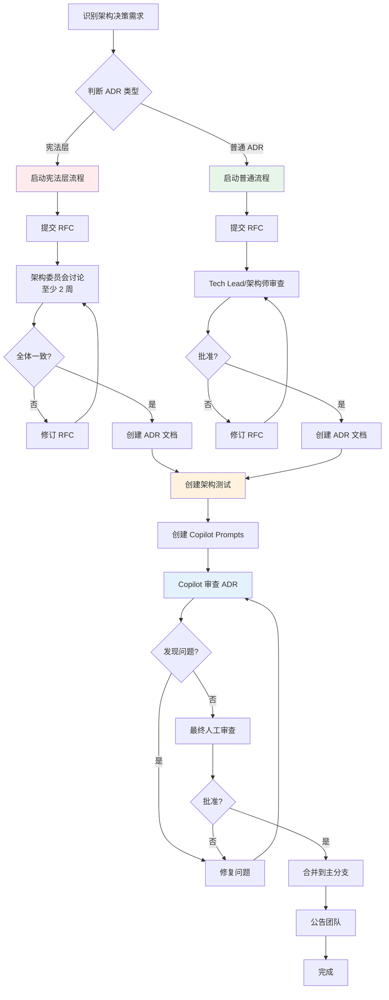
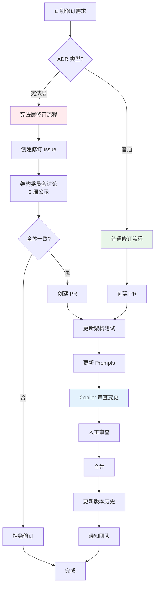

# ADR-0900：ADR 新增与修订流程

**原编号**：ADR-0000A（已重新编号为 ADR-0900，归入治理层）  
**状态**：🏛 Final（不可随意修改）  
**级别**：流程规范 / 治理层  
**适用范围**：所有 ADR 文档  
**生效时间**：2026-01-21  
**编号调整时间**：2026-01-22  

---

## 本章聚焦内容（Focus）

本 ADR 定义架构决策记录（ADR）的新增和修订流程，确保：
- ADR 的质量和一致性
- 架构决策的可追溯性
- 团队对架构变更的共识
- Copilot 能有效参与 ADR 的创建和审查
- 任何未遵循本 ADR-0900 流程新增、修订或废弃的 ADR，在本项目中视为 **无效架构决策**，不具备约束力。

**不在本 ADR 范围内**：
- ADR 的文档结构（参见各 ADR 文档的标准格式）
- 具体 ADR 的内容编写指南（参见 `docs/copilot/adr-XXXX.prompts.md`）

---

## 术语表（Glossary）

| 术语 | 定义 |
|------|------|
| **ADR** | Architecture Decision Record，架构决策记录 |
| **宪法层 ADR** | ADR-0001 至 ADR-0005，构成架构的基础约束 |
| **治理层 ADR** | ADR-0000, ADR-900~999，定义治理机制和流程 |
| **结构层 ADR** | ADR-100~199，定义静态结构和模块组织 |
| **运行层 ADR** | ADR-200~299，定义运行时行为和交互模型 |
| **技术层 ADR** | ADR-300~399，定义技术选型和实现细节 |
| **RFC** | Request for Comments，意见征集 |
| **架构委员会** | 负责审批宪法层 ADR 修订的组织 |

---

## 一、ADR 层级与修订权限

### 1.1 ADR 分级

```
┌─────────────────────────────────────────────────────┐
│ 治理层 ADR-0000, ADR-900~999                        │
│ - 定义架构测试、ADR 流程、破例管理                   │
│ - 权限：Tech Lead + 架构师                          │
└─────────────────────────────────────────────────────┘
              ↓
┌─────────────────────────────────────────────────────┐
│ 宪法层 ADR-0001 ~ 0005                              │
│ - 不可推翻的核心约束                                 │
│ - 权限：架构委员会全体一致同意                       │
└─────────────────────────────────────────────────────┘
              ↓
┌─────────────────────────────────────────────────────┐
│ 结构层 ADR-100~199 / 运行层 ADR-200~299             │
│ 技术层 ADR-300~399                                  │
│ - 具体技术选型、结构细化和最佳实践                   │
│ - 权限：Tech Lead 或架构师审批                       │
└─────────────────────────────────────────────────────┘
```

### 1.2 修订权限表

| ADR 类型 | 新增权限 | 修订权限 | 公示期 | 审批要求 |
|---------|---------|---------|--------|---------|
| **流程层（0000A）** | Tech Lead | Tech Lead + 架构师 | 1 周 | 多数同意 |
| **宪法层（0000-0005）** | 架构委员会 | 架构委员会全体 | 2 周 | 全体一致 |
| **普通 ADR（0006+）** | Tech Lead/架构师 | Tech Lead/架构师 | 无 | 单人批准 |

---

## 二、新增 ADR 流程

### 2.1 完整流程图



### 2.2 第一步：识别需求并判断类型

**何时需要新增 ADR**：
- ✅ 引入新的架构约束
- ✅ 选择影响全局的技术方案
- ✅ 定义跨模块的协作规范
- ✅ 建立新的最佳实践

**何时不需要 ADR**：
- ❌ 单个模块内的实现细节
- ❌ 临时的技术试验
- ❌ 已有 ADR 的细化（更新现有 ADR）

**判断是否为宪法层**：
- 是否影响系统的基础结构？
- 是否定义模块间的核心约束？
- 是否后续 ADR 都会依赖它？

→ 如果 3 个问题中有 2 个回答"是"，则为宪法层。

### 2.3 第二步：提交 RFC（Request for Comments）

#### RFC 文档模板

创建 `docs/rfc/RFC-XXXX-title.md`：

```markdown
# RFC-XXXX：[标题]

**提案人**：[姓名]  
**提交日期**：[日期]  
**目标 ADR 级别**：宪法层 / 普通 ADR  

## 背景（Background）

[描述为什么需要这个决策]

## 问题（Problem）

[明确要解决的问题]

## 提议（Proposal）

[详细的解决方案]

## 备选方案（Alternatives）

[考虑过但未选择的方案]

## 影响分析（Impact）

- 对现有 ADR 的影响：
- 对现有代码的影响：
- 对团队的影响：

## 实施计划（Implementation）

- 架构测试：
- Copilot Prompts：
- 迁移计划：

## 开放问题（Open Questions）

[待解决的问题]
```

#### 使用 Copilot 辅助创建 RFC

```
询问 Copilot：
"我想创建一个 ADR 关于 [主题]，请帮我：
1. 判断它应该是宪法层还是普通 ADR
2. 生成 RFC 框架
3. 列出需要考虑的关键点"
```

Copilot 会参考：
- `docs/copilot/adr-0000A.prompts.md`
- 现有 ADR 文档
- ADR 编写规范

### 2.4 第三步：审查与讨论

#### 宪法层 ADR

1. **提交 RFC** 到 GitHub Issues
   - 标签：`adr`, `constitutional`, `rfc`
   - 标题：`[RFC] ADR-00XX: Title`

2. **公示期**（至少 2 周）
   - 架构委员会成员逐一审查
   - 在 Issue 中讨论
   - 可以多轮修订

3. **投票决策**
   - 需要全体一致同意
   - 任何一票反对，回到讨论

4. **Copilot 辅助审查**
   ```
   询问 Copilot：
   "请审查这个 RFC，检查：
   1. 是否与现有宪法层 ADR 冲突
   2. 是否遗漏关键约束
   3. 是否需要补充架构测试"
   ```

#### 普通 ADR

1. **提交 RFC** 到 GitHub Issues
   - 标签：`adr`, `rfc`
   - 标题：`[RFC] ADR-XXXX: Title`

2. **审查**（1-3 天）
   - Tech Lead 或架构师审查
   - 可以要求修订

3. **批准**
   - 单人批准即可

### 2.5 第四步：创建 ADR 文档

#### 文档结构（标准模板）

```markdown
# ADR-XXXX：[标题]

**状态**：✅ 已采纳 / ⚠️ 草稿 / ❌ 已废弃  
**级别**：架构约束 / 技术选型 / 最佳实践  
**适用范围**：...  
**生效时间**：...  

## 本章聚焦内容（Focus）

## 术语表（Glossary）

## 决策（Decision）

## 与其他 ADR 关系（Related ADRs）

## 快速参考表（Quick Reference）

## 版本历史（Version History）
```

#### 使用 Copilot 生成 ADR

```
询问 Copilot：
"基于 RFC-XXXX，生成完整的 ADR 文档，包括：
1. 标准结构
2. 术语表
3. 决策内容
4. 与其他 ADR 的关系"
```

### 2.6 第五步：创建架构测试

**每个 ADR 必须有对应的架构测试**（参见 ADR-0000）。

测试文件命名：`src/tests/ArchitectureTests/ADR/ADR_XXXX_Architecture_Tests.cs`

#### ADR-测试映射要求

**关键约束标记**：
- 在 ADR 文档中，为需要测试的约束添加 **【必须架构测试覆盖】** 标记
- 在快速参考表中添加"测试覆盖"列，明确对应的测试方法

**测试代码规范**：
- 测试方法必须在 DisplayName 或方法名中包含 `ADR-{编号}`
- 测试失败消息格式：`❌ ADR-{编号} 违规：{约束描述}\n{违规详情}\n修复建议：{具体建议}`

**示例**：

ADR 文档中：
```markdown
### 3. 模块通信约束

严禁行为：
- ❌ 跨模块引用 Entity / Aggregate / ValueObject **【必须架构测试覆盖】**
```

测试代码中：
```csharp
[Theory(DisplayName = "ADR-0001.3: 模块不得跨模块引用实体")]
public void Modules_Should_Not_Reference_Entities_Across_Modules()
{
    // 测试逻辑...
    
    Assert.True(result.IsSuccessful,
        $"❌ ADR-0001.3 违规: 模块实体被其他模块引用。\n" +
        $"违规类型: {failingTypes}。\n" +
        $"修复建议：使用数据契约（DTO）替代直接引用实体。");
}
```

#### 使用 Copilot 生成测试

```
询问 Copilot：
"为 ADR-XXXX 生成架构测试，验证：
[列出需要验证的约束]

要求：
1. 测试方法名包含 ADR 编号
2. 失败消息包含 ADR 引用和修复建议
3. 参考现有测试的格式"
```

Copilot 会参考：
- `docs/copilot/adr-0000.prompts.md`
- 现有架构测试
- NetArchTest 模式
- [ADR-测试映射规范](../../ADR-TEST-MAPPING-SPECIFICATION.md)

### 2.7 第六步：创建 Copilot Prompts

**每个 ADR 必须有对应的 Copilot Prompt 文件，架构测试和 ADR 文档三者缺一不可，缺失任一项，视为 ADR 未完成，不得合并。**

文件命名：`docs/copilot/adr-XXXX.prompts.md`

标准结构：
```markdown
# ADR-XXXX：[标题] - Copilot 提示词库

## 一、当我在写什么时，你应该提醒我哪些约束？

## 二、哪些写法必须阻止？

## 三、CI 失败时，你应该如何解释？

## 四、典型问答（FAQ）

## 五、快速检查清单

## 六、测试覆盖自检清单  ← **新增必需章节**

### 6.1 ADR-测试映射表

| ADR 约束 | 测试方法 | 测试文件 | 状态 |
|---------|---------|---------|------|
| ADR-XXXX.1: ... | `Test_Method_Name` | ADR_XXXX_Architecture_Tests.cs | ✅ 已覆盖 |

### 6.2 自检问题

1. ✅ 所有【必须架构测试覆盖】的约束是否都有对应的测试方法？
2. ✅ 测试方法名是否清晰反映了 ADR 约束内容？
3. ✅ 测试失败消息是否包含 ADR 编号和修复建议？
...
```

#### 使用 Copilot 生成 Prompts

```
询问 Copilot：
"为 ADR-XXXX 生成 Prompts 文件，包括：
1. 场景触发条件
2. 反模式和正确模式
3. CI 失败解释模板
4. FAQ
5. 测试覆盖自检清单（包含完整的映射表）"
```

### 2.8 第七步：运行映射验证

在提交 PR 前，**必须运行** ADR-测试映射验证：

```bash
# 运行映射一致性验证
./scripts/validate-adr-test-mapping.sh

# 或 PowerShell
./scripts/validate-adr-test-mapping.ps1
```

验证脚本会检查：
- ADR 文档中所有 **【必须架构测试覆盖】** 的约束
- 测试代码中的 ADR 引用
- 映射关系的完整性

**如果验证失败**：
1. 检查 ADR 文档是否正确标记了约束
2. 检查测试方法是否包含 ADR 引用
3. 检查快速参考表和 Prompts 文件的映射表是否更新
4. 参考：[ADR-测试一致性开发者指南](../../ADR-TEST-CONSISTENCY-DEVELOPER-GUIDE.md)

### 2.9 第八步：Copilot 审查 ADR

在提交 PR 前，使用 Copilot 审查：

```
询问 Copilot：
"请审查 ADR-XXXX，检查：
1. 文档结构是否完整
2. 是否与现有 ADR 冲突
3. 架构测试是否覆盖所有约束
4. Prompts 文件是否清晰可用
5. 术语表是否完整"
```

Copilot 会参考：
- `.github/instructions/architecture-review.instructions.md`
- `docs/copilot/adr-0000A.prompts.md`
- 所有现有 ADR

### 2.9 第八步：提交 PR

PR 模板必须包含：

```markdown
## ADR 信息

- ADR 编号：ADR-XXXX
- ADR 级别：宪法层 / 普通 ADR
- RFC Issue：#XXXX

## 变更内容

- [ ] ADR 文档 (`docs/adr/ADR-XXXX-xxx.md`)
- [ ] 架构测试 (`src/tests/ArchitectureTests/ADR/ADR_XXXX_Architecture_Tests.cs`)
- [ ] Copilot Prompts (`docs/copilot/adr-XXXX.prompts.md`)
- [ ] 更新 ADR README (`docs/adr/README.md`)

## Copilot Review 结果

[粘贴 Copilot 审查结果]

## 影响评估

- 影响的现有 ADR：
- 需要迁移的代码：
- 团队培训需求：
```

### 2.10 第九步：合并与公告

合并后：
1. **更新 ADR README**：添加到快速导航
2. **团队公告**：通过团队频道通知
3. **培训材料**：如果需要，准备培训材料
4. **监控采纳**：跟踪团队是否理解和遵循

---

## 三、修订 ADR 流程

### 3.1 何时修订 ADR

**应该修订**：
- ✅ 发现 ADR 中的歧义或错误
- ✅ 需要补充细节或示例
- ✅ 技术环境变化，需要调整决策

**不应该修订**：
- ❌ 临时性破例（使用破例流程）
- ❌ 推翻核心决策（应该废弃旧 ADR，创建新 ADR）

### 3.2 修订流程



### 3.3 修订 PR 要求

```markdown
## ADR 修订

- ADR 编号：ADR-XXXX
- 修订类型：补充细节 / 修正错误 / 调整决策
- 修订理由：[说明为什么需要修订]

## 变更内容

- [ ] 更新 ADR 文档
- [ ] 更新架构测试（如需要）
- [ ] 更新 Copilot Prompts
- [ ] 在版本历史中记录变更

## Copilot Review 结果

[粘贴审查结果]

## 影响评估

[评估对现有代码和团队的影响]
```

---

## 四、废弃 ADR 流程

### 4.1 何时废弃 ADR

- ✅ ADR 被新的 ADR 完全替代
- ✅ 技术栈变化，ADR 不再适用
- ✅ 架构演进，决策已过时

### 4.2 废弃流程

1. **创建新 ADR**（如果有替代方案）
2. **标记旧 ADR 为废弃**
   - 状态改为 `❌ 已废弃`
   - 添加废弃日期
   - 说明废弃理由
   - 链接到替代 ADR（如有）

3. **保留文档**（不删除）
4. **更新架构测试**
   - 移除废弃 ADR 的测试
   - 或标记为已禁用

5. **更新 Prompts**
   - 在 Prompts 文件中标注已废弃
   - 引导到新的 ADR

### 4.3 废弃标注示例

```markdown
# ADR-XXXX：[标题]

**状态**：❌ 已废弃  
**废弃日期**：2026-XX-XX  
**废弃理由**：[理由]  
**替代 ADR**：[ADR-YYYY](ADR-YYYY-xxx.md)  

> ⚠️ **废弃通知**
> 
> 本 ADR 已于 2026-XX-XX 废弃。
> 
> 废弃理由：[理由]
> 
> 请参考新的 ADR：[ADR-YYYY](ADR-YYYY-xxx.md)

---

## [原文档内容保留]
```

---

## 五、使用 Copilot 参与 ADR 流程

### 5.1 Copilot 的角色

| 阶段 | Copilot 的作用 |
|------|---------------|
| **RFC 创建** | 生成 RFC 框架、识别关键问题 |
| **审查讨论** | 检查与现有 ADR 的冲突、建议改进 |
| **ADR 编写** | 生成标准结构、补充术语表 |
| **测试生成** | 生成架构测试模板 |
| **Prompts 编写** | 生成 Copilot Prompts 文件 |
| **最终审查** | 全面检查文档质量和一致性 |

### 5.2 典型 Copilot 对话

#### 创建新 ADR

```
开发者：
"我想创建一个 ADR 关于模块间异步通信的超时策略，
请帮我判断它应该是宪法层还是普通 ADR。"

Copilot：
"根据 ADR-0000A，这应该是 **普通 ADR**（ADR-0006+）。

理由：
- 不影响系统的基础结构（模块隔离已由 ADR-0001 定义）
- 不定义模块间的核心约束（通信方式已由 ADR-0005 定义）
- 是对现有异步通信的细化和最佳实践

建议：
1. 提交 RFC 到 GitHub Issues
2. Tech Lead 或架构师审批即可
3. 准备架构测试验证超时配置
4. 创建对应的 Prompts 文件

是否需要我帮你生成 RFC 框架？"
```

#### 审查 ADR 草稿

```
开发者：
"请审查 ADR-0010 草稿，检查是否遗漏重要内容。"

Copilot：
"已审查 ADR-0010。以下是检查结果：

✅ 完整项：
- 文档结构完整
- 术语表清晰
- 决策内容明确

⚠️ 需要补充：
1. **与其他 ADR 关系** 部分缺失
   - 建议说明与 ADR-0005 的关系（异步通信）
   
2. **快速参考表** 可以更详细
   - 建议添加超时值的推荐范围表格

3. **架构测试** 尚未创建
   - 建议添加测试验证超时配置是否在合理范围

是否需要我帮你生成这些补充内容？"
```

---

## 六、快速参考表

### ADR 类型判断表

| 问题 | 宪法层 | 普通 ADR |
|------|--------|---------|
| 影响系统基础结构？ | 是 | 否 |
| 定义模块间核心约束？ | 是 | 否 |
| 后续 ADR 会依赖它？ | 是 | 否 |
| 修订权限 | 架构委员会全体 | Tech Lead/架构师 |
| 公示期 | 2 周 | 无 |

### ADR 文档检查清单

- [ ] 标题清晰描述主题
- [ ] 状态、级别、适用范围完整
- [ ] 本章聚焦内容明确边界
- [ ] 术语表定义关键术语
- [ ] 决策内容包含允许和禁止
- [ ] 说明与其他 ADR 的关系
- [ ] 提供快速参考表
- [ ] 架构测试已创建
- [ ] Copilot Prompts 已创建
- [ ] Copilot 审查通过

### 典型时间线

| ADR 类型 | RFC 讨论 | 文档编写 | 测试/Prompts | 审查 | 总计 |
|---------|---------|---------|-------------|------|------|
| **宪法层** | 2-4 周 | 1-2 周 | 1 周 | 1 周 | 5-8 周 |
| **普通 ADR** | 1-3 天 | 2-3 天 | 1-2 天 | 1 天 | 5-9 天 |

---

## 七、与其他 ADR 关系

### 依赖关系

- **ADR-0000**：本 ADR 定义的流程必须生成符合 ADR-0000 要求的架构测试
- **所有 ADR**：本 ADR 定义了所有 ADR 的生命周期管理

### 引用关系

- 新增 ADR 时，参考本 ADR 的流程
- 修订 ADR 时，参考本 ADR 的权限和公示要求
- Copilot 参与 ADR 流程时，参考 `docs/copilot/adr-0000A.prompts.md`

---

## 八、常见问题（FAQ）

### Q1: 我不确定是否需要创建 ADR，如何判断？

**A:** 使用这个决策树：

```
这个决策是否影响多个模块或全局架构？
├─ 是 → 需要 ADR
└─ 否 → 这个决策是否会被其他开发者参考？
    ├─ 是 → 考虑创建 ADR
    └─ 否 → 不需要 ADR，可以在模块内文档化
```

也可以询问 Copilot：
```
"这个决策是否需要创建 ADR：[描述决策]"
```

### Q2: 宪法层 ADR 可以修订吗？

**A:** 可以，但必须：
- 架构委员会全体一致同意
- 至少 2 周公示期
- 充分的理由和影响评估
- 修订后不能削弱原有约束

**不能做的**：
- 用"折中"方式绕过宪法层约束
- 以"临时破例"为由修订

### Q3: 如果我的代码需要违反 ADR 怎么办？

**A:** 不要修订 ADR，而是走破例流程（参见 ADR-0000）：
- 在 PR 标题加 `[ARCH-VIOLATION]`
- 填写破例说明和归还计划
- 获得架构师批准
- 记录在破例清单

### Q4: Copilot 在 ADR 流程中是必须的吗？

**A:** 强烈建议但不强制：
- ✅ Copilot 可以提高 ADR 质量
- ✅ Copilot 可以确保一致性
- ✅ Copilot 可以加速编写过程
- ⚠️ 最终决策仍由人类做出
- ⚠️ Copilot 审查不能替代人工审查

---

## 九、版本历史

| 版本 | 日期 | 变更说明 | 修订人 | 影响级别 |
|------|------|---------|--------|----------|
| 1.1 | 2026-01-21 | 明确未遵循流程的法律后果，Copilot Prompts/测试为必需品，增加自保护条款，版本历史加影响级别 | @copilot | High |
| 1.0 | 2026-01-21 | 初始版本，定义 ADR 新增和修订流程 | @douhuaa | None |

---

## 附录 A：RFC 模板

见 `docs/templates/rfc-template.md`

## 附录 B：ADR 模板

见 `docs/templates/adr-template.md`

## 附录 C：Copilot Prompts 模板

见 `docs/templates/copilot-prompts-template.md`
