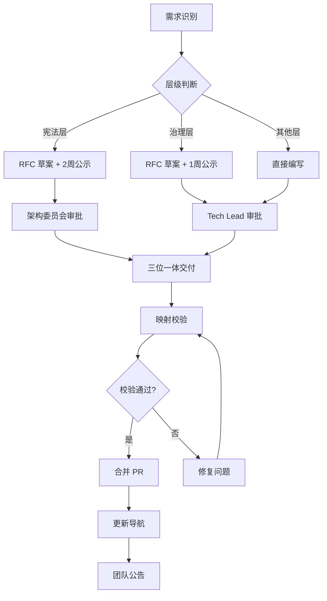

# ADR-0900：ADR 新增与修订流程

**状态**：Final  
**级别**：治理层  
**影响范围**：所有 ADR（0000~999）  
**生效时间**：即刻

> ⚖️ 本流程是 Zss.BilliardHall 唯一有效 ADR 生命周期闭环规范。任何未走本流程的 ADR 在本项目中视为无效，不具约束力。

---

## 1. 规则本体（Rule）

> **这是本 ADR 唯一具有裁决力的部分。**

### R900.1 ADR 层级与权限

ADR **必须**按以下层级管理：

| 层级/类型         | 新增权限           | 修订权限          | 公示期 | 审批要求    |
|------------------|-------------------|-------------------|--------|------------|
| 宪法层 ADR       | 架构委员会         | 架构委员会全体    | 2 周   | 全体一致    |
| 治理层 ADR       | Tech Lead/架构师   | Tech Lead/架构师  | 1 周   | 多数同意    |
| 结构/运行/技术层 | Tech Lead/架构师   | Tech Lead/架构师  | 无     | 单人批准    |

### R900.2 三位一体交付

新增或修订 ADR **必须**：
- 提供 ADR 文档（标准六段式结构）
- 提供架构测试（对应【必须架构测试覆盖】标记）
- 提供 Copilot Prompt 文件

**缺任一项，PR 不得合并。**

### R900.3 映射校验

所有 ADR 变更**必须**：
- 执行映射校验脚本
- 确保 ADR、测试、Prompt 一致性
- Copilot 自检 + 人工责任人确认

### R900.4 RFC 流程

宪法层和治理层 ADR **必须**：
- 先提交 RFC 草案至 GitHub Issues
- 完成公示期讨论
- 记录决议和审批

### R900.5 版本历史

所有 ADR 修订**必须**：
- 更新版本历史表
- 记录变更日期、变更摘要、修订人
- 简要说明影响面

### R900.6 废弃规则

废弃 ADR **必须**：
- 标记状态为 "Superseded by ADR-YYYY"
- 链接到替代 ADR
- 保留在仓库中（不删除）
- 同步移除相关测试/Prompt

---

## 2. 执法模型（Enforcement）

> **规则如果无法执法，就不配存在。**

### 2.1 执行级别

| 级别 | 名称      | 执法方式               | 后果    |
| ---- | ------- | ------------------ | ----- |
| L1   | 静态可执行   | CI 自动化检查 | PR 阻断 |
| L2   | 语义半自动   | 映射脚本验证 | 警告  |
| L3   | 人工 Gate | 架构委员会审批 | 架构裁决  |

### 2.2 测试映射

| 规则编号 | 执行级 | 测试 / 手段                        |
| ------- | --- | ------------------------------ |
| R900.1  | L3  | 人工审批流程 |
| R900.2  | L1  | CI 检查 ADR/测试/Prompt 完整性 |
| R900.3  | L1  | 映射校验脚本 |
| R900.4  | L3  | GitHub Issues 记录验证 |
| R900.5  | L1  | 版本历史表格式检查 |
| R900.6  | L3  | 人工 Code Review |

---

## 3. 破例与归还（Exception）

> **破例不是逃避，而是债务。**

### 3.1 允许破例的前提

破例 **仅在以下情况允许**：

* 紧急修复（需在 1 周内补全流程）
* 实验性 ADR（需明确标记状态为 Draft）
* 迁移期临时规则（需在 6 个月内正式化）

### 3.2 破例要求（不可省略）

每个破例 **必须**：

* 记录在 `docs/summaries/ARCH-VIOLATIONS.md`
* 指明 ADR-0900 + 规则编号（如 R900.2）
* 指定失效日期（不超过 6 个月）
* 给出归还计划（具体到季度）

**未记录的破例 = 未授权架构违规。**

---

## 4. 变更政策（Change Policy）

> **ADR 不是"随时可改"的文档。**

### 4.1 变更规则

* **治理层 ADR**（ADR-0000, 900~999）

  * 可修订，但不得削弱宪法层
  * 需要 Tech Lead 审批
  * 需要 1 周公示期

### 4.2 失效与替代

* Superseded ADR **必须**：
  - 状态标记为 "Superseded by ADR-YYYY"
  - 指向替代 ADR
  - 保留在仓库中（不删除）
  - 移除或更新对应测试

* 不允许"隐性废弃"（偷偷删除或不标记状态）

### 4.3 同步更新

ADR 变更时 **必须** 同步更新：

* 架构测试代码（如适用）
* Copilot prompts 文件
* 映射脚本
* README 导航

---

## 5. 明确不管什么（Non-Goals）

> **防止 ADR 膨胀的关键段落。**

本 ADR **不负责**：

* 技术文档的编写规范 → 团队文档指南
* 代码注释规范 → `.editorconfig`
* Git commit 消息格式 → 团队约定
* PR 模板和描述 → GitHub 配置
* 教学示例和最佳实践 → `docs/copilot/*.prompts.md`

---

## 6. 非裁决性参考（References）

> **仅供理解，不具裁决力。**

### 术语表

| 术语            | 定义说明 |
|----------------|--------------------------------------|
| ADR            | Architecture Decision Record，架构决策记录 |
| 宪法层 ADR     | ADR-0001~0005，系统根基不可推翻约束 |
| 治理层 ADR     | ADR-0000, 900~999，架构过程、CI、审批相关 |
| 结构/运行/技术层 | ADR-100~399，架构细化和技术落地 |
| RFC            | Request for Comments，架构决策草案 |
| 架构委员会      | 宪法层唯一审批主体 |
| 三位一体        | ADR 文档 + 架构测试 + Copilot Prompt |

### 相关 ADR

- [ADR-0000：架构测试与 CI 治理](ADR-0000-architecture-tests.md)
- 所有宪法层 ADR（ADR-0001~0005）

### 辅导材料

- `docs/templates/adr-template.md` - ADR 模板
- `docs/templates/rfc-template.md` - RFC 模板
- `docs/templates/copilot-prompts-template.md` - Prompt 模板

### 新增 ADR 流程图

### FAQ

**Q：只提交 ADR 文档，测试和 Prompt 可以后补吗？**  
A：❌ 不可以，三位一体缺一不可，缺任一项视为无效 ADR。

**Q：Copilot 审查结果可直接视为审批结论吗？**  
A：❌ 不能，必须有人工责任人签字/记录。

**Q：架构委员会可以随意调整宪法层规则吗？**  
A：❌ 必须走 2 周公示与全体一致流程，留历史与公告。

**Q：废弃的 ADR 可以删除吗？**  
A：❌ 永远只做废弃标记和链路，不允许物理删除。

**Q：如何辨别一个决策是否应为宪法层？**  
A：只要它影响系统基础结构、依赖方向、约束开放性，或会被跨模块持久依赖，就应为宪法层。

### 检查清单

新增 ADR 前自检：

- [ ] 是否确定了正确的层级？
- [ ] 是否完成了 RFC 流程（如需要）？
- [ ] 是否提供了完整的 ADR 文档（六段式）？
- [ ] 关键约束是否标记【必须架构测试覆盖】？
- [ ] 是否同步生成/更新架构测试？
- [ ] 是否有对应 Prompt 文件？
- [ ] 映射校验/CI 流程是否全部通过？
- [ ] Copilot 及人工审查报告是否已归档？

### 版本历史

| 版本 | 日期 | 变更摘要 | 修订人 | 影响级别 |
|------|------|----------|------|----------|
| 2.0  | 2026-01-24 | 采用终极模板，明确规则与执法分离 | - | High |
| 1.2  | 2026-01-23 | 企业级闭环重构、三位一体交付与校验 | @douhuaa | High |
| 1.1  | 2026-01-21 | 强调测试/Prompt/审查闭环 | @copilot | High |
| 1.0  | 2026-01-21 | 定义 ADR 新增修订流程 | @douhuaa | None |

---

# ADR 终极一句话定义

> **ADR 是系统的法律条文，不是架构师的解释说明。**
