# ADR-940：ADR 关系与溯源管理治理规范

> ⚖️ **本 ADR 是所有 ADR 关系声明的治理规范，定义 ADR 之间关系的标准化管理机制。**

## Focus（聚焦内容）

- ADR 关系类型定义与标准化
- 关系声明的强制格式
- 关系双向一致性验证
- 全局关系图生成机制
- 循环依赖检测

---

## Glossary（术语表）

| 术语 | 定义 | 英文对照 |
|------|------|----------|
| 关系声明 | ADR 文档中声明与其他 ADR 关系的章节 | Relationship Declaration |
| 依赖关系 | 本 ADR 基于另一 ADR 的规则或概念 | Dependency |
| 被依赖关系 | 其他 ADR 基于本 ADR | Depended By |
| 替代关系 | 本 ADR 取代另一个已废弃的 ADR | Supersedes |
| 被替代关系 | 本 ADR 已被新 ADR 取代 | Superseded By |
| 相关关系 | 与本 ADR 相关但不存在依赖 | Related |
| 冲突关系 | 与本 ADR 冲突的关系 | Conflicts |
| 双向一致性 | A 依赖 B 则 B 必须声明被 A 依赖 | Bidirectional Consistency |
| 关系图 | ADR 之间关系的可视化表示 | Relationship Map |

---

## Decision（裁决）

> ⚠️ **本节为唯一裁决来源，所有条款具备执行级别。**
> 
> 🔒 **统一铁律**：
> 
> ADR-940 中，所有可执法条款必须具备稳定 RuleId，格式为：
> ```
> ADR-940_<Rule>_<Clause>
> ```

>本 ADR 仅在 ADR-902 结构合规的前提下生效。
>不合规的 ADR 视为不存在，其关系不进入本 ADR 的裁决范围。

---

### ADR-940_1：关系声明章节要求（Rule）

#### ADR-940_1_1 每个 ADR 必须包含关系声明章节

**规则**：

所有 ADR **必须**包含"关系声明（Relationships）"章节，位于"决策"章节之后。

**标准格式**：

```markdown
### 关系声明（Relationships）

**依赖（Depends On）**：
- [ADR-XXXX：标题](相对路径) - 依赖原因说明

**被依赖（Depended By）**：
- [ADR-YYYY：标题](相对路径)

**替代（Supersedes）**：
- [ADR-ZZZZ：标题](相对路径) - 替代原因说明

**被替代（Superseded By）**：
- [ADR-AAAA：标题](相对路径) - 被替代原因说明

**相关（Related）**：
- [ADR-BBBB：标题](相对路径) - 关系说明
```

**缺失处理**：
- 无依赖时：`**依赖（Depends On）**：无`
- 其他关系类型同理

**判定**：
- ❌ 缺少"关系声明"章节
- ❌ 章节位置不正确
- ✅ 包含完整的关系声明章节

---

### ADR-940_2：关系类型定义与约束（Rule）

#### ADR-940_2_1 关系类型定义与使用约束

**规则**：

关系类型 **必须**符合以下定义：

| 关系类型 | 定义 | 使用场景 | 强制双向 |
|---------|------|----------|----------|
| **依赖（Depends On）** | 本 ADR 基于另一 ADR 的规则、概念或决策 | ADR-005 依赖 ADR-001 的模块隔离规则 | ✅ 是 |
| **被依赖（Depended By）** | 其他 ADR 基于本 ADR | ADR-001 被 ADR-005 依赖 | ✅ 是 |
| **替代（Supersedes）** | 本 ADR 取代另一 ADR，原 ADR 已废弃 | ADR-005-v2 替代 ADR-005-v1 | ✅ 是 |
| **被替代（Superseded By）** | 本 ADR 已被新 ADR 取代，本 ADR 已废弃 | ADR-005-v1 被 ADR-005-v2 替代 | ✅ 是 |
| **相关（Related）** | 与本 ADR 相关但不存在依赖 | ADR-001 与 ADR-002 都涉及模块 | ❌ 否 |

**核心原则**：
> 依赖和替代关系必须双向一致，相关关系可以单向声明。

**已废弃 ADR 的强制约束（裁决性条款）**：
- 标记为 **Superseded**（被替代）的 ADR **禁止**作为新变更的依据
- 标记为 **Superseded** 的 ADR **禁止**被新 ADR 引用为 Depends On
- 违反此规则的 PR **必须**拒绝合并

**示例**：
```markdown
❌ 禁止：
- ADR-005-v1 已被 ADR-005-v2 替代
- 新 ADR-XXX 声明依赖 ADR-005-v1
→ 违规，必须改为依赖 ADR-005-v2

✅ 允许：
- ADR-005-v1 已被 ADR-005-v2 替代
- 历史 ADR（替代前创建）依赖 ADR-005-v1
→ 合规，历史依赖保留
```

**判定**：
- ❌ 使用未定义的关系类型
- ❌ 依赖关系未双向声明
- ❌ 新 ADR 依赖已废弃 ADR
- ✅ 关系类型正确且双向一致

---

### ADR-940_3：关系一致性验证（Rule）

#### ADR-940_3_1 关系双向一致性验证

**规则**：

**依赖关系双向一致性**：
- 若 ADR-A 依赖 ADR-B，则 ADR-B 必须声明被 ADR-A 依赖
- 不一致则视为违规

**替代关系双向一致性**：
- 若 ADR-A 替代 ADR-B，则 ADR-B 必须声明被 ADR-A 替代
- 不一致则视为违规

**相关关系**：
- 不要求双向，但建议双向声明以提升可发现性

**自动验证**：
- CI 必须检测关系一致性
- 不一致时阻断构建

**判定**：
- ❌ A 依赖 B，但 B 未声明被 A 依赖
- ❌ A 替代 B，但 B 未声明被 A 替代
- ✅ 所有依赖和替代关系双向一致

---

### ADR-940_4：循环依赖治理（Rule）

#### ADR-940_4_1 循环依赖禁止

**规则**：

ADR **禁止**形成循环依赖：

**禁止模式**：
- ❌ ADR-A 依赖 ADR-B，ADR-B 依赖 ADR-A
- ❌ ADR-A 依赖 ADR-B，ADR-B 依赖 ADR-C，ADR-C 依赖 ADR-A

**检测机制**：
- CI 必须检测循环依赖
- 发现循环依赖时阻断构建

**解决方案**：
- 提取公共规则到新 ADR
- 重新设计依赖关系
- 将依赖改为相关关系

**判定**：
- ❌ 存在循环依赖
- ✅ 依赖关系形成有向无环图（DAG）

---

### ADR-940_5：关系可视化（Rule）

#### ADR-940_5_1 全局关系图生成

**规则**：

**自动生成关系图**：
- 位置：`docs/adr/ADR-RELATIONSHIP-MAP.md`
- 格式：Mermaid 图表 + 表格列表
- 更新：每次 ADR 变更后自动生成

**关系图内容**：
1. **全局关系图**：显示所有 ADR 及其关系
2. **分层关系图**：按层级（宪法/治理/结构/运行/技术）分组
3. **状态关系图**：按状态（Active/Superseded/Deprecated）过滤

**Mermaid 图表格式**：

```mermaid
graph TB
    ADR0001[ADR-001: 模块化架构] --> ADR0005[ADR-005: 交互模型]
    ADR0005 --> ADR0201[ADR-201: Handler 生命周期]

    style ADR0001 fill:#90EE90
    style ADR0005 fill:#87CEEB
    style ADR0201 fill:#FFD700
```


**表格列表格式**：
| ADR | 标题 | 依赖 | 被依赖 | 替代 | 被替代 |
|-----|------|------|--------|------|--------|
| ADR-001 | 模块化架构 | 无 | ADR-005, ADR-123 | 无 | 无 |

**判定**：
- ❌ 关系图缺失或过时
- ✅ 关系图准确反映当前 ADR 关系

---

## Enforcement（执法模型）

> 📋 **Enforcement 映射说明**：
> 
> 下表展示了 ADR-940 各条款（Clause）的执法方式及执行级别。

### 测试映射与执行级别

| 规则编号 | 执行级 | 测试/手段 | Decision 映射 |
|---------|--------|----------|--------------|
| **ADR-940_1_1** | L1 | `ADR_940_1_1_Relationship_Section_Required` | §ADR-940_1_1 |
| **ADR-940_2_1** | L1 | `ADR_940_2_1_Relationship_Types_Valid` | §ADR-940_2_1 |
| **ADR-940_2_1 已废弃 ADR 约束** | L1 | `ADR_940_2_1_No_Superseded_ADR_Dependency` | §ADR-940_2_1 |
| **ADR-940_3_1** | L1 | `ADR_940_3_1_Bidirectional_Consistency` | §ADR-940_3_1 |
| **ADR-940_4_1** | L1 | `ADR_940_4_1_No_Circular_Dependencies` | §ADR-940_4_1 |
| **ADR-940_5_1** | L2 | `scripts/generate-adr-relationship-map.sh` | §ADR-940_5_1 |

**执行级别说明**：
- **L1 (Structural Violation)**：违反导致 **CI 构建失败**，PR 无法合并
- **L2 (Governance Warning)**：仅记录警告，不阻断合并

**明确裁决边界**：
- **关系声明缺失** → 构建失败
- **关系类型错误** → 构建失败
- **新 ADR 依赖已废弃 ADR** → 构建失败
- **双向一致性违反** → 构建失败
- **循环依赖** → 构建失败
- **关系图未生成** → 仅警告

---

## 测试实现参考 CI 集成

```yaml
# .github/workflows/adr-relationship-check.yml
name: ADR Relationship Check

on: [pull_request]

jobs:
  check:
    runs-on: ubuntu-latest
    steps:
      - uses: actions/checkout@v3
      - name: Verify Relationship Declarations
        run: ./scripts/verify-adr-relationships.sh
      - name: Check Bidirectional Consistency
        run: ./scripts/check-relationship-consistency.sh
      - name: Detect Circular Dependencies
        run: ./scripts/detect-circular-dependencies.sh
      - name: Generate Relationship Map
        run: ./scripts/generate-adr-relationship-map.sh
```

---

## Non-Goals（明确不管什么）

本 ADR **不负责**：
- ADR 内容质量评审
- ADR 版本号管理（由 ADR-980 管理）
- ADR 文档格式（由 ADR-008 管理）
- ADR 审批流程（由 ADR-900 管理）

---

## Prohibited（禁止行为）

---

## Relationships（关系声明）

### 依赖（Depends On）
- [ADR-900：架构测试与 CI 治理元规则](./ADR-900-architecture-tests.md) - 关系管理基于 CI 治理机制
- [ADR-008：文档编写与维护宪法](../constitutional/ADR-008-documentation-governance-constitution.md) - 基于文档规范
- [ADR-900：ADR 新增与修订流程](ADR-900-architecture-tests.md) - 集成到 ADR 流程

### 被依赖（Depended By）
- [ADR-945：ADR 全局时间线与演进视图](./ADR-945-adr-timeline-evolution-view.md) - 时间线视图依赖关系图
- [ADR-946：ADR 标题级别即语义级别约束](./ADR-946-adr-heading-level-semantic-constraint.md) - 标题语义约束防止解析歧义
- [ADR-947：关系声明区的结构与解析安全规则](./ADR-947-relationship-section-structure-parsing-safety.md) - 关系声明结构规范
- [ADR-955：文档搜索与可发现性优化](./ADR-955-documentation-search-discoverability.md) - 搜索依赖关系图
- [ADR-980：ADR 生命周期一体化同步机制治理规范](./ADR-980-adr-lifecycle-synchronization.md) - 版本同步需要关系图更新

### 替代（Supersedes）
无

### 被替代（Superseded By）
无

### 相关（Related）
- [ADR-006：术语与编号宪法](../constitutional/ADR-006-terminology-numbering-constitution.md) - 涉及 ADR 编号规范
- [ADR-008：文档编写与维护宪法](../constitutional/ADR-008-documentation-governance-constitution.md) - 文档规范相关
- [ADR-946：ADR 标题级别即语义级别约束](./ADR-946-adr-heading-level-semantic-constraint.md) - 标题语义约束防止解析歧义

---

## References（非裁决性参考）

### 工具和脚本

- `scripts/verify-adr-relationships.sh` - 关系声明验证脚本
- `scripts/check-relationship-consistency.sh` - 双向一致性检查脚本
- `scripts/detect-circular-dependencies.sh` - 循环依赖检测脚本
- `scripts/generate-adr-relationship-map.sh` - 关系图生成脚本

### 相关文档

- [ADR 关系图](../ADR-RELATIONSHIP-MAP.md) - 全局关系图
- [ADR 模板](../../templates/adr-template.md) - 包含关系声明章节

---

## History（版本历史）

| 版本 | 日期 | 变更说明 | 作者 |
|------|------|----------|------|
| 2.0 | 2026-02-03 | 对齐 ADR-907 v2.0，引入 Rule/Clause 双层编号体系 | Architecture Board |
| 1.0 | 2026-01-26 | 初始版本，定义 ADR 关系管理机制 | GitHub Copilot |
