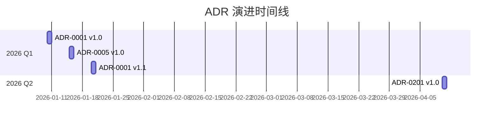

# ADR-945：ADR 全局时间线与演进视图

> ⚖️ **本 ADR 定义 ADR 演进历史的可视化标准和自动化生成机制。**

**状态**：✅ Accepted（已采纳）  
**级别**：治理层 / 工具规范  
**适用范围**：所有 ADR 文档  
**生效时间**：即刻

---

## 聚焦内容（Focus）

- ADR 演进历史时间线生成
- 变更频率统计和分析
- 高频修改 ADR 识别
- 演进视图可视化标准

---

## 术语表（Glossary）

| 术语 | 定义 | 英文对照 |
|------|------|----------|
| 时间线 | ADR 按时间顺序排列的演进历史 | Timeline |
| 演进视图 | ADR 变更频率和影响的可视化表示 | Evolution View |
| 变更频率 | ADR 在特定时间段内的修订次数 | Change Frequency |
| 高频 ADR | 变更频率超过阈值的 ADR | High-Frequency ADR |

---

## 决策（Decision）

### 自动生成 ADR 演进时间线（ADR-945.1）

**规则**：

**生成工具**：`scripts/generate-adr-timeline.sh`

**时间线位置**：`docs/adr/ADR-TIMELINE.md`

**时间线内容**：
1. 按时间倒序列出所有 ADR 变更
2. 包含：日期、ADR 编号、标题、版本、变更类型
3. 按年份和季度分组

**Mermaid 甘特图格式**：


**表格格式**：
| 日期 | ADR | 版本 | 变更类型 | 说明 |
|------|-----|------|----------|------|
| 2026-01-26 | ADR-940 | 1.0 | 新增 | ADR 关系管理 |
| 2026-01-20 | ADR-0001 | 1.1 | 修订 | 细化模块隔离规则 |

**更新频率**：每次 ADR 变更后自动生成

**判定**：
- ❌ 时间线缺失或过时
- ✅ 时间线准确反映所有 ADR 变更

---

### 变更频率统计和分析（ADR-945.2）

**规则**：

**统计维度**：
1. 按 ADR 统计修订次数
2. 按时间段统计变更频率
3. 按层级统计活跃度

**生成报告位置**：`docs/adr/ADR-CHANGE-FREQUENCY-REPORT.md`

**报告内容**：
```markdown
## ADR 变更频率报告

**报告期**：2026 Q1

### 总体统计
- 总 ADR 数：15
- 本期新增：3
- 本期修订：5
- 本期废弃：1

### 高频修改 ADR（≥3 次）
| ADR | 标题 | 修订次数 | 平均间隔 | 最近修订 |
|-----|------|----------|----------|----------|
| ADR-0001 | 模块化架构 | 5 | 12 天 | 2026-01-20 |
| ADR-0005 | 交互模型 | 4 | 15 天 | 2026-01-18 |

### 按层级活跃度
| 层级 | ADR 数 | 修订次数 | 平均频率 |
|------|--------|----------|----------|
| 宪法层 | 5 | 8 | 1.6 |
| 治理层 | 3 | 12 | 4.0 |

### 识别结果
- **潜在不稳定 ADR**：ADR-0001（频繁修订可能表示规则不够清晰）
- **建议行动**：审查 ADR-0001，考虑拆分或细化
```

**更新频率**：每季度生成

**判定**：
- ❌ 报告缺失或数据不准确
- ✅ 报告准确反映 ADR 变更频率

---

### 高频修改 ADR 识别（ADR-945.3）

**规则**：

**识别阈值**：
- 季度修订次数 ≥ 3 次
- 或平均修订间隔 < 14 天

**自动标记**：
在 ADR-CHANGE-FREQUENCY-REPORT.md 中标记高频 ADR

**建议行动**：
1. 审查 ADR 规则是否清晰
2. 评估是否需要拆分
3. 考虑是否需要细化为多个 ADR

**判定**：
- ❌ 高频 ADR 未识别
- ✅ 高频 ADR 已识别并建议行动

---

## 执法模型（Enforcement）

### 测试映射

| 规则编号 | 执行级 | 测试/手段 |
|---------|--------|----------|
| ADR-945.1 | L2 | `scripts/generate-adr-timeline.sh` |
| ADR-945.2 | L2 | `scripts/generate-change-frequency-report.sh` |
| ADR-945.3 | L2 | 报告中包含识别结果 |

### CI 集成

```yaml
# .github/workflows/adr-timeline.yml
name: Generate ADR Timeline

on:
  push:
    paths:
      - 'docs/adr/**/*.md'

jobs:
  generate:
    runs-on: ubuntu-latest
    steps:
      - uses: actions/checkout@v3
      - name: Generate Timeline
        run: ./scripts/generate-adr-timeline.sh
      - name: Commit Changes
        run: |
          git config user.name "ADR Bot"
          git config user.email "bot@example.com"
          git add docs/adr/ADR-TIMELINE.md
          git commit -m "docs: 更新 ADR 时间线" || echo "No changes"
```

---

## 破例与归还（Exception）

### 允许破例的前提

破例 **仅在以下情况允许**：
- 工具开发初期，手动维护时间线

### 破例要求

每个破例 **必须**：
- 记录在 `ARCH-VIOLATIONS.md`
- 指定失效日期（不超过 1 个月）
- 给出自动化计划

---

## 变更政策（Change Policy）

### 变更规则

- **修改阈值**：Tech Lead 可批准
- **修改格式**：Tech Lead 可批准
- **修改工具**：Tech Lead 可批准

---

## 明确不管什么（Non-Goals）

本 ADR **不负责**：
- ADR 内容质量评审
- ADR 变更原因分析（由人工审查）
- ADR 优先级排序

---

## 关系声明（Relationships）

**依赖（Depends On）**：
- [ADR-940：ADR 关系与溯源管理宪法](ADR-940-adr-relationship-traceability-management.md) - 基于关系图数据

**被依赖（Depended By）**：无

**替代（Supersedes）**：无

**被替代（Superseded By）**：无

**相关（Related）**：
- [ADR-980：ADR 生命周期一体化同步机制](ADR-980-adr-lifecycle-synchronization-mechanism.md) - 版本追踪相关

---

## 非裁决性参考（References）

### 工具和脚本

- `scripts/generate-adr-timeline.sh` - 时间线生成脚本
- `scripts/generate-change-frequency-report.sh` - 频率报告生成脚本

### 相关文档

- [ADR 时间线](../ADR-TIMELINE.md) - 演进时间线
- [ADR 变更频率报告](../ADR-CHANGE-FREQUENCY-REPORT.md) - 频率统计

---

## 版本历史

| 版本 | 日期 | 变更说明 | 作者 |
|------|------|----------|------|
| 1.0 | 2026-01-26 | 初始版本，定义 ADR 演进视图 | GitHub Copilot |

---

**维护**：Tech Lead  
**审核**：@douhuaa  
**状态**：✅ Accepted
