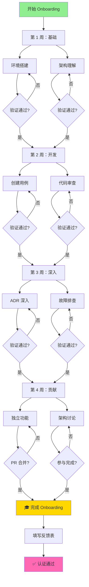
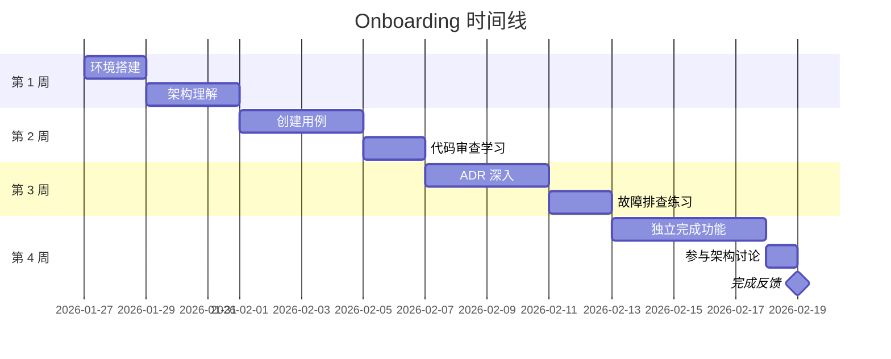

# ADR-965：Onboarding 互动式学习路径

> ⚖️ **本 ADR 是 Onboarding 互动式学习体验的标准，定义互动清单、可视化路径和进度跟踪机制。**

**状态**：✅ Accepted  
**版本**：1.0
**级别**：体验优化 / 治理层  
**适用范围**：Onboarding 文档的互动式增强  
**生效时间**：即刻

---

## 聚焦内容（Focus）

- 互动式清单设计
- 学习路径可视化
- 进度跟踪机制
- Issue Template 集成
- 成就系统（可选）

---

## 术语表（Glossary）

| 术语 | 定义 | 英文对照 |
|------|------|----------|
| 互动式清单 | 可勾选的任务列表 | Interactive Checklist |
| 学习路径 | 可视化的学习流程图 | Learning Path |
| 进度跟踪 | 实时追踪完成情况 | Progress Tracking |
| Issue Template | GitHub Issue 模板 | Issue Template |
| 里程碑 | 学习过程中的关键节点 | Milestone |
| 成就徽章 | 完成某阶段获得的虚拟奖励 | Achievement Badge |

---

## 决策（Decision）

### 互动式清单设计（ADR-965.1）

**规则**：

Onboarding 文档 **必须**包含可互动的任务清单。

**清单格式**：

使用 GitHub Issue Template 创建个人 Onboarding Issue：

```markdown
---
name: Onboarding Checklist
about: 新成员入职学习清单
title: '[Onboarding] Your Name'
labels: onboarding, in-progress
assignees: ''
---

# 🎯 Onboarding 学习清单

**姓名**：[填写你的名字]  
**开始日期**：YYYY-MM-DD  
**Mentor**：[@mentor-username]

---

## 📅 第 1 周：基础设置（Foundation）

### 环境搭建
- [ ] 克隆仓库并配置 Git
- [ ] 安装开发工具（IDE、.NET、Docker）
- [ ] 运行所有测试（单元测试 + 架构测试）
- [ ] 验证 CI/CD 流程

**预计耗时**：1-2 天  
**完成时间**：_____

### 架构理解
- [ ] 阅读 [ADR-0001：模块化单体架构](...)
- [ ] 阅读 [ADR-0005：应用内交互模型](...)
- [ ] 观看架构概览视频（如有）
- [ ] 与 Mentor 讨论架构概念

**预计耗时**：2-3 天  
**完成时间**：_____

### 第 1 周验证
- [ ] 能独立运行和调试测试
- [ ] 理解模块隔离概念
- [ ] 理解 CQRS 基本概念

---

## 📅 第 2 周：开发实践（Development）

### 创建第一个用例
- [ ] 选择简单用例（如查询）
- [ ] 创建 Handler
- [ ] 创建 Endpoint
- [ ] 编写单元测试
- [ ] 运行架构测试验证

**预计耗时**：3-4 天  
**完成时间**：_____

### 代码审查学习
- [ ] 审查至少 2 个 PR
- [ ] 理解 PR 模板和检查清单
- [ ] 学习提交规范（Conventional Commits）

**预计耗时**：1-2 天  
**完成时间**：_____

### 第 2 周验证
- [ ] 创建了可运行的用例
- [ ] 理解测试编写规范
- [ ] 理解 PR 流程

---

## 📅 第 3 周：架构深入（Architecture）

### ADR 深入学习
- [ ] 阅读核心 ADR（0000-0008）
- [ ] 理解架构测试机制
- [ ] 学习 Copilot Prompts 使用
- [ ] 理解模块通信模式

**预计耗时**：3-4 天  
**完成时间**：_____

### 故障排查练习
- [ ] 故意引入架构违规
- [ ] 观察测试失败
- [ ] 使用 Copilot Prompts 修复
- [ ] 理解错误消息和修复指南

**预计耗时**：1-2 天  
**完成时间**：_____

### 第 3 周验证
- [ ] 理解所有核心 ADR
- [ ] 能独立排查架构测试失败
- [ ] 能使用 Copilot Prompts

---

## 📅 第 4 周：独立贡献（Contribution）

### 独立完成功能
- [ ] 从 Issue 中选择任务
- [ ] 独立设计和实现
- [ ] 编写完整测试
- [ ] 提交 PR 并通过审查
- [ ] 合并到主分支

**预计耗时**：4-5 天  
**完成时间**：_____

### 参与架构讨论
- [ ] 参加至少 1 次架构讨论会议
- [ ] 提出问题或改进建议
- [ ] 理解决策过程

**预计耗时**：1 天  
**完成时间**：_____

### 完成反馈
- [ ] 填写 [Onboarding 反馈表](...)
- [ ] 与 Mentor 进行总结会谈

**预计耗时**：0.5 天  
**完成时间**：_____

---

## 🎓 完成标准

完成以下所有项目即视为"Onboarding 完成"：
- [ ] 所有周清单项已勾选
- [ ] 至少 1 个 PR 已合并
- [ ] 反馈表已提交
- [ ] Mentor 确认完成

**实际完成日期**：_____  
**总耗时**：_____ 天

---

## 📝 笔记和问题

（在这里记录你的学习笔记、遇到的问题和解决方案）

---

## 🏆 成就解锁

- [ ] 🚀 First Commit - 第一次提交代码
- [ ] ✅ Test Master - 运行所有测试通过
- [ ] 🏗️ Architecture Aware - 理解核心架构 ADR
- [ ] 🔧 Handler Creator - 创建第一个 Handler
- [ ] 👥 Code Reviewer - 审查第一个 PR
- [ ] 🎯 Feature Complete - 完成第一个功能
- [ ] 📚 Documentation Reader - 阅读所有核心 ADR
- [ ] 🎓 Onboarding Complete - 完成 Onboarding
```

**Issue Template 位置**：
```
.github/ISSUE_TEMPLATE/onboarding-checklist.md
```

**使用流程**：
1. 新成员加入时，创建 Onboarding Issue
2. 分配给新成员和 Mentor
3. 新成员勾选完成的任务
4. Mentor 定期检查进度
5. 完成后关闭 Issue

**核心原则**：
> 可见进度，互动参与，持续激励。

**判定**：
- ❌ 静态文档，无互动
- ❌ 无法追踪进度
- ✅ 互动清单，实时追踪

---

### 学习路径可视化（ADR-965.2）

**规则**：

Onboarding 文档 **必须**包含可视化学习路径图。

**路径图位置**：
```
docs/onboarding/README.md
```

**可视化格式**：

使用 Mermaid 图表：

```markdown
# Onboarding 学习路径


```

**里程碑可视化**：



**核心原则**：
> 可视化路径，明确目标，知道位置。

**判定**：
- ❌ 纯文字描述，难以理解全局
- ❌ 无时间线概念
- ✅ 可视化路径和时间线

---

### 进度跟踪机制（ADR-965.3）

**规则**：

**必须**实时追踪 Onboarding 进度。

**追踪方式**：

1. **GitHub Issue 进度条**：
   - Issue 中的复选框自动生成进度条
   - GitHub 原生支持

2. **Project Board 集成**：
   ```
   Onboarding Pipeline
   ├─ To Do（待完成）
   ├─ In Progress（进行中）
   ├─ Review（审查中）
   └─ Done（已完成）
   ```

3. **自动化通知**：
   - 完成每周时自动评论祝贺
   - 卡住超过 3 天自动通知 Mentor
   - 完成 Onboarding 时自动庆祝

**GitHub Actions 示例**：
```yaml
name: Onboarding Progress Tracker

on:
  issues:
    types: [edited]

jobs:
  track-progress:
    if: contains(github.event.issue.labels.*.name, 'onboarding')
    runs-on: ubuntu-latest
    steps:
      - name: Check Progress
        uses: actions/github-script@v6
        with:
          script: |
            const body = context.payload.issue.body;
            const checkboxes = body.match(/- \[x\]/g) || [];
            const totalBoxes = body.match(/- \[ \]/g).length + checkboxes.length;
            const progress = Math.round((checkboxes.length / totalBoxes) * 100);
            
            // 更新 Issue 标题显示进度
            const newTitle = context.payload.issue.title.replace(/\(\d+%\)/, '') + ` (${progress}%)`;
            
            await github.rest.issues.update({
              owner: context.repo.owner,
              repo: context.repo.repo,
              issue_number: context.issue.number,
              title: newTitle
            });
            
            // 里程碑祝贺
            if (progress === 25) {
              await github.rest.issues.createComment({
                issue_number: context.issue.number,
                owner: context.repo.owner,
                repo: context.repo.repo,
                body: '🎉 恭喜完成 25% 的 Onboarding！继续加油！'
              });
            }
            // ... 50%, 75%, 100% 类似
```

**进度仪表板**（可选）：
```
docs/onboarding/dashboard.md
```

内容：
```markdown
# Onboarding 仪表板

## 当前进行中

| 成员 | 开始日期 | 当前周 | 进度 | Mentor | 状态 |
|------|---------|-------|------|--------|------|
| Alice | 2026-01-20 | Week 3 | 65% | @bob | ✅ 正常 |
| Charlie | 2026-01-15 | Week 4 | 85% | @david | ✅ 正常 |

## 历史记录

| 成员 | 开始日期 | 完成日期 | 总耗时 | Mentor | 评分 |
|------|---------|---------|--------|--------|------|
| Eve | 2026-01-01 | 2026-01-29 | 28 天 | @frank | ⭐⭐⭐⭐⭐ |
```

**核心原则**：
> 实时可见，自动通知，持续激励。

**判定**：
- ❌ 不知道新人进度如何
- ❌ 需手动询问进度
- ✅ 自动追踪和通知

---

### Issue Template 集成（ADR-965.4）

**规则**：

**必须**提供标准化的 Issue Template。

**Template 文件**：
```
.github/ISSUE_TEMPLATE/onboarding-checklist.md
```

（内容见 ADR-965.1）

**配置文件**：
```yaml
# .github/ISSUE_TEMPLATE/config.yml
blank_issues_enabled: false
contact_links:
  - name: 📚 Documentation
    url: https://github.com/owner/repo/blob/main/docs/README.md
    about: 查阅文档
  - name: 💬 Discussions
    url: https://github.com/owner/repo/discussions
    about: 讨论和提问
```

**使用指南**：
```
docs/onboarding/HOW-TO-START.md
```

内容：
```markdown
# 如何开始 Onboarding

## 第 1 步：创建你的 Onboarding Issue

1. 点击 [创建 Issue](https://github.com/owner/repo/issues/new/choose)
2. 选择"Onboarding Checklist"模板
3. 填写你的名字和 Mentor
4. 提交 Issue

## 第 2 步：开始勾选任务

- 完成每个任务后勾选复选框
- 记录完成时间
- 在笔记区记录问题和心得

## 第 3 步：定期同步

- 每周与 Mentor 同步进度
- 遇到困难及时在 Issue 中评论求助
- 查看自动生成的进度百分比

## 第 4 步：完成并反馈

- 勾选所有任务
- 填写反馈表
- Mentor 确认后关闭 Issue
```

**核心原则**：
> 标准化流程，降低启动成本。

**判定**：
- ❌ 新人不知道如何开始
- ❌ 每个人 Onboarding 方式不一样
- ✅ 标准化 Template，统一流程

---

### 成就系统（可选）（ADR-965.5）

**规则**：

**可以**引入成就徽章系统以增强激励。

**成就定义**：

| 徽章 | 名称 | 解锁条件 | 图标 |
|------|------|---------|------|
| 🚀 | First Commit | 第一次提交代码 | 🚀 |
| ✅ | Test Master | 所有测试通过 | ✅ |
| 🏗️ | Architecture Aware | 理解核心 ADR | 🏗️ |
| 🔧 | Handler Creator | 创建第一个 Handler | 🔧 |
| 👥 | Code Reviewer | 审查第一个 PR | 👥 |
| 🎯 | Feature Complete | 完成第一个功能 | 🎯 |
| 📚 | Documentation Reader | 阅读所有核心 ADR | 📚 |
| 🎓 | Onboarding Complete | 完成 Onboarding | 🎓 |

**徽章显示**：

在 Onboarding Issue 中自动更新：
```markdown
## 🏆 成就解锁

- [x] 🚀 First Commit - 2026-01-28
- [x] ✅ Test Master - 2026-01-29
- [ ] 🏗️ Architecture Aware
- ...
```

**自动化检测**（可选）：
- 监测 Git 提交 → 解锁 First Commit
- 监测 CI 通过 → 解锁 Test Master
- 监测 PR 合并 → 解锁 Feature Complete

**排行榜**（可选）：
```
docs/onboarding/leaderboard.md
```

内容：
```markdown
# Onboarding 排行榜

## 最快完成

| 排名 | 成员 | 耗时 | 日期 |
|------|------|------|------|
| 🥇 | Alice | 22 天 | 2026-01 |
| 🥈 | Bob | 25 天 | 2026-01 |
| 🥉 | Charlie | 27 天 | 2025-12 |

## 最多徽章

| 成员 | 徽章数 | 特殊成就 |
|------|--------|---------|
| Alice | 8/8 | 🌟 完美通关 |
| Bob | 7/8 | - |
```

**核心原则**：
> 游戏化学习，提升参与感（可选）。

**判定**：
- ⚠️ 可选特性
- ✅ 如实施，必须自动化

---

## 关系声明（Relationships）

**依赖（Depends On）**：
- [ADR-0008：文档编写与维护宪法](../constitutional/ADR-0008-documentation-governance-constitution.md) - 基于其文档标准
- [ADR-960：Onboarding 文档治理宪法](../governance/ADR-960-onboarding-documentation-governance.md) - 基于其 Onboarding 结构

**被依赖（Depended By）**：
- 无

**替代（Supersedes）**：
- 无

**被替代（Superseded By）**：
- 无

**相关（Related）**：
- 无

---

## 执法模型（Enforcement）

| 规则编号 | 执行级别 | 测试/手段 | 说明 |
|---------|---------|----------|------|
| ADR-965.1 | L2 | Issue Template 存在性 | 确保 Template 存在 |
| ADR-965.2 | L2 | 文档审查 | 确保包含可视化路径 |
| ADR-965.3 | L1 | GitHub Actions | 自动追踪进度 |
| ADR-965.4 | L2 | 文件存在性检查 | 确保 Template 配置正确 |
| ADR-965.5 | L3 | 可选 | 成就系统为增强特性 |

---

## 破例与归还（Exception）

### 允许破例的前提

破例 **仅在以下情况允许**：
- 小团队（<5 人）可简化流程
- 技术限制无法自动化追踪（需手动）
- Issue Template 无法满足特殊需求（需定制）

### 破例要求

每个破例 **必须**：
- 记录原因
- 提供替代方案
- Tech Lead 批准

---

## 变更政策（Change Policy）

### 变更规则

本 ADR 属于 **治理层体验优化规则**：
- 修改需 Tech Lead + Onboarding Champion 同意
- 需更新 Issue Template
- 需通知正在 Onboarding 的成员

### 失效与替代

- 本 ADR 一旦被替代，**必须**更新所有 Issue Template
- 不允许"隐性废弃"

---

## 明确不管什么（Non-Goals）

本 ADR **不负责**：
- Onboarding 内容质量（由 ADR-960 负责）
- 技术培训内容设计
- 团队文化建设
- 绩效评估
- 薪酬和福利

---

## 非裁决性参考（References）

### 相关 ADR
- [ADR-0008：文档编写与维护宪法](../constitutional/ADR-0008-documentation-governance-constitution.md)
- [ADR-960：Onboarding 文档治理宪法](../governance/ADR-960-onboarding-documentation-governance.md)

### 实施工具
- `.github/ISSUE_TEMPLATE/onboarding-checklist.md` - Issue Template
- `.github/workflows/onboarding-tracker.yml` - 进度追踪 Workflow
- `docs/onboarding/HOW-TO-START.md` - 使用指南

### 背景材料
- [ADR-Documentation-Governance-Gap-Analysis.md](../proposals/ADR-Documentation-Governance-Gap-Analysis.md) - 原始提案

---

## 版本历史（Version History）

| 版本 | 日期 | 变更说明 | 作者 |
|------|------|----------|------|
| 1.0 | 2026-01-26 | 初版：定义 Onboarding 互动式学习路径 | GitHub Copilot |
