# ADR-965：Onboarding 互动式学习路径

> ⚖️ **本 ADR 是 Onboarding 互动式学习体验的标准，定义互动清单、可视化路径和进度跟踪机制。**

**状态**：✅ Accepted  
## Focus（聚焦内容）

- 互动式清单设计
- 学习路径可视化
- 进度跟踪机制
- Issue Template 集成
- 成就系统（可选）

---

---

## Glossary（术语表）

| 术语 | 定义 | 英文对照 |
|------|------|----------|
| 互动式清单 | 可勾选的任务列表 | Interactive Checklist |
| 学习路径 | 可视化的学习流程图 | Learning Path |
| 进度跟踪 | 实时追踪完成情况 | Progress Tracking |
| Issue Template | GitHub Issue 模板 | Issue Template |
| 里程碑 | 学习过程中的关键节点 | Milestone |
| 成就徽章 | 完成某阶段获得的虚拟奖励 | Achievement Badge |

---

---

## Decision（裁决）

### 互动式清单设计（ADR-965.1）

**规则**：

Onboarding 文档 **必须**包含可互动的任务清单。

**清单格式**：

使用 GitHub Issue Template 创建个人 Onboarding Issue：

```markdown
---
name: Onboarding Checklist
about: 新成员入职学习清单
title: '[Onboarding] Your Name'
labels: onboarding, in-progress
assignees: ''
---

# 🎯 Onboarding 学习清单

**姓名**：[填写你的名字]  
**开始日期**：YYYY-MM-DD  
**Mentor**：[@mentor-username]

---

## 📅 第 1 周：基础设置（Foundation）

### 环境搭建
- [ ] 克隆仓库并配置 Git
- [ ] 安装开发工具（IDE、.NET、Docker）
- [ ] 运行所有测试（单元测试 + 架构测试）
- [ ] 验证 CI/CD 流程

**预计耗时**：1-2 天  
**完成时间**：_____

### 架构理解
- [ ] 阅读 [ADR-0001：模块化单体架构](...)
- [ ] 阅读 [ADR-0005：应用内交互模型](...)
- [ ] 观看架构概览视频（如有）
- [ ] 与 Mentor 讨论架构概念

**预计耗时**：2-3 天  
**完成时间**：_____

### 第 1 周验证
- [ ] 能独立运行和调试测试
- [ ] 理解模块隔离概念
- [ ] 理解 CQRS 基本概念

---

## 📅 第 2 周：开发实践（Development）

### 创建第一个用例
- [ ] 选择简单用例（如查询）
- [ ] 创建 Handler
- [ ] 创建 Endpoint
- [ ] 编写单元测试
- [ ] 运行架构测试验证

**预计耗时**：3-4 天  
**完成时间**：_____

### 代码审查学习
- [ ] 审查至少 2 个 PR
- [ ] 理解 PR 模板和检查清单
- [ ] 学习提交规范（Conventional Commits）

**预计耗时**：1-2 天  
**完成时间**：_____

### 第 2 周验证
- [ ] 创建了可运行的用例
- [ ] 理解测试编写规范
- [ ] 理解 PR 流程

---

## 📅 第 3 周：架构深入（Architecture）

### ADR 深入学习
- [ ] 阅读核心 ADR（0000-0008）
- [ ] 理解架构测试机制
- [ ] 学习 Copilot Prompts 使用
- [ ] 理解模块通信模式

**预计耗时**：3-4 天  
**完成时间**：_____

### 故障排查练习
- [ ] 故意引入架构违规
- [ ] 观察测试失败
- [ ] 使用 Copilot Prompts 修复
- [ ] 理解错误消息和修复指南

**预计耗时**：1-2 天  
**完成时间**：_____

### 第 3 周验证
- [ ] 理解所有核心 ADR
- [ ] 能独立排查架构测试失败
- [ ] 能使用 Copilot Prompts

---

## 📅 第 4 周：独立贡献（Contribution）

### 独立完成功能
- [ ] 从 Issue 中选择任务
- [ ] 独立设计和实现
- [ ] 编写完整测试
- [ ] 提交 PR 并通过审查
- [ ] 合并到主分支

**预计耗时**：4-5 天  
**完成时间**：_____

### 参与架构讨论
- [ ] 参加至少 1 次架构讨论会议
- [ ] 提出问题或改进建议
- [ ] 理解决策过程

**预计耗时**：1 天  
**完成时间**：_____

### 完成反馈
- [ ] 填写 [Onboarding 反馈表](...)
- [ ] 与 Mentor 进行总结会谈

**预计耗时**：0.5 天  
**完成时间**：_____

---

## 🎓 完成标准

完成以下所有项目即视为"Onboarding 完成"：
- [ ] 所有周清单项已勾选
- [ ] 至少 1 个 PR 已合并
- [ ] 反馈表已提交
- [ ] Mentor 确认完成

**实际完成日期**：_____  
**总耗时**：_____ 天

---

## 📝 笔记和问题

（在这里记录你的学习笔记、遇到的问题和解决方案）

---

## 🏆 成就解锁

- [ ] 🚀 First Commit - 第一次提交代码
- [ ] ✅ Test Master - 运行所有测试通过
- [ ] 🏗️ Architecture Aware - 理解核心架构 ADR
- [ ] 🔧 Handler Creator - 创建第一个 Handler
- [ ] 👥 Code Reviewer - 审查第一个 PR
- [ ] 🎯 Feature Complete - 完成第一个功能
- [ ] 📚 Documentation Reader - 阅读所有核心 ADR
- [ ] 🎓 Onboarding Complete - 完成 Onboarding
```

**Issue Template 位置**：
```
.github/ISSUE_TEMPLATE/onboarding-checklist.md
```

**使用流程**：
1. 新成员加入时，创建 Onboarding Issue
2. 分配给新成员和 Mentor
3. 新成员勾选完成的任务
4. Mentor 定期检查进度
5. 完成后关闭 Issue

**核心原则**：
> 可见进度，互动参与，持续激励。

**判定**：
- ❌ 静态文档，无互动
- ❌ 无法追踪进度
- ✅ 互动清单，实时追踪

---

### 学习路径可视化（ADR-965.2）

**规则**：

Onboarding 文档 **必须**包含可视化学习路径图。

**路径图位置**：
```
docs/onboarding/README.md
```

**可视化格式**：

使用 Mermaid 图表：

```markdown
# Onboarding 学习路径

```mermaid
graph TD
    Start[开始 Onboarding] --> Week1[第 1 周：基础]
    
    Week1 --> Env[环境搭建]
    Week1 --> Arch[架构理解]
    Env --> EnvDone{验证通过?}
    Arch --> ArchDone{验证通过?}
    
    EnvDone -->|是| Week2[第 2 周：开发]
    ArchDone -->|是| Week2
    EnvDone -->|否| Env
    ArchDone -->|否| Arch
    
    Week2 --> UseCase[创建用例]
    Week2 --> Review[代码审查]
    UseCase --> UseCaseDone{验证通过?}
    Review --> ReviewDone{验证通过?}
    
    UseCaseDone -->|是| Week3[第 3 周：深入]
    ReviewDone -->|是| Week3
    UseCaseDone -->|否| UseCase
    ReviewDone -->|否| Review
    
    Week3 --> ADRDeep[ADR 深入]
    Week3 --> Debug[故障排查]
    ADRDeep --> ADRDone{验证通过?}
    Debug --> DebugDone{验证通过?}
    
    ADRDone -->|是| Week4[第 4 周：贡献]
    DebugDone -->|是| Week4
    ADRDone -->|否| ADRDeep
    DebugDone -->|否| Debug
    
    Week4 --> Feature[独立功能]
    Week4 --> Discussion[架构讨论]
    Feature --> FeatureDone{PR 合并?}
    Discussion --> DiscussionDone{参与完成?}
    
    FeatureDone -->|是| Complete[🎓 完成 Onboarding]
    DiscussionDone -->|是| Complete
    FeatureDone -->|否| Feature
    DiscussionDone -->|否| Discussion
    
    Complete --> Feedback[填写反馈表]
    Feedback --> Certified[✅ 认证通过]
    
    style Start fill:#90EE90
    style Complete fill:#FFD700
    style Certified fill:#FF69B4
```


```

**里程碑可视化**：


**核心原则**：
> 可视化路径，明确目标，知道位置。

**判定**：
- ❌ 纯文字描述，难以理解全局
- ❌ 无时间线概念
- ✅ 可视化路径和时间线

---

### 进度跟踪机制（ADR-965.3）

**规则**：

**必须**实时追踪 Onboarding 进度。

**追踪方式**：

1. **GitHub Issue 进度条**：
   - Issue 中的复选框自动生成进度条
   - GitHub 原生支持

2. **Project Board 集成**：
   ```
   Onboarding Pipeline
   ├─ To Do（待完成）
   ├─ In Progress（进行中）
   ├─ Review（审查中）
   └─ Done（已完成）
   ```

3. **自动化通知**：
   - 完成每周时自动评论祝贺
   - 卡住超过 3 天自动通知 Mentor
   - 完成 Onboarding 时自动庆祝

**GitHub Actions 示例**：
```yaml
name: Onboarding Progress Tracker

on:
  issues:
    types: [edited]

jobs:
  track-progress:
    if: contains(github.event.issue.labels.*.name, 'onboarding')
    runs-on: ubuntu-latest
    steps:
      - name: Check Progress
        uses: actions/github-script@v6
        with:
          script: |
            const body = context.payload.issue.body;
            const checkboxes = body.match(/- \[x\]/g) || [];
            const totalBoxes = body.match(/- \[ \]/g).length + checkboxes.length;
            const progress = Math.round((checkboxes.length / totalBoxes) * 100);
            
            // 更新 Issue 标题显示进度
            const newTitle = context.payload.issue.title.replace(/\(\d+%\)/, '') + ` (${progress}%)`;
            
            await github.rest.issues.update({
              owner: context.repo.owner,
              repo: context.repo.repo,
              issue_number: context.issue.number,
              title: newTitle
            });
            
            // 里程碑祝贺
            if (progress === 25) {
              await github.rest.issues.createComment({
                issue_number: context.issue.number,
                owner: context.repo.owner,
                repo: context.repo.repo,
                body: '🎉 恭喜完成 25% 的 Onboarding！继续加油！'
              });
            }
            // ... 50%, 75%, 100% 类似
```

**进度仪表板**（可选）：
```
docs/onboarding/dashboard.md
```

内容：
```markdown
# Onboarding 仪表板

---

## Enforcement（执法模型）


### 执行方式

待补充...


---
---

## Non-Goals（明确不管什么）

本 ADR 明确不涉及以下内容：

- 待补充

---

## Prohibited（禁止行为）


以下行为明确禁止：

- 待补充


---

---

## Relationships（关系声明）

**依赖（Depends On）**：
- [ADR-0008：文档编写与维护宪法](../constitutional/ADR-0008-documentation-governance-constitution.md) - 基于其文档标准
- [ADR-960：Onboarding 文档治理规范](../governance/ADR-960-onboarding-documentation-governance.md) - 基于其 Onboarding 结构

**被依赖（Depended By）**：
- 无

**替代（Supersedes）**：
- 无

**被替代（Superseded By）**：
- 无

**相关（Related）**：
- 无

---

---

## References（非裁决性参考）

### 相关 ADR
- [ADR-0008：文档编写与维护宪法](../constitutional/ADR-0008-documentation-governance-constitution.md)
- [ADR-960：Onboarding 文档治理规范](../governance/ADR-960-onboarding-documentation-governance.md)

### 实施工具
- `.github/ISSUE_TEMPLATE/onboarding-checklist.md` - Issue Template
- `.github/workflows/onboarding-tracker.yml` - 进度追踪 Workflow
- `docs/onboarding/HOW-TO-START.md` - 使用指南

### 背景材料
- [ADR-Documentation-Governance-Gap-Analysis.md](../proposals/ADR-Documentation-Governance-Gap-Analysis.md) - 原始提案

---

---

## History（版本历史）


| 版本  | 日期         | 变更说明   |
|-----|------------|--------|
| 1.0 | 2026-01-29 | 初始版本 |
