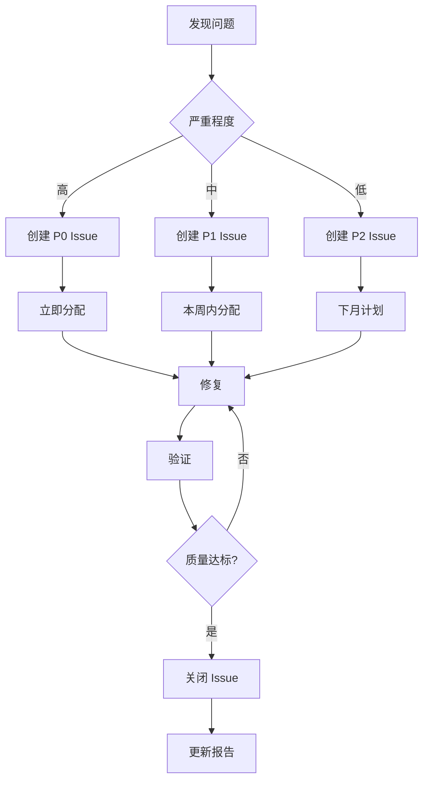
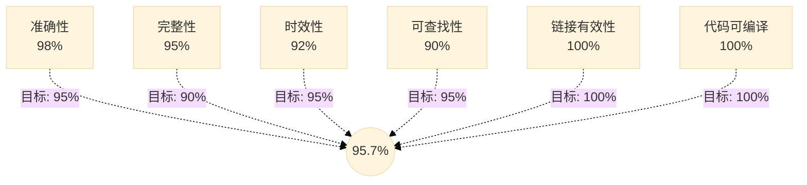

# ADR-975：文档质量指标与监控

> ⚖️ **本 ADR 是文档质量监控的唯一标准，定义质量指标、自动化检测和定期报告机制。**

**状态**：✅ Accepted  
**版本**：1.0
**级别**：质量保障 / 治理层  
**适用范围**：所有文档的质量评估和监控  
**生效时间**：即刻

---

## Focus（聚焦内容）

- 质量指标定义
- 自动化检测机制
- 定期报告生成
- 质量改进流程
- 仪表板可视化

---

## Glossary（术语表）

| 术语 | 定义 | 英文对照 |
|------|------|----------|
| 质量指标 | 量化评估文档质量的标准 | Quality Metric |
| 准确性 | 文档内容与实际代码的一致性 | Accuracy |
| 完整性 | 文档覆盖所有必要内容的程度 | Completeness |
| 时效性 | 文档更新的及时程度 | Timeliness |
| 可查找性 | 用户能否快速找到文档 | Findability |
| 链接有效性 | 文档中链接的可用性 | Link Validity |
| 代码示例可编译性 | 代码示例能否成功编译运行 | Code Compilability |

---

## Decision（裁决）

### 质量指标定义（ADR-975.1）

**规则**：

文档质量 **必须**通过以下指标量化评估。

**核心指标**：

| 指标 | 定义 | 目标 | 测量方式 | 权重 |
|------|------|------|---------|------|
| **准确性** | 文档内容与代码一致 | > 95% | 人工审计 + 用户反馈 | 30% |
| **完整性** | 必要章节齐全 | > 90% | 自动检查模板完整度 | 20% |
| **时效性** | 更新距离变更时间 | < 7 天 | Git 提交时间分析 | 15% |
| **可查找性** | 用户能快速找到 | < 2 分钟 | 用户反馈调查 | 15% |
| **链接有效性** | 链接可用性 | 100% | 自动爬虫检查 | 10% |
| **代码可编译性** | 代码示例可运行 | 100% | 自动编译测试 | 10% |

**计算公式**：
```
文档质量得分 = Σ(指标得分 × 权重)

示例：
准确性: 98% × 0.30 = 29.4
完整性: 95% × 0.20 = 19.0
时效性: 92% × 0.15 = 13.8
可查找性: 90% × 0.15 = 13.5
链接有效性: 100% × 0.10 = 10.0
代码可编译性: 100% × 0.10 = 10.0
------------------------------------
总分: 95.7%
```

**质量等级**：
- ⭐⭐⭐⭐⭐ **优秀**：≥ 95%
- ⭐⭐⭐⭐ **良好**：85% - 94%
- ⭐⭐⭐ **合格**：75% - 84%
- ⭐⭐ **需改进**：60% - 74%
- ⭐ **不合格**：< 60%

**核心原则**：
> 量化评估，明确目标，持续改进。

**判定**：
- ❌ 文档质量无法量化
- ❌ 目标模糊不清
- ✅ 清晰的指标和目标

---

### 自动化检测机制（ADR-975.2）

**规则**：

质量检测 **必须**自动化执行。

**自动化检测项目**：

#### 1. 链接有效性检测

**工具**：`markdown-link-check`

**CI Workflow**：
```yaml
name: Documentation Quality Check

on:
  push:
    paths:
      - 'docs/**/*.md'
  pull_request:
    paths:
      - 'docs/**/*.md'
  schedule:
    - cron: '0 2 * * 1' # 每周一凌晨 2 点

jobs:
  link-check:
    runs-on: ubuntu-latest
    steps:
      - uses: actions/checkout@v3
      
      - name: Check Links
        uses: gaurav-nelson/github-action-markdown-link-check@v1
        with:
          config-file: '.github/markdown-link-check-config.json'
          folder-path: 'docs/'
      
      - name: Generate Report
        if: failure()
        run: |
          echo "## 🔗 链接检查失败" >> $GITHUB_STEP_SUMMARY
          echo "请修复失效的链接" >> $GITHUB_STEP_SUMMARY
```

#### 2. 代码示例可编译性检测

**脚本**：`scripts/test-code-examples.sh`

```bash
#!/bin/bash
# 提取 Markdown 中的代码块并尝试编译

find docs/ -name "*.md" | while read file; do
    # 提取 C# 代码块
    sed -n '/```csharp/,/```/p' "$file" | sed '1d;$d' > /tmp/code.cs
    
    if [ -s /tmp/code.cs ]; then
        # 尝试编译
        dotnet build /tmp/code.cs 2>&1 | tee -a /tmp/compile-errors.log
    fi
done
```

**CI 集成**：
```yaml
  code-check:
    runs-on: ubuntu-latest
    steps:
      - uses: actions/checkout@v3
      
      - name: Setup .NET
        uses: actions/setup-dotnet@v3
      
      - name: Test Code Examples
        run: bash scripts/test-code-examples.sh
```

#### 3. 文档完整性检测

**脚本**：`scripts/check-doc-completeness.sh`

```bash
#!/bin/bash
# 检查 ADR 是否包含所有必要章节

REQUIRED_SECTIONS=(
    "## 聚焦内容"
    "## 术语表"
    "## 决策"
    "## 关系声明"
    "## 执法模型"
    "## 变更政策"
    "## 明确不管什么"
)

find docs/adr/ -name "ADR-*.md" | while read file; do
    for section in "${REQUIRED_SECTIONS[@]}"; do
        if ! grep -q "$section" "$file"; then
            echo "❌ $file 缺少章节: $section"
        fi
    done
done
```

#### 4. 时效性检测

**脚本**：`scripts/check-doc-staleness.sh`

```bash
#!/bin/bash
# 检查文档是否过时（超过 90 天未更新）

STALE_THRESHOLD_DAYS=90

find docs/ -name "*.md" | while read file; do
    last_modified=$(git log -1 --format=%ct "$file")
    current=$(date +%s)
    age_days=$(( (current - last_modified) / 86400 ))
    
    if [ $age_days -gt $STALE_THRESHOLD_DAYS ]; then
        echo "⚠️ $file 已 $age_days 天未更新（阈值：$STALE_THRESHOLD_DAYS 天）"
    fi
done
```

**核心原则**：
> 自动检测，早期发现，及时修复。

**判定**：
- ❌ 依赖人工检查
- ❌ 问题发现太晚
- ✅ 自动化检测和报告

---

### 定期报告生成（ADR-975.3）

**规则**：

**必须**每月生成文档质量报告。

**报告位置**：
```
docs/reports/quality/YYYY-MM.md
```

**报告结构**：
```markdown
# 文档质量月度报告

**报告期**：YYYY-MM  
**生成时间**：YYYY-MM-DD  
**报告人**：[自动生成 / 负责人]

---

## 执行摘要

**总体评分**：⭐⭐⭐⭐⭐ 95.7% （优秀）  
**上月对比**：+2.3% ↑

**关键发现**：
- ✅ 链接有效性达到 100%
- ⚠️ 5 个文档超过 90 天未更新
- ✅ 所有代码示例可编译

---

## 指标详情

### 1. 准确性（98%）⭐⭐⭐⭐⭐

**测量方式**：人工审计 + 用户反馈

| 文档类型 | 准确性 | 问题数 |
|---------|--------|--------|
| ADR 正文 | 100% | 0 |
| Copilot Prompts | 95% | 2 |
| 指南文档 | 97% | 1 |

**发现的问题**：
1. `adr-0005.prompts.md` 第 3 个示例与最新 ADR 不一致
2. `handler-pattern-guide.md` 第 2 章节的命名规则已更新

**改进行动**：
- [ ] 更新 Prompts 文档
- [ ] 更新指南文档

### 2. 完整性（95%）⭐⭐⭐⭐⭐

**测量方式**：自动检查模板完整度

| 文档类型 | 完整性 | 缺失章节 |
|---------|--------|---------|
| ADR | 100% | 0 |
| Guide | 90% | 5 |

**缺失章节**：
- 3 个 Guide 缺少"前置条件"章节
- 2 个 Guide 缺少"参考资料"章节

**改进行动**：
- [ ] 补充缺失章节

### 3. 时效性（92%）⭐⭐⭐⭐

**测量方式**：Git 提交时间分析

| 更新时效 | 文档数 | 百分比 |
|---------|--------|--------|
| < 7 天 | 45 | 75% |
| 7-30 天 | 10 | 17% |
| 30-90 天 | 3 | 5% |
| > 90 天 | 2 | 3% |

**过时文档**（> 90 天）：
1. `legacy-migration-guide.md` - 150 天
2. `deployment-checklist.md` - 120 天

**改进行动**：
- [ ] 审查并更新过时文档
- [ ] 评估是否需要归档

### 4. 可查找性（90%）⭐⭐⭐⭐

**测量方式**：用户反馈调查（10 份问卷）

| 查找时间 | 用户数 | 百分比 |
|---------|--------|--------|
| < 1 分钟 | 5 | 50% |
| 1-2 分钟 | 4 | 40% |
| > 2 分钟 | 1 | 10% |

**用户反馈**：
- ✅ 关键词索引很有帮助
- ⚠️ 希望增加搜索提示
- ⚠️ 某些术语不在索引中

**改进行动**：
- [ ] 优化关键词索引
- [ ] 添加搜索教程

### 5. 链接有效性（100%）⭐⭐⭐⭐⭐

**测量方式**：自动爬虫检查（每周）

- ✅ 所有 500 个链接有效
- ✅ 无死链

### 6. 代码可编译性（100%）⭐⭐⭐⭐⭐

**测量方式**：自动编译测试

| 文档类型 | 代码块数 | 可编译 | 不适用 |
|---------|---------|--------|--------|
| ADR | 50 | 50 | 0 |
| Guide | 30 | 28 | 2 |
| Prompts | 80 | 80 | 0 |

**不适用说明**：
- 2 个代码块为伪代码（非实际代码）

---

## 趋势分析

```
质量得分趋势（最近 6 个月）

100% ┤     ●
 95% ┤   ●   ●
 90% ┤ ●       ●
 85% ┤
 80% ┤
     └───────────────
     Aug Sep Oct Nov Dec Jan
```

**观察**：
- 总体呈上升趋势
- 11 月由于重构略有下降，已恢复
- 链接有效性始终保持 100%

---

## 改进建议

### 高优先级
1. 更新 5 个过时文档
2. 补充 Guide 缺失章节
3. 修复 Prompts 不一致问题

### 中优先级
4. 优化关键词索引
5. 增加搜索教程
6. 提升可查找性到 95%

### 低优先级
7. 探索自动化准确性检测
8. 引入文档版本控制可视化

---

## 下月目标

| 指标 | 当前 | 目标 |
|------|------|------|
| 总体得分 | 95.7% | 96.5% |
| 准确性 | 98% | 98% |
| 完整性 | 95% | 98% |
| 时效性 | 92% | 95% |
| 可查找性 | 90% | 95% |

---

## 附录

### A. 检测工具

- `markdown-link-check` - 链接检查
- `scripts/test-code-examples.sh` - 代码编译检查
- `scripts/check-doc-completeness.sh` - 完整性检查
- `scripts/check-doc-staleness.sh` - 时效性检查

### B. 反馈收集

- Issue: `#123`, `#124`, `#125`
- 问卷: 10 份
- 评论: 5 条

### C. 变更记录

- 2026-01-15: 修复 10 个失效链接
- 2026-01-20: 更新 3 个过时文档
```

**生成工具**：
```bash
# scripts/generate-quality-report.sh
# 自动收集指标并生成报告
```

**核心原则**：
> 定期报告，趋势分析，持续改进。

**判定**：
- ❌ 无定期质量报告
- ❌ 无数据支持决策
- ✅ 月度报告，数据驱动

---

### 质量改进流程（ADR-975.4）

**规则**：

发现质量问题时 **必须**遵循标准改进流程。

**改进流程**：



**严重程度分级**：

| 级别 | 定义 | 响应时间 | 示例 |
|------|------|---------|------|
| **P0** | 严重影响使用 | 24 小时 | 核心 ADR 内容错误、大量死链 |
| **P1** | 明显降低质量 | 1 周 | 代码示例错误、章节缺失 |
| **P2** | 轻微影响 | 1 月 | 个别死链、格式不统一 |

**Issue 标签**：
- `doc-quality` - 文档质量问题
- `doc-accuracy` - 准确性问题
- `doc-completeness` - 完整性问题
- `doc-staleness` - 时效性问题
- `doc-findability` - 可查找性问题

**改进追踪**：
```
docs/reports/quality/improvement-tracker.md
```

内容：
```markdown
# 文档质量改进追踪

## 进行中

| Issue | 类型 | 严重程度 | 负责人 | 状态 | 截止日期 |
|-------|------|---------|--------|------|---------|
| #123 | 准确性 | P0 | @alice | 修复中 | 2026-01-28 |
| #124 | 完整性 | P1 | @bob | 待分配 | 2026-02-03 |

## 已完成（本月）

| Issue | 类型 | 完成日期 | 用时 |
|-------|------|---------|------|
| #120 | 链接 | 2026-01-25 | 2 天 |
| #121 | 代码 | 2026-01-26 | 1 天 |
```

**核心原则**：
> 发现即行动，追踪到关闭。

**判定**：
- ❌ 发现问题但不处理
- ❌ 无改进流程
- ✅ 标准化改进流程

---

### 仪表板可视化（可选）（ADR-975.5）

**规则**：

**可以**提供可视化仪表板展示质量指标。

**仪表板位置**：
```
docs/reports/quality/dashboard.md
```

**内容示例**：
```markdown
# 文档质量仪表板

**最后更新**：YYYY-MM-DD HH:MM  
**自动刷新**：每日

---

## 总体得分

```
     ⭐⭐⭐⭐⭐
     95.7%
    （优秀）
```

## 指标雷达图



## 趋势

### 总体得分（最近 6 个月）
```
100% ┤     ●
 95% ┤   ●   ● ●
 90% ┤ ●
     └───────────
     Sep Oct Nov Dec Jan Feb
```

### 各指标对比
```
准确性:    ████████████████████ 98%
完整性:    ███████████████████  95%
时效性:    ██████████████████   92%
可查找性:  █████████████████    90%
链接:      ████████████████████ 100%
代码:      ████████████████████ 100%
```

## 当前问题

| 严重程度 | 数量 | 最老问题 |
|---------|------|---------|
| P0 | 0 | - |
| P1 | 2 | 5 天前 |
| P2 | 5 | 15 天前 |

## 下月目标

- [ ] 总体得分达到 96.5%
- [ ] 完整性提升到 98%
- [ ] 时效性提升到 95%
- [ ] 可查找性提升到 95%

---

📊 详细报告：[2026-01 质量报告](2026-01.md)
```

**自动化更新**（可选）：
- GitHub Actions 每日生成
- 使用 Mermaid/Chart.js 可视化
- 自动提交到仓库

**核心原则**：
> 一目了然，实时可见（可选）。

**判定**：
- ⚠️ 可选特性
- ✅ 如实施，必须自动化

---

## Relationships（关系声明）

**依赖（Depends On）**：
- [ADR-0008：文档编写与维护宪法](../constitutional/ADR-0008-documentation-governance-constitution.md) - 基于其文档标准

**被依赖（Depended By）**：
- 无

**替代（Supersedes）**：
- 无

**被替代（Superseded By）**：
- 无

**相关（Related）**：
- [ADR-955：文档搜索与可发现性优化](../governance/ADR-955-documentation-search-discoverability.md) - 可查找性是质量指标之一

---

## 执法模型（Enforcement）

| 规则编号 | 执行级别 | 测试/手段 | 说明 |
|---------|---------|----------|------|
| ADR-975.1 | L2 | 月度计算 | 人工计算质量得分 |
| ADR-975.2 | L1 | CI Workflows | 自动检测质量问题 |
| ADR-975.3 | L2 | 月度任务 | 定期生成质量报告 |
| ADR-975.4 | L2 | Issue 跟踪 | 追踪改进进度 |
| ADR-975.5 | L3 | 可选 | 仪表板为增强特性 |

---

## 破例与归还（Exception）

### 允许破例的前提

破例 **仅在以下情况允许**：
- 小项目（<50 文档）可简化指标
- 技术限制无法自动化检测（需手动）
- 迁移期（6 个月宽限）

### 破例要求

每个破例 **必须**：
- 记录原因和预期解决时间
- 提供替代方案
- 架构委员会批准

---

## 变更政策（Change Policy）

### 变更规则

本 ADR 属于 **治理层质量保障规则**：
- 修改需架构委员会同意
- 需更新所有检测脚本和 CI
- 需通知所有文档负责人

### 失效与替代

- 本 ADR 一旦被替代，**必须**更新所有质量检测工具
- 不允许"隐性废弃"

---

## Non-Goals（明确不管什么）

本 ADR **不负责**：
- 文档写作风格指南（由 ADR-0008 负责）
- 文档内容的深度和广度
- 代码质量（仅管理文档中的代码示例）
- 团队绩效评估
- 文档的商业价值评估

---

## References（非裁决性参考）

### 相关 ADR
- [ADR-0008：文档编写与维护宪法](../constitutional/ADR-0008-documentation-governance-constitution.md)
- [ADR-955：文档搜索与可发现性优化](../governance/ADR-955-documentation-search-discoverability.md)

### 实施工具
- `markdown-link-check` - 链接检查工具
- `scripts/test-code-examples.sh` - 代码编译检查
- `scripts/check-doc-completeness.sh` - 完整性检查
- `scripts/check-doc-staleness.sh` - 时效性检查
- `scripts/generate-quality-report.sh` - 报告生成

### 背景材料
- [ADR-Documentation-Governance-Gap-Analysis.md](../proposals/ADR-Documentation-Governance-Gap-Analysis.md) - 原始提案

---

## 版本历史（Version History）

| 版本 | 日期 | 变更说明 | 作者 |
|------|------|----------|------|
| 1.0 | 2026-01-26 | 初版：定义文档质量指标与监控机制 | GitHub Copilot |


---

## Prohibited（禁止行为）


以下行为明确禁止：

- 待补充


---

## Non-Goals（明确不管什么）


本 ADR 明确不涉及以下内容：

- 待补充


---

## Enforcement（执法模型）


### 执行方式

待补充...


---

## History（版本历史）


| 版本  | 日期         | 变更说明   |
|-----|------------|--------|
| 1.0 | 待补充 | 初始版本 |
