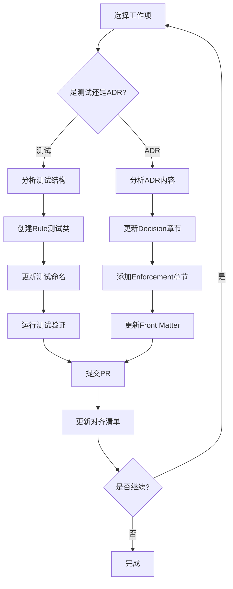

# ADR 对齐执行指南 - 快速开始

> **状态**：Active  
> **版本**：1.0  
> **日期**：2026-02-03

---

## 📋 概述

本指南帮助您开始执行 [ADR 对齐执行计划](../../../ADR-ALIGNMENT-EXECUTION-PLAN.md)，该计划已获 Architecture Board 批准。

---

## 🎯 目标

将所有 ADR 文档和架构测试对齐到 ADR-907 v2.0 定义的 **Rule/Clause 双层编号体系**。

---

## 📚 必读文档

在开始之前，请务必阅读以下文档：

1. **[ADR-907：ArchitectureTests 执法治理体系](./ADR-907-architecture-tests-enforcement-governance.md)**  
   - 定义新的 Rule/Clause 编号格式
   - 规定测试组织和命名规范

2. **[ADR-907-A：ADR-907 对齐执行标准](./ADR-907-A-adr-alignment-execution-standard.md)**  
   - 定义对齐的强制规范
   - 规定失败处理策略

3. **[ADR 对齐执行计划](../../../ADR-ALIGNMENT-EXECUTION-PLAN.md)**  
   - 完整的执行路线图
   - 风险评估和缓解措施

4. **[ADR-907-A 对齐清单](./adr-907-a-alignment-checklist.md)**  
   - 进度追踪清单
   - 所有 ADR 的对齐状态

---

## 🚀 快速开始

### 步骤 1：了解当前状态

查看 [对齐清单](./adr-907-a-alignment-checklist.md) 了解：
- 哪些 ADR 已完成对齐（✅ 已完成）
- 哪些 ADR 正在进行（🚧 进行中）
- 哪些 ADR 等待对齐（⏸️ 待对齐）

**当前状态**：
- **ADR 对齐**：26/48 个完成（54%）
- **测试对齐**：4/29 个完成（14%）
- **Instructions 更新**：10% 完成

### 步骤 2：选择工作项

根据优先级选择：

#### Phase 1：测试对齐（最高优先级 - P0）

**目标**：将 25 个旧格式测试文件重构为 Rule/Clause 结构

**工作量**：2-3 天

**步骤**：
1. 选择一个测试文件（建议从简单的开始）
2. 分析测试方法，识别 Rule 和 Clause
3. 为每个 Rule 创建单独的测试类
4. 按照 ADR-907_2_4 和 ADR-907_2_5 更新命名
5. 运行测试确保全部通过
6. 提交 PR

**示例**：参见已完成的 `src/tests/ArchitectureTests/ADR-0907/` 目录

#### Phase 2：治理层 ADR 对齐（P1）

**目标**：对齐 9 个治理层 ADR

**工作量**：3-4 周

**批次**：每批 5 个 ADR

**步骤**：
1. 选择一个待对齐的治理层 ADR
2. 按照 ADR-907-A_1 更新 Decision 章节
3. 添加 Enforcement 章节
4. 更新 Front Matter（版本号 +1）
5. 添加 History 记录
6. 更新对齐清单状态
7. 提交 PR

### 步骤 3：验证变更

每次变更后必须验证：

```bash
# 运行架构测试
dotnet test src/tests/ArchitectureTests/

# 检查特定 ADR 的测试
dotnet test --filter "FullyQualifiedName~ADR_XXXX"

# 检查测试覆盖率
dotnet test /p:CollectCoverage=true
```

### 步骤 4：更新进度

完成工作后：

1. 更新 [对齐清单](./adr-907-a-alignment-checklist.md)
2. 将状态从 "⏸️ 待对齐" 改为 "✅ 已完成"
3. 记录完成日期和备注

---

## 📋 ADR 对齐模板

### Decision 章节标准格式

```markdown
## Decision（裁决）

> ⚠️ **本节为唯一裁决来源，所有条款具备执行级别。**
> 
> 🔒 **统一铁律**：
> 
> ADR-XXX 中，所有可执法条款必须具备稳定 RuleId，格式为：
> \`\`\`
> ADR-XXX_<Rule>_<Clause>
> \`\`\`

---

### ADR-XXX_1：<Rule 名称>（Rule）

#### ADR-XXX_1_1 <Clause 标题>
- 规则内容描述

#### ADR-XXX_1_2 <Clause 标题>
- 规则内容描述

---

### ADR-XXX_2：<Rule 名称>（Rule）

#### ADR-XXX_2_1 <Clause 标题>
- 规则内容描述
```

### Enforcement 章节标准格式

```markdown
## Enforcement（执法模型）

> 📋 **Enforcement 映射说明**：
> 
> 下表展示了 ADR-XXX 各条款（Clause）的执法方式及执行级别。

| 规则编号 | 执行级 | 执法方式 | Decision 映射 |
|---------|--------|---------|--------------|
| **ADR-XXX_1_1** | L1 | ArchitectureTests 自动化验证 | §ADR-XXX_1_1 |
| **ADR-XXX_1_2** | L2 | 人工审查 | §ADR-XXX_1_2 |

### 执行级别说明
- **L1（阻断级）**：违规直接导致 CI 失败、阻止合并/部署
- **L2（警告级）**：违规记录告警，需人工 Code Review 裁决
- **L3（人工级）**：需要架构师人工裁决
```

---

## 🧪 测试重构指南

### 测试类命名规范（ADR-907_2_4）

**旧格式**：
```csharp
public class ADR_0001_Architecture_Tests { }
```

**新格式**：
```csharp
// 为每个 Rule 创建单独的测试类
public class ADR_001_1_Architecture_Tests { }  // Rule 1
public class ADR_001_2_Architecture_Tests { }  // Rule 2
```

### 测试方法命名规范（ADR-907_2_5）

**旧格式**：
```csharp
[Fact(DisplayName = "ADR-0001.1: 模块不应相互引用")]
public void Modules_Should_Not_Reference_Other_Modules() { }
```

**新格式**：
```csharp
[Fact(DisplayName = "ADR-001_1_1: 模块不应相互引用")]
public void ADR_001_1_1_Modules_Should_Not_Reference_Other_Modules() { }
```

### 测试目录结构（ADR-907_2_2）

**新结构**：
```
src/tests/ArchitectureTests/
└── ADR-XXXX/                              # 按 ADR 编号分组
    ├── ADR_XXX_1_Architecture_Tests.cs    # Rule 1 的测试
    ├── ADR_XXX_2_Architecture_Tests.cs    # Rule 2 的测试
    └── ...
```

---

## ⚠️ 注意事项

### 禁止行为

❌ **不允许保留旧格式测试作为兼容层**
- 必须完全迁移到新格式
- 不能同时存在新旧两种格式

❌ **不允许跳过测试验证**
- 每次变更后必须运行相关测试
- 确保 100% 测试通过

❌ **不允许修改测试以使代码通过**
- 架构测试定义约束
- 应该修复代码而非测试

### 强制要求

✅ **每批对齐 ADR 数量上限：5 个**

✅ **对齐期间新 ADR 必须直接使用新格式**

✅ **所有变更必须通过 Architecture Board 审批**

---

## 🔄 工作流程



---

## 📞 获取帮助

### 常见问题

**Q: 我不确定如何拆分 Rule 和 Clause？**
A: 参考 ADR-907 的 Decision 章节，查看已完成对齐的 ADR 示例。一般原则：
- Rule = 主题分类（如"命名规范"、"组织规范"）
- Clause = 具体规则（如"测试类命名格式"、"测试方法命名格式"）

**Q: 测试拆分后数量变多了，这正常吗？**
A: 正常。每个 Rule 一个测试类，可能导致测试文件数量增加，但这提高了可维护性和可追溯性。

**Q: 如何处理 ADR-930（Decision 章节不完整）？**
A: 根据批准的决策 4，先补充完整 Decision 章节再对齐。如不确定，请咨询 Architecture Board。

### 联系方式

- **Architecture Board**：@douhuaa
- **问题报告**：在 GitHub 创建 Issue，标签 `adr-alignment`
- **进度跟踪**：[对齐清单](./adr-907-a-alignment-checklist.md)

---

## 📊 进度追踪

定期检查：
- [ADR-907-A 对齐清单](./adr-907-a-alignment-checklist.md) - 实时进度
- [ADR 对齐执行计划](../../../ADR-ALIGNMENT-EXECUTION-PLAN.md) - 整体路线图

---

**版本**：1.0  
**日期**：2026-02-03  
**维护**：Architecture Board  
**状态**：✅ Active
