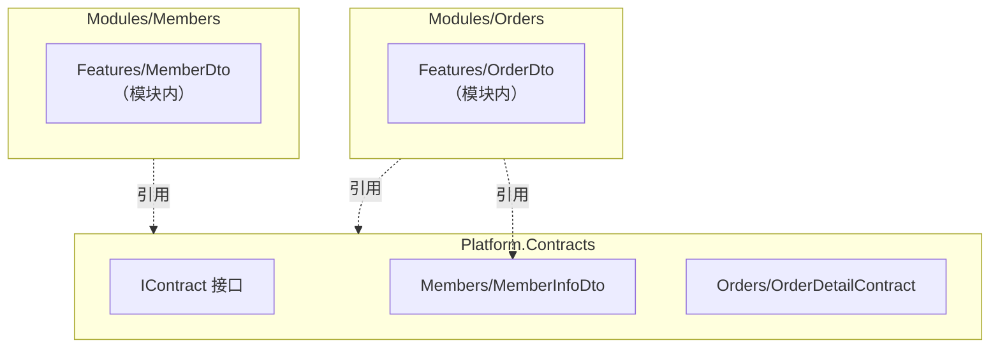

# ADR-121：契约（Contract）与 DTO 命名组织规范

**适用范围**：所有模块（Modules）、跨模块数据传递、API 层、事件与命令 Query 消息  
**生效时间**：即刻  
**依赖 ADR**：ADR-0001（模块化单体与垂直切片架构）、ADR-0003（命名空间规范）、ADR-0005（应用内交互模型）、ADR-120（领域事件命名规范）

---

## Focus（聚焦内容）

- 统一跨模块契约/DTO 命名规则，确保类型隔离和可演进性
- 规范契约目录组织和命名空间映射
- 定义版本管理策略，支持向后兼容和渐进式废弃
- 明确契约约束：只读、无业务逻辑、不包含领域模型
- 为架构测试、文档生成和工具链自动发现提供标准基础
- 严格遵守模块隔离原则，避免契约嵌入跨模块业务语义

---

## Glossary（术语表）

| 术语 | 定义 | 英文对照 |
|------------------|---------------------------------------|---------------------------|
| 契约（Contract）     | 跨模块数据传递的只读、版本化的数据 DTO，只用于信息传递       | Contract               |
| DTO              | 数据传输对象，用于在不同层次或模块间传递数据，不包含业务逻辑      | Data Transfer Object   |
| 模块内 DTO          | 仅在模块内部使用的 DTO，不对外暴露                 | Internal DTO           |
| 跨模块契约            | 在模块间传递的契约，必须严格遵守命名和组织规范             | Cross-Module Contract  |
| 契约版本             | 契约结构的版本标识（如 V2、V3），用于支持向后兼容和演进     | Contract Version       |
| 业务含义后缀           | 反映数据用途的后缀，如 `InfoDto`、`DetailContract` | Business Meaning Suffix |

---

## Decision（裁决）

### 命名规范

#### 契约类型命名模式

所有跨模块契约必须遵循以下命名模式：

```
{AggregateRoot}[{BusinessMeaning}]{Dto|Contract}
```

- **{AggregateRoot}**：聚合根名称（单数、PascalCase）
- **{BusinessMeaning}**：可选业务含义（Info、Detail、Summary、List）
- **{Dto|Contract}**：固定后缀（必须二选一）

**✅ 正确示例**：

```csharp
// 基础契约
public record MemberDto(Guid MemberId, string UserName);
public record OrderContract(Guid OrderId, decimal TotalAmount);

// 带业务含义
public record MemberInfoDto(Guid MemberId, string UserName, string Email);
public record OrderDetailContract(Guid OrderId, IReadOnlyList<OrderItemDto> Items);

// 嵌套 DTO
public record OrderItemDto(Guid ProductId, string ProductName, int Quantity);
```

**❌ 错误示例**：

```csharp
public record MemberInfo(Guid MemberId);        // ❌ 缺少后缀
public record MemberData(Guid MemberId);        // ❌ 模糊名称
public record MemberEntity(Guid MemberId);      // ❌ Entity 保留给领域模型
```

#### 属性命名规范

- 主键属性：`{AggregateRoot}Id`（如 `MemberId`、`OrderId`）
- 避免通用名称（`Id`、`Data`、`Value`），使用明确业务语义
- 集合属性使用复数（`Items`、`Orders`）

### 目录与命名空间组织

#### 目录结构

契约组织支持三种方式：

**方式 1：Platform.Contracts（当前项目推荐）**

```
src/Platform/Contracts/
  Members/MemberInfoDto.cs
  Orders/OrderDetailContract.cs
```

**方式 2：模块内 Contracts**

```
src/Modules/Members/Contracts/
  MemberInfoDto.cs
```

**方式 3：独立 Contracts 程序集**

```
src/Contracts/
  Members/MemberInfoDto.cs
```

#### 命名空间映射

契约命名空间必须与物理目录一致：

```csharp
// Platform.Contracts
namespace Zss.BilliardHall.Platform.Contracts.Members;
public record MemberInfoDto(...);

// 模块内 Contracts
namespace Zss.BilliardHall.Modules.Members.Contracts;
public record MemberInfoDto(...);
```

### 契约约束

#### 不可变性

所有契约必须是只读的：

```csharp
// ✅ 使用 record（推荐）
public record MemberInfoDto(Guid MemberId, string UserName);

// ✅ 或使用 init-only
public class MemberInfoDto
{
    public required Guid MemberId { get; init; }
    public required string UserName { get; init; }
}

// ❌ 禁止可变属性
public class MemberInfoDto
{
    public Guid MemberId { get; set; }  // ❌
}
```

#### 无业务逻辑

契约不得包含业务方法：

```csharp
// ✅ 允许：计算属性
public record OrderDetailContract(
    Guid OrderId,
    IReadOnlyList<OrderItemDto> Items
)
{
    public decimal TotalAmount => Items.Sum(i => i.Price);  // ✅
}

// ❌ 禁止：业务判断方法
public record MemberInfoDto(Guid MemberId, decimal Balance)
{
    public bool CanUpgrade() => Balance > 1000;  // ❌
}
```

#### 不包含领域模型

契约只能包含原始类型和其他 DTO：

```csharp
// ✅ 正确
public record OrderDetailContract(
    Guid OrderId,                           // 原始类型
    IReadOnlyList<OrderItemDto> Items       // 嵌套 DTO
);

// ❌ 错误
public record OrderDetailContract(
    Guid OrderId,
    Order Order,              // ❌ 领域实体
    Member Member             // ❌ 领域实体
);
```

### 版本管理

#### 版本命名

破坏性变更必须创建新版本（V2、V3）：

```csharp
// V1
public record MemberInfoDto(Guid MemberId, string UserName);

// V2（添加必需属性）
[Obsolete("Use MemberInfoDtoV2 instead. Removed after 2025-01-01.", false)]
public record MemberInfoDto(Guid MemberId, string UserName);

public record MemberInfoDtoV2(Guid MemberId, string UserName, string Email);
```

#### 废弃策略

使用 `[Obsolete]` 标记旧版本，采用渐进式流程：

1. **阶段 1**：警告级别（`error: false`）
2. **阶段 2**：6 个月后升级为错误级别（`error: true`）
3. **阶段 3**：12 个月后移除旧版本

#### 嵌套 DTO 版本

嵌套 DTO 独立版本管理：

```csharp
// 父契约 V2，子 DTO 也需升级
public record OrderDetailContractV2(
    Guid OrderId,
    IReadOnlyList<OrderItemDtoV2> Items  // 使用新版本
);

public record OrderItemDtoV2(
    Guid ProductId,
    string ProductName,
    int Quantity,
    decimal DiscountRate  // 新增字段
);
```

### 标记接口（可选）

为支持工具和文档生成，契约可实现 `IContract`：

```csharp
namespace Zss.BilliardHall.Platform.Contracts;

public interface IContract
{
    string Version => "1.0";  // 可选版本属性
}

// 使用
public record MemberInfoDto(Guid MemberId, string UserName) : IContract
{
    public string Version => "1.0";
}
```

---

## 约束及检查点（Constraints & Checklist）

### 必须架构测试覆盖的约束

- [ ] **ADR-121.1**：契约类型必须以 `Dto` 或 `Contract` 结尾
- [ ] **ADR-121.2**：契约属性必须是只读的（record 或 init-only）
- [ ] **ADR-121.3**：契约不得包含业务方法
- [ ] **ADR-121.4**：契约不得包含领域模型类型
- [ ] **ADR-121.5**：契约必须位于 Contracts 命名空间下
- [ ] **ADR-121.6**：契约命名空间必须与物理目录一致（L1 核心约束）

### 开发检查清单

- [ ] 跨模块 DTO 均以 `Dto`/`Contract` 结尾
- [ ] 契约位于 Contracts 目录内
- [ ] 不包含领域模型类型（Entity/Aggregate/ValueObject）
- [ ] 版本迭代采用 V2/V3 后缀
- [ ] 旧版本使用 `[Obsolete]` 标记
- [ ] Command Handler 不依赖契约进行业务决策

---

## 与其他 ADR 关系（Related ADRs）

| 编号                  | 关系说明                         |
|---------------------|------------------------------|
| ADR-0001            | 定义模块隔离原则，本 ADR 细化契约通信规范      |
| ADR-0003            | 定义命名空间规则，本 ADR 细化契约命名空间约束    |
| ADR-0005            | 定义 Handler 模式，本 ADR 约束契约在其中的使用 |
| ADR-120             | 定义事件命名规范，与契约命名规范并行           |
| ADR-0000            | 架构测试元规则，本 ADR 的约束需要测试覆盖      |

---

## 快速参考表（Quick Reference）

| 约束编号      | 约束描述                          | 层级 | 测试方法                                                | 必须覆盖 | ADR 章节 |
|-----------|-------------------------------|----|----------------------------------------------------|------|--------|
| ADR-121.1 | 契约类型必须以 Dto 或 Contract 结尾    | L1 | Contract_Types_Should_End_With_Dto_Or_Contract_Suffix | ✅    | 决策 §1  |
| ADR-121.2 | 契约属性必须是只读的                    | L1 | Contracts_Should_Be_Immutable                      | ✅    | 决策 §3  |
| ADR-121.3 | 契约不得包含业务方法                    | L1 | Contracts_Should_Not_Contain_Business_Methods      | ✅    | 决策 §3  |
| ADR-121.4 | 契约不得包含领域模型类型                  | L1 | Contracts_Should_Not_Contain_Domain_Types          | ✅    | 决策 §3  |
| ADR-121.5 | 契约必须位于 Contracts 命名空间下        | L1 | Contracts_Should_Be_In_Contracts_Namespace         | ✅    | 决策 §2  |
| ADR-121.6 | 契约命名空间必须与物理目录一致（升级为 L1）      | L1 | Contract_Namespace_Should_Match_Directory          | 🔜   | 决策 §2  |

**层级说明**：
- **L1（核心约束）**：架构测试必须覆盖，违反即为严重架构违规
- **L2（建议约束）**：架构测试可选覆盖，违反会影响代码可维护性

**关于 ADR-121.6**：已从 L2 升级为 L1，建议实施 CI 验证脚本扫描 Platform.Contracts 确保命名空间与路径匹配。

---

## Relationships（关系声明）

**依赖（Depends On）**：
- [ADR-0005：应用内交互模型与执行边界](../constitutional/ADR-0005-Application-Interaction-Model-Final.md) - 契约 DTO 基于 CQRS 模式
- [ADR-0006：术语与编号宪法](../constitutional/ADR-0006-terminology-numbering-constitution.md) - 命名约定遵循术语规范
- [ADR-0003：命名空间与项目结构规范](../constitutional/ADR-0003-namespace-rules.md) - 命名空间规范
- [ADR-0001：模块化单体与垂直切片架构](../constitutional/ADR-0001-modular-monolith-vertical-slice-architecture.md)

**被依赖（Depended By）**：
- [ADR-124：Endpoint 命名及参数约束规范](./ADR-124-endpoint-naming-constraints.md) - Endpoint 使用契约遵循命名规范

**替代（Supersedes）**：
- 无

**被替代（Superseded By）**：
- 无

**相关（Related）**：
- [ADR-120：领域事件命名约定](./ADR-120-domain-event-naming-convention.md) - 同为命名规范

---

## 版本历史（Version History）

| 版本  | 日期         | 变更说明                                                             | 修订人            |
|-----|------------|------------------------------------------------------------------|----------------|
| 1.0 | 2026-01-24 | 初稿发布，定义契约命名、组织、版本管理和约束规范                                         | GitHub Copilot |
| 1.1 | 2026-01-24 | 增强版本管理：添加 Obsolete 废弃标记策略、嵌套 DTO 版本规则、IContract.Version 属性、文档生成建议 | GitHub Copilot |
| 1.2 | 2026-01-24 | 重构为严格遵循 ADR 模板格式，精简内容，去除过度说明                                   | GitHub Copilot |

---

## 附录

### A. 自动化文档生成建议

**Swashbuckle (OpenAPI/Swagger)**：

```csharp
services.AddSwaggerGen(options =>
{
    options.IncludeXmlComments(xmlPath);
    options.SchemaFilter<ObsoleteSchemaFilter>();
});
```

**DocFX 静态文档**：

```yaml
{
  "metadata": [{ "src": [{ "files": ["Platform/Contracts/**/*.cs"] }] }]
}
```

**Roslyn Analyzer 契约变更检测**：

```csharp
[DiagnosticAnalyzer(LanguageNames.CSharp)]
public class ContractBreakingChangeAnalyzer : DiagnosticAnalyzer
{
    // 检测破坏性变更，强制版本升级
}
```

### B. 契约组织架构图



### C. 参考资源

**架构相关**：
- [ADR-0001: 模块化单体与垂直切片架构](../constitutional/ADR-0001-modular-monolith-vertical-slice-architecture.md)
- [ADR-0005: 应用内交互模型](../constitutional/ADR-0005-Application-Interaction-Model-Final.md)
- [ADR-120: 领域事件命名规范](ADR-120-domain-event-naming-convention.md)

**设计模式与工具**：
- [Martin Fowler: DTO Pattern](https://martinfowler.com/eaaCatalog/dataTransferObject.html)
- [Semantic Versioning](https://semver.org/)
- [Swashbuckle](https://github.com/domaindrivendev/Swashbuckle.AspNetCore)
- [DocFX](https://dotnet.github.io/docfx/)
- [Roslyn Analyzers](https://docs.microsoft.com/en-us/dotnet/csharp/roslyn-sdk/)
